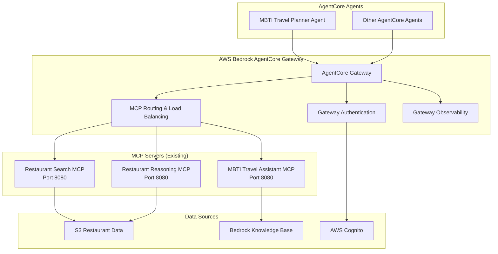

# Direct MCP Exposure via AgentCore Gateway - Design Analysis

## Overview

This document analyzes the approach of using **Bedrock AgentCore Gateway to directly expose MCP servers** instead of converting REST APIs to MCP tools. This approach leverages existing MCP infrastructure for better performance and simpler architecture.

## Architecture Comparison

### Current Approach: API-to-MCP Conversion
```
REST APIs → AgentCore Gateway → MCP Tools → AgentCore Agents
```

### Proposed Approach: Direct MCP Exposure
```
MCP Servers → AgentCore Gateway → AgentCore Agents
```

## Benefits Analysis

### 1. **Architectural Simplicity**
- **Eliminates conversion layer**: No need for HTTP-to-MCP transformation
- **Native MCP protocol**: Direct communication between agents and MCP servers
- **Reduced complexity**: Fewer moving parts and potential failure points
- **Standard patterns**: Uses established MCP server patterns

### 2. **Performance Advantages**
- **Fewer network hops**: Direct MCP communication
- **No protocol conversion overhead**: Native MCP throughout the stack
- **Better streaming support**: MCP protocol supports streaming natively
- **Reduced latency**: Eliminates HTTP-to-MCP transformation time

### 3. **Enhanced Functionality**
- **Full MCP feature set**: Access to all MCP protocol capabilities
- **Rich tool metadata**: Better tool descriptions and parameter schemas
- **Streaming responses**: Native support for real-time data
- **Better error handling**: MCP-native error propagation

### 4. **Development Efficiency**
- **Reuse existing MCP servers**: Leverage restaurant-search-mcp and restaurant-reasoning-mcp
- **Standard MCP patterns**: Use established development practices
- **Better tooling**: MCP development tools and debugging
- **Easier testing**: Standard MCP testing frameworks

## Existing MCP Infrastructure

### Available MCP Servers
1. **restaurant-search-mcp**: Restaurant search functionality
2. **restaurant-reasoning-mcp**: Restaurant recommendation and analysis
3. **mbti-travel-assistant-mcp**: MBTI-based travel planning

### MCP Server Capabilities
```python
# Restaurant Search MCP Tools
- search_restaurants_by_district(districts: List[str])
- search_restaurants_by_meal_type(meal_types: List[str])
- search_restaurants_combined(districts: List[str], meal_types: List[str])

# Restaurant Reasoning MCP Tools  
- recommend_restaurants(restaurants: List[Restaurant], method: str)
- analyze_restaurant_sentiment(restaurants: List[Restaurant])

# MBTI Travel Assistant MCP Tools
- create_mbti_itinerary(personality: str, preferences: Dict)
- get_personality_recommendations(mbti_type: str)
```

## Proposed Architecture

### System Architecture


### Gateway Configuration
```yaml
# AgentCore Gateway Configuration for Direct MCP Exposure
gateway:
  name: "restaurant-mcp-gateway"
  description: "Direct MCP server exposure via AgentCore Gateway"
  
mcp_servers:
  - name: "restaurant-search"
    endpoint: "http://restaurant-search-mcp:8080"
    protocol: "mcp"
    health_check: "/health"
    tools:
      - "search_restaurants_by_district"
      - "search_restaurants_by_meal_type" 
      - "search_restaurants_combined"
      
  - name: "restaurant-reasoning"
    endpoint: "http://restaurant-reasoning-mcp:8080"
    protocol: "mcp"
    health_check: "/health"
    tools:
      - "recommend_restaurants"
      - "analyze_restaurant_sentiment"
      
  - name: "mbti-travel-assistant"
    endpoint: "http://mbti-travel-assistant-mcp:8080"
    protocol: "mcp"
    health_check: "/health"
    tools:
      - "create_mbti_itinerary"
      - "get_personality_recommendations"

authentication:
  type: "cognito_jwt"
  user_pool_id: "us-east-1_KePRX24Bn"
  client_id: "1ofgeckef3po4i3us4j1m4chvd"
  
routing:
  load_balancing: "round_robin"
  health_checks: true
  circuit_breaker: true
  
observability:
  metrics: true
  tracing: true
  logging: "info"
```

## Implementation Strategy

### Phase 1: Gateway Setup (Week 1)
1. **Configure AgentCore Gateway for MCP**
   - Set up gateway to route MCP protocol directly
   - Configure authentication with existing Cognito setup
   - Set up health monitoring for MCP servers

2. **MCP Server Registration**
   - Register existing MCP servers with gateway
   - Configure routing rules for tool distribution
   - Set up load balancing and failover

### Phase 2: Integration Testing (Week 2)
1. **Agent Integration**
   - Test MBTI Travel Planner Agent with gateway-exposed tools
   - Validate tool discovery and execution
   - Test authentication flow end-to-end

2. **Performance Validation**
   - Benchmark direct MCP vs API conversion approach
   - Test concurrent tool execution
   - Validate streaming response capabilities

### Phase 3: Production Deployment (Week 3)
1. **Production Configuration**
   - Deploy gateway with production MCP servers
   - Configure monitoring and alerting
   - Set up backup and disaster recovery

## Advantages Over API Conversion

### 1. **No Custom Development Required**
- Use existing MCP servers without modification
- No custom gateway application to maintain
- Standard AgentCore Gateway configuration only

### 2. **Better Protocol Alignment**
- Native MCP communication throughout
- Full MCP feature support (streaming, rich metadata)
- Better error handling and debugging

### 3. **Improved Performance**
- Eliminate HTTP-to-MCP conversion overhead
- Direct protocol communication
- Better support for real-time operations

### 4. **Operational Simplicity**
- Fewer components to monitor and maintain
- Standard MCP server operational patterns
- Better integration with AgentCore ecosystem

## Migration Path

### From Current Implementation
1. **Keep existing MCP servers**: No changes required
2. **Update gateway configuration**: Switch from API conversion to direct MCP routing
3. **Update agent configurations**: Point to gateway-exposed MCP tools
4. **Retire API conversion layer**: Remove custom gateway application

### Minimal Changes Required
- Gateway configuration update
- Agent tool endpoint updates
- Monitoring configuration adjustments
- Documentation updates

## Recommendation

**Strongly recommend the direct MCP exposure approach** for the following reasons:

1. **Leverages existing infrastructure**: Uses current MCP servers without changes
2. **Simpler architecture**: Eliminates unnecessary conversion layers
3. **Better performance**: Native MCP protocol throughout
4. **Easier maintenance**: Standard patterns and fewer custom components
5. **Future-proof**: Aligns with MCP protocol evolution and AgentCore roadmap

This approach transforms the project from "building a custom gateway" to "configuring AWS managed services," significantly reducing complexity and development effort while improving performance and maintainability.