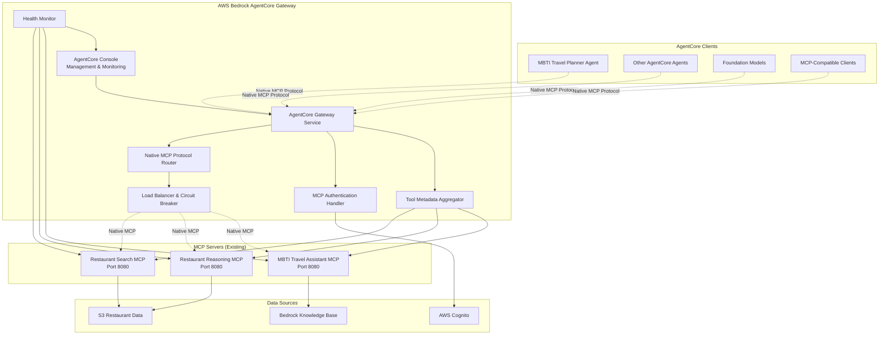
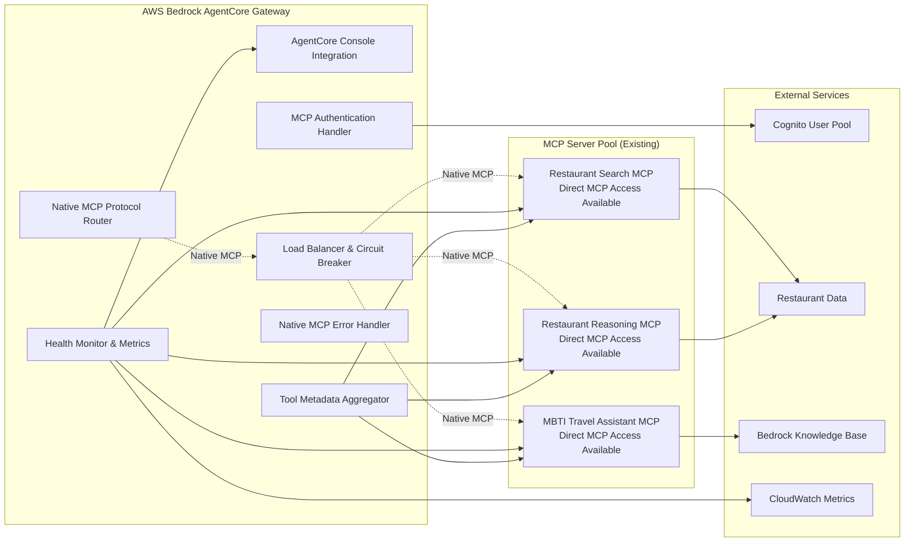

# Design Document

## Overview

The AgentCore Gateway for MCP Tools is an Amazon Bedrock AgentCore Gateway that provides native MCP protocol routing between AgentCore agents, foundation models, and existing MCP servers. The Gateway serves as an intelligent MCP protocol router, eliminating the need for HTTP-to-MCP conversion while providing load balancing, health monitoring, authentication, and observability for native MCP communications.

The Gateway leverages existing MCP servers (restaurant-search-mcp, restaurant-reasoning-mcp, mbti-travel-assistant-mcp) without requiring modifications to their implementation. It provides centralized MCP tool access through native MCP protocol, supporting full MCP functionality including streaming, rich metadata, and native error handling. The Gateway appears in the Bedrock AgentCore console for management and monitoring.

## Architecture

### High-Level Architecture



### Component Architecture



## Components and Interfaces

### 1. AWS Bedrock AgentCore Gateway Service

**Purpose**: AWS Bedrock AgentCore Gateway that provides native MCP protocol routing to existing MCP servers without protocol conversion

**Key Features**:
- Native MCP protocol routing (no HTTP-to-MCP conversion)
- Integration with existing MCP servers without modifications
- Built-in MCP authentication and authorization
- Managed scaling and high availability through AWS
- Load balancing and circuit breaker functionality
- AgentCore Console integration for management and monitoring
- Support for both gateway-routed and direct MCP access

**MCP Servers Exposed**:
```
Restaurant Search MCP Server (restaurant-search-mcp:8080):
  - search_restaurants_by_district
  - search_restaurants_by_meal_type
  - search_restaurants_combined

Restaurant Reasoning MCP Server (restaurant-reasoning-mcp:8080):
  - recommend_restaurants
  - analyze_restaurant_sentiment

MBTI Travel Assistant MCP Server (mbti-travel-assistant-mcp:8080):
  - create_mbti_itinerary
  - get_personality_recommendations
  - analyze_travel_preferences
```

**Native MCP Tool Metadata Aggregation**:
The Gateway aggregates and provides rich metadata from all registered MCP servers:
- Native MCP tool schemas with full parameter validation from source servers
- Streaming response support for real-time operations
- Rich tool descriptions aggregated from MCP servers for AI model understanding
- Example usage scenarios for different personality types
- Integration patterns for travel planning workflows
- MBTI personality integration guidance from source MCP servers

### 2. Native MCP Protocol Router

**Purpose**: Route native MCP protocol communications directly to appropriate MCP servers without conversion

**Implementation**:
- Gateway authenticates AgentCore agents and foundation models using JWT tokens within MCP protocol headers
- JWT authentication is handled at the MCP protocol level (not HTTP level)
- Gateway validates JWT tokens from Cognito and forwards user context to MCP servers via MCP protocol
- Gateway routes MCP requests to appropriate MCP servers based on tool names using native MCP protocol
- MCP servers receive authentication context through native MCP protocol headers/metadata
- User context is maintained throughout the native MCP communication flow
- Circuit breaker functionality for handling MCP server unavailability
- Native MCP error responses forwarded without conversion

**Configuration**:
```yaml
agentcore_gateway_config:
  gateway_type: 'bedrock_agentcore'
  protocol: 'native_mcp'
  authentication:
    type: 'jwt_over_mcp'
    jwt_validation:
      cognito_user_pool_id: 'us-east-1_KePRX24Bn'
      client_id: '1ofgeckef3po4i3us4j1m4chvd'
      region: 'us-east-1'
      discovery_url: 'https://cognito-idp.us-east-1.amazonaws.com/us-east-1_KePRX24Bn/.well-known/openid-configuration'
  
  mcp_servers:
    - name: 'restaurant-search-mcp'
      endpoint: 'restaurant-search-mcp:8080'
      protocol: 'native_mcp'
      health_check: '/health'
      health_check_interval: 30
      health_check_timeout: 10
      tools: ['search_restaurants_by_district', 'search_restaurants_by_meal_type', 'search_restaurants_combined']
      
    - name: 'restaurant-search-result-reasoning-mcp'
      endpoint: 'restaurant-search-result-reasoning-mcp:8080'
      protocol: 'native_mcp'
      health_check: '/health'
      health_check_interval: 30
      health_check_timeout: 10
      tools: ['recommend_restaurants', 'analyze_restaurant_sentiment']
      
    - name: 'mbti-travel-assistant-mcp'
      endpoint: 'mbti-travel-assistant-mcp:8080'
      protocol: 'native_mcp'
      health_check: '/health'
      health_check_interval: 30
      health_check_timeout: 10
      tools: ['create_mbti_itinerary', 'get_personality_recommendations']
  
  console_integration:
    enabled: true
    metrics_enabled: true
    health_monitoring: true
    individual_server_status: true
  
  status_checks:
    enabled: true
    detailed_reporting: true
    individual_server_metrics: true
    failure_threshold: 3
    recovery_threshold: 2
```

### 3. Native MCP Connection Manager

**Purpose**: Manages native MCP connections and communication with existing MCP servers

**Key Features**:
- Native MCP connection pooling for registered MCP servers
- Automatic retry logic with exponential backoff for MCP protocol
- Health monitoring of MCP server endpoints with console integration
- Native MCP request/response forwarding without protocol conversion
- Circuit breaker functionality for unavailable MCP servers
- Load balancing across healthy MCP server instances

**MCP Server Endpoints**:
- Restaurant Search MCP: `restaurant-search-mcp:8080` (native MCP)
- Restaurant Reasoning MCP: `restaurant-reasoning-mcp:8080` (native MCP)
- MBTI Travel Assistant MCP: `mbti-travel-assistant-mcp:8080` (native MCP)

**Authentication Flow**:
1. AgentCore agents/foundation models include JWT tokens in MCP protocol headers
2. Gateway validates JWT tokens against Cognito using standard JWT validation
3. Gateway forwards user context to MCP servers via MCP protocol metadata
4. MCP servers receive authenticated user context through native MCP protocol

**Design Rationale**: This component maintains native MCP protocol throughout the communication chain while using JWT for authentication. The JWT validation happens at the Gateway level, and user context is forwarded to MCP servers using native MCP protocol mechanisms, ensuring full MCP functionality including streaming, rich metadata, and native error handling is preserved.

### 4. Native MCP Protocol Models

**Purpose**: Native MCP protocol message handling and validation

**MCP Tool Call Models** (Native MCP Protocol):
```python
class MCPToolCall(BaseModel):
    """Native MCP tool call structure"""
    jsonrpc: str = "2.0"
    id: Union[str, int]
    method: str = "tools/call"
    params: Dict[str, Any]

class MCPToolResponse(BaseModel):
    """Native MCP tool response structure"""
    jsonrpc: str = "2.0"
    id: Union[str, int]
    result: Optional[Dict[str, Any]] = None
    error: Optional[Dict[str, Any]] = None

class MCPError(BaseModel):
    """Native MCP error response"""
    code: int
    message: str
    data: Optional[Dict[str, Any]] = None
```

**Tool Metadata Models** (Aggregated from MCP Servers):
```python
class MCPToolMetadata(BaseModel):
    """Aggregated tool metadata from MCP servers"""
    name: str
    description: str
    inputSchema: Dict[str, Any]  # JSON Schema from MCP server
    source_server: str
    examples: List[Dict[str, Any]]
    mbti_integration: Optional[Dict[str, Any]]

class MCPServerInfo(BaseModel):
    """MCP server information for console display"""
    name: str
    endpoint: str
    status: str  # "healthy", "unhealthy", "unavailable"
    tools: List[MCPToolMetadata]
    last_health_check: datetime
```

**Design Rationale**: These models handle native MCP protocol messages without conversion, preserving full MCP functionality and ensuring compatibility with MCP-compatible clients.

### 5. Tool Metadata Aggregation System

**Purpose**: Aggregates and provides comprehensive tool metadata from registered MCP servers to foundation models and AgentCore agents

**Tool Metadata Aggregation**:
```python
class AggregatedToolMetadata(BaseModel):
    """Aggregated metadata from multiple MCP servers"""
    gateway_tools: List[MCPToolMetadata]
    server_info: List[MCPServerInfo]
    total_tools: int
    healthy_servers: int
    last_updated: datetime

class MCPToolDiscovery(BaseModel):
    """Tool discovery response for MCP clients"""
    jsonrpc: str = "2.0"
    id: Union[str, int]
    result: Dict[str, Any]  # Native MCP tools/list response
```

**Foundation Model Integration**:
- Aggregates tool descriptions from all registered MCP servers
- Preserves native MCP tool schemas and validation rules from source servers
- Includes use case scenarios and MBTI personality integration guidance
- Provides integration patterns for travel planning workflows
- Maintains streaming support and rich metadata from source MCP servers

**Console Integration**:
- Displays aggregated tool metadata in AgentCore console
- Shows health status and performance metrics for each MCP server
- Provides tool usage analytics and success rates
- Enables management of MCP server routing rules

**Design Rationale**: This system aggregates metadata from existing MCP servers without requiring modifications to the servers themselves, providing a centralized view while maintaining native MCP protocol functionality.

### 6. Native MCP Error Handling System

**Purpose**: Comprehensive error handling using native MCP protocol error responses

**MCP Error Categories**:
- MCP Validation Errors: Invalid parameters forwarded from MCP servers
- MCP Authentication Errors: Authentication failures in native MCP format
- MCP Service Unavailable: Circuit breaker responses when MCP servers are down
- MCP Rate Limiting: Rate limit exceeded responses in MCP format
- MCP Protocol Errors: Native MCP protocol-level errors

**Native MCP Error Response Format**:
```json
{
    "jsonrpc": "2.0",
    "id": 1,
    "error": {
        "code": -32602,
        "message": "Invalid params",
        "data": {
            "validation_errors": ["Invalid district names provided"],
            "available_options": ["Central district", "Admiralty"],
            "source_server": "restaurant-search-mcp",
            "timestamp": "2025-01-03T10:30:00Z"
        }
    }
}
```

**Circuit Breaker Error Response**:
```json
{
    "jsonrpc": "2.0",
    "id": 1,
    "error": {
        "code": -32001,
        "message": "Service unavailable",
        "data": {
            "reason": "MCP server unavailable",
            "server": "restaurant-search-mcp",
            "retry_after": 30,
            "circuit_breaker_state": "open"
        }
    }
}
```

**Design Rationale**: Using native MCP error responses ensures compatibility with MCP-compatible clients and maintains consistency with the MCP protocol specification. Errors from underlying MCP servers are forwarded without conversion to preserve original error context.

## Data Models

### AgentCore Gateway Configuration Model

```json
{
  "gateway_name": "agentcore-mcp-gateway",
  "description": "AWS Bedrock AgentCore Gateway for native MCP protocol routing",
  "gateway_type": "bedrock_agentcore",
  "protocol": "native_mcp",
  "console_integration": {
    "enabled": true,
    "display_name": "Restaurant MCP Gateway",
    "description": "Native MCP routing for restaurant search and reasoning tools"
  },
  "mcp_servers": [
    {
      "name": "restaurant-search-mcp",
      "endpoint": "restaurant-search-mcp:8080",
      "protocol": "native_mcp",
      "health_check_path": "/health",
      "health_check_interval": 30,
      "health_check_timeout": 10,
      "failure_threshold": 3,
      "recovery_threshold": 2,
      "tools": ["search_restaurants_by_district", "search_restaurants_by_meal_type", "search_restaurants_combined"]
    },
    {
      "name": "restaurant-search-result-reasoning-mcp", 
      "endpoint": "restaurant-search-result-reasoning-mcp:8080",
      "protocol": "native_mcp",
      "health_check_path": "/health",
      "health_check_interval": 30,
      "health_check_timeout": 10,
      "failure_threshold": 3,
      "recovery_threshold": 2,
      "tools": ["recommend_restaurants", "analyze_restaurant_sentiment"]
    },
    {
      "name": "mbti-travel-assistant-mcp",
      "endpoint": "mbti-travel-assistant-mcp:8080", 
      "protocol": "native_mcp",
      "health_check_path": "/health",
      "health_check_interval": 30,
      "health_check_timeout": 10,
      "failure_threshold": 3,
      "recovery_threshold": 2,
      "tools": ["create_mbti_itinerary", "get_personality_recommendations"]
    }
  ],
  "authentication": {
    "type": "jwt_over_mcp",
    "jwt_validation": {
      "cognito_user_pool_id": "us-east-1_KePRX24Bn",
      "client_id": "1ofgeckef3po4i3us4j1m4chvd",
      "client_secret": "t69uogl8jl9qu9nvsrpifu0gpruj02l9q8rnoci36bipc8me4r9",
      "region": "us-east-1",
      "discovery_url": "https://cognito-idp.us-east-1.amazonaws.com/us-east-1_KePRX24Bn/.well-known/openid-configuration"
    }
  },
  "circuit_breaker": {
    "enabled": true,
    "failure_threshold": 5,
    "timeout": 30,
    "retry_interval": 60
  }
}
```

### Native MCP Protocol Response Format

```json
{
  "jsonrpc": "2.0",
  "id": 1,
  "result": {
    "content": [
      {
        "type": "text",
        "text": "{\"restaurants\": [...], \"metadata\": {...}}"
      }
    ],
    "isError": false,
    "_meta": {
      "source_server": "restaurant-search-mcp",
      "processing_time_ms": 150,
      "gateway_version": "1.0.0"
    }
  }
}
```

**Design Rationale**: The configuration model supports native MCP protocol routing without conversion, includes console integration for management, and maintains compatibility with existing MCP servers without requiring modifications.

## Error Handling

### Native MCP Authentication Errors

**JWT Authentication Missing in MCP Headers**:
- MCP Error Code: -32001
- Response: Native MCP authentication required error
- Action: Return MCP error indicating JWT token required in MCP protocol headers

**JWT Authentication Invalid in MCP Context**:
- MCP Error Code: -32001
- Response: Native MCP authentication validation failure with JWT validation details
- Action: Include Cognito discovery URL and JWT validation errors in MCP error data

**JWT Token Expired in MCP Request**:
- MCP Error Code: -32001
- Response: Native MCP token expired error with JWT expiration details
- Action: Include JWT refresh guidance in MCP error response data

### MCP Server Errors

**MCP Server Unavailable**:
- MCP Error Code: -32001
- Response: Native MCP service unavailable error with circuit breaker data
- Action: Automatic retry with exponential backoff, update console status

**MCP Tool Execution Error**:
- MCP Error Code: Forwarded from source MCP server
- Response: Forward native MCP error from source server without conversion
- Action: Log full error details for debugging, maintain error context

**Circuit Breaker Open**:
- MCP Error Code: -32001
- Response: Circuit breaker open error with retry information
- Action: Route traffic to healthy servers, update console metrics

### MCP Validation Errors

**Invalid MCP Parameters**:
- MCP Error Code: -32602
- Response: Forward validation errors from source MCP server
- Action: Preserve original validation context and suggestions

**MCP Protocol Errors**:
- MCP Error Code: -32700, -32600, -32601
- Response: Native MCP protocol error responses
- Action: Maintain MCP protocol compliance

**Design Rationale**: All error handling uses native MCP protocol error responses to maintain compatibility with MCP-compatible clients. Errors from underlying MCP servers are forwarded without conversion to preserve original error context and enable proper client-side error handling.

## Testing Strategy

### Unit Tests

**Native MCP Authentication Tests**:
- Valid MCP authentication validation
- Invalid MCP authentication rejection
- MCP authentication context forwarding
- User context extraction and preservation

**Native MCP Connection Manager Tests**:
- Successful native MCP tool calls
- MCP connection failure handling
- MCP retry logic validation
- MCP server health check monitoring

**MCP Protocol Router Tests**:
- Native MCP request routing
- MCP response forwarding
- MCP error handling
- Tool metadata aggregation

### Integration Tests

**End-to-End Native MCP Tests**:
- Complete MCP request/response cycles
- MCP authentication flow validation
- MCP server integration without conversion
- Native MCP error scenario testing

**Console Integration Tests**:
- Gateway visibility in AgentCore console
- Health status reporting
- Metrics collection and display
- Tool usage analytics

**Performance Tests**:
- Load testing with concurrent MCP requests
- Native MCP response time validation
- Resource usage monitoring
- Circuit breaker functionality

### Security Tests

**MCP Authentication Security**:
- MCP authentication tampering detection
- Expired authentication handling
- Invalid authentication rejection
- User context isolation in MCP protocol

**MCP Protocol Security**:
- MCP input validation
- Protocol compliance validation
- Rate limiting enforcement
- Circuit breaker security

### Backward Compatibility Tests

**Direct MCP Access Tests**:
- Verify existing direct MCP connections continue to work
- Test both gateway-routed and direct access simultaneously
- Validate consistent MCP protocol behavior
- Ensure no disruption to existing MCP server functionality

**Configuration**:
```json
{
  "agentcore_gateway_config": {
    "gateway_type": "bedrock_agentcore",
    "protocol": "native_mcp",
    "console_integration": true,
    "authentication": {
      "type": "mcp_native",
      "cognito_user_pool": "us-east-1_KePRX24Bn",
      "client_id": "1ofgeckef3po4i3us4j1m4chvd"
    },
    "circuit_breaker": {
      "enabled": true,
      "timeout": 30,
      "retry_policy": {
        "max_retries": 3,
        "backoff_multiplier": 2
      }
    }
  }
}
```

**Design Rationale**: Testing strategy focuses on native MCP protocol functionality, console integration, and backward compatibility to ensure the Gateway provides the required functionality without disrupting existing MCP server operations.

## Backward Compatibility and Coexistence

### Design Principles for Coexistence

**Requirement Addressed**: Requirement 8 - System integrator needs for both direct MCP access and gateway-routed access

**Key Design Decisions**:

1. **Non-Intrusive Architecture**: The Gateway operates as a separate service that routes to existing MCP servers without requiring any modifications to the MCP servers themselves.

2. **Dual Access Pattern**: Both direct MCP connections and gateway-routed connections are supported simultaneously:
   ```
   Direct Access:    Client ←→ MCP Server
   Gateway Access:   Client ←→ Gateway ←→ MCP Server
   ```

3. **Protocol Consistency**: Both access patterns use identical native MCP protocol, ensuring consistent behavior regardless of access method.

4. **Authentication Compatibility**: The Gateway forwards authentication context to MCP servers using the same mechanisms they already support.

### Implementation Strategy

**MCP Server Independence**:
- Existing MCP servers continue to operate unchanged
- No modifications required to server code, configuration, or deployment
- Servers maintain their existing authentication and authorization mechanisms
- Direct client connections continue to work as before

**Gateway as Optional Layer**:
- Gateway provides additional capabilities (load balancing, circuit breaker, console integration)
- Clients can choose between direct access and gateway access based on their needs
- Gateway configuration changes do not affect MCP server operations
- MCP servers can be added/removed from gateway routing without server changes

**Consistent Protocol Behavior**:
- Same MCP protocol messages and responses regardless of access method
- Identical authentication requirements and user context handling
- Consistent error responses and tool metadata
- Same streaming and rich metadata support

### Migration and Adoption Strategy

**Gradual Adoption**:
- Existing clients can continue using direct MCP access
- New clients can use gateway access for additional features
- Clients can migrate from direct to gateway access without code changes
- A/B testing between access methods is supported

**Operational Flexibility**:
- Gateway can be deployed without disrupting existing operations
- MCP servers can be temporarily removed from gateway routing for maintenance
- Direct access provides fallback option if gateway is unavailable
- Independent scaling and management of gateway and MCP servers

**Design Rationale**: This coexistence approach ensures that the Gateway adds value without creating dependencies or disrupting existing MCP server operations, providing flexibility for different integration patterns and migration strategies.

### 7. MCP Server Status Check System

**Purpose**: Comprehensive status monitoring and health checking for restaurant-search-mcp and restaurant-search-result-reasoning-mcp services

**Key Features**:
- Individual status tracking for each named MCP server
- Configurable health check intervals and timeouts
- Detailed metrics collection per MCP server
- Console integration for individual server status display
- Failure threshold and recovery monitoring
- Circuit breaker integration based on status checks

**Status Check Configuration**:
```python
class MCPServerStatusConfig(BaseModel):
    """Configuration for MCP server status checks"""
    name: str
    endpoint: str
    health_check_path: str = "/health"
    health_check_interval: int = 30  # seconds
    health_check_timeout: int = 10   # seconds
    failure_threshold: int = 3       # consecutive failures before marking unhealthy
    recovery_threshold: int = 2      # consecutive successes before marking healthy
    enabled: bool = True

class StatusCheckResponse(BaseModel):
    """Individual MCP server status response"""
    server_name: str
    status: str  # "healthy", "unhealthy", "unknown"
    last_check: datetime
    response_time_ms: Optional[float]
    consecutive_failures: int
    consecutive_successes: int
    error_message: Optional[str]
    endpoint: str
    tools_available: List[str]
```

**Status Check Endpoints**:
- `/health` - Overall Gateway health including individual MCP server status
- `/health/servers` - Detailed status for all MCP servers
- `/health/servers/{server_name}` - Status for specific MCP server
- `/metrics/mcp` - Detailed metrics for all MCP servers
- `/metrics/mcp/{server_name}` - Metrics for specific MCP server

**Console Integration**:
```json
{
  "gateway_status": {
    "overall_status": "healthy",
    "mcp_servers": {
      "restaurant-search-mcp": {
        "status": "healthy",
        "last_check": "2025-01-03T10:30:00Z",
        "response_time_ms": 45.2,
        "tools": ["search_restaurants_by_district", "search_restaurants_by_meal_type", "search_restaurants_combined"]
      },
      "restaurant-search-result-reasoning-mcp": {
        "status": "healthy", 
        "last_check": "2025-01-03T10:30:00Z",
        "response_time_ms": 67.8,
        "tools": ["recommend_restaurants", "analyze_restaurant_sentiment"]
      }
    }
  }
}
```

**Design Rationale**: This system provides granular status monitoring for the specific MCP services requested, enabling precise health tracking and troubleshooting while maintaining the existing comprehensive health monitoring architecture.

### 8. AgentCore Gateway Deployment Configuration

**Purpose**: Configure the AWS Bedrock AgentCore Gateway for native MCP protocol routing

**Deployment Method**: AWS CLI with AgentCore Gateway configuration

**Gateway Configuration**:
```yaml
# agentcore-gateway-config.yaml
apiVersion: bedrock-agentcore/v1
kind: Gateway
metadata:
  name: agentcore-mcp-gateway
  description: "AWS Bedrock AgentCore Gateway for native MCP protocol routing"
spec:
  gateway_type: "bedrock_agentcore"
  protocol: "native_mcp"
  console_integration:
    enabled: true
    display_name: "Restaurant MCP Gateway"
    description: "Native MCP routing for restaurant search and reasoning tools"
  mcp_servers:
    - name: "restaurant-search-mcp"
      endpoint: "restaurant-search-mcp:8080"
      protocol: "native_mcp"
      health_check: "/health"
      tools: 
        - "search_restaurants_by_district"
        - "search_restaurants_by_meal_type" 
        - "search_restaurants_combined"
    - name: "restaurant-reasoning-mcp"
      endpoint: "restaurant-reasoning-mcp:8080"
      protocol: "native_mcp"
      health_check: "/health"
      tools:
        - "recommend_restaurants"
        - "analyze_restaurant_sentiment"
    - name: "mbti-travel-assistant-mcp"
      endpoint: "mbti-travel-assistant-mcp:8080"
      protocol: "native_mcp"
      health_check: "/health"
      tools:
        - "create_mbti_itinerary"
        - "get_personality_recommendations"
  authentication:
    type: "jwt_over_mcp"
    jwt_validation:
      cognito_user_pool_id: "us-east-1_KePRX24Bn"
      client_id: "1ofgeckef3po4i3us4j1m4chvd"
      discovery_url: "https://cognito-idp.us-east-1.amazonaws.com/us-east-1_KePRX24Bn/.well-known/openid-configuration"
  circuit_breaker:
    enabled: true
    failure_threshold: 5
    timeout: 30
    retry_interval: 60
  load_balancing:
    enabled: true
    strategy: "round_robin"
    health_check_interval: 30
```

**AWS CLI Deployment Commands**:
```bash
# Create AgentCore Gateway
aws bedrock-agentcore create-gateway \
  --gateway-name agentcore-mcp-gateway \
  --configuration file://agentcore-gateway-config.yaml \
  --region us-east-1

# Update Gateway configuration
aws bedrock-agentcore update-gateway \
  --gateway-id <gateway-id> \
  --configuration file://agentcore-gateway-config.yaml \
  --region us-east-1

# List Gateways (verify console integration)
aws bedrock-agentcore list-gateways --region us-east-1
```

**Design Rationale**: This configuration enables native MCP protocol routing without conversion, integrates with the AgentCore console for management, and supports infrastructure-as-code deployment patterns.

## Data Models

### Gateway Configuration Model

```json
{
  "gateway_name": "restaurant-mcp-gateway",
  "description": "Gateway for restaurant search and reasoning MCP tools",
  "target_runtime": {
    "arn": "arn:aws:bedrock-agentcore:us-east-1:209803798463:runtime/main-DUQgnrHqCl",
    "base_url": "https://bedrock-agentcore.us-east-1.amazonaws.com/runtime/main-DUQgnrHqCl",
    "authentication_required": true
  },
  "authentication": {
    "type": "jwt_over_mcp",
    "jwt_validation": {
      "cognito_user_pool_id": "us-east-1_KePRX24Bn",
      "client_id": "1ofgeckef3po4i3us4j1m4chvd",
      "client_secret": "t69uogl8jl9qu9nvsrpifu0gpruj02l9q8rnoci36bipc8me4r9",
      "region": "us-east-1",
      "discovery_url": "https://cognito-idp.us-east-1.amazonaws.com/us-east-1_KePRX24Bn/.well-known/openid-configuration"
    }
  },
  "tools": [
    {
      "mcp_name": "search_restaurants_by_district",
      "http_endpoint": "/api/v1/restaurants/search/district",
      "method": "POST",
      "description": "Search for restaurants in specific Hong Kong districts"
    }
  ]
}
```

### MCP Tool Response Format

```json
{
  "jsonrpc": "2.0",
  "id": 1,
  "result": {
    "content": [
      {
        "type": "text",
        "text": "{\"restaurants\": [...], \"metadata\": {...}}"
      }
    ]
  }
}
```