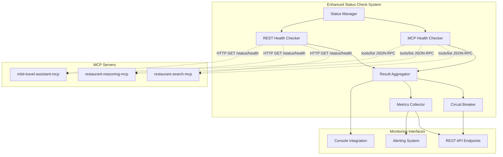
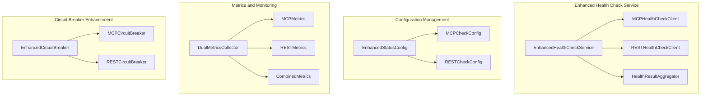

# Design Document

## Overview

The Enhanced MCP Status Check system provides comprehensive health monitoring for MCP servers using dual monitoring approaches: native MCP tools/list requests and RESTful API health checks. This design builds upon the existing status check implementations in restaurant-search-mcp and restaurant-search-result-reasoning-mcp servers to provide more robust, comprehensive, and intelligent health monitoring capabilities.

The system implements a dual-path monitoring architecture where both MCP protocol health checks and HTTP REST health checks are performed concurrently, with intelligent aggregation of results to determine overall server health status. This approach provides redundancy, comprehensive coverage, and detailed insights into both MCP protocol functionality and general server health.

## Architecture

### High-Level Architecture



### Component Architecture



## Components and Interfaces

### 1. Enhanced Health Check Service

**Purpose**: Orchestrates dual health checking using both MCP and REST approaches

**Key Classes**:
- `EnhancedHealthCheckService`: Main orchestrator for dual health checks
- `MCPHealthCheckClient`: Handles MCP tools/list requests
- `RESTHealthCheckClient`: Handles HTTP REST health checks
- `HealthResultAggregator`: Combines results from both monitoring methods

**Interfaces**:
```python
class EnhancedHealthCheckService:
    async def perform_dual_health_check(
        self, 
        server_config: EnhancedServerConfig
    ) -> DualHealthCheckResult
    
    async def perform_mcp_health_check(
        self, 
        server_config: EnhancedServerConfig
    ) -> MCPHealthCheckResult
    
    async def perform_rest_health_check(
        self, 
        server_config: EnhancedServerConfig
    ) -> RESTHealthCheckResult
    
    async def check_multiple_servers_dual(
        self, 
        server_configs: List[EnhancedServerConfig]
    ) -> List[DualHealthCheckResult]
```

### 2. MCP Health Check Client

**Purpose**: Performs native MCP tools/list health checks

**Key Features**:
- JSON-RPC 2.0 tools/list request generation
- MCP response validation and tool verification
- Expected tools list validation
- MCP-specific error handling

**Interface**:
```python
class MCPHealthCheckClient:
    async def send_tools_list_request(
        self, 
        endpoint_url: str, 
        auth_headers: Dict[str, str],
        timeout: int
    ) -> MCPToolsListResponse
    
    def validate_tools_list_response(
        self, 
        response: MCPToolsListResponse,
        expected_tools: List[str]
    ) -> MCPValidationResult
    
    def create_mcp_request(
        self, 
        request_id: str = None
    ) -> MCPToolsListRequest
```

### 3. REST Health Check Client

**Purpose**: Performs HTTP REST health checks on MCP server health endpoints

**Key Features**:
- HTTP GET requests to /status/health endpoints
- Response validation and metrics extraction
- HTTP-specific error handling and retry logic
- Support for various REST health check formats

**Interface**:
```python
class RESTHealthCheckClient:
    async def send_health_request(
        self, 
        health_endpoint_url: str,
        auth_headers: Dict[str, str],
        timeout: int
    ) -> RESTHealthCheckResponse
    
    def validate_rest_response(
        self, 
        response: RESTHealthCheckResponse
    ) -> RESTValidationResult
    
    async def perform_rest_health_check_with_retry(
        self, 
        config: RESTHealthConfig
    ) -> RESTHealthCheckResult
```

### 4. Health Result Aggregator

**Purpose**: Combines MCP and REST health check results into unified health status

**Key Features**:
- Intelligent result aggregation logic
- Priority weighting between MCP and REST results
- Comprehensive status determination
- Detailed failure analysis

**Interface**:
```python
class HealthResultAggregator:
    def aggregate_dual_results(
        self, 
        mcp_result: MCPHealthCheckResult,
        rest_result: RESTHealthCheckResult,
        aggregation_config: AggregationConfig
    ) -> DualHealthCheckResult
    
    def determine_overall_status(
        self, 
        mcp_success: bool,
        rest_success: bool,
        priority_config: PriorityConfig
    ) -> ServerStatus
    
    def create_combined_metrics(
        self, 
        mcp_metrics: MCPMetrics,
        rest_metrics: RESTMetrics
    ) -> CombinedHealthMetrics
```

### 5. Enhanced Configuration Management

**Purpose**: Manages configuration for dual health checking approaches

**Key Features**:
- Separate configuration for MCP and REST health checks
- Backward compatibility with existing configurations
- Priority and weighting configuration
- Flexible timeout and retry settings

**Configuration Structure**:
```json
{
  "enhanced_status_check_system": {
    "dual_monitoring_enabled": true,
    "mcp_health_checks": {
      "enabled": true,
      "default_timeout_seconds": 10,
      "tools_list_validation": true,
      "expected_tools_validation": true
    },
    "rest_health_checks": {
      "enabled": true,
      "default_timeout_seconds": 8,
      "health_endpoint_path": "/status/health",
      "metrics_endpoint_path": "/status/metrics"
    },
    "result_aggregation": {
      "mcp_priority_weight": 0.6,
      "rest_priority_weight": 0.4,
      "require_both_success_for_healthy": false,
      "degraded_on_single_failure": true
    }
  }
}
```

### 6. Enhanced Circuit Breaker

**Purpose**: Implements intelligent circuit breaking based on dual health check results

**Key Features**:
- Separate circuit breaker states for MCP and REST paths
- Combined circuit breaker logic
- Intelligent traffic routing based on available paths
- Enhanced failure pattern detection

**Interface**:
```python
class EnhancedCircuitBreaker:
    async def evaluate_circuit_state(
        self, 
        server_name: str,
        dual_result: DualHealthCheckResult
    ) -> EnhancedCircuitBreakerState
    
    async def should_allow_mcp_traffic(
        self, 
        server_name: str
    ) -> bool
    
    async def should_allow_rest_traffic(
        self, 
        server_name: str
    ) -> bool
    
    async def get_available_paths(
        self, 
        server_name: str
    ) -> List[str]  # ["mcp", "rest", "both", "none"]
```

## Data Models

### Enhanced Health Check Result

```python
@dataclass
class DualHealthCheckResult:
    server_name: str
    timestamp: datetime
    overall_status: ServerStatus
    overall_success: bool
    
    # MCP Health Check Results
    mcp_result: Optional[MCPHealthCheckResult]
    mcp_success: bool
    mcp_response_time_ms: float
    mcp_tools_count: Optional[int]
    mcp_error_message: Optional[str]
    
    # REST Health Check Results
    rest_result: Optional[RESTHealthCheckResult]
    rest_success: bool
    rest_response_time_ms: float
    rest_status_code: Optional[int]
    rest_error_message: Optional[str]
    
    # Combined Metrics
    combined_response_time_ms: float
    health_score: float  # 0.0 to 1.0
    available_paths: List[str]
    
    def to_dict(self) -> Dict[str, Any]:
        """Convert to dictionary for JSON serialization."""
        pass
```

### MCP Health Check Result

```python
@dataclass
class MCPHealthCheckResult:
    server_name: str
    timestamp: datetime
    success: bool
    response_time_ms: float
    
    # MCP-specific data
    tools_list_response: Optional[MCPToolsListResponse]
    tools_count: Optional[int]
    expected_tools_found: List[str]
    missing_tools: List[str]
    validation_errors: List[str]
    
    # Request/Response details
    request_id: str
    jsonrpc_version: str
    mcp_error: Optional[Dict[str, Any]]
    
    def to_dict(self) -> Dict[str, Any]:
        """Convert to dictionary for JSON serialization."""
        pass
```

### REST Health Check Result

```python
@dataclass
class RESTHealthCheckResult:
    server_name: str
    timestamp: datetime
    success: bool
    response_time_ms: float
    
    # HTTP-specific data
    status_code: Optional[int]
    response_body: Optional[Dict[str, Any]]
    health_endpoint_url: str
    
    # Server health data from REST response
    server_metrics: Optional[Dict[str, Any]]
    circuit_breaker_states: Optional[Dict[str, Any]]
    system_health: Optional[Dict[str, Any]]
    
    # Error details
    http_error: Optional[str]
    connection_error: Optional[str]
    
    def to_dict(self) -> Dict[str, Any]:
        """Convert to dictionary for JSON serialization."""
        pass
```

### Enhanced Server Configuration

```python
@dataclass
class EnhancedServerConfig:
    server_name: str
    
    # MCP Configuration
    mcp_endpoint_url: str
    mcp_enabled: bool = True
    mcp_timeout_seconds: int = 10
    mcp_expected_tools: List[str] = None
    mcp_retry_attempts: int = 3
    
    # REST Configuration
    rest_health_endpoint_url: str
    rest_enabled: bool = True
    rest_timeout_seconds: int = 8
    rest_retry_attempts: int = 2
    
    # Authentication
    jwt_token: Optional[str] = None
    auth_headers: Dict[str, str] = None
    
    # Aggregation Settings
    mcp_priority_weight: float = 0.6
    rest_priority_weight: float = 0.4
    require_both_success: bool = False
    
    def to_dict(self) -> Dict[str, Any]:
        """Convert to dictionary for JSON serialization."""
        pass
```

## Error Handling

### MCP-Specific Error Handling

1. **JSON-RPC 2.0 Validation Errors**
   - Invalid JSON-RPC version
   - Missing required fields
   - Malformed request/response structure

2. **Tools List Validation Errors**
   - Missing expected tools
   - Invalid tool schema
   - Tool description validation failures

3. **MCP Protocol Errors**
   - Connection timeouts
   - Authentication failures
   - Server-side MCP errors

### REST-Specific Error Handling

1. **HTTP Status Code Handling**
   - 2xx: Success with response validation
   - 4xx: Client errors (authentication, bad request)
   - 5xx: Server errors (internal server error, service unavailable)

2. **Response Validation Errors**
   - Invalid JSON response format
   - Missing required health check fields
   - Malformed metrics data

3. **Connection Errors**
   - Network timeouts
   - DNS resolution failures
   - Connection refused

### Aggregated Error Handling

1. **Partial Failure Scenarios**
   - MCP success + REST failure = DEGRADED status
   - MCP failure + REST success = DEGRADED status
   - Both failures = UNHEALTHY status

2. **Error Priority and Reporting**
   - Critical errors (both paths failed)
   - Warning errors (single path failed)
   - Information errors (validation warnings)

## Testing Strategy

### Unit Testing

1. **MCP Health Check Client Tests**
   - JSON-RPC 2.0 request generation
   - Tools list response validation
   - Expected tools verification
   - Error handling scenarios

2. **REST Health Check Client Tests**
   - HTTP request generation
   - Response validation
   - Status code handling
   - Retry logic testing

3. **Result Aggregation Tests**
   - Dual result combination logic
   - Priority weighting calculations
   - Status determination algorithms
   - Metrics aggregation

### Integration Testing

1. **End-to-End Dual Health Checks**
   - Complete dual health check flow
   - Authentication integration
   - Configuration loading
   - Result persistence

2. **Circuit Breaker Integration**
   - Enhanced circuit breaker behavior
   - Path availability determination
   - Traffic routing decisions
   - Recovery scenarios

3. **API Endpoint Testing**
   - Enhanced REST API responses
   - Backward compatibility
   - Performance under load
   - Concurrent request handling

### Performance Testing

1. **Concurrent Health Check Performance**
   - Multiple server monitoring
   - Resource utilization
   - Response time optimization
   - Connection pool management

2. **Scalability Testing**
   - Large number of monitored servers
   - High-frequency health checks
   - Memory usage patterns
   - CPU utilization

### Compatibility Testing

1. **Backward Compatibility**
   - Existing configuration support
   - Legacy API response formats
   - Existing monitoring system integration
   - Migration path validation

2. **Cross-Platform Testing**
   - Different MCP server implementations
   - Various REST API formats
   - Authentication method compatibility
   - Network configuration variations

## Security Considerations

### Authentication and Authorization

1. **MCP Authentication**
   - JWT token inclusion in MCP requests
   - Token refresh mechanisms
   - Authentication error handling
   - Secure token storage

2. **REST Authentication**
   - HTTP authentication headers
   - API key management
   - Certificate-based authentication
   - OAuth 2.0 integration

### Data Security

1. **Sensitive Data Handling**
   - Authentication token protection
   - Secure configuration storage
   - Encrypted communication channels
   - Audit logging

2. **Network Security**
   - TLS/SSL enforcement
   - Certificate validation
   - Network isolation
   - Firewall considerations

### Monitoring Security

1. **Health Check Data Protection**
   - Sensitive information filtering
   - Secure metrics transmission
   - Access control for monitoring data
   - Privacy compliance

## Performance Optimization

### Concurrent Processing

1. **Parallel Health Checks**
   - Concurrent MCP and REST requests
   - Asynchronous processing
   - Connection pooling
   - Resource management

2. **Batch Processing**
   - Multiple server health checks
   - Efficient resource utilization
   - Load balancing
   - Queue management

### Caching and Optimization

1. **Result Caching**
   - Recent health check results
   - Configuration caching
   - Authentication token caching
   - DNS resolution caching

2. **Network Optimization**
   - Connection reuse
   - Keep-alive connections
   - Compression support
   - Timeout optimization

### Resource Management

1. **Memory Management**
   - Result history limits
   - Configuration memory usage
   - Connection pool sizing
   - Garbage collection optimization

2. **CPU Optimization**
   - Efficient JSON processing
   - Optimized validation algorithms
   - Minimal computational overhead
   - Background processing

This design provides a comprehensive foundation for implementing enhanced MCP status checks with dual monitoring approaches, ensuring robust health monitoring while maintaining backward compatibility and performance optimization.