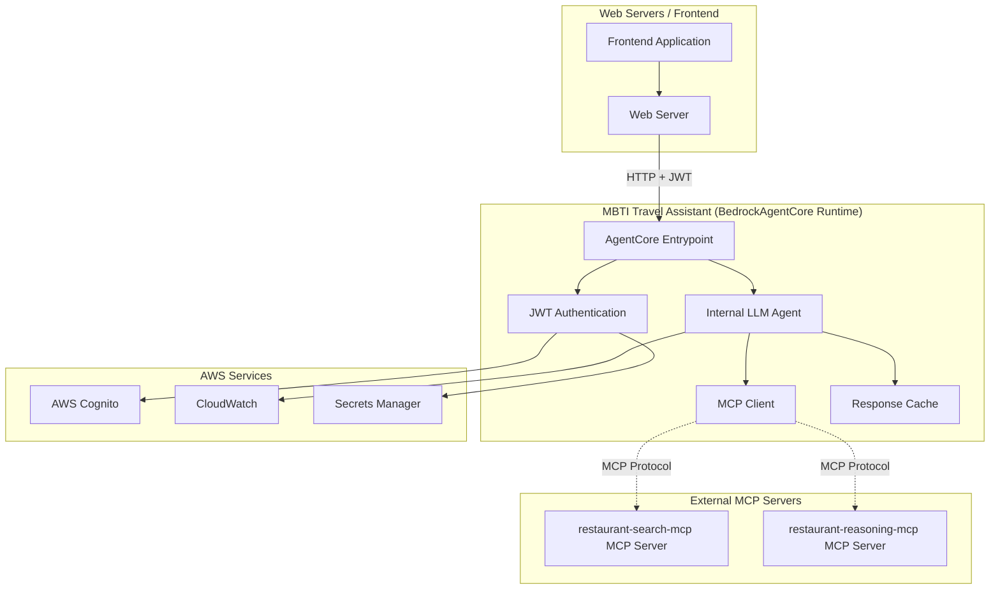
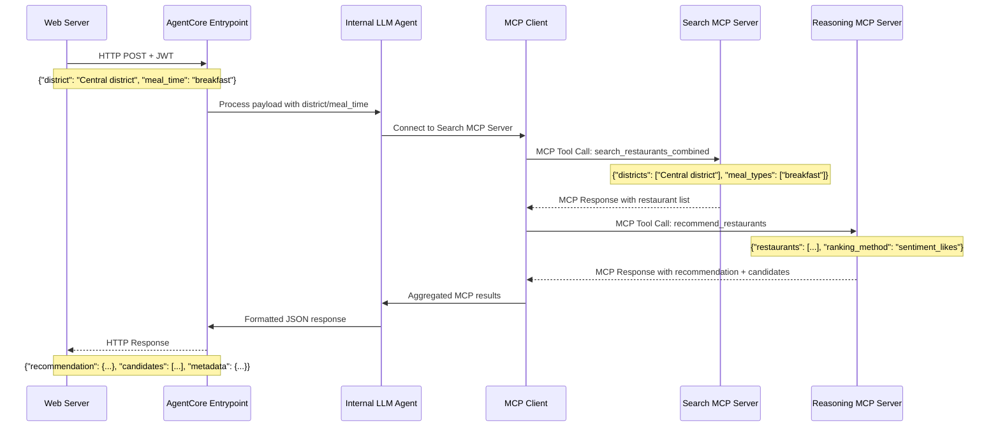

# Design Document

## Overview

The MBTI Travel Assistant is designed as a Bedrock AgentCore runtime service that receives HTTP requests from web servers and uses an internal LLM agent to orchestrate MCP client calls to existing MCP servers. The system processes HTTP payloads containing district and meal time parameters, authenticates via JWT tokens, and employs an embedded foundation model to intelligently coordinate restaurant search and sentiment analysis.

The architecture follows the BedrockAgentCore runtime pattern: (1) Web servers send HTTP requests with JWT authentication and structured payloads, (2) the AgentCore runtime processes requests through an internal LLM agent, (3) the LLM acts as an MCP client to communicate with existing MCP servers, and (4) structured JSON responses are returned to the web server. The internal LLM adds intelligence by understanding the workflow and coordinating multiple MCP calls to deliver exactly one recommended restaurant plus 19 candidates.

## Architecture

### High-Level Architecture



### Request Processing Flow



## MCP Client Integration Strategy

### MCP Client Calls to Existing MCP Servers

Based on the actual implementation of `restaurant-search-mcp` and `restaurant-search-result-reasoning-mcp`, both projects expose **MCP servers** with `@mcp.tool()` decorators. The MBTI Travel Assistant's internal LLM will act as an **MCP client** to call these existing MCP servers.

**Integration Pattern:**
```python
from mcp.client import MCPClient
from mcp.client.session import ClientSession

# MCP client connections to existing servers
search_mcp_client = MCPClient("restaurant-search-mcp-endpoint")
reasoning_mcp_client = MCPClient("restaurant-reasoning-mcp-endpoint")

# Usage for search MCP server
async with search_mcp_client.connect() as (read, write):
    async with ClientSession(read, write) as session:
        await session.initialize()
        
        # Call search_restaurants_combined MCP tool
        result = await session.call_tool(
            "search_restaurants_combined",
            {
                "districts": [district],
                "meal_types": [meal_time]
            }
        )

# Usage for reasoning MCP server  
async with reasoning_mcp_client.connect() as (read, write):
    async with ClientSession(read, write) as session:
        await session.initialize()
        
        # Call recommend_restaurants MCP tool
        result = await session.call_tool(
            "recommend_restaurants",
            {
                "restaurants": restaurant_list,
                "ranking_method": "sentiment_likes"
            }
        )
```

**MCP Protocol:** The internal LLM will use MCP protocol to communicate with the existing MCP servers, not HTTP calls to AgentCore runtimes.

**Dual Architecture:** Each existing project has both a BedrockAgentCore runtime (`main.py`) AND a separate MCP server (`*_mcp_server.py`). The MBTI Travel Assistant will connect to their **MCP servers**.

## Components and Interfaces

### BedrockAgentCore Runtime Structure

The MBTI Travel Assistant follows the BedrockAgentCore runtime pattern with these key components:

```python
from bedrock_agentcore import BedrockAgentCoreApp
from strands_agents import Agent

app = BedrockAgentCoreApp()

@app.entrypoint
def process_restaurant_request(payload: dict) -> str:
    """
    Main entrypoint for processing restaurant recommendation requests
    
    Args:
        payload: HTTP request payload containing district and meal_time
        
    Returns:
        JSON string with recommendation and candidates
    """
```

### 1. AgentCore Entrypoint

**Purpose**: Serves as the main HTTP entry point following BedrockAgentCore runtime patterns.

**Key Responsibilities**:
- HTTP request/response handling with JWT authentication
- Payload validation and extraction
- Integration with internal LLM agent
- Response formatting and serialization
- Error handling and logging

**Interface**:
```python
@app.entrypoint
def process_restaurant_request(payload: dict) -> str:
    """
    Process restaurant recommendation requests from web servers
    
    Expected Payload:
    {
        "district": "Central district",
        "meal_time": "breakfast",
        "user_context": {...}  # Optional user context from JWT
    }
    
    Returns:
        JSON string:
        {
            "recommendation": {...},
            "candidates": [...],
            "metadata": {...}
        }
    """
```

### 2. Internal LLM Agent

**Purpose**: Processes requests and orchestrates MCP client calls using an embedded foundation model.

**Key Responsibilities**:
- Understand district and meal time parameters
- Determine the sequence of MCP calls needed
- Act as MCP client to external MCP servers
- Process and aggregate MCP responses
- Generate structured JSON responses

**Interface**:
```python
from strands_agents import Agent
from mcp.client import MCPClient

class RestaurantAgent(Agent):
    def __init__(self):
        super().__init__()
        self.search_mcp_client = MCPClient("restaurant_search_mcp_endpoint")
        self.reasoning_mcp_client = MCPClient("restaurant_reasoning_mcp_endpoint")
    
    async def process_request(self, district: str, meal_time: str) -> dict:
        """
        Main processing method that coordinates MCP calls
        
        Args:
            district: District name for restaurant search
            meal_time: Meal time (breakfast, lunch, dinner)
            
        Returns:
            {
                "recommendation": Restaurant,
                "candidates": List[Restaurant],
                "metadata": ResponseMetadata
            }
        """
```

### 3. MCP Client Manager

**Purpose**: Manages MCP client connections to existing MCP servers and coordinates tool calls.

**Key Responsibilities**:
- Establish MCP client connections to search and reasoning MCP servers
- Execute MCP tool calls with proper parameter formatting
- Handle MCP protocol communication and error handling
- Parse MCP tool responses and extract data
- Implement retry logic and connection management

**Interface**:
```python
from mcp.client import MCPClient
from mcp.client.session import ClientSession
from typing import Dict, List, Any

class MCPClientManager:
    def __init__(self, search_mcp_endpoint: str, reasoning_mcp_endpoint: str):
        self.search_mcp_endpoint = search_mcp_endpoint
        self.reasoning_mcp_endpoint = reasoning_mcp_endpoint
    
    async def search_restaurants(self, district: str, meal_time: str) -> List[Restaurant]:
        """
        Call search_restaurants_combined MCP tool on restaurant-search-mcp server
        
        Args:
            district: District name for search
            meal_time: Meal time filter
            
        Returns:
            List of restaurants from search MCP server
        """
        search_client = MCPClient(self.search_mcp_endpoint)
        
        async with search_client.connect() as (read, write):
            async with ClientSession(read, write) as session:
                await session.initialize()
                
                # Call the search_restaurants_combined MCP tool
                result = await session.call_tool(
                    "search_restaurants_combined",
                    {
                        "districts": [district],
                        "meal_types": [meal_time]
                    }
                )
                
                return self._parse_search_mcp_response(result)
        
    async def analyze_restaurants(self, restaurants: List[Restaurant]) -> ReasoningResponse:
        """
        Call recommend_restaurants MCP tool on restaurant-reasoning-mcp server
        
        Args:
            restaurants: List of restaurants to analyze
            
        Returns:
            Reasoning response with recommendation and candidates
        """
        reasoning_client = MCPClient(self.reasoning_mcp_endpoint)
        
        async with reasoning_client.connect() as (read, write):
            async with ClientSession(read, write) as session:
                await session.initialize()
                
                # Call the recommend_restaurants MCP tool
                result = await session.call_tool(
                    "recommend_restaurants",
                    {
                        "restaurants": [r.to_dict() for r in restaurants],
                        "ranking_method": "sentiment_likes"
                    }
                )
                
                return self._parse_reasoning_mcp_response(result)
```

### 4. JWT Authentication Handler

**Purpose**: Handles JWT token validation for incoming HTTP requests and MCP client authentication.

**Key Responsibilities**:
- Validate JWT tokens from incoming HTTP requests
- Extract user context from JWT claims
- Manage authentication for MCP client connections
- Handle token refresh and expiration
- Security logging and monitoring

**Interface**:
```python
import jwt
from typing import Optional

class JWTAuthHandler:
    def __init__(self, cognito_user_pool_id: str, region: str):
        """Initialize with Cognito User Pool configuration"""
        
    def validate_request_token(self, auth_header: str) -> Optional[dict]:
        """
        Validate JWT token from HTTP Authorization header
        
        Args:
            auth_header: Authorization header value (Bearer <token>)
            
        Returns:
            User context dict if valid, None if invalid
        """
        
    async def get_mcp_client_auth(self) -> dict:
        """
        Get authentication configuration for MCP client connections
        
        Returns:
            Authentication configuration for MCP clients
        """
```

### 5. Response Cache

**Purpose**: Caches frequently requested restaurant data to improve performance.

**Key Responsibilities**:
- Cache restaurant search results by district/meal_time
- Cache reasoning results for common restaurant sets
- Implement TTL-based cache expiration
- Handle cache invalidation strategies

**Interface**:
```python
class ResponseCache:
    def get_cached_search(self, district: str, meal_time: str) -> Optional[List[Restaurant]]:
        """Get cached search results"""
        
    def cache_search_results(self, key: str, results: List[Restaurant], ttl: int):
        """Cache search results with TTL"""
        
    def get_cached_reasoning(self, restaurant_hash: str) -> Optional[ReasoningResponse]:
        """Get cached reasoning results"""
```

### 6. Authentication Service

**Purpose**: Manages authentication with AWS Cognito and AgentCore runtimes.

**Key Responsibilities**:
- Cognito User Pool integration
- JWT token validation and refresh
- Security event logging
- Session management

**Interface**:
```python
class AuthenticationService:
    def validate_request_token(self, token: str) -> TokenValidationResult:
        """Validate incoming request JWT token"""
        
    def get_agentcore_token(self) -> str:
        """Get valid JWT token for AgentCore runtime calls"""
        
    def refresh_agentcore_token(self) -> str:
        """Refresh AgentCore JWT token"""
```

## Data Models

### Core Data Models

```python
from dataclasses import dataclass
from typing import List, Dict, Optional
from datetime import datetime

@dataclass
class Restaurant:
    """Core restaurant data model"""
    id: str
    name: str
    address: str
    district: str
    meal_type: List[str]  # cuisine types
    sentiment: SentimentData
    price_range: str
    operating_hours: Dict[str, List[str]]
    location_category: str
    metadata: Optional[Dict] = None

@dataclass
class SentimentData:
    """Restaurant sentiment information"""
    likes: int
    dislikes: int
    neutral: int
    
    @property
    def total_responses(self) -> int:
        return self.likes + self.dislikes + self.neutral
    
    @property
    def positive_percentage(self) -> float:
        if self.total_responses == 0:
            return 0.0
        return (self.likes + self.neutral) / self.total_responses * 100

@dataclass
class RecommendationResponse:
    """Final response structure for frontend"""
    recommendation: Restaurant
    candidates: List[Restaurant]
    metadata: ResponseMetadata
    error: Optional[ErrorInfo] = None

@dataclass
class ResponseMetadata:
    """Metadata about the recommendation response"""
    search_criteria: Dict[str, str]
    total_found: int
    timestamp: datetime
    processing_time_ms: int
    cache_hit: bool
    agentcore_calls: List[str]

@dataclass
class ErrorInfo:
    """Error information structure"""
    error_type: str
    message: str
    suggested_actions: List[str]
    error_code: str
```

### Request/Response Models

```python
@dataclass
class RecommendationRequest:
    """Incoming request structure"""
    district: Optional[str] = None
    meal_time: Optional[str] = None
    natural_language_query: Optional[str] = None
    
    def validate(self) -> List[str]:
        """Validate request and return list of validation errors"""
        errors = []
        if not self.district and not self.natural_language_query:
            errors.append("Either district or natural_language_query must be provided")
        return errors

@dataclass
class AgentCoreRequest:
    """Request format for AgentCore runtimes"""
    input: Dict[str, str]
    
    @classmethod
    def create_search_request(cls, district: str, meal_time: str) -> 'AgentCoreRequest':
        prompt = f"Find {meal_time} restaurants in {district}"
        return cls(input={"prompt": prompt})

@dataclass
class AgentCoreResponse:
    """Response format from AgentCore runtimes"""
    output: str
    metadata: Optional[Dict] = None
    
    def parse_restaurant_data(self) -> List[Restaurant]:
        """Parse restaurant data from AgentCore response"""
        # Implementation to parse JSON from output string
        pass
```

## Error Handling

### Error Categories and Strategies

```python
class ErrorCategory(Enum):
    VALIDATION_ERROR = "validation_error"
    AUTHENTICATION_ERROR = "authentication_error"
    AGENTCORE_UNAVAILABLE = "agentcore_unavailable"
    PARSING_ERROR = "parsing_error"
    TIMEOUT_ERROR = "timeout_error"
    RATE_LIMIT_ERROR = "rate_limit_error"
    INTERNAL_ERROR = "internal_error"

class ErrorHandler:
    def handle_agentcore_error(self, error: Exception, service_name: str) -> ErrorResponse:
        """Handle errors from AgentCore runtime calls"""
        if isinstance(error, TimeoutError):
            return ErrorResponse(
                error_type=ErrorCategory.TIMEOUT_ERROR,
                message=f"{service_name} request timed out",
                suggested_actions=["Try again in a few moments", "Check service status"],
                retry_after=30
            )
        elif isinstance(error, AuthenticationError):
            return ErrorResponse(
                error_type=ErrorCategory.AUTHENTICATION_ERROR,
                message="Authentication failed with AgentCore runtime",
                suggested_actions=["Check authentication configuration"],
                retry_after=None
            )
        # Additional error handling logic...
```

### Retry and Circuit Breaker Logic

```python
class CircuitBreaker:
    def __init__(self, failure_threshold: int = 5, timeout: int = 60):
        self.failure_threshold = failure_threshold
        self.timeout = timeout
        self.failure_count = 0
        self.last_failure_time = None
        self.state = "CLOSED"  # CLOSED, OPEN, HALF_OPEN
    
    async def call(self, func, *args, **kwargs):
        """Execute function with circuit breaker protection"""
        if self.state == "OPEN":
            if time.time() - self.last_failure_time > self.timeout:
                self.state = "HALF_OPEN"
            else:
                raise CircuitBreakerOpenError("Service temporarily unavailable")
        
        try:
            result = await func(*args, **kwargs)
            if self.state == "HALF_OPEN":
                self.state = "CLOSED"
                self.failure_count = 0
            return result
        except Exception as e:
            self.failure_count += 1
            self.last_failure_time = time.time()
            
            if self.failure_count >= self.failure_threshold:
                self.state = "OPEN"
            
            raise e
```

## Testing Strategy

### Unit Testing Approach

```python
# Test structure for key components
class TestOrchestrationService:
    def test_successful_orchestration(self):
        """Test complete orchestration flow with mocked AgentCore responses"""
        
    def test_search_agent_failure_handling(self):
        """Test behavior when search agent is unavailable"""
        
    def test_reasoning_agent_failure_handling(self):
        """Test behavior when reasoning agent is unavailable"""
        
    def test_partial_data_handling(self):
        """Test handling of incomplete restaurant data"""

class TestNaturalLanguageProcessor:
    def test_district_extraction(self):
        """Test extraction of district names from various phrasings"""
        
    def test_meal_time_extraction(self):
        """Test extraction of meal times from natural language"""
        
    def test_ambiguous_query_handling(self):
        """Test handling of ambiguous or unclear queries"""

class TestAgentCoreClient:
    def test_token_refresh_logic(self):
        """Test JWT token refresh mechanism"""
        
    def test_retry_logic(self):
        """Test retry behavior for transient failures"""
        
    def test_circuit_breaker_integration(self):
        """Test circuit breaker functionality"""
```

### Integration Testing Strategy

```python
class TestAgentCoreIntegration:
    def test_search_agent_integration(self):
        """Test actual calls to restaurant_search_conversational_agent"""
        
    def test_reasoning_agent_integration(self):
        """Test actual calls to restaurant_reasoning_mcp"""
        
    def test_end_to_end_workflow(self):
        """Test complete workflow from request to response"""
        
    def test_authentication_flow(self):
        """Test Cognito authentication with AgentCore runtimes"""

class TestPerformanceAndLoad:
    def test_concurrent_requests(self):
        """Test handling of multiple concurrent requests"""
        
    def test_cache_effectiveness(self):
        """Test cache hit rates and performance improvement"""
        
    def test_response_time_requirements(self):
        """Verify response times meet 5-second requirement"""
```

### Test Data Management

```python
class TestDataManager:
    """Manages test data for consistent testing"""
    
    @staticmethod
    def get_sample_restaurants() -> List[Restaurant]:
        """Return sample restaurant data for testing"""
        
    @staticmethod
    def get_sample_agentcore_responses() -> Dict[str, str]:
        """Return sample AgentCore runtime responses"""
        
    @staticmethod
    def get_test_queries() -> List[str]:
        """Return various natural language test queries"""
```

## Security Considerations

### Authentication and Authorization

1. **JWT Token Management**:
   - Secure storage of Cognito client credentials
   - Automatic token refresh with exponential backoff
   - Token validation with proper signature verification

2. **AgentCore Runtime Security**:
   - Mutual TLS for AgentCore communications
   - Request signing for additional security
   - Rate limiting to prevent abuse

3. **Data Protection**:
   - Encryption of sensitive configuration data
   - Secure logging practices (no sensitive data in logs)
   - Input sanitization and validation

### Security Monitoring

```python
class SecurityMonitor:
    def log_authentication_event(self, event_type: str, details: Dict):
        """Log security-related events for monitoring"""
        
    def detect_suspicious_activity(self, request_pattern: Dict) -> bool:
        """Detect potentially suspicious request patterns"""
        
    def alert_security_team(self, incident: SecurityIncident):
        """Alert security team of potential incidents"""
```

## Performance Optimization

### Caching Strategy

1. **Multi-Level Caching**:
   - In-memory cache for frequently accessed data
   - Redis cache for shared data across instances
   - CDN caching for static restaurant metadata

2. **Cache Key Strategy**:
   ```python
   def generate_cache_key(district: str, meal_time: str) -> str:
       return f"search:{district}:{meal_time}:{date.today().isoformat()}"
   ```

3. **Cache Invalidation**:
   - Time-based expiration (TTL)
   - Event-based invalidation for data updates
   - Cache warming for popular queries

### Parallel Processing

```python
class ParallelProcessor:
    async def process_concurrent_requests(self, requests: List[Request]) -> List[Response]:
        """Process multiple requests concurrently with proper resource management"""
        
        semaphore = asyncio.Semaphore(10)  # Limit concurrent AgentCore calls
        
        async def process_single_request(request):
            async with semaphore:
                return await self.orchestration_service.orchestrate_recommendation(
                    request.district, request.meal_time
                )
        
        tasks = [process_single_request(req) for req in requests]
        return await asyncio.gather(*tasks, return_exceptions=True)
```

## Deployment Architecture

### Container Configuration

```dockerfile
# Multi-stage build for optimized MCP server container
FROM --platform=linux/arm64 python:3.12-slim as builder

WORKDIR /app
COPY requirements.txt .
RUN pip install --no-cache-dir -r requirements.txt

FROM --platform=linux/arm64 python:3.12-slim as runtime

WORKDIR /app
COPY --from=builder /usr/local/lib/python3.12/site-packages /usr/local/lib/python3.12/site-packages
COPY . .

# Security: Run as non-root user
RUN useradd -m -u 1000 mcpuser
USER mcpuser

# MCP server typically runs on port 8000
EXPOSE 8000
CMD ["python", "-m", "mbti_travel_assistant_mcp_server"]
```

### Environment Configuration

```yaml
# Environment variables for different deployment stages
development:
  SEARCH_AGENT_ENDPOINT: "https://dev-search-agent.agentcore.aws"
  REASONING_AGENT_ENDPOINT: "https://dev-reasoning-agent.agentcore.aws"
  COGNITO_USER_POOL_ID: "us-east-1_dev123"
  CACHE_TTL_SECONDS: 300
  LOG_LEVEL: "DEBUG"

production:
  SEARCH_AGENT_ENDPOINT: "https://prod-search-agent.agentcore.aws"
  REASONING_AGENT_ENDPOINT: "https://prod-reasoning-agent.agentcore.aws"
  COGNITO_USER_POOL_ID: "us-east-1_prod456"
  CACHE_TTL_SECONDS: 1800
  LOG_LEVEL: "INFO"
```

### Health Checks and Monitoring

```python
class HealthChecker:
    async def check_health(self) -> HealthStatus:
        """Comprehensive health check for all dependencies"""
        checks = {
            "search_agent": await self.check_agentcore_runtime(self.search_endpoint),
            "reasoning_agent": await self.check_agentcore_runtime(self.reasoning_endpoint),
            "cognito": await self.check_cognito_connectivity(),
            "cache": await self.check_cache_connectivity()
        }
        
        return HealthStatus(
            overall_status="healthy" if all(checks.values()) else "unhealthy",
            component_status=checks,
            timestamp=datetime.utcnow()
        )
```

This design provides a comprehensive foundation for implementing the MBTI Travel Assistant MCP with proper separation of concerns, robust error handling, and scalable architecture patterns.