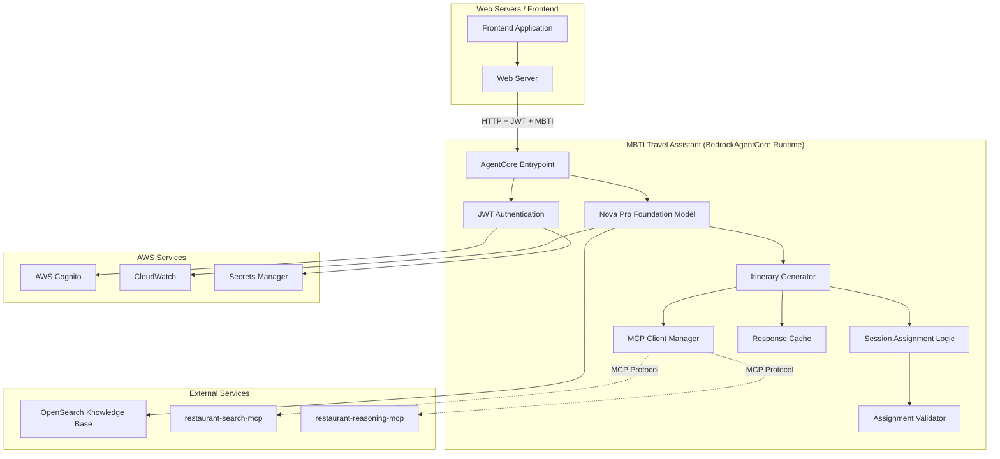
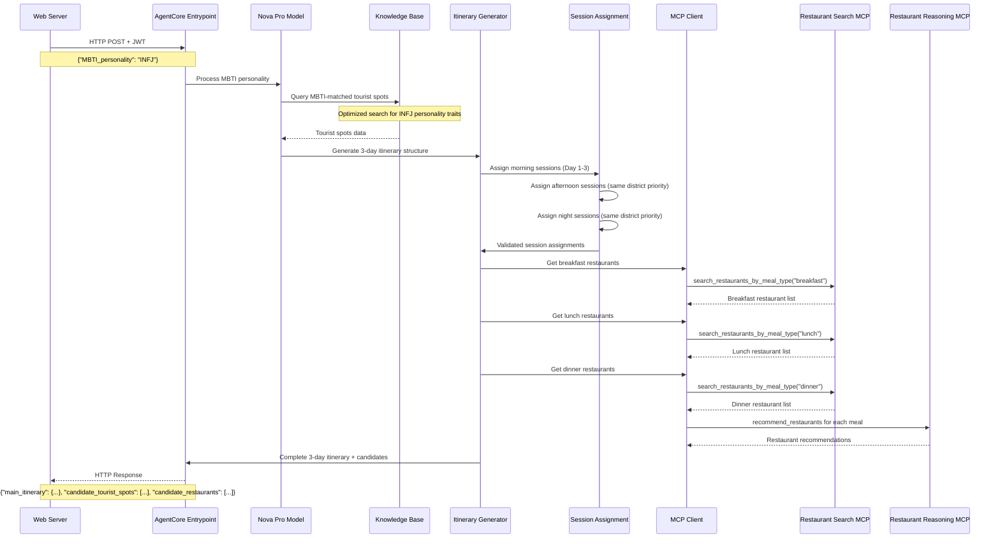

# Design Document

## Overview

The MBTI Travel Assistant is designed as a Bedrock AgentCore runtime service that generates comprehensive 3-day travel itineraries based on MBTI personality types. The system receives HTTP requests with 4-character MBTI personality codes, uses Amazon Nova Pro foundation model to query an OpenSearch knowledge base for personality-matched tourist spots, and integrates with existing MCP servers for restaurant recommendations.

The architecture follows the BedrockAgentCore runtime pattern: (1) Web servers send HTTP requests with JWT authentication and MBTI personality parameters, (2) the AgentCore runtime processes requests through Nova Pro foundation model, (3) Nova Pro queries the OpenSearch knowledge base for MBTI-matched tourist spots, (4) the system generates 3-day itineraries with strict session assignment logic, (5) MCP client calls retrieve restaurant recommendations, and (6) comprehensive JSON responses with main itinerary, candidate lists, and metadata are returned. The system ensures no tourist spot or restaurant is repeated across the entire 3-day period while maintaining MBTI personality alignment and proper operating hours matching.

## Architecture

### High-Level Architecture



### Request Processing Flow



## Knowledge Base Integration Strategy

### Nova Pro Foundation Model Integration

The MBTI Travel Assistant uses Amazon Nova Pro foundation model to query the OpenSearch knowledge base efficiently. This approach provides faster performance than the current multi-prompt strategy used in `test_single_mbti_type.py`.

**Integration Pattern:**
```python
import boto3
from bedrock_agentcore import BedrockAgentCoreApp

# Nova Pro model configuration
bedrock_client = boto3.client('bedrock-runtime', region_name='us-east-1')

# Optimized knowledge base query
def query_mbti_tourist_spots(mbti_personality: str) -> List[TouristSpot]:
    """
    Query knowledge base for MBTI-matched tourist spots using Nova Pro
    
    Args:
        mbti_personality: 4-character MBTI code (e.g., "INFJ", "ENFP")
        
    Returns:
        List of tourist spots matching the personality type
    """
    
    # Optimized prompt for Nova Pro
    prompt = f"""
    Find tourist spots in Hong Kong that match {mbti_personality} personality traits.
    Focus on spots that align with {mbti_personality} preferences for:
    - Social interaction level
    - Activity type preferences  
    - Environment preferences
    - Experience depth vs breadth
    
    Return structured data with all tourist spot fields including:
    - Name, Address, District, Area
    - Operating hours and days
    - Location category and description
    """
    
    response = bedrock_client.invoke_model(
        modelId='amazon.nova-pro-v1:0',
        body=json.dumps({
            'prompt': prompt,
            'max_tokens': 4000,
            'temperature': 0.1
        })
    )
    
    return parse_tourist_spots_response(response)
```

### MCP Client Integration for Restaurant Services

The system integrates with existing restaurant MCP servers for meal assignments:

**Restaurant Search Integration:**
```python
from mcp.client import MCPClient
from mcp.client.session import ClientSession

class RestaurantMCPClient:
    def __init__(self):
        self.search_mcp_endpoint = "restaurant-search-mcp-endpoint"
        self.reasoning_mcp_endpoint = "restaurant-reasoning-mcp-endpoint"
    
    async def search_restaurants_by_meal_and_district(
        self, 
        meal_type: str, 
        district: str
    ) -> List[Restaurant]:
        """Search restaurants by meal type and district"""
        
        search_client = MCPClient(self.search_mcp_endpoint)
        
        async with search_client.connect() as (read, write):
            async with ClientSession(read, write) as session:
                await session.initialize()
                
                # Call search_restaurants_by_meal_type MCP tool
                result = await session.call_tool(
                    "search_restaurants_by_meal_type",
                    {"meal_types": [meal_type]}
                )
                
                # Filter by district
                restaurants = self._parse_restaurant_response(result)
                return [r for r in restaurants if r.district == district]
    
    async def get_restaurant_recommendations(
        self, 
        restaurants: List[Restaurant]
    ) -> RecommendationResponse:
        """Get restaurant recommendations using reasoning MCP"""
        
        reasoning_client = MCPClient(self.reasoning_mcp_endpoint)
        
        async with reasoning_client.connect() as (read, write):
            async with ClientSession(read, write) as session:
                await session.initialize()
                
                result = await session.call_tool(
                    "recommend_restaurants",
                    {
                        "restaurants": [r.to_dict() for r in restaurants],
                        "ranking_method": "sentiment_likes"
                    }
                )
                
                return self._parse_recommendation_response(result)
```

## Components and Interfaces

### BedrockAgentCore Runtime Structure

The MBTI Travel Assistant follows the BedrockAgentCore runtime pattern with these key components:

```python
from bedrock_agentcore import BedrockAgentCoreApp
import boto3
import json

app = BedrockAgentCoreApp()

@app.entrypoint
def process_mbti_itinerary_request(payload: dict) -> str:
    """
    Main entrypoint for processing MBTI-based 3-day itinerary requests
    
    Args:
        payload: HTTP request payload containing MBTI_personality
        
    Returns:
        JSON string with complete 3-day itinerary, candidate lists, and metadata
    """
    
    # Validate MBTI personality format
    mbti_personality = payload.get('MBTI_personality')
    if not validate_mbti_format(mbti_personality):
        return json.dumps({
            "error": {
                "error_type": "validation_error",
                "message": "Invalid MBTI personality format. Expected 4-character code like INFJ, ENFP.",
                "suggested_actions": ["Provide valid MBTI personality type"]
            }
        })
    
    # Generate 3-day itinerary
    itinerary_generator = ItineraryGenerator()
    result = itinerary_generator.generate_complete_itinerary(mbti_personality)
    
    return json.dumps(result)

def validate_mbti_format(mbti: str) -> bool:
    """Validate MBTI personality format"""
    if not mbti or len(mbti) != 4:
        return False
    
    valid_types = [
        'INTJ', 'INTP', 'ENTJ', 'ENTP',
        'INFJ', 'INFP', 'ENFJ', 'ENFP', 
        'ISTJ', 'ISFJ', 'ESTJ', 'ESFJ',
        'ISTP', 'ISFP', 'ESTP', 'ESFP'
    ]
    
    return mbti.upper() in valid_types
```

### 1. AgentCore Entrypoint

**Purpose**: Serves as the main HTTP entry point following BedrockAgentCore runtime patterns.

**Key Responsibilities**:
- HTTP request/response handling with JWT authentication
- MBTI personality validation and extraction
- Integration with Nova Pro foundation model
- Complete itinerary generation orchestration
- Response formatting and serialization
- Error handling and logging

**Interface**:
```python
@app.entrypoint
def process_mbti_itinerary_request(payload: dict) -> str:
    """
    Process MBTI-based 3-day itinerary requests from web servers
    
    Expected Payload:
    {
        "MBTI_personality": "INFJ",
        "user_context": {...}  # Optional user context from JWT
    }
    
    Returns:
        JSON string:
        {
            "main_itinerary": {
                "day_1": {
                    "morning_session": {...},
                    "afternoon_session": {...},
                    "night_session": {...},
                    "breakfast": {...},
                    "lunch": {...},
                    "dinner": {...}
                },
                "day_2": {...},
                "day_3": {...}
            },
            "candidate_tourist_spots": {
                "day_1": [...],
                "day_2": [...], 
                "day_3": [...]
            },
            "candidate_restaurants": {
                "day_1": {
                    "breakfast": [...],
                    "lunch": [...],
                    "dinner": [...]
                },
                "day_2": {...},
                "day_3": {...}
            },
            "metadata": {
                "MBTI_personality": "INFJ",
                "generation_timestamp": "2025-01-01T12:00:00Z",
                "total_spots_found": 45,
                "total_restaurants_found": 120,
                "processing_time_ms": 8500
            }
        }
    """
```

### 2. Nova Pro Foundation Model Integration

**Purpose**: Processes MBTI personalities and queries the knowledge base for personality-matched tourist spots.

**Key Responsibilities**:
- Validate and process MBTI personality types
- Query OpenSearch knowledge base with optimized prompts
- Extract and structure tourist spot data
- Understand personality traits and match to tourist spot characteristics
- Provide fast, efficient knowledge base queries

**Interface**:
```python
import boto3
import json
from typing import List, Dict

class NovaProKnowledgeBaseClient:
    def __init__(self):
        self.bedrock_client = boto3.client('bedrock-runtime', region_name='us-east-1')
        self.knowledge_base_id = "RCWW86CLM9"
        
    async def query_mbti_tourist_spots(self, mbti_personality: str) -> List[TouristSpot]:
        """
        Query knowledge base for MBTI-matched tourist spots using Nova Pro
        
        Args:
            mbti_personality: 4-character MBTI code (e.g., "INFJ", "ENFP")
            
        Returns:
            List of tourist spots matching the personality type
        """
        
        # Build optimized prompt based on MBTI traits
        prompt = self._build_mbti_query_prompt(mbti_personality)
        
        # Query using Nova Pro
        response = await self._invoke_nova_pro(prompt)
        
        # Parse and structure tourist spots
        tourist_spots = self._parse_tourist_spots_response(response)
        
        return tourist_spots
    
    def _build_mbti_query_prompt(self, mbti_personality: str) -> str:
        """Build optimized query prompt for specific MBTI type"""
        
        mbti_traits = {
            'INFJ': 'quiet, meaningful experiences; cultural sites; peaceful environments',
            'ENFP': 'vibrant, social experiences; interactive attractions; diverse activities',
            'INTJ': 'strategic, educational experiences; museums; architectural sites',
            'ESTP': 'active, adventurous experiences; outdoor activities; dynamic environments'
            # ... additional MBTI mappings
        }
        
        traits = mbti_traits.get(mbti_personality, 'diverse experiences')
        
        return f"""
        Find Hong Kong tourist spots that match {mbti_personality} personality preferences.
        Focus on attractions that offer {traits}.
        
        Include all available fields:
        - Name, Address, District, Area
        - Operating hours and operating days
        - Location category and descriptions
        - Any additional metadata
        
        Prioritize spots that align with {mbti_personality} characteristics.
        """
    
    async def _invoke_nova_pro(self, prompt: str) -> Dict:
        """Invoke Nova Pro model with knowledge base integration"""
        
        # Use bedrock-agent-runtime for knowledge base queries
        bedrock_agent_client = boto3.client('bedrock-agent-runtime', region_name='us-east-1')
        
        response = bedrock_agent_client.retrieve_and_generate(
            input={'text': prompt},
            retrieveAndGenerateConfiguration={
                'type': 'KNOWLEDGE_BASE',
                'knowledgeBaseConfiguration': {
                    'knowledgeBaseId': self.knowledge_base_id,
                    'modelArn': 'arn:aws:bedrock:us-east-1::foundation-model/amazon.nova-pro-v1:0'
                }
            }
        )
        
        return response
```

### 3. Itinerary Generator

**Purpose**: Orchestrates the complete 3-day itinerary generation process with strict session assignment logic.

**Key Responsibilities**:
- Generate 3-day itinerary structure with morning/afternoon/night sessions
- Implement strict session assignment logic with district and operating hours matching
- Ensure no tourist spot or restaurant is repeated across the entire itinerary
- Coordinate with Nova Pro for tourist spot data and MCP clients for restaurant data
- Generate candidate lists for alternative options
- Validate all assignments against business rules

**Interface**:
```python
from typing import Dict, List
from datetime import datetime

class ItineraryGenerator:
    def __init__(self):
        self.nova_client = NovaProKnowledgeBaseClient()
        self.mcp_client = RestaurantMCPClient()
        self.session_assigner = SessionAssignmentLogic()
        self.validator = AssignmentValidator()
        
    async def generate_complete_itinerary(self, mbti_personality: str) -> Dict:
        """
        Generate complete 3-day itinerary with tourist spots and restaurants
        
        Args:
            mbti_personality: 4-character MBTI code
            
        Returns:
            Complete itinerary with main assignments and candidate lists
        """
        
        start_time = datetime.now()
        
        # Step 1: Get MBTI-matched tourist spots from knowledge base
        mbti_tourist_spots = await self.nova_client.query_mbti_tourist_spots(mbti_personality)
        
        # Step 2: Generate 3-day session assignments
        main_itinerary = await self._generate_main_itinerary(mbti_tourist_spots)
        
        # Step 3: Assign restaurants for each meal
        await self._assign_restaurants_to_itinerary(main_itinerary)
        
        # Step 4: Generate candidate lists
        candidate_tourist_spots = await self._generate_tourist_spot_candidates(
            main_itinerary, mbti_tourist_spots
        )
        candidate_restaurants = await self._generate_restaurant_candidates(main_itinerary)
        
        # Step 5: Validate all assignments
        validation_result = self.validator.validate_complete_itinerary(main_itinerary)
        
        if not validation_result.is_valid:
            # Handle validation failures
            await self._handle_validation_failures(main_itinerary, validation_result)
        
        processing_time = (datetime.now() - start_time).total_seconds() * 1000
        
        return {
            "main_itinerary": main_itinerary,
            "candidate_tourist_spots": candidate_tourist_spots,
            "candidate_restaurants": candidate_restaurants,
            "metadata": {
                "MBTI_personality": mbti_personality,
                "generation_timestamp": start_time.isoformat(),
                "total_spots_found": len(mbti_tourist_spots),
                "processing_time_ms": processing_time,
                "validation_status": validation_result.status
            }
        }
    
    async def _generate_main_itinerary(self, mbti_tourist_spots: List[TouristSpot]) -> Dict:
        """Generate main 3-day itinerary with session assignments"""
        
        itinerary = {
            "day_1": {"morning_session": None, "afternoon_session": None, "night_session": None},
            "day_2": {"morning_session": None, "afternoon_session": None, "night_session": None},
            "day_3": {"morning_session": None, "afternoon_session": None, "night_session": None}
        }
        
        used_spots = set()
        
        # Assign sessions for each day
        for day in ["day_1", "day_2", "day_3"]:
            # Morning session assignment
            morning_spot = self.session_assigner.assign_morning_session(
                mbti_tourist_spots, used_spots
            )
            if morning_spot:
                morning_spot.MBTI_match = True
                itinerary[day]["morning_session"] = morning_spot
                used_spots.add(morning_spot.id)
            
            # Afternoon session assignment (same district as morning)
            afternoon_spot = self.session_assigner.assign_afternoon_session(
                mbti_tourist_spots, used_spots, morning_spot
            )
            if afternoon_spot:
                afternoon_spot.MBTI_match = True
                itinerary[day]["afternoon_session"] = afternoon_spot
                used_spots.add(afternoon_spot.id)
            
            # Night session assignment (same district as morning/afternoon)
            night_spot = self.session_assigner.assign_night_session(
                mbti_tourist_spots, used_spots, morning_spot, afternoon_spot
            )
            if night_spot:
                night_spot.MBTI_match = True
                itinerary[day]["night_session"] = night_spot
                used_spots.add(night_spot.id)
        
        return itinerary
```

### 4. Session Assignment Logic

**Purpose**: Implements strict business rules for assigning tourist spots to morning/afternoon/night sessions.

**Key Responsibilities**:
- Apply morning session assignment logic with operating hours validation
- Implement afternoon session district/area matching priority
- Apply night session district/area matching priority  
- Ensure no tourist spot repetition across all sessions
- Handle fallback assignment when MBTI spots are unavailable
- Mark MBTI_match status accurately

**Interface**:
```python
from typing import List, Set, Optional
from enum import Enum

class SessionType(Enum):
    MORNING = "morning"
    AFTERNOON = "afternoon"
    NIGHT = "night"

class SessionAssignmentLogic:
    def __init__(self):
        self.morning_hours = (7, 11, 59)  # 07:00-11:59
        self.afternoon_hours = (12, 17, 59)  # 12:00-17:59
        self.night_hours = (18, 23, 59)  # 18:00-23:59
    
    def assign_morning_session(
        self, 
        mbti_spots: List[TouristSpot], 
        used_spots: Set[str]
    ) -> Optional[TouristSpot]:
        """
        Assign morning session tourist spot
        
        Priority:
        1. MBTI-matched spots with morning operating hours or no operating hours
        2. MBTI-matched spots never assigned before
        3. Random unassigned non-MBTI spots as fallback
        
        Args:
            mbti_spots: List of MBTI-matched tourist spots
            used_spots: Set of already assigned spot IDs
            
        Returns:
            Selected tourist spot or None if unavailable
        """
        
        # Filter available MBTI spots
        available_mbti_spots = [
            spot for spot in mbti_spots 
            if spot.id not in used_spots and 
            self._matches_operating_hours(spot, SessionType.MORNING)
        ]
        
        if available_mbti_spots:
            selected_spot = available_mbti_spots[0]  # Or apply additional selection logic
            selected_spot.MBTI_match = True
            return selected_spot
        
        # Fallback to non-MBTI spots
        return self._assign_fallback_spot(used_spots, SessionType.MORNING)
    
    def assign_afternoon_session(
        self,
        mbti_spots: List[TouristSpot],
        used_spots: Set[str],
        morning_spot: Optional[TouristSpot]
    ) -> Optional[TouristSpot]:
        """
        Assign afternoon session tourist spot
        
        Priority:
        1. Same district as morning spot, MBTI-matched, afternoon hours
        2. Same area as morning spot, MBTI-matched, afternoon hours  
        3. Any MBTI-matched spot with afternoon hours
        4. Fallback to non-MBTI spots
        
        Args:
            mbti_spots: List of MBTI-matched tourist spots
            used_spots: Set of already assigned spot IDs
            morning_spot: Morning session spot for district matching
            
        Returns:
            Selected tourist spot or None if unavailable
        """
        
        target_district = morning_spot.district if morning_spot else None
        target_area = morning_spot.area if morning_spot else None
        
        # Priority 1: Same district
        if target_district:
            same_district_spots = [
                spot for spot in mbti_spots
                if (spot.id not in used_spots and 
                    spot.district == target_district and
                    self._matches_operating_hours(spot, SessionType.AFTERNOON))
            ]
            
            if same_district_spots:
                selected_spot = same_district_spots[0]
                selected_spot.MBTI_match = True
                return selected_spot
        
        # Priority 2: Same area
        if target_area:
            same_area_spots = [
                spot for spot in mbti_spots
                if (spot.id not in used_spots and 
                    spot.area == target_area and
                    self._matches_operating_hours(spot, SessionType.AFTERNOON))
            ]
            
            if same_area_spots:
                selected_spot = same_area_spots[0]
                selected_spot.MBTI_match = True
                return selected_spot
        
        # Priority 3: Any MBTI spot with afternoon hours
        available_spots = [
            spot for spot in mbti_spots
            if (spot.id not in used_spots and
                self._matches_operating_hours(spot, SessionType.AFTERNOON))
        ]
        
        if available_spots:
            selected_spot = available_spots[0]
            selected_spot.MBTI_match = True
            return selected_spot
        
        # Fallback
        return self._assign_fallback_spot(used_spots, SessionType.AFTERNOON, target_district, target_area)
    
    def assign_night_session(
        self,
        mbti_spots: List[TouristSpot],
        used_spots: Set[str],
        morning_spot: Optional[TouristSpot],
        afternoon_spot: Optional[TouristSpot]
    ) -> Optional[TouristSpot]:
        """
        Assign night session tourist spot with same logic as afternoon
        but prioritizing districts from both morning and afternoon spots
        """
        
        # Similar logic to afternoon but considering both morning and afternoon districts
        target_districts = []
        target_areas = []
        
        if morning_spot:
            target_districts.append(morning_spot.district)
            target_areas.append(morning_spot.area)
        if afternoon_spot:
            target_districts.append(afternoon_spot.district)
            target_areas.append(afternoon_spot.area)
        
        # Apply same priority logic as afternoon session
        # ... implementation details
        
    def _matches_operating_hours(self, spot: TouristSpot, session_type: SessionType) -> bool:
        """Check if tourist spot operating hours match session time"""
        
        if not spot.operating_hours:
            return True  # No operating hours means always available
        
        session_hours = {
            SessionType.MORNING: self.morning_hours,
            SessionType.AFTERNOON: self.afternoon_hours,
            SessionType.NIGHT: self.night_hours
        }
        
        target_start, target_end, target_end_min = session_hours[session_type]
        
        # Check if spot operates during target session time
        # Implementation depends on operating_hours format
        return self._check_time_overlap(spot.operating_hours, target_start, target_end, target_end_min)
```

### 5. Restaurant MCP Client Manager

**Purpose**: Manages MCP client connections to restaurant search and reasoning servers for meal assignments.

**Key Responsibilities**:
- Execute MCP tool calls to restaurant-search-mcp for meal-specific searches
- Call restaurant-reasoning-mcp for restaurant recommendations
- Handle district-based restaurant filtering
- Ensure no restaurant repetition across the entire itinerary
- Parse and structure restaurant data responses

**Interface**:
```python
from mcp.client import MCPClient
from mcp.client.session import ClientSession
from typing import List, Dict

class RestaurantMCPClient:
    def __init__(self):
        self.search_mcp_endpoint = "restaurant-search-mcp-endpoint"
        self.reasoning_mcp_endpoint = "restaurant-reasoning-mcp-endpoint"
        
    async def get_breakfast_restaurants(self, district: str) -> List[Restaurant]:
        """
        Get breakfast restaurants (06:00-11:29) in specified district
        
        Args:
            district: Target district for restaurant search
            
        Returns:
            List of breakfast restaurants in the district
        """
        
        search_client = MCPClient(self.search_mcp_endpoint)
        
        async with search_client.connect() as (read, write):
            async with ClientSession(read, write) as session:
                await session.initialize()
                
                # Call search_restaurants_by_meal_type MCP tool
                result = await session.call_tool(
                    "search_restaurants_by_meal_type",
                    {"meal_types": ["breakfast"]}
                )
                
                # Filter by district
                all_restaurants = self._parse_restaurant_response(result)
                return [r for r in all_restaurants if r.district == district]
    
    async def get_lunch_restaurants(self, districts: List[str]) -> List[Restaurant]:
        """
        Get lunch restaurants (11:30-17:29) in specified districts
        
        Args:
            districts: List of target districts (morning and afternoon spot districts)
            
        Returns:
            List of lunch restaurants in the districts
        """
        
        search_client = MCPClient(self.search_mcp_endpoint)
        
        async with search_client.connect() as (read, write):
            async with ClientSession(read, write) as session:
                await session.initialize()
                
                result = await session.call_tool(
                    "search_restaurants_by_meal_type",
                    {"meal_types": ["lunch"]}
                )
                
                all_restaurants = self._parse_restaurant_response(result)
                return [r for r in all_restaurants if r.district in districts]
    
    async def get_dinner_restaurants(self, districts: List[str]) -> List[Restaurant]:
        """
        Get dinner restaurants (17:30-23:59) in specified districts
        
        Args:
            districts: List of target districts (afternoon and night spot districts)
            
        Returns:
            List of dinner restaurants in the districts
        """
        
        search_client = MCPClient(self.search_mcp_endpoint)
        
        async with search_client.connect() as (read, write):
            async with ClientSession(read, write) as session:
                await session.initialize()
                
                result = await session.call_tool(
                    "search_restaurants_by_meal_type", 
                    {"meal_types": ["dinner"]}
                )
                
                all_restaurants = self._parse_restaurant_response(result)
                return [r for r in all_restaurants if r.district in districts]
    
    async def get_restaurant_recommendations(
        self, 
        restaurants: List[Restaurant]
    ) -> RecommendationResponse:
        """
        Get restaurant recommendations using reasoning MCP server
        
        Args:
            restaurants: List of restaurants to analyze
            
        Returns:
            Recommendation response with top choice and candidates
        """
        
        reasoning_client = MCPClient(self.reasoning_mcp_endpoint)
        
        async with reasoning_client.connect() as (read, write):
            async with ClientSession(read, write) as session:
                await session.initialize()
                
                result = await session.call_tool(
                    "recommend_restaurants",
                    {
                        "restaurants": [r.to_dict() for r in restaurants],
                        "ranking_method": "sentiment_likes"
                    }
                )
                
                return self._parse_recommendation_response(result)
    
    def _parse_restaurant_response(self, mcp_response) -> List[Restaurant]:
        """Parse MCP response into Restaurant objects"""
        # Implementation to parse MCP tool response
        pass
    
    def _parse_recommendation_response(self, mcp_response) -> RecommendationResponse:
        """Parse MCP recommendation response"""
        # Implementation to parse recommendation response
        pass
```

### 6. Assignment Validator

**Purpose**: Validates that all session assignments follow strict business rules and constraints.

**Key Responsibilities**:
- Validate operating hours match session times
- Verify district and area matching priorities are followed
- Ensure no tourist spot or restaurant repetition
- Validate MBTI_match field accuracy
- Generate detailed validation reports
- Suggest corrections for validation failures

**Interface**:
```python
from typing import Dict, List
from dataclasses import dataclass

@dataclass
class ValidationResult:
    is_valid: bool
    status: str
    errors: List[str]
    warnings: List[str]
    suggestions: List[str]

class AssignmentValidator:
    def __init__(self):
        self.morning_hours = (7, 11, 59)
        self.afternoon_hours = (12, 17, 59) 
        self.night_hours = (18, 23, 59)
    
    def validate_complete_itinerary(self, itinerary: Dict) -> ValidationResult:
        """
        Validate complete 3-day itinerary against all business rules
        
        Args:
            itinerary: Complete itinerary with tourist spots and restaurants
            
        Returns:
            Validation result with errors, warnings, and suggestions
        """
        
        errors = []
        warnings = []
        suggestions = []
        
        # Validate tourist spot assignments
        tourist_spot_validation = self._validate_tourist_spot_assignments(itinerary)
        errors.extend(tourist_spot_validation.errors)
        warnings.extend(tourist_spot_validation.warnings)
        
        # Validate restaurant assignments
        restaurant_validation = self._validate_restaurant_assignments(itinerary)
        errors.extend(restaurant_validation.errors)
        warnings.extend(restaurant_validation.warnings)
        
        # Validate uniqueness constraints
        uniqueness_validation = self._validate_uniqueness_constraints(itinerary)
        errors.extend(uniqueness_validation.errors)
        
        # Validate district matching logic
        district_validation = self._validate_district_matching(itinerary)
        warnings.extend(district_validation.warnings)
        
        is_valid = len(errors) == 0
        status = "valid" if is_valid else "invalid"
        
        if not is_valid:
            suggestions = self._generate_correction_suggestions(errors)
        
        return ValidationResult(
            is_valid=is_valid,
            status=status,
            errors=errors,
            warnings=warnings,
            suggestions=suggestions
        )
    
    def _validate_tourist_spot_assignments(self, itinerary: Dict) -> ValidationResult:
        """Validate tourist spot session assignments"""
        
        errors = []
        warnings = []
        
        for day_key, day_data in itinerary.items():
            if not day_key.startswith('day_'):
                continue
                
            # Validate morning session
            morning_spot = day_data.get('morning_session')
            if morning_spot:
                if not self._spot_matches_session_hours(morning_spot, 'morning'):
                    errors.append(f"{day_key} morning spot '{morning_spot.name}' operating hours don't match morning session (07:00-11:59)")
            
            # Validate afternoon session
            afternoon_spot = day_data.get('afternoon_session')
            if afternoon_spot:
                if not self._spot_matches_session_hours(afternoon_spot, 'afternoon'):
                    errors.append(f"{day_key} afternoon spot '{afternoon_spot.name}' operating hours don't match afternoon session (12:00-17:59)")
                
                # Check district matching with morning spot
                if morning_spot and afternoon_spot.district != morning_spot.district:
                    if afternoon_spot.area != morning_spot.area:
                        warnings.append(f"{day_key} afternoon spot not in same district or area as morning spot")
            
            # Validate night session
            night_spot = day_data.get('night_session')
            if night_spot:
                if not self._spot_matches_session_hours(night_spot, 'night'):
                    errors.append(f"{day_key} night spot '{night_spot.name}' operating hours don't match night session (18:00-23:59)")
        
        return ValidationResult(
            is_valid=len(errors) == 0,
            status="valid" if len(errors) == 0 else "invalid",
            errors=errors,
            warnings=warnings,
            suggestions=[]
        )
    
    def _validate_uniqueness_constraints(self, itinerary: Dict) -> ValidationResult:
        """Validate no tourist spot or restaurant appears twice"""
        
        errors = []
        used_tourist_spots = set()
        used_restaurants = set()
        
        for day_key, day_data in itinerary.items():
            if not day_key.startswith('day_'):
                continue
            
            # Check tourist spot uniqueness
            for session in ['morning_session', 'afternoon_session', 'night_session']:
                spot = day_data.get(session)
                if spot:
                    if spot.id in used_tourist_spots:
                        errors.append(f"Tourist spot '{spot.name}' appears multiple times in itinerary")
                    else:
                        used_tourist_spots.add(spot.id)
            
            # Check restaurant uniqueness
            for meal in ['breakfast', 'lunch', 'dinner']:
                restaurant = day_data.get(meal)
                if restaurant:
                    if restaurant.id in used_restaurants:
                        errors.append(f"Restaurant '{restaurant.name}' appears multiple times in itinerary")
                    else:
                        used_restaurants.add(restaurant.id)
        
        return ValidationResult(
            is_valid=len(errors) == 0,
            status="valid" if len(errors) == 0 else "invalid", 
            errors=errors,
            warnings=[],
            suggestions=[]
        )
```

## Data Models

### Core Data Models

```python
from dataclasses import dataclass
from typing import List, Dict, Optional
from datetime import datetime

@dataclass
class TouristSpot:
    """Core tourist spot data model"""
    id: str
    name: str
    address: str
    district: str
    area: str
    location_category: str
    description: Optional[str]
    operating_hours: Optional[Dict[str, str]]  # e.g., {"monday": "09:00-18:00"}
    operating_days: Optional[List[str]]  # e.g., ["monday", "tuesday", "wednesday"]
    MBTI_match: bool = False  # New field to indicate MBTI personality alignment
    metadata: Optional[Dict] = None

@dataclass
class Restaurant:
    """Core restaurant data model"""
    id: str
    name: str
    address: str
    district: str
    meal_type: List[str]  # cuisine types
    sentiment: SentimentData
    price_range: str
    operating_hours: Dict[str, List[str]]
    location_category: str
    metadata: Optional[Dict] = None

@dataclass
class SentimentData:
    """Restaurant sentiment information"""
    likes: int
    dislikes: int
    neutral: int
    
    @property
    def total_responses(self) -> int:
        return self.likes + self.dislikes + self.neutral
    
    @property
    def positive_percentage(self) -> float:
        if self.total_responses == 0:
            return 0.0
        return (self.likes + self.neutral) / self.total_responses * 100

@dataclass
class DayItinerary:
    """Single day itinerary structure"""
    morning_session: Optional[TouristSpot]
    afternoon_session: Optional[TouristSpot]
    night_session: Optional[TouristSpot]
    breakfast: Optional[Restaurant]
    lunch: Optional[Restaurant]
    dinner: Optional[Restaurant]

@dataclass
class MainItinerary:
    """Complete 3-day itinerary structure"""
    day_1: DayItinerary
    day_2: DayItinerary
    day_3: DayItinerary

@dataclass
class CandidateLists:
    """Candidate options for each day"""
    tourist_spots: Dict[str, List[TouristSpot]]  # {"day_1": [...], "day_2": [...], "day_3": [...]}
    restaurants: Dict[str, Dict[str, List[Restaurant]]]  # {"day_1": {"breakfast": [...], "lunch": [...], "dinner": [...]}}

@dataclass
class ItineraryResponse:
    """Complete response structure for frontend"""
    main_itinerary: MainItinerary
    candidate_tourist_spots: Dict[str, List[TouristSpot]]
    candidate_restaurants: Dict[str, Dict[str, List[Restaurant]]]
    metadata: ResponseMetadata
    error: Optional[ErrorInfo] = None

@dataclass
class ResponseMetadata:
    """Metadata about the itinerary response"""
    MBTI_personality: str
    generation_timestamp: str
    total_spots_found: int
    total_restaurants_found: int
    processing_time_ms: float
    validation_status: str
    cache_hit: bool = False
    knowledge_base_queries: int = 0
    mcp_calls: List[str] = None

@dataclass
class ErrorInfo:
    """Error information structure"""
    error_type: str
    message: str
    suggested_actions: List[str]
    error_code: str
```

### Request/Response Models

```python
@dataclass
class ItineraryRequest:
    """Incoming request structure"""
    MBTI_personality: str
    user_context: Optional[Dict] = None
    
    def validate(self) -> List[str]:
        """Validate request and return list of validation errors"""
        errors = []
        
        if not self.MBTI_personality:
            errors.append("MBTI_personality is required")
            return errors
        
        if len(self.MBTI_personality) != 4:
            errors.append("MBTI_personality must be exactly 4 characters")
        
        valid_types = [
            'INTJ', 'INTP', 'ENTJ', 'ENTP',
            'INFJ', 'INFP', 'ENFJ', 'ENFP', 
            'ISTJ', 'ISFJ', 'ESTJ', 'ESFJ',
            'ISTP', 'ISFP', 'ESTP', 'ESFP'
        ]
        
        if self.MBTI_personality.upper() not in valid_types:
            errors.append(f"Invalid MBTI personality type: {self.MBTI_personality}")
        
        return errors

@dataclass
class KnowledgeBaseQuery:
    """Query structure for knowledge base requests"""
    mbti_personality: str
    query_prompt: str
    max_results: int = 50
    
    @classmethod
    def create_mbti_query(cls, mbti_personality: str) -> 'KnowledgeBaseQuery':
        """Create optimized knowledge base query for MBTI personality"""
        
        mbti_traits = {
            'INFJ': 'quiet, meaningful experiences; cultural sites; peaceful environments; deep exploration',
            'ENFP': 'vibrant, social experiences; interactive attractions; diverse activities; people-focused',
            'INTJ': 'strategic, educational experiences; museums; architectural sites; systematic exploration',
            'ESTP': 'active, adventurous experiences; outdoor activities; dynamic environments; hands-on activities'
            # ... additional MBTI mappings
        }
        
        traits = mbti_traits.get(mbti_personality, 'diverse experiences')
        
        prompt = f"""
        Find Hong Kong tourist spots that match {mbti_personality} personality preferences.
        Focus on attractions that offer {traits}.
        
        Include all available fields:
        - Name, Address, District, Area
        - Operating hours and operating days
        - Location category and descriptions
        - Any additional metadata
        
        Prioritize spots that align with {mbti_personality} characteristics.
        """
        
        return cls(
            mbti_personality=mbti_personality,
            query_prompt=prompt,
            max_results=50
        )

@dataclass
class MCPToolCall:
    """Structure for MCP tool calls"""
    tool_name: str
    parameters: Dict
    server_endpoint: str
    
    @classmethod
    def create_restaurant_search(cls, meal_type: str, districts: List[str] = None) -> 'MCPToolCall':
        """Create restaurant search MCP tool call"""
        
        if districts:
            return cls(
                tool_name="search_restaurants_combined",
                parameters={
                    "districts": districts,
                    "meal_types": [meal_type]
                },
                server_endpoint="restaurant-search-mcp"
            )
        else:
            return cls(
                tool_name="search_restaurants_by_meal_type",
                parameters={"meal_types": [meal_type]},
                server_endpoint="restaurant-search-mcp"
            )
    
    @classmethod
    def create_restaurant_recommendation(cls, restaurants: List[Restaurant]) -> 'MCPToolCall':
        """Create restaurant recommendation MCP tool call"""
        
        return cls(
            tool_name="recommend_restaurants",
            parameters={
                "restaurants": [r.to_dict() for r in restaurants],
                "ranking_method": "sentiment_likes"
            },
            server_endpoint="restaurant-reasoning-mcp"
        )
```

## Error Handling

### Error Categories and Strategies

```python
class ErrorCategory(Enum):
    VALIDATION_ERROR = "validation_error"
    AUTHENTICATION_ERROR = "authentication_error"
    AGENTCORE_UNAVAILABLE = "agentcore_unavailable"
    PARSING_ERROR = "parsing_error"
    TIMEOUT_ERROR = "timeout_error"
    RATE_LIMIT_ERROR = "rate_limit_error"
    INTERNAL_ERROR = "internal_error"

class ErrorHandler:
    def handle_agentcore_error(self, error: Exception, service_name: str) -> ErrorResponse:
        """Handle errors from AgentCore runtime calls"""
        if isinstance(error, TimeoutError):
            return ErrorResponse(
                error_type=ErrorCategory.TIMEOUT_ERROR,
                message=f"{service_name} request timed out",
                suggested_actions=["Try again in a few moments", "Check service status"],
                retry_after=30
            )
        elif isinstance(error, AuthenticationError):
            return ErrorResponse(
                error_type=ErrorCategory.AUTHENTICATION_ERROR,
                message="Authentication failed with AgentCore runtime",
                suggested_actions=["Check authentication configuration"],
                retry_after=None
            )
        # Additional error handling logic...
```

### Retry and Circuit Breaker Logic

```python
class CircuitBreaker:
    def __init__(self, failure_threshold: int = 5, timeout: int = 60):
        self.failure_threshold = failure_threshold
        self.timeout = timeout
        self.failure_count = 0
        self.last_failure_time = None
        self.state = "CLOSED"  # CLOSED, OPEN, HALF_OPEN
    
    async def call(self, func, *args, **kwargs):
        """Execute function with circuit breaker protection"""
        if self.state == "OPEN":
            if time.time() - self.last_failure_time > self.timeout:
                self.state = "HALF_OPEN"
            else:
                raise CircuitBreakerOpenError("Service temporarily unavailable")
        
        try:
            result = await func(*args, **kwargs)
            if self.state == "HALF_OPEN":
                self.state = "CLOSED"
                self.failure_count = 0
            return result
        except Exception as e:
            self.failure_count += 1
            self.last_failure_time = time.time()
            
            if self.failure_count >= self.failure_threshold:
                self.state = "OPEN"
            
            raise e
```

## Testing Strategy

### Unit Testing Approach

```python
# Test structure for key components
class TestOrchestrationService:
    def test_successful_orchestration(self):
        """Test complete orchestration flow with mocked AgentCore responses"""
        
    def test_search_agent_failure_handling(self):
        """Test behavior when search agent is unavailable"""
        
    def test_reasoning_agent_failure_handling(self):
        """Test behavior when reasoning agent is unavailable"""
        
    def test_partial_data_handling(self):
        """Test handling of incomplete restaurant data"""

class TestNaturalLanguageProcessor:
    def test_district_extraction(self):
        """Test extraction of district names from various phrasings"""
        
    def test_meal_time_extraction(self):
        """Test extraction of meal times from natural language"""
        
    def test_ambiguous_query_handling(self):
        """Test handling of ambiguous or unclear queries"""

class TestAgentCoreClient:
    def test_token_refresh_logic(self):
        """Test JWT token refresh mechanism"""
        
    def test_retry_logic(self):
        """Test retry behavior for transient failures"""
        
    def test_circuit_breaker_integration(self):
        """Test circuit breaker functionality"""
```

### Integration Testing Strategy

```python
class TestAgentCoreIntegration:
    def test_search_agent_integration(self):
        """Test actual calls to restaurant_search_conversational_agent"""
        
    def test_reasoning_agent_integration(self):
        """Test actual calls to restaurant_reasoning_mcp"""
        
    def test_end_to_end_workflow(self):
        """Test complete workflow from request to response"""
        
    def test_authentication_flow(self):
        """Test Cognito authentication with AgentCore runtimes"""

class TestPerformanceAndLoad:
    def test_concurrent_requests(self):
        """Test handling of multiple concurrent requests"""
        
    def test_cache_effectiveness(self):
        """Test cache hit rates and performance improvement"""
        
    def test_response_time_requirements(self):
        """Verify response times meet 5-second requirement"""
```

### Test Data Management

```python
class TestDataManager:
    """Manages test data for consistent testing"""
    
    @staticmethod
    def get_sample_restaurants() -> List[Restaurant]:
        """Return sample restaurant data for testing"""
        
    @staticmethod
    def get_sample_agentcore_responses() -> Dict[str, str]:
        """Return sample AgentCore runtime responses"""
        
    @staticmethod
    def get_test_queries() -> List[str]:
        """Return various natural language test queries"""
```

## Security Considerations

### Authentication and Authorization

1. **JWT Token Management**:
   - Secure storage of Cognito client credentials
   - Automatic token refresh with exponential backoff
   - Token validation with proper signature verification

2. **AgentCore Runtime Security**:
   - Mutual TLS for AgentCore communications
   - Request signing for additional security
   - Rate limiting to prevent abuse

3. **Data Protection**:
   - Encryption of sensitive configuration data
   - Secure logging practices (no sensitive data in logs)
   - Input sanitization and validation

### Security Monitoring

```python
class SecurityMonitor:
    def log_authentication_event(self, event_type: str, details: Dict):
        """Log security-related events for monitoring"""
        
    def detect_suspicious_activity(self, request_pattern: Dict) -> bool:
        """Detect potentially suspicious request patterns"""
        
    def alert_security_team(self, incident: SecurityIncident):
        """Alert security team of potential incidents"""
```

## Performance Optimization

### Caching Strategy

1. **Multi-Level Caching**:
   - In-memory cache for frequently accessed data
   - Redis cache for shared data across instances
   - CDN caching for static restaurant metadata

2. **Cache Key Strategy**:
   ```python
   def generate_cache_key(district: str, meal_time: str) -> str:
       return f"search:{district}:{meal_time}:{date.today().isoformat()}"
   ```

3. **Cache Invalidation**:
   - Time-based expiration (TTL)
   - Event-based invalidation for data updates
   - Cache warming for popular queries

### Parallel Processing

```python
class ParallelProcessor:
    async def process_concurrent_requests(self, requests: List[Request]) -> List[Response]:
        """Process multiple requests concurrently with proper resource management"""
        
        semaphore = asyncio.Semaphore(10)  # Limit concurrent AgentCore calls
        
        async def process_single_request(request):
            async with semaphore:
                return await self.orchestration_service.orchestrate_recommendation(
                    request.district, request.meal_time
                )
        
        tasks = [process_single_request(req) for req in requests]
        return await asyncio.gather(*tasks, return_exceptions=True)
```

## Deployment Architecture

### Container Configuration

```dockerfile
# Multi-stage build for optimized MCP server container
FROM --platform=linux/arm64 python:3.12-slim as builder

WORKDIR /app
COPY requirements.txt .
RUN pip install --no-cache-dir -r requirements.txt

FROM --platform=linux/arm64 python:3.12-slim as runtime

WORKDIR /app
COPY --from=builder /usr/local/lib/python3.12/site-packages /usr/local/lib/python3.12/site-packages
COPY . .

# Security: Run as non-root user
RUN useradd -m -u 1000 mcpuser
USER mcpuser

# MCP server typically runs on port 8000
EXPOSE 8000
CMD ["python", "-m", "mbti_travel_assistant_mcp_server"]
```

### Environment Configuration

```yaml
# Environment variables for different deployment stages
development:
  SEARCH_AGENT_ENDPOINT: "https://dev-search-agent.agentcore.aws"
  REASONING_AGENT_ENDPOINT: "https://dev-reasoning-agent.agentcore.aws"
  COGNITO_USER_POOL_ID: "us-east-1_dev123"
  CACHE_TTL_SECONDS: 300
  LOG_LEVEL: "DEBUG"

production:
  SEARCH_AGENT_ENDPOINT: "https://prod-search-agent.agentcore.aws"
  REASONING_AGENT_ENDPOINT: "https://prod-reasoning-agent.agentcore.aws"
  COGNITO_USER_POOL_ID: "us-east-1_prod456"
  CACHE_TTL_SECONDS: 1800
  LOG_LEVEL: "INFO"
```

### Health Checks and Monitoring

```python
class HealthChecker:
    async def check_health(self) -> HealthStatus:
        """Comprehensive health check for all dependencies"""
        checks = {
            "search_agent": await self.check_agentcore_runtime(self.search_endpoint),
            "reasoning_agent": await self.check_agentcore_runtime(self.reasoning_endpoint),
            "cognito": await self.check_cognito_connectivity(),
            "cache": await self.check_cache_connectivity()
        }
        
        return HealthStatus(
            overall_status="healthy" if all(checks.values()) else "unhealthy",
            component_status=checks,
            timestamp=datetime.utcnow()
        )
```

This design provides a comprehensive foundation for implementing the MBTI Travel Assistant MCP with proper separation of concerns, robust error handling, and scalable architecture patterns.