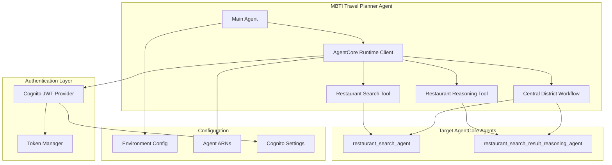

# Design Document

## Overview

This design document outlines the architecture and implementation approach for updating the MBTI Travel Planner Agent to use direct AgentCore Runtime API calls instead of HTTP gateway intermediaries. The system will transition from a gateway-based architecture to native AgentCore agent-to-agent communication, providing better performance, reliability, and ecosystem integration.

**Current Architecture:**
```
mbti-travel-planner-agent → HTTP Gateway → agentcore-gateway-mcp-tools → MCP calls
```

**Target Architecture:**
```
mbti-travel-planner-agent → AgentCore Runtime API → restaurant_search_agent & restaurant_search_result_reasoning_agent
```

## Architecture

### High-Level System Architecture



### Component Architecture

#### 1. AgentCore Runtime Client
**Purpose:** Central client for making AgentCore Runtime API calls
**Responsibilities:**
- Manage connections to target AgentCore agents
- Handle authentication token lifecycle
- Provide retry logic and error handling
- Connection pooling and performance optimization

#### 2. Authentication Manager
**Purpose:** Handle JWT token management for AgentCore calls
**Responsibilities:**
- Obtain JWT tokens from Cognito
- Refresh tokens automatically
- Validate token expiration
- Provide tokens to AgentCore Runtime Client

#### 3. Tool Implementations
**Purpose:** Replace HTTP gateway tools with AgentCore agent calls
**Components:**
- Restaurant Search Tool (calls `restaurant_search_agent`)
- Restaurant Reasoning Tool (calls `restaurant_search_result_reasoning_agent`)
- Central District Workflow (orchestrates both agents)

#### 4. Configuration Management
**Purpose:** Environment-specific configuration for different deployment contexts
**Components:**
- Agent ARN configuration
- Cognito client settings
- Environment-specific overrides
- Validation and defaults

## Components and Interfaces

### AgentCore Runtime Client Interface

```python
class AgentCoreRuntimeClient:
    """Client for making AgentCore Runtime API calls."""
    
    def __init__(self, cognito_config: CognitoConfig, region: str = "us-east-1"):
        """Initialize with Cognito configuration."""
        
    async def invoke_agent(
        self, 
        agent_arn: str, 
        input_text: str, 
        session_id: Optional[str] = None
    ) -> AgentResponse:
        """Invoke an AgentCore agent with input text."""
        
    async def invoke_agent_with_streaming(
        self, 
        agent_arn: str, 
        input_text: str, 
        session_id: Optional[str] = None
    ) -> AsyncIterator[AgentStreamingResponse]:
        """Invoke agent with streaming response."""
        
    def get_health_status(self) -> HealthStatus:
        """Get client health and connectivity status."""
```

### Authentication Manager Interface

```python
class AuthenticationManager:
    """Manages JWT authentication for AgentCore calls."""
    
    def __init__(self, cognito_config: CognitoConfig):
        """Initialize with Cognito configuration."""
        
    async def get_valid_token(self) -> str:
        """Get a valid JWT token, refreshing if necessary."""
        
    async def refresh_token(self) -> str:
        """Force refresh the JWT token."""
        
    def is_token_valid(self) -> bool:
        """Check if current token is valid."""
```

### Tool Interface Definitions

```python
class RestaurantSearchTool:
    """Tool for searching restaurants using AgentCore agent."""
    
    def __init__(self, runtime_client: AgentCoreRuntimeClient):
        """Initialize with runtime client."""
        
    async def search_restaurants(
        self, 
        districts: List[str], 
        meal_types: Optional[List[str]] = None
    ) -> RestaurantSearchResult:
        """Search restaurants by district and meal type."""

class RestaurantReasoningTool:
    """Tool for restaurant reasoning using AgentCore agent."""
    
    def __init__(self, runtime_client: AgentCoreRuntimeClient):
        """Initialize with runtime client."""
        
    async def get_recommendations(
        self, 
        restaurants: List[Dict], 
        mbti_type: str, 
        preferences: Dict
    ) -> RecommendationResult:
        """Get MBTI-based restaurant recommendations."""

class CentralDistrictWorkflow:
    """Orchestrates restaurant search and reasoning for Central District."""
    
    def __init__(
        self, 
        search_tool: RestaurantSearchTool, 
        reasoning_tool: RestaurantReasoningTool
    ):
        """Initialize with both tools."""
        
    async def execute_workflow(
        self, 
        mbti_type: str, 
        preferences: Dict
    ) -> WorkflowResult:
        """Execute complete Central District workflow."""
```

### Configuration Interface

```python
@dataclass
class AgentCoreConfig:
    """Configuration for AgentCore integration."""
    restaurant_search_agent_arn: str
    restaurant_reasoning_agent_arn: str
    region: str = "us-east-1"
    timeout_seconds: int = 30
    max_retries: int = 3
    
@dataclass
class CognitoConfig:
    """Cognito authentication configuration."""
    user_pool_id: str
    client_id: str
    client_secret: str
    region: str = "us-east-1"
    discovery_url: str
    
@dataclass
class EnvironmentConfig:
    """Environment-specific configuration."""
    environment: str  # development, staging, production
    agentcore: AgentCoreConfig
    cognito: CognitoConfig
    debug_mode: bool = False
    performance_monitoring: bool = True
```

## Data Models

### Request/Response Models

```python
@dataclass
class AgentRequest:
    """Request to AgentCore agent."""
    input_text: str
    session_id: Optional[str] = None
    metadata: Optional[Dict] = None

@dataclass
class AgentResponse:
    """Response from AgentCore agent."""
    output_text: str
    session_id: str
    metadata: Dict
    execution_time_ms: int
    
@dataclass
class RestaurantSearchResult:
    """Result from restaurant search."""
    restaurants: List[Dict]
    total_count: int
    search_metadata: Dict
    execution_time_ms: int
    
@dataclass
class RecommendationResult:
    """Result from restaurant reasoning."""
    recommendations: List[Dict]
    reasoning: str
    confidence_score: float
    mbti_analysis: Dict
    execution_time_ms: int
    
@dataclass
class WorkflowResult:
    """Result from Central District workflow."""
    search_result: RestaurantSearchResult
    recommendation_result: RecommendationResult
    workflow_metadata: Dict
    total_execution_time_ms: int
```

### Error Models

```python
class AgentCoreError(Exception):
    """Base exception for AgentCore operations."""
    pass

class AuthenticationError(AgentCoreError):
    """Authentication-related errors."""
    pass

class AgentInvocationError(AgentCoreError):
    """Agent invocation errors."""
    def __init__(self, message: str, agent_arn: str, status_code: Optional[int] = None):
        super().__init__(message)
        self.agent_arn = agent_arn
        self.status_code = status_code

class ConfigurationError(AgentCoreError):
    """Configuration-related errors."""
    pass
```

## Error Handling

### Error Handling Strategy

#### 1. Layered Error Handling
- **Transport Layer:** Network connectivity, timeouts, HTTP errors
- **Authentication Layer:** JWT token issues, Cognito errors
- **Agent Layer:** Agent-specific errors, invocation failures
- **Application Layer:** Business logic errors, data validation

#### 2. Retry Logic
```python
class RetryConfig:
    """Configuration for retry behavior."""
    max_retries: int = 3
    base_delay: float = 1.0
    max_delay: float = 60.0
    exponential_base: float = 2.0
    jitter: bool = True
    
    retryable_errors = [
        "ServiceUnavailable",
        "ThrottlingException", 
        "InternalServerError",
        "TimeoutError"
    ]
```

#### 3. Circuit Breaker Pattern
```python
class CircuitBreaker:
    """Circuit breaker for AgentCore agent calls."""
    
    def __init__(
        self, 
        failure_threshold: int = 5,
        recovery_timeout: int = 60,
        expected_exception: Type[Exception] = AgentInvocationError
    ):
        """Initialize circuit breaker."""
        
    async def call(self, func: Callable, *args, **kwargs):
        """Execute function with circuit breaker protection."""
```

#### 4. Fallback Mechanisms
- **Graceful Degradation:** Provide basic responses when agents unavailable
- **Cached Responses:** Use cached results for repeated queries
- **Alternative Workflows:** Simplified workflows when full functionality unavailable

### Error Response Format
```python
@dataclass
class ErrorResponse:
    """Standardized error response format."""
    error_code: str
    error_message: str
    error_type: str  # "authentication", "agent_invocation", "configuration", "network"
    agent_arn: Optional[str] = None
    retry_after: Optional[int] = None
    correlation_id: str = field(default_factory=lambda: str(uuid.uuid4()))
```

## Testing Strategy

### Unit Testing
- **Component Isolation:** Test each component independently with mocks
- **Error Scenarios:** Test all error conditions and edge cases
- **Configuration Validation:** Test configuration loading and validation
- **Authentication Flow:** Test JWT token lifecycle management

### Integration Testing
- **AgentCore Connectivity:** Test actual calls to deployed agents
- **Authentication Integration:** Test end-to-end JWT authentication
- **Workflow Orchestration:** Test complete Central District workflow
- **Performance Testing:** Test response times and throughput

### Test Structure
```
tests/
├── unit/
│   ├── test_agentcore_runtime_client.py
│   ├── test_authentication_manager.py
│   ├── test_restaurant_search_tool.py
│   ├── test_restaurant_reasoning_tool.py
│   ├── test_central_district_workflow.py
│   └── test_configuration.py
├── integration/
│   ├── test_agentcore_integration.py
│   ├── test_authentication_integration.py
│   ├── test_workflow_integration.py
│   └── test_performance_integration.py
└── fixtures/
    ├── mock_responses.py
    ├── test_configurations.py
    └── test_data.py
```

### Test Data and Mocking
```python
# Mock AgentCore responses
MOCK_RESTAURANT_SEARCH_RESPONSE = {
    "output_text": json.dumps({
        "restaurants": [
            {
                "name": "Test Restaurant",
                "district": "Central district",
                "cuisine": "Cantonese"
            }
        ]
    }),
    "session_id": "test-session-123",
    "metadata": {"execution_time": 1500}
}

MOCK_REASONING_RESPONSE = {
    "output_text": json.dumps({
        "recommendations": [
            {
                "restaurant": "Test Restaurant",
                "score": 0.85,
                "reasoning": "Perfect for ENFP personality"
            }
        ]
    }),
    "session_id": "test-session-123",
    "metadata": {"confidence": 0.85}
}
```

## Implementation Details

### AgentCore Runtime Client Implementation

**Design Rationale:** Centralized client provides consistent interface for all AgentCore operations, handles authentication automatically, and implements performance optimizations.

```python
class AgentCoreRuntimeClient:
    def __init__(self, cognito_config: CognitoConfig, region: str = "us-east-1"):
        self.auth_manager = AuthenticationManager(cognito_config)
        self.bedrock_agent_runtime = boto3.client(
            'bedrock-agent-runtime', 
            region_name=region
        )
        self.session = aiohttp.ClientSession(
            timeout=aiohttp.ClientTimeout(total=30),
            connector=aiohttp.TCPConnector(limit=100, limit_per_host=10)
        )
        
    async def invoke_agent(self, agent_arn: str, input_text: str, session_id: Optional[str] = None) -> AgentResponse:
        """Invoke AgentCore agent with retry logic and error handling."""
        token = await self.auth_manager.get_valid_token()
        
        for attempt in range(self.max_retries):
            try:
                response = await self.bedrock_agent_runtime.invoke_agent(
                    agentId=agent_arn.split('/')[-1],
                    agentAliasId='TSTALIASID',
                    sessionId=session_id or str(uuid.uuid4()),
                    inputText=input_text,
                    # Add JWT token to request headers
                    **self._get_auth_headers(token)
                )
                return self._parse_agent_response(response)
                
            except Exception as e:
                if attempt == self.max_retries - 1:
                    raise AgentInvocationError(f"Failed to invoke agent: {e}", agent_arn)
                await asyncio.sleep(self._calculate_backoff(attempt))
```

### Authentication Manager Implementation

**Design Rationale:** Separate authentication concerns from business logic, automatic token refresh prevents authentication failures, caching reduces Cognito API calls.

```python
class AuthenticationManager:
    def __init__(self, cognito_config: CognitoConfig):
        self.config = cognito_config
        self.cognito_client = boto3.client('cognito-idp', region_name=cognito_config.region)
        self.current_token: Optional[str] = None
        self.token_expiry: Optional[datetime] = None
        self.refresh_lock = asyncio.Lock()
        
    async def get_valid_token(self) -> str:
        """Get valid JWT token with automatic refresh."""
        if self._is_token_expired():
            async with self.refresh_lock:
                if self._is_token_expired():  # Double-check after acquiring lock
                    await self._refresh_token()
        return self.current_token
        
    async def _refresh_token(self):
        """Refresh JWT token from Cognito."""
        try:
            response = await self.cognito_client.admin_initiate_auth(
                UserPoolId=self.config.user_pool_id,
                ClientId=self.config.client_id,
                AuthFlow='ADMIN_NO_SRP_AUTH',
                AuthParameters={
                    'USERNAME': 'service-account',
                    'PASSWORD': self._get_service_password(),
                    'SECRET_HASH': self._calculate_secret_hash()
                }
            )
            
            self.current_token = response['AuthenticationResult']['IdToken']
            expires_in = response['AuthenticationResult']['ExpiresIn']
            self.token_expiry = datetime.utcnow() + timedelta(seconds=expires_in - 300)  # 5min buffer
            
        except Exception as e:
            raise AuthenticationError(f"Failed to refresh token: {e}")
```

### Tool Implementation Strategy

**Design Rationale:** Tools maintain same interface as HTTP gateway versions for backward compatibility, but internally use AgentCore Runtime API. This allows drop-in replacement without changing calling code.

```python
class RestaurantSearchTool:
    def __init__(self, runtime_client: AgentCoreRuntimeClient, agent_arn: str):
        self.runtime_client = runtime_client
        self.agent_arn = agent_arn
        
    async def search_restaurants(self, districts: List[str], meal_types: Optional[List[str]] = None) -> RestaurantSearchResult:
        """Search restaurants maintaining backward compatibility with HTTP gateway interface."""
        
        # Construct input for AgentCore agent
        search_request = {
            "action": "search_restaurants",
            "parameters": {
                "districts": districts,
                "meal_types": meal_types or []
            }
        }
        
        input_text = json.dumps(search_request)
        
        try:
            response = await self.runtime_client.invoke_agent(
                agent_arn=self.agent_arn,
                input_text=input_text
            )
            
            # Parse response and convert to expected format
            result_data = json.loads(response.output_text)
            
            return RestaurantSearchResult(
                restaurants=result_data.get('restaurants', []),
                total_count=len(result_data.get('restaurants', [])),
                search_metadata=result_data.get('metadata', {}),
                execution_time_ms=response.execution_time_ms
            )
            
        except Exception as e:
            # Provide fallback response for graceful degradation
            logger.error(f"Restaurant search failed: {e}")
            return RestaurantSearchResult(
                restaurants=[],
                total_count=0,
                search_metadata={"error": str(e)},
                execution_time_ms=0
            )
```

### Configuration Management

**Design Rationale:** Environment-based configuration allows different agent ARNs for different deployment stages, validation prevents runtime errors, defaults provide sensible fallbacks.

```python
class ConfigurationManager:
    def __init__(self, environment: str = None):
        self.environment = environment or os.getenv('ENVIRONMENT', 'development')
        self.config = self._load_configuration()
        self._validate_configuration()
        
    def _load_configuration(self) -> EnvironmentConfig:
        """Load environment-specific configuration."""
        config_file = f"config/environments/{self.environment}.env"
        
        if not os.path.exists(config_file):
            logger.warning(f"Config file {config_file} not found, using defaults")
            return self._get_default_config()
            
        # Load from environment file
        load_dotenv(config_file)
        
        return EnvironmentConfig(
            environment=self.environment,
            agentcore=AgentCoreConfig(
                restaurant_search_agent_arn=os.getenv('RESTAURANT_SEARCH_AGENT_ARN'),
                restaurant_reasoning_agent_arn=os.getenv('RESTAURANT_REASONING_AGENT_ARN'),
                region=os.getenv('AWS_REGION', 'us-east-1'),
                timeout_seconds=int(os.getenv('AGENTCORE_TIMEOUT', '30')),
                max_retries=int(os.getenv('AGENTCORE_MAX_RETRIES', '3'))
            ),
            cognito=CognitoConfig(
                user_pool_id=os.getenv('COGNITO_USER_POOL_ID'),
                client_id=os.getenv('COGNITO_CLIENT_ID'),
                client_secret=os.getenv('COGNITO_CLIENT_SECRET'),
                region=os.getenv('COGNITO_REGION', 'us-east-1'),
                discovery_url=os.getenv('COGNITO_DISCOVERY_URL')
            ),
            debug_mode=os.getenv('DEBUG_MODE', 'false').lower() == 'true',
            performance_monitoring=os.getenv('PERFORMANCE_MONITORING', 'true').lower() == 'true'
        )
```

## Monitoring and Observability

### Performance Metrics
- **Response Times:** Track AgentCore agent invocation times
- **Success Rates:** Monitor successful vs failed agent calls
- **Authentication Metrics:** Token refresh frequency and failures
- **Circuit Breaker Status:** Track circuit breaker state changes

### Logging Strategy
```python
class StructuredLogger:
    def __init__(self, component: str):
        self.logger = logging.getLogger(component)
        self.component = component
        
    def log_agent_invocation(
        self, 
        agent_arn: str, 
        input_size: int, 
        response_time_ms: int, 
        success: bool,
        error: Optional[str] = None
    ):
        """Log structured agent invocation data."""
        self.logger.info(
            "agent_invocation",
            extra={
                "component": self.component,
                "agent_arn": agent_arn,
                "input_size_bytes": input_size,
                "response_time_ms": response_time_ms,
                "success": success,
                "error": error,
                "timestamp": datetime.utcnow().isoformat()
            }
        )
```

### Health Checks
```python
class HealthCheckService:
    def __init__(self, runtime_client: AgentCoreRuntimeClient, config: EnvironmentConfig):
        self.runtime_client = runtime_client
        self.config = config
        
    async def check_agent_connectivity(self) -> Dict[str, bool]:
        """Check connectivity to all configured agents."""
        results = {}
        
        for agent_name, agent_arn in [
            ("restaurant_search", self.config.agentcore.restaurant_search_agent_arn),
            ("restaurant_reasoning", self.config.agentcore.restaurant_reasoning_agent_arn)
        ]:
            try:
                # Simple ping test
                response = await self.runtime_client.invoke_agent(
                    agent_arn=agent_arn,
                    input_text='{"action": "health_check"}'
                )
                results[agent_name] = True
            except Exception:
                results[agent_name] = False
                
        return results
```

## Security Considerations

### Authentication Security
- **JWT Token Security:** Tokens stored in memory only, automatic refresh prevents long-lived tokens
- **Secret Management:** Cognito client secrets loaded from environment variables or AWS Secrets Manager
- **Token Validation:** Verify token expiry before each use

### Network Security
- **TLS Encryption:** All AgentCore API calls use HTTPS
- **Connection Limits:** Prevent resource exhaustion with connection pooling limits
- **Timeout Configuration:** Prevent hanging connections with appropriate timeouts

### Error Information Disclosure
- **Sanitized Error Messages:** Remove sensitive information from error responses
- **Correlation IDs:** Use correlation IDs for error tracking without exposing internal details
- **Audit Logging:** Log security-relevant events for monitoring

## Performance Optimization

### Connection Management
**Design Rationale:** Connection pooling reduces overhead of establishing new connections for each request, improving overall performance.

```python
# Connection pooling configuration
CONNECTOR_CONFIG = {
    "limit": 100,  # Total connection pool size
    "limit_per_host": 10,  # Max connections per host
    "keepalive_timeout": 30,  # Keep connections alive for 30 seconds
    "enable_cleanup_closed": True  # Clean up closed connections
}
```

### Caching Strategy
```python
class ResponseCache:
    def __init__(self, ttl_seconds: int = 300):
        self.cache = {}
        self.ttl_seconds = ttl_seconds
        
    async def get_or_compute(self, key: str, compute_func: Callable) -> Any:
        """Get cached result or compute and cache new result."""
        if key in self.cache:
            result, timestamp = self.cache[key]
            if time.time() - timestamp < self.ttl_seconds:
                return result
                
        result = await compute_func()
        self.cache[key] = (result, time.time())
        return result
```

### Parallel Execution
**Design Rationale:** When multiple agent calls are needed (like in Central District workflow), execute them in parallel to reduce total response time.

```python
async def execute_parallel_workflow(self, mbti_type: str, preferences: Dict) -> WorkflowResult:
    """Execute search and reasoning in parallel when possible."""
    
    # Start search
    search_task = asyncio.create_task(
        self.search_tool.search_restaurants(["Central district"])
    )
    
    # Wait for search results
    search_result = await search_task
    
    # Start reasoning with search results
    reasoning_task = asyncio.create_task(
        self.reasoning_tool.get_recommendations(
            search_result.restaurants, 
            mbti_type, 
            preferences
        )
    )
    
    reasoning_result = await reasoning_task
    
    return WorkflowResult(
        search_result=search_result,
        recommendation_result=reasoning_result,
        workflow_metadata={"execution_mode": "parallel"},
        total_execution_time_ms=search_result.execution_time_ms + reasoning_result.execution_time_ms
    )
```

## Migration Strategy

### Phase 1: Infrastructure Setup
1. **Configuration Management:** Set up environment-specific configurations
2. **Authentication Setup:** Configure Cognito integration and JWT handling
3. **AgentCore Client:** Implement and test basic AgentCore Runtime client

### Phase 2: Tool Implementation
1. **Restaurant Search Tool:** Implement AgentCore-based restaurant search
2. **Restaurant Reasoning Tool:** Implement AgentCore-based reasoning
3. **Backward Compatibility:** Ensure same interface as HTTP gateway tools

### Phase 3: Integration and Testing
1. **Unit Testing:** Comprehensive unit test coverage
2. **Integration Testing:** Test with actual AgentCore agents
3. **Performance Testing:** Validate performance improvements

### Phase 4: Deployment and Monitoring
1. **Staged Deployment:** Deploy to development, staging, then production
2. **Monitoring Setup:** Implement comprehensive monitoring and alerting
3. **Rollback Plan:** Prepare rollback procedures if issues arise

## Design Decisions and Rationales

### 1. Direct AgentCore Runtime API vs Gateway Pattern
**Decision:** Use direct AgentCore Runtime API calls
**Rationale:** 
- Eliminates unnecessary intermediary layer
- Follows AgentCore best practices for agent-to-agent communication
- Reduces latency and potential failure points
- Provides better integration with AgentCore ecosystem

### 2. Centralized Authentication Manager
**Decision:** Separate authentication concerns into dedicated manager
**Rationale:**
- Single responsibility principle
- Automatic token refresh prevents authentication failures
- Centralized token caching reduces Cognito API calls
- Easier to test and maintain authentication logic

### 3. Backward Compatible Tool Interface
**Decision:** Maintain same interface as HTTP gateway tools
**Rationale:**
- Allows drop-in replacement without changing calling code
- Reduces migration risk and complexity
- Enables gradual rollout and easy rollback
- Preserves existing integration patterns

### 4. Environment-Based Configuration
**Decision:** Use environment-specific configuration files
**Rationale:**
- Different agent ARNs needed for different environments
- Supports development, staging, and production deployments
- Allows environment-specific tuning of timeouts and retry logic
- Follows twelve-factor app configuration principles

### 5. Circuit Breaker Pattern for Resilience
**Decision:** Implement circuit breaker for agent calls
**Rationale:**
- Prevents cascading failures when agents are unavailable
- Provides fast failure detection and recovery
- Reduces load on failing agents
- Improves overall system resilience

### 6. Parallel Execution for Workflows
**Decision:** Execute independent agent calls in parallel
**Rationale:**
- Reduces total response time for complex workflows
- Better utilizes available resources
- Improves user experience with faster responses
- Maintains sequential execution where dependencies exist

This design provides a robust, performant, and maintainable solution for migrating from HTTP gateway-based tools to direct AgentCore agent communication while maintaining backward compatibility and operational excellence.