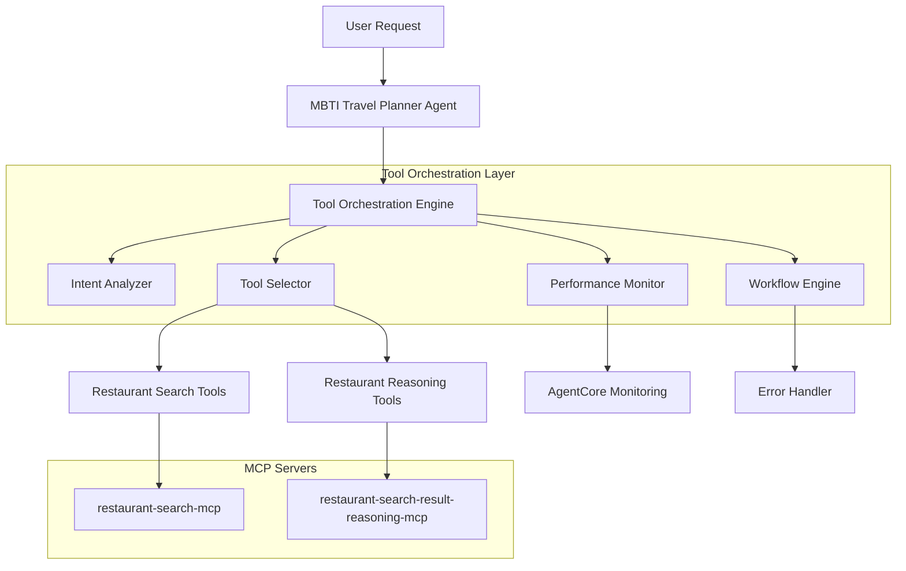
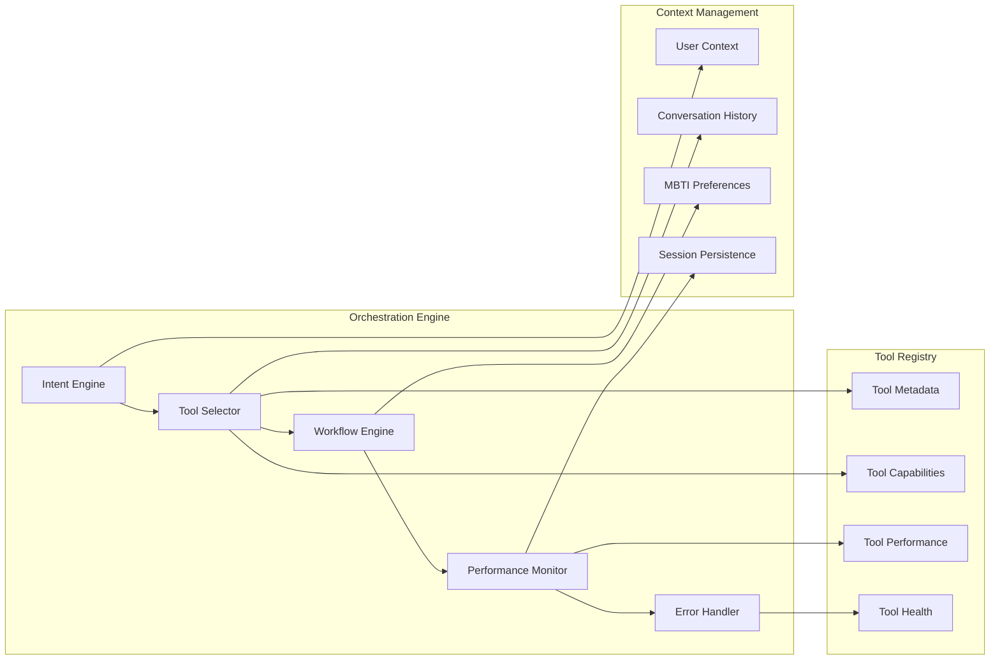
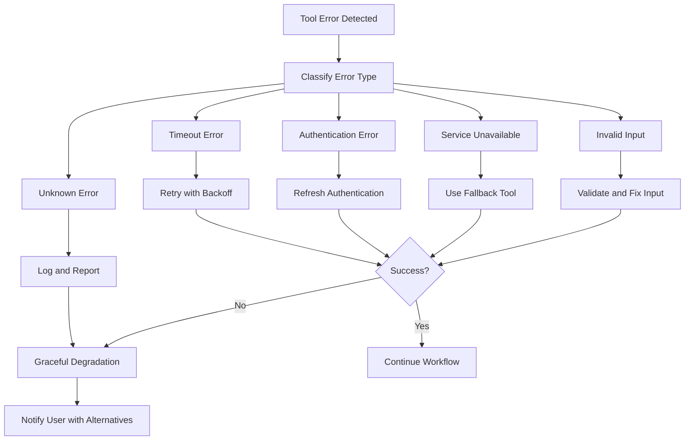

# Design Document

## Overview

The MBTI Travel Planner Tool Orchestration system provides intelligent guidance and automation for selecting and coordinating tools from multiple MCP servers. The system acts as an intelligent middleware layer between the Nova Pro model and the available MCP tools, ensuring optimal tool selection, efficient workflows, and robust error handling.

The design leverages existing AgentCore infrastructure while adding a sophisticated orchestration layer that can analyze user intent, select appropriate tools, coordinate multi-step workflows, and provide comprehensive monitoring and fallback capabilities.

## Architecture

### High-Level Architecture



### Component Architecture



## Components and Interfaces

### 1. Tool Orchestration Engine

**Purpose**: Central coordinator that manages tool selection and workflow execution.

**Key Classes**:
```python
class ToolOrchestrationEngine:
    def __init__(self, config: OrchestrationConfig)
    async def orchestrate_request(self, request: UserRequest) -> OrchestrationResult
    async def execute_workflow(self, workflow: Workflow) -> WorkflowResult
    def register_tool(self, tool: ToolMetadata) -> None
    def get_performance_metrics(self) -> PerformanceMetrics
```

**Interfaces**:
- `IIntentAnalyzer`: Analyzes user requests to determine intent and required capabilities
- `IToolSelector`: Selects optimal tools based on intent and context
- `IWorkflowEngine`: Executes multi-step workflows with error handling
- `IPerformanceMonitor`: Tracks tool usage and performance metrics

### 2. Intent Analyzer

**Purpose**: Analyzes user requests to understand intent and extract relevant parameters.

**Key Classes**:
```python
class IntentAnalyzer:
    def __init__(self, nlp_config: NLPConfig)
    async def analyze_intent(self, request: str, context: UserContext) -> Intent
    def extract_parameters(self, request: str, intent: Intent) -> Dict[str, Any]
    def classify_request_type(self, intent: Intent) -> RequestType
```

**Intent Types**:
- `RESTAURANT_SEARCH_BY_LOCATION`: Search restaurants in specific districts
- `RESTAURANT_SEARCH_BY_MEAL`: Search restaurants by meal type
- `RESTAURANT_RECOMMENDATION`: Get recommendations from restaurant data
- `COMBINED_SEARCH_AND_RECOMMENDATION`: Multi-step workflow
- `SENTIMENT_ANALYSIS`: Analyze restaurant sentiment data

### 3. Tool Selector

**Purpose**: Selects the most appropriate tools based on intent, context, and performance metrics.

**Key Classes**:
```python
class ToolSelector:
    def __init__(self, registry: ToolRegistry, performance_monitor: PerformanceMonitor)
    async def select_tools(self, intent: Intent, context: UserContext) -> List[SelectedTool]
    def rank_tools(self, candidates: List[Tool], criteria: SelectionCriteria) -> List[RankedTool]
    def validate_tool_compatibility(self, tools: List[Tool]) -> ValidationResult
```

**Selection Criteria**:
- Tool capability match with intent
- Historical performance metrics
- Current tool health status
- User context and preferences
- Workflow efficiency considerations

### 4. Workflow Engine

**Purpose**: Executes multi-step workflows that coordinate multiple tools.

**Key Classes**:
```python
class WorkflowEngine:
    def __init__(self, error_handler: ErrorHandler, monitor: PerformanceMonitor)
    async def execute_workflow(self, workflow: Workflow, context: ExecutionContext) -> WorkflowResult
    async def execute_step(self, step: WorkflowStep, context: StepContext) -> StepResult
    def create_workflow_from_intent(self, intent: Intent, tools: List[SelectedTool]) -> Workflow
```

**Workflow Types**:
- `SIMPLE_SEARCH`: Single tool execution
- `SEARCH_AND_RECOMMEND`: Search followed by recommendation
- `MULTI_CRITERIA_SEARCH`: Multiple search tools with result aggregation
- `ITERATIVE_REFINEMENT`: Progressive refinement based on results

### 5. Performance Monitor

**Purpose**: Tracks tool usage, performance metrics, and health status.

**Key Classes**:
```python
class PerformanceMonitor:
    def __init__(self, monitoring_service: AgentCoreMonitoringService)
    async def track_tool_invocation(self, tool: Tool, request: ToolRequest) -> InvocationTracker
    def update_tool_metrics(self, tool_id: str, metrics: ToolMetrics) -> None
    def get_tool_health_status(self, tool_id: str) -> HealthStatus
    def generate_performance_report(self) -> PerformanceReport
```

**Metrics Tracked**:
- Tool invocation frequency and patterns
- Response times and success rates
- Error rates and failure modes
- Resource utilization and efficiency
- User satisfaction indicators

## Data Models

### Core Data Models

```python
@dataclass
class UserRequest:
    text: str
    user_id: Optional[str]
    session_id: Optional[str]
    context: UserContext
    timestamp: datetime

@dataclass
class Intent:
    type: RequestType
    confidence: float
    parameters: Dict[str, Any]
    required_capabilities: List[str]
    optional_capabilities: List[str]

@dataclass
class SelectedTool:
    tool_id: str
    tool_name: str
    confidence: float
    expected_performance: PerformanceEstimate
    fallback_tools: List[str]

@dataclass
class Workflow:
    id: str
    steps: List[WorkflowStep]
    execution_strategy: ExecutionStrategy
    error_handling: ErrorHandlingStrategy
    expected_duration: timedelta

@dataclass
class WorkflowStep:
    id: str
    tool_id: str
    input_mapping: Dict[str, str]
    output_mapping: Dict[str, str]
    retry_policy: RetryPolicy
    timeout: timedelta
```

### Tool Metadata Models

```python
@dataclass
class ToolMetadata:
    id: str
    name: str
    description: str
    capabilities: List[str]
    input_schema: Dict[str, Any]
    output_schema: Dict[str, Any]
    performance_characteristics: PerformanceCharacteristics
    health_check_endpoint: Optional[str]

@dataclass
class ToolCapability:
    name: str
    description: str
    required_parameters: List[str]
    optional_parameters: List[str]
    output_format: str
    use_cases: List[str]

@dataclass
class PerformanceCharacteristics:
    average_response_time: timedelta
    success_rate: float
    throughput_limit: int
    resource_requirements: ResourceRequirements
```

## Error Handling

### Error Handling Strategy



### Error Recovery Mechanisms

1. **Automatic Retry**: Exponential backoff for transient failures
2. **Tool Fallbacks**: Alternative tools for the same capability
3. **Partial Results**: Return available results when some tools fail
4. **Graceful Degradation**: Reduce functionality rather than complete failure
5. **User Notification**: Clear communication about limitations and alternatives

### Error Types and Responses

```python
class ErrorHandler:
    async def handle_tool_error(self, error: ToolError, context: ErrorContext) -> ErrorResponse:
        if isinstance(error, TimeoutError):
            return await self._handle_timeout(error, context)
        elif isinstance(error, AuthenticationError):
            return await self._handle_auth_error(error, context)
        elif isinstance(error, ServiceUnavailableError):
            return await self._handle_unavailable(error, context)
        elif isinstance(error, ValidationError):
            return await self._handle_validation_error(error, context)
        else:
            return await self._handle_unknown_error(error, context)
```

## Testing Strategy

### Unit Testing

1. **Intent Analysis Testing**:
   - Test intent classification accuracy
   - Validate parameter extraction
   - Test edge cases and ambiguous requests

2. **Tool Selection Testing**:
   - Test selection algorithm correctness
   - Validate performance-based ranking
   - Test fallback selection logic

3. **Workflow Engine Testing**:
   - Test workflow execution paths
   - Validate error handling and recovery
   - Test step coordination and data flow

### Integration Testing

1. **End-to-End Workflow Testing**:
   - Test complete user request workflows
   - Validate tool coordination and data passing
   - Test error scenarios and recovery

2. **MCP Server Integration**:
   - Test communication with restaurant-search-mcp
   - Test communication with restaurant-reasoning-mcp
   - Validate authentication and error handling

3. **AgentCore Integration**:
   - Test monitoring service integration
   - Validate authentication manager usage
   - Test performance metric collection

### Performance Testing

1. **Load Testing**:
   - Test concurrent workflow execution
   - Validate performance under high load
   - Test resource utilization and limits

2. **Latency Testing**:
   - Measure tool selection decision time
   - Test workflow execution performance
   - Validate monitoring overhead

## Configuration Management

### Configuration Structure

```yaml
orchestration:
  intent_analysis:
    confidence_threshold: 0.8
    nlp_model: "intent-classifier-v1"
    parameter_extraction:
      enabled: true
      timeout: 5s
  
  tool_selection:
    ranking_algorithm: "weighted_performance"
    performance_weight: 0.4
    health_weight: 0.3
    capability_weight: 0.3
    fallback_count: 2
  
  workflow_engine:
    max_concurrent_workflows: 50
    step_timeout: 30s
    retry_policy:
      max_retries: 3
      backoff_multiplier: 2
      max_backoff: 60s
  
  performance_monitoring:
    metrics_collection: true
    health_check_interval: 30s
    performance_window: 300s
    alert_thresholds:
      error_rate: 0.1
      response_time: 10s

tools:
  restaurant_search:
    priority: 1
    capabilities:
      - "search_by_district"
      - "search_by_meal_type"
      - "combined_search"
    health_check: "/health"
    timeout: 15s
  
  restaurant_reasoning:
    priority: 1
    capabilities:
      - "recommend_restaurants"
      - "analyze_sentiment"
    health_check: "/health"
    timeout: 20s
```

### Environment-Specific Configuration

```python
class OrchestrationConfig:
    def __init__(self, environment: str = "production"):
        self.environment = environment
        self.load_config()
    
    def load_config(self):
        base_config = self._load_base_config()
        env_config = self._load_environment_config(self.environment)
        self.config = self._merge_configs(base_config, env_config)
    
    def get_tool_config(self, tool_id: str) -> ToolConfig:
        return self.config.tools.get(tool_id)
    
    def get_orchestration_config(self) -> Dict[str, Any]:
        return self.config.orchestration
```

## Integration Points

### AgentCore Integration

1. **Authentication Integration**:
   ```python
   class OrchestrationAuthManager:
       def __init__(self, auth_manager: AuthenticationManager):
           self.auth_manager = auth_manager
       
       async def get_tool_credentials(self, tool_id: str) -> Credentials:
           return await self.auth_manager.get_credentials_for_tool(tool_id)
   ```

2. **Monitoring Integration**:
   ```python
   class OrchestrationMonitoring:
       def __init__(self, monitoring_service: AgentCoreMonitoringService):
           self.monitoring_service = monitoring_service
       
       async def track_orchestration_event(self, event: OrchestrationEvent):
           await self.monitoring_service.log_custom_metric(
               "orchestration_event", event.to_dict()
           )
   ```

### MCP Server Integration

1. **Tool Registration**:
   ```python
   class MCPToolRegistry:
       async def register_mcp_server(self, server_config: MCPServerConfig):
           tools = await self._discover_tools(server_config)
           for tool in tools:
               await self.register_tool(tool)
   ```

2. **Dynamic Tool Discovery**:
   ```python
   class ToolDiscoveryService:
       async def discover_tools(self, mcp_endpoint: str) -> List[ToolMetadata]:
           # Use MCP protocol to discover available tools
           # Parse OpenAPI schemas to extract tool metadata
           # Register tools with orchestration engine
   ```

## Deployment Considerations

### Scalability

1. **Horizontal Scaling**: Support multiple orchestration engine instances
2. **Load Balancing**: Distribute workflows across available instances
3. **Resource Management**: Monitor and manage resource utilization
4. **Caching**: Cache tool metadata and performance metrics

### Reliability

1. **Health Monitoring**: Continuous health checks for all components
2. **Circuit Breakers**: Prevent cascade failures
3. **Graceful Degradation**: Maintain partial functionality during failures
4. **Backup Strategies**: Fallback tools and alternative workflows

### Security

1. **Authentication**: Secure communication with MCP servers
2. **Authorization**: Role-based access to tools and workflows
3. **Data Protection**: Secure handling of user data and context
4. **Audit Logging**: Comprehensive logging for security analysis

## Monitoring and Observability

### Metrics Collection

1. **Orchestration Metrics**:
   - Tool selection accuracy and performance
   - Workflow execution times and success rates
   - Error rates and failure patterns
   - Resource utilization and efficiency

2. **Tool Metrics**:
   - Individual tool performance and health
   - Usage patterns and frequency
   - Error rates and failure modes
   - Response time distributions

3. **User Experience Metrics**:
   - Request fulfillment rates
   - User satisfaction indicators
   - Workflow completion times
   - Error recovery success rates

### Dashboards and Alerting

1. **Real-time Dashboards**:
   - Tool orchestration overview
   - Individual tool performance
   - Workflow execution status
   - Error and alert summaries

2. **Alerting Rules**:
   - Tool failure rate thresholds
   - Performance degradation alerts
   - Workflow timeout notifications
   - Resource utilization warnings

This design provides a comprehensive foundation for intelligent tool orchestration while maintaining integration with existing AgentCore infrastructure and ensuring robust error handling and monitoring capabilities.