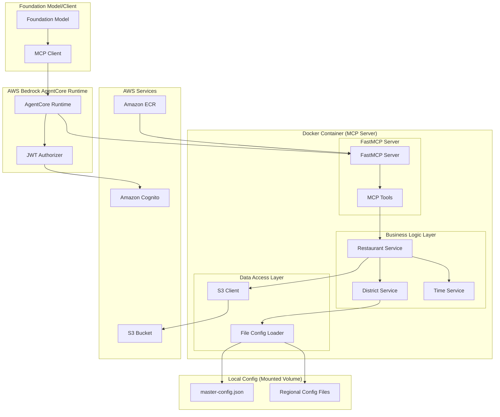

# Design Document

## Overview

The Restaurant Search MCP application is a containerized Python service that provides Model Context Protocol (MCP) tools for searching restaurant data stored in AWS S3. The application integrates with AWS Bedrock AgentCore to enable foundation models to search restaurants by district and meal type through structured MCP tool calls.

The system follows a layered architecture with clear separation between MCP protocol handling, business logic, data access, and AWS services integration. It loads district configuration locally for fast lookups while retrieving restaurant data from S3 on-demand.

## Architecture

### High-Level Architecture



### Component Architecture

The application follows the Bedrock AgentCore MCP server pattern with these key components:

1. **FastMCP Server**: Uses FastMCP with `stateless_http=True` for AgentCore Runtime compatibility
2. **MCP Tools**: Decorated Python functions that become MCP tools via `@mcp.tool()`
3. **Restaurant Service**: Core business logic for restaurant search operations
4. **District Service**: Manages district configuration and validation
5. **Time Service**: Handles meal time calculations and operating hours analysis
6. **S3 Client**: Manages AWS S3 data retrieval using boto3
7. **Configuration Loader**: Loads and parses local district configuration files
8. **Authentication**: JWT-based authentication via Amazon Cognito integration

## Components and Interfaces

### FastMCP Server Implementation

The application uses FastMCP with the following configuration:

```python
from mcp.server.fastmcp import FastMCP

# Create MCP server with AgentCore Runtime compatibility
mcp = FastMCP(host="0.0.0.0", stateless_http=True)

# MCP tools are defined using decorators
@mcp.tool()
def search_restaurants_by_district(districts: list[str]) -> str:
    """Search for restaurants in specific districts"""
    # Implementation here
    
@mcp.tool()
def search_restaurants_by_meal_type(meal_types: list[str]) -> str:
    """Search for restaurants by meal type based on operating hours"""
    # Implementation here
    
@mcp.tool()
def search_restaurants_combined(districts: list[str] = None, meal_types: list[str] = None) -> str:
    """Search for restaurants by both district and meal type"""
    # Implementation here

if __name__ == "__main__":
    mcp.run(transport="streamable-http")
```

### MCP Tools Interface

The application exposes the following MCP tools with automatic schema generation:

#### search_restaurants_by_district
- **Parameters**: `districts: list[str]` - List of district names to search
- **Returns**: JSON string containing restaurant data and metadata
- **Description**: Search for restaurants in specific districts

#### search_restaurants_by_meal_type  
- **Parameters**: `meal_types: list[str]` - List of meal types ("breakfast", "lunch", "dinner")
- **Returns**: JSON string containing restaurant data filtered by operating hours
- **Description**: Search for restaurants by meal type based on operating hours

#### search_restaurants_combined
- **Parameters**: 
  - `districts: list[str] = None` - Optional list of district names
  - `meal_types: list[str] = None` - Optional list of meal types
- **Returns**: JSON string containing filtered restaurant data
- **Description**: Search for restaurants by both district and meal type

### Restaurant Service Interface

```python
class RestaurantService:
    def search_by_districts(self, districts: List[str]) -> List[Restaurant]
    def search_by_meal_types(self, meal_types: List[str]) -> List[Restaurant]
    def search_combined(self, districts: List[str] = None, meal_types: List[str] = None) -> List[Restaurant]
    def get_restaurant_data_from_s3(self, region: str, district: str) -> RestaurantDataFile
```

### District Service Interface

```python
class DistrictService:
    def load_district_config(self) -> None
    def get_all_districts(self) -> Dict[str, List[str]]
    def validate_district(self, district_name: str) -> bool
    def get_region_for_district(self, district_name: str) -> str
    def get_s3_path_for_district(self, district_name: str) -> str
```

### Time Service Interface

```python
class TimeService:
    def is_open_for_meal(self, operating_hours: OperatingHours, meal_type: str) -> bool
    def parse_time_range(self, time_range: str) -> Tuple[datetime.time, datetime.time]
    def check_time_overlap(self, range1: Tuple[datetime.time, datetime.time], 
                          range2: Tuple[datetime.time, datetime.time]) -> bool
```

## Data Models

### Restaurant Data Models

```python
@dataclass
class OperatingHours:
    mon_fri: List[str]
    sat_sun: List[str]
    public_holiday: List[str]

@dataclass
class Sentiment:
    likes: int
    dislikes: int
    neutral: int

@dataclass
class RestaurantMetadata:
    data_quality: str
    version: str
    quality_score: int

@dataclass
class Restaurant:
    id: str
    name: str
    address: str
    meal_type: List[str]
    sentiment: Sentiment
    location_category: str
    district: str
    price_range: str
    operating_hours: OperatingHours
    metadata: RestaurantMetadata

@dataclass
class FileMetadata:
    timestamp: str
    version: str
    district: str
    location_category: str
    record_count: int
    file_size: int
    sanitized_at: str
    sanitization_version: str

@dataclass
class RestaurantDataFile:
    metadata: FileMetadata
    restaurants: List[Restaurant]
```

### Configuration Data Models

```python
@dataclass
class DistrictConfig:
    name: str
    priority: int
    max_pages: int
    district_id: int

@dataclass
class RegionConfig:
    name: str
    category: str
    priority: int
    districts: List[DistrictConfig]

@dataclass
class MasterConfig:
    version: str
    last_updated: str
    regions: List[Dict[str, Any]]
```

## Error Handling

### Error Types and Responses

1. **District Validation Errors**
   - Invalid district name
   - District not found in configuration
   - Response includes list of available districts

2. **S3 Access Errors**
   - Authentication failures
   - Network connectivity issues
   - File not found errors
   - Malformed JSON data

3. **Configuration Errors**
   - Missing configuration files
   - Invalid JSON format
   - Missing required fields

4. **MCP Protocol Errors**
   - Invalid tool parameters
   - Tool execution failures
   - Serialization errors

### Error Response Format

```python
{
    "error": {
        "type": "ValidationError",
        "message": "Invalid district name: 'InvalidDistrict'",
        "details": {
            "available_districts": ["Admiralty", "Central district", "Causeway Bay", ...],
            "invalid_districts": ["InvalidDistrict"]
        }
    }
}
```

## Testing Strategy

### Unit Testing
- Test individual components in isolation
- Mock external dependencies (S3, file system)
- Test edge cases and error conditions
- Validate data model serialization/deserialization

### Integration Testing
- Test MCP tool registration and execution
- Test S3 data retrieval with real AWS credentials
- Test configuration loading from actual files
- Test end-to-end restaurant search workflows

### Performance Testing
- Test response times for large restaurant datasets
- Test concurrent request handling
- Test memory usage with multiple district searches
- Test S3 request optimization

### Test Data Strategy
- Use sample restaurant data files for testing
- Create test district configuration files
- Mock S3 responses for unit tests
- Use containerized test environment

## Deployment and Configuration

### Bedrock AgentCore Runtime Deployment

The application follows the Bedrock AgentCore Runtime deployment pattern:

#### Using Bedrock AgentCore Starter Toolkit

```python
from bedrock_agentcore_starter_toolkit import Runtime
from boto3.session import Session

# Initialize runtime
agentcore_runtime = Runtime()

# Configure with authentication
auth_config = {
    "customJWTAuthorizer": {
        "allowedClients": [cognito_client_id],
        "discoveryUrl": cognito_discovery_url,
    }
}

# Configure deployment
response = agentcore_runtime.configure(
    entrypoint="restaurant_mcp_server.py",
    auto_create_execution_role=True,
    auto_create_ecr=True,
    requirements_file="requirements.txt",
    region=region,
    authorizer_configuration=auth_config,
    protocol="MCP",
    agent_name="restaurant_search_mcp"
)

# Launch to AgentCore Runtime
launch_result = agentcore_runtime.launch()
```

### Docker Configuration

The AgentCore Runtime automatically generates a Dockerfile with:
- Python 3.11+ base image
- Required dependencies from requirements.txt
- FastMCP server configuration
- Proper entrypoint setup

### Requirements.txt

```txt
mcp>=1.10.0
boto3
bedrock-agentcore
bedrock-agentcore-starter-toolkit
```

### Environment Variables

AgentCore Runtime manages these automatically:
- AWS credentials via IAM roles
- Region configuration
- Authentication tokens
- Runtime-specific configurations

### Volume Mounts

```bash
# District configuration files (mounted as read-only)
-v /path/to/config:/app/config:ro
```

### Authentication Configuration

Uses Amazon Cognito for JWT-based authentication:
- User pool with app client
- JWT token validation
- Bearer token authentication for MCP client connections

## Security Considerations

### Bedrock AgentCore Security
- JWT-based authentication via Amazon Cognito
- Automatic IAM role management by AgentCore Runtime
- Secure MCP protocol communication over HTTPS
- Session isolation via `Mcp-Session-Id` headers

### AWS Security
- IAM roles with minimal required permissions for S3 access
- S3 bucket policies for read-only access to restaurant data
- No hardcoded AWS credentials (managed by AgentCore Runtime)
- VPC integration support for network isolation

### Container Security
- AgentCore Runtime manages container security
- Automatic vulnerability scanning via ECR
- Resource limits and monitoring
- Secure base image management

### Data Security
- Input validation for all MCP tool parameters
- Sanitization of restaurant data before returning
- Audit logging of all MCP tool invocations
- Rate limiting handled by AgentCore Runtime

### Authentication Flow
1. Client authenticates with Cognito to get JWT token
2. Client includes Bearer token in MCP requests
3. AgentCore Runtime validates JWT against Cognito
4. Validated requests are forwarded to MCP server
5. MCP server processes requests with validated context

## Performance Optimization

### AgentCore Runtime Optimization
- Stateless HTTP transport for scalability
- Automatic scaling managed by AgentCore Runtime
- Connection pooling handled by runtime infrastructure
- Built-in monitoring and observability

### Caching Strategy
- In-memory caching of district configuration on startup
- LRU cache for frequently accessed restaurant data
- S3 response caching with appropriate TTL
- Boto3 connection pooling for S3 client

### S3 Optimization
- Efficient S3 key patterns for district-based access
- Parallel downloads for multiple districts using asyncio
- Appropriate S3 request patterns to minimize costs
- S3 request monitoring and optimization

### Memory Management
- Streaming JSON parsing for large restaurant files
- Generator-based processing for large result sets
- Memory-efficient data structures
- Garbage collection optimization for long-running processes

### MCP Protocol Optimization
- Efficient JSON serialization/deserialization
- Minimal data transfer in MCP responses
- Proper error handling to avoid connection issues
- Session management for stateless operations
#
# Implementation Patterns from Bedrock AgentCore Samples

### FastMCP Server Pattern

Based on the AgentCore samples, the MCP server follows this specific pattern:

```python
from mcp.server.fastmcp import FastMCP

# CRITICAL: stateless_http=True is required for AgentCore Runtime
mcp = FastMCP(host="0.0.0.0", stateless_http=True)

@mcp.tool()
def restaurant_search_tool(param1: str, param2: list[str]) -> str:
    """Tool description for the foundation model"""
    # Business logic implementation
    return json.dumps(result)

if __name__ == "__main__":
    # Use streamable-http transport for AgentCore compatibility
    mcp.run(transport="streamable-http")
```

### Authentication Integration Pattern

Following the inbound auth examples:

```python
# Cognito setup (handled by starter toolkit)
cognito_config = setup_cognito_user_pool()

# AgentCore Runtime configuration
auth_config = {
    "customJWTAuthorizer": {
        "allowedClients": [cognito_config['client_id']],
        "discoveryUrl": cognito_config['discovery_url'],
    }
}
```

### Client Connection Pattern

MCP clients connect using this pattern:

```python
from mcp import ClientSession
from mcp.client.streamable_http import streamablehttp_client

# AgentCore Runtime URL pattern
encoded_arn = agent_arn.replace(':', '%3A').replace('/', '%2F')
mcp_url = f"https://bedrock-agentcore.{region}.amazonaws.com/runtimes/{encoded_arn}/invocations?qualifier=DEFAULT"

headers = {
    "authorization": f"Bearer {bearer_token}",
    "Content-Type": "application/json"
}

async with streamablehttp_client(mcp_url, headers, timeout=timedelta(seconds=120)) as (read_stream, write_stream, _):
    async with ClientSession(read_stream, write_stream) as session:
        await session.initialize()
        tools = await session.list_tools()
        result = await session.call_tool(name="tool_name", arguments={"param": "value"})
```

### Project Structure Pattern

Following the AgentCore samples structure:

```
restaurant-search-mcp/
├── restaurant_mcp_server.py     # Main MCP server with FastMCP
├── services/
│   ├── restaurant_service.py    # Business logic
│   ├── district_service.py      # District management
│   └── time_service.py          # Time calculations
├── models/
│   └── restaurant_models.py     # Data models
├── config/
│   ├── districts/               # Local district config files
│   └── requirements.txt         # Dependencies
├── tests/
│   ├── test_mcp_client.py      # Local testing client
│   └── test_remote_client.py   # Remote testing client
└── Dockerfile                   # Auto-generated by AgentCore
```

### Error Handling Pattern

Following AgentCore best practices:

```python
@mcp.tool()
def search_restaurants(districts: list[str]) -> str:
    """Search restaurants by district"""
    try:
        # Validate inputs
        if not districts:
            return json.dumps({"error": "Districts parameter is required"})
        
        # Business logic
        results = restaurant_service.search_by_districts(districts)
        
        return json.dumps({
            "success": True,
            "data": results,
            "metadata": {"count": len(results)}
        })
        
    except Exception as e:
        logger.error(f"Error in search_restaurants: {e}")
        return json.dumps({
            "error": f"Search failed: {str(e)}",
            "success": False
        })
```

### Deployment Automation Pattern

Using the starter toolkit pattern:

```python
# Configure
agentcore_runtime.configure(
    entrypoint="restaurant_mcp_server.py",
    auto_create_execution_role=True,
    auto_create_ecr=True,
    requirements_file="requirements.txt",
    authorizer_configuration=auth_config,
    protocol="MCP"
)

# Launch
launch_result = agentcore_runtime.launch()

# Wait for ready status
while status not in ['READY', 'CREATE_FAILED']:
    time.sleep(10)
    status = agentcore_runtime.status().endpoint['status']
```