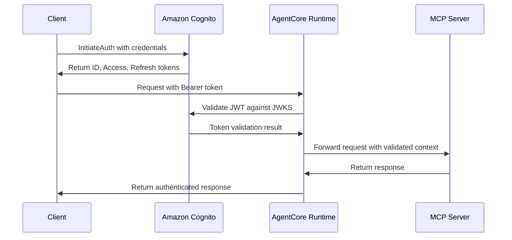
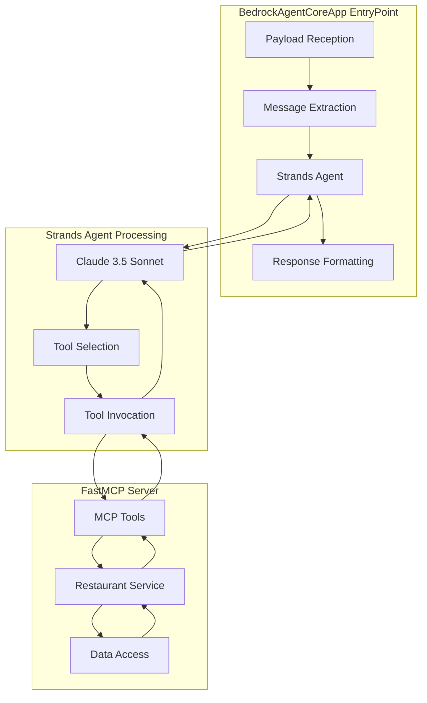

# Design Document

## Overview

The Restaurant Search MCP application is a comprehensive conversational AI system that enables natural language restaurant search through AWS Bedrock AgentCore. The system consists of two main components: an MCP server that provides structured restaurant search tools, and an AgentCore-hosted foundation model that processes natural language queries and converts them to MCP tool calls.

The application integrates with AWS Bedrock AgentCore to create a complete conversational restaurant search experience. Users can interact with the system using natural language queries like "Find breakfast places in Central district," and the foundation model automatically translates these into appropriate MCP tool calls, retrieves restaurant data from S3, and formats responses in a conversational manner.

The system follows a layered architecture with clear separation between natural language processing (foundation model), MCP protocol handling, business logic, data access, and AWS services integration. It loads district configuration locally for fast lookups while retrieving restaurant data from S3 on-demand.

## Architecture

### High-Level Architecture


### Component Architecture

The application follows the Bedrock AgentCore conversational AI pattern with these key components:

#### Foundation Model Layer
1. **AgentCore Foundation Model**: Claude 3.5 Sonnet configured for restaurant search tasks
2. **Natural Language Processor**: Interprets user queries and extracts search parameters
3. **System Prompts**: Context about Hong Kong districts and restaurant search capabilities
4. **Tool Orchestrator**: Manages MCP tool selection and parameter mapping
5. **Response Formatter**: Converts structured data into conversational responses

#### MCP Server Layer
6. **FastMCP Server**: Uses FastMCP with `stateless_http=True` for AgentCore Runtime compatibility
7. **MCP Tools**: Decorated Python functions that become MCP tools via `@mcp.tool()`
8. **Restaurant Service**: Core business logic for restaurant search operations
9. **District Service**: Manages district configuration and validation
10. **Time Service**: Handles meal time calculations and operating hours analysis

#### Data Access Layer
11. **Data Access Client**: Unified client for S3 restaurant data retrieval and local district configuration loading
12. **S3 Client**: Manages AWS S3 data retrieval using boto3
13. **Configuration Loader**: Loads and parses local district configuration files

#### Infrastructure Layer
14. **AgentCore Runtime**: Manages foundation model hosting and MCP tool routing
15. **Authentication**: JWT-based authentication via Amazon Cognito integration
16. **Request Router**: Routes natural language queries to appropriate processing components

## Components and Interfaces

### Foundation Model Configuration

The AgentCore foundation model is configured to handle natural language restaurant search queries with the following specifications:

```python
# Foundation model configuration for AgentCore
foundation_model_config = {
    "model_id": "anthropic.claude-3-5-sonnet-20241022-v2:0",
    "model_parameters": {
        "temperature": 0.1,  # Low temperature for consistent tool calling
        "max_tokens": 2048,
        "top_p": 0.9
    },
    "system_prompt": """You are a helpful restaurant search assistant for Hong Kong. 
    You have access to restaurant data organized by districts across Hong Kong Island, 
    Kowloon, New Territories, and Lantau. You can search restaurants by district names 
    and meal times (breakfast: 7:00-11:29, lunch: 11:30-17:29, dinner: 17:30-22:30).
    
    Available districts include: Admiralty, Central district, Causeway Bay, Wan Chai, 
    Tsim Sha Tsui, Mong Kok, Sha Tin, Tsuen Wan, and many others.
    
    When users ask about restaurants, use the appropriate MCP tools to search and 
    provide helpful, conversational responses with restaurant details.""",
    "tool_calling": {
        "enabled": True,
        "auto_invoke": True
    }
}
```

#### Natural Language Processing Pipeline

The foundation model processes queries through these stages:

1. **Intent Recognition**: Identifies restaurant search intent from natural language
2. **Parameter Extraction**: Extracts district names and meal types from user queries
3. **District Mapping**: Maps colloquial names to exact district names (e.g., "Central" → "Central district")
4. **Tool Selection**: Chooses appropriate MCP tool based on extracted parameters
5. **Parameter Validation**: Validates extracted parameters against available options
6. **Tool Invocation**: Calls MCP tools with properly formatted parameters
7. **Response Generation**: Formats tool results into conversational responses

#### Query Processing Examples

```python
# Example query processing flows
query_examples = {
    "Find restaurants in Central district": {
        "intent": "district_search",
        "extracted_params": {"districts": ["Central district"]},
        "tool_call": "search_restaurants_by_district",
        "parameters": {"districts": ["Central district"]}
    },
    "breakfast places in Tsim Sha Tsui": {
        "intent": "combined_search", 
        "extracted_params": {
            "districts": ["Tsim Sha Tsui"],
            "meal_types": ["breakfast"]
        },
        "tool_call": "search_restaurants_combined",
        "parameters": {
            "districts": ["Tsim Sha Tsui"], 
            "meal_types": ["breakfast"]
        }
    },
    "dinner restaurants": {
        "intent": "meal_search",
        "extracted_params": {"meal_types": ["dinner"]},
        "tool_call": "search_restaurants_by_meal_type", 
        "parameters": {"meal_types": ["dinner"]}
    }
}
```

### FastMCP Server Implementation

The application uses FastMCP with the following configuration:

```python
from mcp.server.fastmcp import FastMCP

# Create MCP server with AgentCore Runtime compatibility
mcp = FastMCP(host="0.0.0.0", stateless_http=True)

# MCP tools are defined using decorators
@mcp.tool()
def search_restaurants_by_district(districts: list[str]) -> str:
    """Search for restaurants in specific districts"""
    # Implementation here
    
@mcp.tool()
def search_restaurants_by_meal_type(meal_types: list[str]) -> str:
    """Search for restaurants by meal type based on operating hours"""
    # Implementation here
    
@mcp.tool()
def search_restaurants_combined(districts: list[str] = None, meal_types: list[str] = None) -> str:
    """Search for restaurants by both district and meal type"""
    # Implementation here

if __name__ == "__main__":
    mcp.run(transport="streamable-http")
```

### MCP Tools Interface

The application exposes the following MCP tools with automatic schema generation:

#### search_restaurants_by_district
- **Parameters**: `districts: list[str]` - List of district names to search
- **Returns**: JSON string containing restaurant data and metadata
- **Description**: Search for restaurants in specific districts

#### search_restaurants_by_meal_type  
- **Parameters**: `meal_types: list[str]` - List of meal types ("breakfast", "lunch", "dinner")
- **Returns**: JSON string containing restaurant data filtered by operating hours
- **Description**: Search for restaurants by meal type based on operating hours

#### search_restaurants_combined
- **Parameters**: 
  - `districts: list[str] = None` - Optional list of district names
  - `meal_types: list[str] = None` - Optional list of meal types
- **Returns**: JSON string containing filtered restaurant data
- **Description**: Search for restaurants by both district and meal type

### Restaurant Service Interface

```python
class RestaurantService:
    def search_by_districts(self, districts: List[str]) -> List[Restaurant]
    def search_by_meal_types(self, meal_types: List[str]) -> List[Restaurant]
    def search_combined(self, districts: List[str] = None, meal_types: List[str] = None) -> List[Restaurant]
```

### District Service Interface

```python
class DistrictService:
    def load_district_config(self) -> None
    def get_all_districts(self) -> Dict[str, List[str]]
    def validate_district(self, district_name: str) -> bool
    def get_region_for_district(self, district_name: str) -> str
    def get_s3_path_for_district(self, district_name: str) -> str
```

### Time Service Interface

```python
class TimeService:
    def is_open_for_meal(self, operating_hours: OperatingHours, meal_type: str) -> bool
    def parse_time_range(self, time_range: str) -> Tuple[datetime.time, datetime.time]
    def check_time_overlap(self, range1: Tuple[datetime.time, datetime.time], 
                          range2: Tuple[datetime.time, datetime.time]) -> bool
```

### Data Access Client Interface

```python
class DataAccessClient:
    def get_restaurant_data(self, region: str, district: str) -> Optional[RestaurantDataFile]
    def get_multiple_restaurant_data(self, region_district_pairs: List[tuple]) -> Dict[str, RestaurantDataFile]
    def load_district_config(self, config_path: str = "config/districts") -> Dict[str, Any]
    def test_s3_connection(self) -> bool
    def get_available_districts_from_s3(self) -> Dict[str, List[str]]
```

### AgentCore Runtime Integration Interface

```python
class AgentCoreIntegration:
    def configure_foundation_model(self, model_config: Dict) -> str
    def deploy_mcp_server(self, server_config: Dict) -> str
    def create_agent_runtime(self, agent_config: Dict) -> str
    def process_natural_language_query(self, query: str, session_id: str = None) -> Dict
    def invoke_agent(self, input_data: Dict) -> Dict
    def get_agent_status(self) -> Dict
    def update_system_prompts(self, prompts: Dict) -> bool
```

### Authentication Service Interfaces

```python
class CognitoAuthenticator:
    def __init__(self, user_pool_id: str, client_id: str, region: str)
    async def authenticate_user(self, username: str, password: str) -> Dict
    async def refresh_token(self, refresh_token: str) -> Dict
    async def validate_user_session(self, access_token: str) -> Dict
    def get_user_info(self, access_token: str) -> Dict

class TokenValidator:
    def __init__(self, cognito_config: Dict)
    async def validate_jwt_token(self, token: str) -> Dict
    async def get_signing_key(self, kid: str) -> str
    def extract_claims(self, token: str) -> Dict
    def is_token_expired(self, token: str) -> bool

class AuthenticationMiddleware:
    def __init__(self, token_validator: TokenValidator)
    async def __call__(self, request: Request, call_next) -> Response
    def extract_bearer_token(self, auth_header: str) -> str
    def create_error_response(self, error_type: str, message: str) -> JSONResponse

class JWKSManager:
    def __init__(self, discovery_url: str, cache_ttl: int = 3600)
    async def get_jwks_keys(self) -> Dict
    async def refresh_jwks_cache(self) -> None
    def get_signing_key_for_kid(self, kid: str) -> str
    def is_cache_expired(self) -> bool
```

### Natural Language Query Processing Interface

```python
class QueryProcessor:
    def extract_intent(self, query: str) -> str
    def extract_districts(self, query: str) -> List[str]
    def extract_meal_types(self, query: str) -> List[str]
    def validate_districts(self, districts: List[str]) -> Tuple[List[str], List[str]]
    def suggest_alternatives(self, invalid_districts: List[str]) -> List[str]
    def format_conversational_response(self, results: List[Restaurant], query_context: Dict) -> str
```

## Data Models

### Restaurant Data Models

```python
@dataclass
class OperatingHours:
    mon_fri: List[str]
    sat_sun: List[str]
    public_holiday: List[str]

@dataclass
class Sentiment:
    likes: int
    dislikes: int
    neutral: int

@dataclass
class RestaurantMetadata:
    data_quality: str
    version: str
    quality_score: int

@dataclass
class Restaurant:
    id: str
    name: str
    address: str
    meal_type: List[str]
    sentiment: Sentiment
    location_category: str
    district: str
    price_range: str
    operating_hours: OperatingHours
    metadata: RestaurantMetadata

@dataclass
class FileMetadata:
    timestamp: str
    version: str
    district: str
    location_category: str
    record_count: int
    file_size: int
    sanitized_at: str
    sanitization_version: str

@dataclass
class RestaurantDataFile:
    metadata: FileMetadata
    restaurants: List[Restaurant]
```

### Configuration Data Models

```python
@dataclass
class DistrictConfig:
    name: str
    priority: int
    max_pages: int
    district_id: int

@dataclass
class RegionConfig:
    name: str
    category: str
    priority: int
    districts: List[DistrictConfig]

@dataclass
class MasterConfig:
    version: str
    last_updated: str
    regions: List[Dict[str, Any]]

### Authentication Data Models

```python
@dataclass
class CognitoConfig:
    user_pool_id: str
    client_id: str
    region: str
    discovery_url: str
    jwks_url: str
    issuer_url: str

@dataclass
class JWTClaims:
    user_id: str
    username: str
    email: str
    client_id: str
    token_use: str
    exp: int
    iat: int
    iss: str
    aud: str

@dataclass
class AuthenticationTokens:
    id_token: str
    access_token: str
    refresh_token: str
    expires_in: int
    token_type: str = "Bearer"

@dataclass
class AuthenticationError:
    error_type: str
    error_code: str
    message: str
    details: str
    suggested_action: str

@dataclass
class UserContext:
    user_id: str
    username: str
    email: str
    authenticated: bool
    token_claims: JWTClaims
    session_id: Optional[str] = None
```

## Natural Language Processing and User Experience

### Conversational Interface Design

The system provides a natural, conversational interface for restaurant search through the AgentCore foundation model:

#### Query Understanding Patterns

```python
# Natural language patterns the system recognizes
query_patterns = {
    "district_only": [
        "restaurants in {district}",
        "find places in {district}", 
        "what's good in {district}",
        "{district} restaurants"
    ],
    "meal_type_only": [
        "{meal_type} places",
        "where to get {meal_type}",
        "{meal_type} restaurants",
        "good {meal_type} spots"
    ],
    "combined": [
        "{meal_type} in {district}",
        "{meal_type} places in {district}",
        "find {meal_type} restaurants in {district}"
    ],
    "cuisine_specific": [
        "{cuisine} restaurants in {district}",
        "good {cuisine} in {district}",
        "{cuisine} places for {meal_type}"
    ]
}
```

#### Response Formatting Strategy

The foundation model formats responses to be conversational and helpful:

1. **Greeting and Context**: Acknowledge the user's request
2. **Results Summary**: Provide count and overview of findings
3. **Restaurant Details**: Present key information in readable format
4. **Operating Hours**: Format times in user-friendly way
5. **Suggestions**: Offer alternatives when no results found
6. **Follow-up**: Invite further questions or refinements

#### Example Response Templates

```python
response_templates = {
    "success_multiple": """I found {count} restaurants in {district} for {meal_type}:

{restaurant_list}

Would you like more details about any of these restaurants or search in a different area?""",
    
    "success_single": """Here's a great {meal_type} spot in {district}:

**{name}** - {address}
- Cuisine: {meal_types}
- Price Range: {price_range}
- Hours: {formatted_hours}
- Rating: {sentiment_summary}

Would you like to see more options in this area?""",
    
    "no_results": """I couldn't find any {meal_type} restaurants in {district}. 

You might want to try:
- Nearby districts: {nearby_suggestions}
- Different meal times: {meal_suggestions}
- Broader search across all districts

What would you prefer to search for?""",
    
    "invalid_district": """I don't recognize "{invalid_district}" as a Hong Kong district. 

Did you mean one of these?
{district_suggestions}

Or you can search across all districts by just mentioning the meal type."""
}
```

### Error Handling and User Guidance

#### Intelligent Error Recovery

The system provides helpful guidance when queries cannot be processed:

1. **District Name Fuzzy Matching**: Suggests similar district names for typos
2. **Meal Time Clarification**: Helps users understand meal time categories
3. **Alternative Suggestions**: Offers nearby districts or different search options
4. **Query Refinement**: Guides users to refine ambiguous queries

#### Contextual Help System

```python
help_responses = {
    "available_districts": "I can search restaurants in Hong Kong districts including Central district, Tsim Sha Tsui, Causeway Bay, Wan Chai, Mong Kok, Admiralty, and many others.",
    
    "meal_times": "I categorize restaurants by meal times: breakfast (7:00-11:29), lunch (11:30-17:29), and dinner (17:30-22:30) based on their operating hours.",
    
    "search_examples": "You can ask me things like: 'Find breakfast places in Central district', 'dinner restaurants in Tsim Sha Tsui', or just 'restaurants in Causeway Bay'."
}
```

## Error Handling

### Error Types and Responses

1. **Natural Language Processing Errors**
   - Ambiguous query intent
   - Unrecognized district names with fuzzy matching suggestions
   - Invalid meal type references with clarification
   - Query too vague or complex for processing

2. **District Validation Errors**
   - Invalid district name with suggested alternatives
   - District not found in configuration
   - Response includes list of available districts
   - Fuzzy matching for typos and variations

3. **Foundation Model Errors**
   - Model invocation failures
   - Tool calling parameter errors
   - Response generation timeouts
   - Context window exceeded

4. **S3 Access Errors**
   - Authentication failures
   - Network connectivity issues
   - File not found errors
   - Malformed JSON data

5. **Configuration Errors**
   - Missing configuration files
   - Invalid JSON format
   - Missing required fields

6. **MCP Protocol Errors**
   - Invalid tool parameters
   - Tool execution failures
   - Serialization errors

7. **AgentCore Runtime Errors**
   - Agent deployment failures
   - Authentication token issues
   - Runtime scaling problems
   - Session management errors

### Error Response Format

#### MCP Tool Error Format (Internal)
```python
{
    "error": {
        "type": "ValidationError",
        "message": "Invalid district name: 'InvalidDistrict'",
        "details": {
            "available_districts": ["Admiralty", "Central district", "Causeway Bay", ...],
            "invalid_districts": ["InvalidDistrict"]
        }
    }
}
```

#### Conversational Error Format (User-Facing)
```python
conversational_errors = {
    "invalid_district": "I don't recognize '{district}' as a Hong Kong district. Did you mean {suggestions}? Or I can search across all districts if you prefer.",
    
    "ambiguous_query": "I'm not sure what you're looking for. Could you be more specific? For example, you could ask for 'breakfast places in Central district' or 'dinner restaurants in Tsim Sha Tsui'.",
    
    "no_results": "I couldn't find any restaurants matching your criteria. Would you like me to try a broader search or suggest some nearby areas?",
    
    "system_error": "I'm having trouble accessing the restaurant data right now. Please try again in a moment, or let me know if you'd like help with something else."
}
```

## Testing Strategy

### Unit Testing
- Test individual components in isolation
- Mock external dependencies (S3, file system)
- Test edge cases and error conditions
- Validate data model serialization/deserialization
- Test natural language query parsing functions
- Test response formatting utilities

### Integration Testing
- Test MCP tool registration and execution
- Test S3 data retrieval with real AWS credentials
- Test configuration loading from actual files
- Test end-to-end restaurant search workflows
- Test AgentCore Runtime integration
- Test foundation model tool calling

### Conversational Testing
- Test natural language query understanding
- Test various query patterns and phrasings
- Test error handling and user guidance
- Test response formatting and readability
- Test multi-turn conversation flows
- Test ambiguous query resolution

### End-to-End Testing
- Test complete user journey from query to response
- Test AgentCore Runtime deployment and connectivity
- Test authentication flow with Cognito
- Test foundation model and MCP server integration
- Test error propagation through the entire stack

### Performance Testing
- Test response times for large restaurant datasets
- Test concurrent request handling
- Test memory usage with multiple district searches
- Test S3 request optimization
- Test foundation model response times
- Test AgentCore Runtime scaling behavior

### User Experience Testing
- Test query understanding accuracy
- Test response quality and helpfulness
- Test error message clarity
- Test suggestion relevance
- Test conversation flow naturalness

### Test Data Strategy
- Use sample restaurant data files for testing
- Create test district configuration files
- Mock S3 responses for unit tests
- Use containerized test environment
- Create test conversation scenarios
- Develop query pattern test cases

## Deployment and Configuration

### Platform Architecture Requirements

**Critical Requirement**: Amazon Bedrock AgentCore Runtime requires `linux/arm64` architecture containers.

#### Architecture Compatibility
- **Development Environment**: Can be x86/AMD64 (Windows, macOS, Linux)
- **Runtime Environment**: Must be `linux/arm64` (managed by AgentCore Runtime)
- **Build Process**: AWS CodeBuild automatically handles cross-platform building

#### CodeBuild ARM64 Deployment Process
1. **Source Upload**: Local source code is uploaded to S3
2. **CodeBuild Project**: Creates ARM64-compatible build environment
3. **Container Build**: Builds `linux/arm64` Docker image using cloud resources
4. **ECR Push**: Pushes ARM64 image to Amazon ECR
5. **AgentCore Deploy**: Deploys ARM64 container to AgentCore Runtime

This approach eliminates the need for:
- Local ARM64 Docker setup
- Cross-platform compilation on development machines
- Manual architecture management

### Bedrock AgentCore Runtime Deployment

The application follows the Bedrock AgentCore Runtime deployment pattern with both MCP server and foundation model configuration:

#### Using Bedrock AgentCore Starter Toolkit

```python
from bedrock_agentcore_starter_toolkit import Runtime
from boto3.session import Session

# Initialize runtime
agentcore_runtime = Runtime()

# Configure with authentication
auth_config = {
    "customJWTAuthorizer": {
        "allowedClients": [cognito_client_id],
        "discoveryUrl": cognito_discovery_url,
    }
}

# Configure MCP server deployment
mcp_server_config = agentcore_runtime.configure(
    entrypoint="restaurant_mcp_server.py",
    auto_create_execution_role=True,
    auto_create_ecr=True,
    requirements_file="requirements.txt",
    region=region,
    authorizer_configuration=auth_config,
    protocol="MCP",
    agent_name="restaurant_search_mcp"
)

# Launch MCP server to AgentCore Runtime
mcp_launch_result = agentcore_runtime.launch()

# Configure foundation model agent
foundation_model_config = {
    "model_id": "anthropic.claude-3-5-sonnet-20241022-v2:0",
    "model_parameters": {
        "temperature": 0.1,
        "max_tokens": 2048,
        "top_p": 0.9
    },
    "system_prompt": """You are a helpful restaurant search assistant for Hong Kong...""",
    "mcp_server_arn": mcp_launch_result.agent_arn,
    "tool_calling": {"enabled": True, "auto_invoke": True}
}

# Deploy complete conversational agent
agent_config = agentcore_runtime.configure_agent(
    agent_name="restaurant_search_conversational_agent",
    foundation_model_config=foundation_model_config,
    authorizer_configuration=auth_config
)

# Launch conversational agent
agent_launch_result = agentcore_runtime.launch_agent()
```

### Docker Configuration

The AgentCore Runtime automatically generates a Dockerfile with:
- **Platform Architecture**: `linux/arm64` (required by Bedrock AgentCore Runtime)
- Python 3.11+ base image optimized for ARM64
- Required dependencies from requirements.txt
- FastMCP server configuration
- Proper entrypoint setup

**Important**: Bedrock AgentCore Runtime requires ARM64 containers. The deployment uses AWS CodeBuild to automatically build ARM64 containers in the cloud, eliminating the need for local ARM64 Docker setup on x86/AMD64 development machines.

### Requirements.txt

```txt
mcp>=1.10.0
boto3
bedrock-agentcore
bedrock-agentcore-starter-toolkit
```

### Environment Variables

AgentCore Runtime manages these automatically:
- AWS credentials via IAM roles
- Region configuration
- Authentication tokens
- Runtime-specific configurations

### Volume Mounts

```bash
# District configuration files (mounted as read-only)
-v /path/to/config:/app/config:ro
```

### Authentication Configuration

The system implements comprehensive JWT-based authentication using Amazon Cognito:

#### Cognito User Pool Setup
```python
# Cognito User Pool configuration
cognito_config = {
    "user_pool_name": "restaurant-search-mcp-users",
    "client_name": "restaurant-search-client",
    "domain_name": "restaurant-search-mcp",
    "supported_identity_providers": ["COGNITO"],
    "callback_urls": ["https://localhost:3000/callback"],
    "logout_urls": ["https://localhost:3000/logout"],
    "oauth_flows": ["authorization_code_grant"],
    "oauth_scopes": ["openid", "profile", "email"]
}
```

#### JWT Token Validation Pipeline
```python
class JWTValidator:
    def __init__(self, cognito_config):
        self.discovery_url = cognito_config['discovery_url']
        self.allowed_clients = cognito_config['allowed_clients']
        self.jwks_cache = {}
        self.jwks_cache_ttl = 3600  # 1 hour
    
    async def validate_token(self, token: str) -> Dict:
        """Validate JWT token against Cognito User Pool"""
        # 1. Decode token header to get key ID
        # 2. Fetch JWKS from Cognito if not cached
        # 3. Verify token signature using public key
        # 4. Validate token claims (exp, iss, aud, client_id)
        # 5. Return validated claims or raise exception
        
    async def get_jwks_keys(self) -> Dict:
        """Fetch and cache JWKS keys from Cognito"""
        # Implementation for JWKS key retrieval and caching
```

#### AgentCore Authentication Integration
```python
# AgentCore Runtime authentication configuration
auth_config = {
    "customJWTAuthorizer": {
        "allowedClients": [cognito_client_id],
        "discoveryUrl": f"https://cognito-idp.{region}.amazonaws.com/{user_pool_id}/.well-known/openid_configuration"
    }
}

# MCP Server authentication middleware
@mcp.middleware()
async def authenticate_request(request, call_next):
    """Validate JWT token in MCP requests"""
    auth_header = request.headers.get('Authorization')
    if not auth_header or not auth_header.startswith('Bearer '):
        raise HTTPException(401, "Missing or invalid authorization header")
    
    token = auth_header.split(' ')[1]
    try:
        claims = await jwt_validator.validate_token(token)
        request.state.user_claims = claims
        return await call_next(request)
    except Exception as e:
        raise HTTPException(401, f"Token validation failed: {str(e)}")
```

#### Authentication Flow Architecture


## Authentication Architecture

### JWT Token Management System

The authentication system implements a comprehensive JWT token management pipeline:

#### Token Creation and SRP Authentication
```python
class CognitoAuthenticator:
    def __init__(self, user_pool_id: str, client_id: str, region: str):
        self.cognito_client = boto3.client('cognito-idp', region_name=region)
        self.user_pool_id = user_pool_id
        self.client_id = client_id
    
    async def authenticate_user(self, username: str, password: str) -> Dict:
        """Authenticate user using SRP protocol"""
        try:
            # Use SRP authentication for security
            response = self.cognito_client.initiate_auth(
                ClientId=self.client_id,
                AuthFlow='USER_SRP_AUTH',
                AuthParameters={
                    'USERNAME': username,
                    'SRP_A': self._calculate_srp_a()
                }
            )
            
            # Handle SRP challenge response
            if response['ChallengeName'] == 'PASSWORD_VERIFIER':
                challenge_response = self._handle_srp_challenge(
                    response['ChallengeParameters'], password
                )
                
                final_response = self.cognito_client.respond_to_auth_challenge(
                    ClientId=self.client_id,
                    ChallengeName='PASSWORD_VERIFIER',
                    ChallengeResponses=challenge_response
                )
                
                return {
                    'id_token': final_response['AuthenticationResult']['IdToken'],
                    'access_token': final_response['AuthenticationResult']['AccessToken'],
                    'refresh_token': final_response['AuthenticationResult']['RefreshToken'],
                    'expires_in': final_response['AuthenticationResult']['ExpiresIn']
                }
                
        except ClientError as e:
            raise AuthenticationError(f"Authentication failed: {e.response['Error']['Message']}")
```

#### Token Validation and Claims Processing
```python
class TokenValidator:
    def __init__(self, cognito_config: Dict):
        self.discovery_url = cognito_config['discovery_url']
        self.allowed_clients = cognito_config['allowed_clients']
        self.jwks_cache = TTLCache(maxsize=100, ttl=3600)
        
    async def validate_jwt_token(self, token: str) -> Dict:
        """Comprehensive JWT token validation"""
        try:
            # 1. Decode token header without verification
            unverified_header = jwt.get_unverified_header(token)
            kid = unverified_header['kid']
            
            # 2. Get signing key from JWKS
            signing_key = await self._get_signing_key(kid)
            
            # 3. Verify and decode token
            decoded_token = jwt.decode(
                token,
                signing_key,
                algorithms=['RS256'],
                audience=self.allowed_clients,
                issuer=self._get_issuer_url(),
                options={
                    'verify_signature': True,
                    'verify_exp': True,
                    'verify_aud': True,
                    'verify_iss': True
                }
            )
            
            # 4. Additional claim validation
            self._validate_custom_claims(decoded_token)
            
            return {
                'user_id': decoded_token.get('sub'),
                'username': decoded_token.get('cognito:username'),
                'email': decoded_token.get('email'),
                'client_id': decoded_token.get('client_id'),
                'token_use': decoded_token.get('token_use'),
                'exp': decoded_token.get('exp'),
                'iat': decoded_token.get('iat')
            }
            
        except jwt.ExpiredSignatureError:
            raise AuthenticationError("Token has expired")
        except jwt.InvalidTokenError as e:
            raise AuthenticationError(f"Invalid token: {str(e)}")
        except Exception as e:
            raise AuthenticationError(f"Token validation failed: {str(e)}")
    
    async def _get_signing_key(self, kid: str) -> str:
        """Get JWT signing key from JWKS endpoint with caching"""
        if kid in self.jwks_cache:
            return self.jwks_cache[kid]
            
        # Fetch JWKS from Cognito
        jwks_url = f"{self.discovery_url.replace('/.well-known/openid_configuration', '')}/.well-known/jwks.json"
        
        async with aiohttp.ClientSession() as session:
            async with session.get(jwks_url) as response:
                jwks = await response.json()
                
        # Find matching key
        for key in jwks['keys']:
            if key['kid'] == kid:
                # Convert JWK to PEM format
                signing_key = jwt.algorithms.RSAAlgorithm.from_jwk(json.dumps(key))
                self.jwks_cache[kid] = signing_key
                return signing_key
                
        raise AuthenticationError(f"Unable to find signing key for kid: {kid}")
```

#### Authentication Middleware Integration
```python
class AuthenticationMiddleware:
    def __init__(self, token_validator: TokenValidator):
        self.token_validator = token_validator
        
    async def __call__(self, request: Request, call_next):
        """FastAPI middleware for JWT authentication"""
        # Skip authentication for health checks
        if request.url.path in ['/health', '/metrics']:
            return await call_next(request)
            
        # Extract and validate JWT token
        auth_header = request.headers.get('Authorization')
        if not auth_header or not auth_header.startswith('Bearer '):
            return JSONResponse(
                status_code=401,
                content={
                    "error": "Missing or invalid authorization header",
                    "error_type": "AuthenticationError",
                    "details": "Request must include 'Authorization: Bearer <token>' header"
                }
            )
        
        token = auth_header.split(' ')[1]
        
        try:
            # Validate token and extract claims
            user_claims = await self.token_validator.validate_jwt_token(token)
            
            # Add user context to request
            request.state.user_claims = user_claims
            request.state.authenticated = True
            
            # Log authentication event
            logger.info(f"Authenticated request from user: {user_claims['username']}")
            
            return await call_next(request)
            
        except AuthenticationError as e:
            logger.warning(f"Authentication failed: {str(e)}")
            return JSONResponse(
                status_code=401,
                content={
                    "error": str(e),
                    "error_type": "AuthenticationError",
                    "details": "Please ensure you have a valid JWT token"
                }
            )
        except Exception as e:
            logger.error(f"Unexpected authentication error: {str(e)}")
            return JSONResponse(
                status_code=500,
                content={
                    "error": "Internal authentication error",
                    "error_type": "InternalError"
                }
            )
```

### Authentication Error Handling

#### Comprehensive Error Response System
```python
class AuthenticationErrorHandler:
    @staticmethod
    def handle_token_expired():
        return {
            "error": "Token has expired",
            "error_type": "TokenExpiredError",
            "error_code": "AUTH_001",
            "details": "Your authentication token has expired. Please refresh your token or re-authenticate.",
            "suggested_action": "Use refresh token to obtain new access token"
        }
    
    @staticmethod
    def handle_invalid_token():
        return {
            "error": "Invalid token format",
            "error_type": "InvalidTokenError", 
            "error_code": "AUTH_002",
            "details": "The provided JWT token is malformed or invalid.",
            "suggested_action": "Ensure token is properly formatted and not corrupted"
        }
    
    @staticmethod
    def handle_unauthorized_client():
        return {
            "error": "Unauthorized client",
            "error_type": "UnauthorizedClientError",
            "error_code": "AUTH_003", 
            "details": "Client ID in token is not authorized for this service.",
            "suggested_action": "Contact administrator to verify client permissions"
        }
    
    @staticmethod
    def handle_cognito_service_error():
        return {
            "error": "Authentication service unavailable",
            "error_type": "ServiceUnavailableError",
            "error_code": "AUTH_004",
            "details": "Unable to validate token due to authentication service issues.",
            "suggested_action": "Please try again later or contact support"
        }
```

## Security Considerations

### Bedrock AgentCore Security
- JWT-based authentication via Amazon Cognito with SRP protocol
- Automatic IAM role management by AgentCore Runtime
- Secure MCP protocol communication over HTTPS
- Session isolation via `Mcp-Session-Id` headers
- Token validation with JWKS key rotation support

### AWS Security
- IAM roles with minimal required permissions for S3 access
- S3 bucket policies for read-only access to restaurant data
- No hardcoded AWS credentials (managed by AgentCore Runtime)
- VPC integration support for network isolation

### Container Security
- AgentCore Runtime manages container security
- Automatic vulnerability scanning via ECR
- Resource limits and monitoring
- Secure base image management

### Data Security
- Input validation for all MCP tool parameters
- Sanitization of restaurant data before returning
- Audit logging of all MCP tool invocations
- Rate limiting handled by AgentCore Runtime

### Authentication Flow
1. Client authenticates with Cognito to get JWT token
2. Client includes Bearer token in MCP requests
3. AgentCore Runtime validates JWT against Cognito
4. Validated requests are forwarded to MCP server
5. MCP server processes requests with validated context

## Performance Optimization

### AgentCore Runtime Optimization
- Stateless HTTP transport for scalability
- Automatic scaling managed by AgentCore Runtime
- Connection pooling handled by runtime infrastructure
- Built-in monitoring and observability

### Caching Strategy
- In-memory caching of district configuration on startup
- LRU cache for frequently accessed restaurant data
- S3 response caching with appropriate TTL
- Boto3 connection pooling for S3 client

### S3 Optimization
- Efficient S3 key patterns for district-based access
- Parallel downloads for multiple districts using asyncio
- Appropriate S3 request patterns to minimize costs
- S3 request monitoring and optimization

### Memory Management
- Streaming JSON parsing for large restaurant files
- Generator-based processing for large result sets
- Memory-efficient data structures
- Garbage collection optimization for long-running processes

### MCP Protocol Optimization
- Efficient JSON serialization/deserialization
- Minimal data transfer in MCP responses
- Proper error handling to avoid connection issues
- Session management for stateless operations
#
# Implementation Patterns from Bedrock AgentCore Samples

### FastMCP Server Pattern

Based on the AgentCore samples, the MCP server follows this specific pattern:

```python
from mcp.server.fastmcp import FastMCP

# CRITICAL: stateless_http=True is required for AgentCore Runtime
mcp = FastMCP(host="0.0.0.0", stateless_http=True)

@mcp.tool()
def restaurant_search_tool(param1: str, param2: list[str]) -> str:
    """Tool description for the foundation model"""
    # Business logic implementation
    return json.dumps(result)

if __name__ == "__main__":
    # Use streamable-http transport for AgentCore compatibility
    mcp.run(transport="streamable-http")
```

### Authentication Integration Pattern

Following the inbound auth examples:

```python
# Cognito setup (handled by starter toolkit)
cognito_config = setup_cognito_user_pool()

# AgentCore Runtime configuration
auth_config = {
    "customJWTAuthorizer": {
        "allowedClients": [cognito_config['client_id']],
        "discoveryUrl": cognito_config['discovery_url'],
    }
}
```

### End-to-End Workflow

The complete restaurant search workflow involves multiple components working together:

#### User Query Processing Flow


#### Request/Response Data Flow

```python
# Example end-to-end data flow
user_input = {
    "input": {
        "prompt": "Find breakfast places in Central district"
    }
}

# Foundation model processing
extracted_params = {
    "intent": "combined_search",
    "districts": ["Central district"],
    "meal_types": ["breakfast"]
}

# MCP tool invocation
mcp_call = {
    "tool": "search_restaurants_combined",
    "parameters": {
        "districts": ["Central district"],
        "meal_types": ["breakfast"]
    }
}

# Structured results from MCP
mcp_response = {
    "success": True,
    "data": [
        {
            "name": "Central Breakfast Cafe",
            "address": "123 Central Street",
            "operating_hours": {"mon_fri": ["07:00 - 11:30"]},
            # ... more restaurant data
        }
    ],
    "metadata": {"count": 5, "district": "Central district"}
}

# Final conversational response
final_response = """I found 5 breakfast places in Central district:

**Central Breakfast Cafe** - 123 Central Street
- Open for breakfast: Mon-Fri 7:00-11:30
- Price Range: $$

**Morning Glory Restaurant** - 456 Des Voeux Road
- Open for breakfast: Daily 6:30-11:00
- Price Range: $

Would you like more details about any of these restaurants?"""
```

### Client Connection Pattern

MCP clients connect using this pattern:

```python
from mcp import ClientSession
from mcp.client.streamable_http import streamablehttp_client

# AgentCore Runtime URL pattern
encoded_arn = agent_arn.replace(':', '%3A').replace('/', '%2F')
mcp_url = f"https://bedrock-agentcore.{region}.amazonaws.com/runtimes/{encoded_arn}/invocations?qualifier=DEFAULT"

headers = {
    "authorization": f"Bearer {bearer_token}",
    "Content-Type": "application/json"
}

async with streamablehttp_client(mcp_url, headers, timeout=timedelta(seconds=120)) as (read_stream, write_stream, _):
    async with ClientSession(read_stream, write_stream) as session:
        await session.initialize()
        tools = await session.list_tools()
        result = await session.call_tool(name="tool_name", arguments={"param": "value"})
```

### Project Structure Pattern

Following the AgentCore samples structure:

```
restaurant-search-mcp/
├── restaurant_mcp_server.py     # Main MCP server with FastMCP
├── services/
│   ├── restaurant_service.py    # Business logic
│   ├── district_service.py      # District management
│   └── time_service.py          # Time calculations
├── models/
│   └── restaurant_models.py     # Data models
├── config/
│   ├── districts/               # Local district config files
│   └── requirements.txt         # Dependencies
├── tests/
│   ├── test_mcp_client.py      # Local testing client
│   └── test_remote_client.py   # Remote testing client
└── Dockerfile                   # Auto-generated by AgentCore
```

### Error Handling Pattern

Following AgentCore best practices:

```python
@mcp.tool()
def search_restaurants(districts: list[str]) -> str:
    """Search restaurants by district"""
    try:
        # Validate inputs
        if not districts:
            return json.dumps({"error": "Districts parameter is required"})
        
        # Business logic
        results = restaurant_service.search_by_districts(districts)
        
        return json.dumps({
            "success": True,
            "data": results,
            "metadata": {"count": len(results)}
        })
        
    except Exception as e:
        logger.error(f"Error in search_restaurants: {e}")
        return json.dumps({
            "error": f"Search failed: {str(e)}",
            "success": False
        })
```

### System Prompts and Model Configuration

The foundation model requires carefully crafted system prompts to handle restaurant search queries effectively:

#### Core System Prompt

```python
SYSTEM_PROMPT = """You are a helpful restaurant search assistant for Hong Kong. You have access to comprehensive restaurant data organized by districts across Hong Kong Island, Kowloon, New Territories, and Lantau.

**Your Capabilities:**
- Search restaurants by district names (e.g., Central district, Tsim Sha Tsui, Causeway Bay)
- Filter restaurants by meal times based on operating hours:
  - Breakfast: 7:00-11:29
  - Lunch: 11:30-17:29  
  - Dinner: 17:30-22:30
- Combine district and meal time searches
- Provide detailed restaurant information including address, cuisine, price range, and hours

**Available Districts Include:**
Hong Kong Island: Admiralty, Central district, Causeway Bay, Wan Chai, Sheung Wan, Mid-Levels, Happy Valley, Tin Hau, North Point, Quarry Bay, Tai Koo, Shau Kei Wan, Chai Wan
Kowloon: Tsim Sha Tsui, Mong Kok, Yau Ma Tei, Jordan, Hung Hom, To Kwa Wan, Kowloon City, Wong Tai Sin, Diamond Hill, Ngau Tau Kok, Kwun Tong, Lam Tin
New Territories: Sha Tin, Tai Po, Fanling, Sheung Shui, Tsuen Wan, Kwai Chung, Tsing Yi, Tuen Mun, Yuen Long, Tin Shui Wai, Tseung Kwan O, Ma On Shan
Lantau: Tung Chung, Mui Wo, Tai O

**Instructions:**
1. When users ask about restaurants, use the appropriate MCP tools to search
2. Always provide helpful, conversational responses with restaurant details
3. If a district name isn't recognized, suggest similar districts
4. If no results are found, offer alternative suggestions
5. Format operating hours in a user-friendly way
6. Be proactive in offering follow-up searches or refinements

**Response Style:**
- Be conversational and helpful
- Provide specific restaurant details when available
- Offer suggestions when searches return no results
- Ask clarifying questions for ambiguous requests
- Format information clearly and readably"""

# Model parameters optimized for restaurant search
MODEL_PARAMETERS = {
    "temperature": 0.1,  # Low for consistent tool calling
    "max_tokens": 2048,
    "top_p": 0.9,
    "stop_sequences": []
}
```

#### District Name Mapping

The system includes fuzzy matching for common district name variations:

```python
DISTRICT_ALIASES = {
    "central": "Central district",
    "tsim sha tsui": "Tsim Sha Tsui", 
    "tst": "Tsim Sha Tsui",
    "causeway": "Causeway Bay",
    "cwb": "Causeway Bay",
    "wan chai": "Wan Chai",
    "mong kok": "Mong Kok",
    "mk": "Mong Kok",
    "admiralty": "Admiralty",
    "sheung wan": "Sheung Wan",
    "mid levels": "Mid-Levels",
    # ... additional mappings
}
```

### MCP EntryPoint Integration Architecture

The application implements a BedrockAgentCoreApp entrypoint that serves as the bridge between user queries and MCP tool execution. This entrypoint receives payloads from AgentCore Runtime and orchestrates the LLM's tool selection and execution process.

#### EntryPoint Component Design

```python
from strands import Agent
from bedrock_agentcore.runtime import BedrockAgentCoreApp

class RestaurantSearchEntryPoint:
    def __init__(self):
        self.agent = Agent()
        self.app = BedrockAgentCoreApp()
        self.setup_entrypoint()
    
    def setup_entrypoint(self):
        @self.app.entrypoint
        def invoke(payload):
            """Process user input and return a response"""
            try:
                # Extract user message from payload
                user_message = self.extract_user_message(payload)
                
                # Process through Strands Agent (LLM + MCP tools)
                response = self.agent(user_message)
                
                # Return JSON-serializable response
                return self.format_response(response)
                
            except Exception as e:
                return self.handle_error(e)
    
    def extract_user_message(self, payload: dict) -> str:
        """Extract user prompt from AgentCore payload structure"""
        # Handle various payload formats
        if isinstance(payload, dict):
            return payload.get("prompt", payload.get("input", {}).get("prompt", "Hello"))
        return str(payload)
    
    def format_response(self, response) -> str:
        """Ensure response is JSON-serializable"""
        if isinstance(response, str):
            return response
        return str(response)
    
    def handle_error(self, error: Exception) -> str:
        """Handle errors gracefully with user-friendly messages"""
        return f"I'm sorry, I encountered an error: {str(error)}. Please try again."
    
    def run(self):
        """Start the BedrockAgentCore runtime server"""
        self.app.run()
```

#### Payload Processing Pipeline

The entrypoint processes requests through the following pipeline:

1. **Payload Reception**: Receives structured payload from AgentCore Runtime
2. **Message Extraction**: Extracts user prompt from payload structure
3. **Agent Processing**: Passes message to Strands Agent for LLM processing
4. **Tool Selection**: LLM automatically selects appropriate MCP tools based on query
5. **Tool Execution**: MCP tools are invoked with extracted parameters
6. **Response Integration**: Tool results are integrated into agent response
7. **Response Formatting**: Final response is formatted as JSON-serializable string
8. **Error Handling**: Graceful error handling with user-friendly messages

#### Strands Agent Configuration

The Strands Agent is configured to work with the available MCP tools:

```python
from strands import Agent, Tool

# Configure agent with MCP tools
agent_config = {
    "model": "anthropic.claude-3-5-sonnet-20241022-v2:0",
    "temperature": 0.1,
    "max_tokens": 2048,
    "system_prompt": SYSTEM_PROMPT,
    "tools": [
        Tool(name="search_restaurants_by_district", 
             description="Search for restaurants in specific districts",
             parameters={"districts": {"type": "array", "items": {"type": "string"}}}),
        Tool(name="search_restaurants_by_meal_type",
             description="Search for restaurants by meal type based on operating hours", 
             parameters={"meal_types": {"type": "array", "items": {"type": "string"}}}),
        Tool(name="search_restaurants_combined",
             description="Search for restaurants by both district and meal type",
             parameters={
                 "districts": {"type": "array", "items": {"type": "string"}, "required": False},
                 "meal_types": {"type": "array", "items": {"type": "string"}, "required": False}
             })
    ]
}

agent = Agent(**agent_config)
```

#### Integration with MCP Server

The entrypoint integrates with the FastMCP server through the Strands Agent:



#### Error Handling in EntryPoint

The entrypoint implements comprehensive error handling:

```python
class EntryPointErrorHandler:
    def handle_payload_error(self, payload) -> str:
        """Handle invalid payload structures"""
        return "I received an invalid request format. Please try again."
    
    def handle_agent_error(self, error: Exception) -> str:
        """Handle Strands Agent processing errors"""
        if "tool" in str(error).lower():
            return "I'm having trouble accessing the restaurant search tools. Please try again in a moment."
        return "I encountered an error processing your request. Could you please rephrase your question?"
    
    def handle_mcp_error(self, error: Exception) -> str:
        """Handle MCP tool execution errors"""
        return "I'm having trouble searching the restaurant database. Please try again or ask for help with a different search."
    
    def handle_timeout_error(self) -> str:
        """Handle request timeout errors"""
        return "Your search is taking longer than expected. Please try a more specific query or try again."
```

#### Deployment Configuration

The entrypoint is deployed as the main application entry point:

```python
# main.py - Application entry point
from restaurant_search_entrypoint import RestaurantSearchEntryPoint

if __name__ == "__main__":
    entrypoint = RestaurantSearchEntryPoint()
    entrypoint.run()
```

#### AgentCore Runtime Configuration

The entrypoint integrates with AgentCore Runtime configuration:

```yaml
# .bedrock_agentcore.yaml
name: "restaurant-search-mcp"
platform: "linux/arm64"
entrypoint: "main.py"
network_mode: "PUBLIC"
observability:
  enabled: true
authentication:
  type: "jwt"
  config:
    discovery_url: "${COGNITO_DISCOVERY_URL}"
    allowed_clients: ["${COGNITO_CLIENT_ID}"]
```

### Deployment Automation Pattern

Using the starter toolkit pattern with entrypoint integration:

```python
# Configure with entrypoint
agentcore_runtime.configure(
    entrypoint="main.py",  # Points to BedrockAgentCoreApp entrypoint
    auto_create_execution_role=True,
    auto_create_ecr=True,
    requirements_file="requirements.txt",
    authorizer_configuration=auth_config,
    protocol="MCP"
)

# Launch
launch_result = agentcore_runtime.launch()

# Wait for ready status
while status not in ['READY', 'CREATE_FAILED']:
    time.sleep(10)
    status = agentcore_runtime.status().endpoint['status']
```