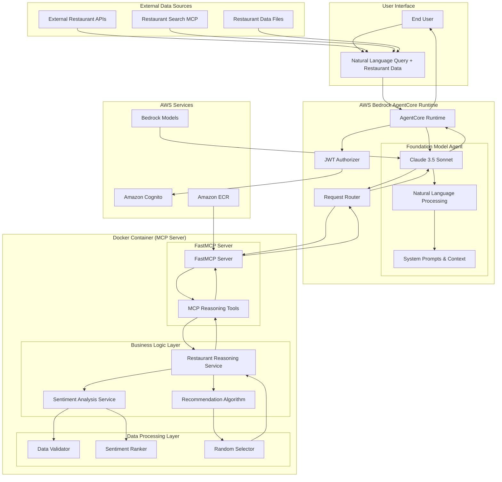

# Design Document

## Overview

The Restaurant Search Result Reasoning MCP application is a specialized AI system that provides intelligent restaurant recommendations based on sentiment analysis. Unlike traditional search systems, this application focuses on analyzing existing restaurant data to identify top candidates and provide data-driven recommendations using customer sentiment metrics.

The system consists of two main components: an MCP server that provides sentiment-based restaurant reasoning tools, and an AgentCore-hosted foundation model that processes natural language queries and converts them to MCP tool calls. The application takes restaurant data as input (typically from external search services) and applies algorithmic analysis to rank restaurants by sentiment scores and provide personalized recommendations.

The system follows a layered architecture with clear separation between natural language processing (foundation model), MCP protocol handling, sentiment analysis logic, and AWS services integration. It focuses on processing and reasoning about restaurant data rather than retrieving it from external sources.

## Architecture

### High-Level Architecture



### Component Architecture

The application follows the Bedrock AgentCore conversational AI pattern with these key components:

#### Foundation Model Layer
1. **AgentCore Foundation Model**: Claude 3.5 Sonnet configured for restaurant reasoning tasks
2. **Natural Language Processor**: Interprets user queries and extracts reasoning parameters
3. **System Prompts**: Context about restaurant sentiment analysis and recommendation logic
4. **Tool Orchestrator**: Manages MCP tool selection and parameter mapping
5. **Response Formatter**: Converts structured reasoning results into conversational responses

#### MCP Server Layer
6. **FastMCP Server**: Uses FastMCP with `stateless_http=True` for AgentCore Runtime compatibility
7. **MCP Reasoning Tools**: Decorated Python functions that become MCP tools via `@mcp.tool()`
8. **Restaurant Reasoning Service**: Core business logic for sentiment analysis and recommendation
9. **Sentiment Analysis Service**: Analyzes restaurant sentiment data and calculates scores
10. **Recommendation Algorithm**: Implements ranking and selection logic

#### Data Processing Layer
11. **Data Validator**: Validates incoming restaurant data structure and completeness
12. **Sentiment Ranker**: Ranks restaurants based on sentiment metrics
13. **Random Selector**: Provides random selection from top candidates

#### Infrastructure Layer
14. **AgentCore Runtime**: Manages foundation model hosting and MCP tool routing
15. **Authentication**: JWT-based authentication via Amazon Cognito integration
16. **Request Router**: Routes natural language queries to appropriate processing components

## Components and Interfaces

### Foundation Model Configuration

The AgentCore foundation model is configured to handle natural language restaurant reasoning queries:

```python
# Foundation model configuration for AgentCore
foundation_model_config = {
    "model_id": "amazon.nova-pro-v1:0",
    "model_parameters": {
        "temperature": 0.1,  # Low temperature for consistent reasoning and tool calling
        "max_tokens": 2048,
        "top_p": 0.9
    },
    "system_prompt": """You are a helpful restaurant recommendation assistant that analyzes 
    restaurant sentiment data to provide intelligent recommendations. You can process lists 
    of restaurants and analyze their customer satisfaction metrics (likes, dislikes, neutral) 
    to identify top candidates and provide personalized recommendations.
    
    You have access to sentiment analysis tools that can:
    - Rank restaurants by highest sentiment likes
    - Rank restaurants by combined likes + neutral percentage
    - Select top candidates based on meal type context:
      * Breakfast: top 20 candidates
      * Lunch: top 10 candidates  
      * Dinner: top 10 candidates
      * General/Unknown: top 10 candidates (default)
    - Randomly recommend 1 restaurant from top candidates
    
    When users provide restaurant data or ask for recommendations, use the appropriate 
    MCP tools to analyze sentiment and provide helpful, data-driven recommendations. 
    Consider meal type context when available to determine appropriate candidate count.""",
    "tool_calling": {
        "enabled": True,
        "auto_invoke": True
    }
}
```

#### Natural Language Processing Pipeline

The foundation model processes queries through these stages:

1. **Intent Recognition**: Identifies restaurant recommendation intent from natural language
2. **Data Extraction**: Extracts restaurant data from user input or external sources
3. **Parameter Extraction**: Extracts ranking preferences and recommendation criteria
4. **Tool Selection**: Chooses appropriate MCP reasoning tool
5. **Parameter Validation**: Validates restaurant data structure and completeness
6. **Tool Invocation**: Calls MCP tools with properly formatted restaurant data
7. **Response Generation**: Formats reasoning results into conversational responses

#### Query Processing Examples

```python
# Example query processing flows
query_examples = {
    "recommend from this list": {
        "intent": "restaurant_recommendation",
        "extracted_data": "restaurant_json_list",
        "tool_call": "recommend_restaurants",
        "parameters": {
            "restaurants": "parsed_restaurant_list",
            "ranking_method": "sentiment_likes"
        }
    },
    "find best restaurants by customer satisfaction": {
        "intent": "sentiment_analysis",
        "ranking_preference": "combined_sentiment",
        "tool_call": "recommend_restaurants", 
        "parameters": {
            "restaurants": "restaurant_data",
            "ranking_method": "combined_sentiment"
        }
    },
    "analyze these restaurants and pick one": {
        "intent": "recommendation_with_analysis",
        "tool_call": "recommend_restaurants",
        "parameters": {
            "restaurants": "restaurant_list",
            "ranking_method": "sentiment_likes"
        }
    }
}
```

### FastMCP Server Implementation

The application uses FastMCP with the following configuration:

```python
from mcp.server.fastmcp import FastMCP

# Create MCP server with AgentCore Runtime compatibility
mcp = FastMCP(host="0.0.0.0", stateless_http=True)

# MCP reasoning tools are defined using decorators
@mcp.tool()
def recommend_restaurants(
    restaurants: list[dict], 
    ranking_method: str = "sentiment_likes",
    meal_type: str = None
) -> str:
    """
    Analyze restaurant sentiment data and provide intelligent recommendations.
    
    Args:
        restaurants: List of restaurant objects with sentiment data
        ranking_method: Ranking method ("sentiment_likes" or "combined_sentiment")
        meal_type: Optional meal type context ("breakfast", "lunch", "dinner")
        
    Returns:
        JSON string containing candidate list and single recommendation
    """
    # Implementation with meal type-aware candidate selection
    
@mcp.tool()
def analyze_restaurant_sentiment(restaurants: list[dict]) -> str:
    """
    Analyze sentiment data for a list of restaurants without recommendation.
    
    Args:
        restaurants: List of restaurant objects with sentiment data
        
    Returns:
        JSON string containing sentiment analysis results
    """
    # Implementation here

if __name__ == "__main__":
    mcp.run(transport="streamable-http")
```

### MCP Tools Interface

The application exposes the following MCP tools with automatic schema generation:

#### recommend_restaurants
- **Parameters**: 
  - `restaurants: list[dict]` - List of restaurant objects with sentiment data
  - `ranking_method: str = "sentiment_likes"` - Ranking method ("sentiment_likes" or "combined_sentiment")
  - `meal_type: str = None` - Optional meal type context ("breakfast", "lunch", "dinner") for candidate count determination
- **Returns**: JSON string containing candidate list (10-20 based on meal type) and single recommendation
- **Description**: Analyze restaurant sentiment data and provide intelligent recommendations with meal type-aware candidate selection

#### analyze_restaurant_sentiment
- **Parameters**: `restaurants: list[dict]` - List of restaurant objects with sentiment data
- **Returns**: JSON string containing sentiment analysis results without recommendation
- **Description**: Analyze sentiment data for restaurants without providing recommendations

### Restaurant Reasoning Service Interface

```python
class RestaurantReasoningService:
    def analyze_and_recommend(self, restaurants: List[dict], ranking_method: str, meal_type: str = None) -> RecommendationResult
    def rank_by_sentiment_likes(self, restaurants: List[Restaurant]) -> List[Restaurant]
    def rank_by_combined_sentiment(self, restaurants: List[Restaurant]) -> List[Restaurant]
    def select_top_candidates(self, ranked_restaurants: List[Restaurant], meal_type: str = None) -> List[Restaurant]
    def determine_candidate_count(self, meal_type: str = None) -> int
    def random_recommendation(self, candidates: List[Restaurant]) -> Restaurant
    def validate_restaurant_data(self, restaurant_data: dict) -> bool
```

### Sentiment Analysis Service Interface

```python
class SentimentAnalysisService:
    def calculate_sentiment_score(self, sentiment: Sentiment) -> float
    def calculate_combined_score(self, sentiment: Sentiment) -> float
    def get_sentiment_percentage(self, sentiment: Sentiment) -> Dict[str, float]
    def rank_restaurants_by_score(self, restaurants: List[Restaurant], score_method: str) -> List[Restaurant]
    def validate_sentiment_data(self, sentiment: dict) -> bool
```

### Data Validator Interface

```python
class RestaurantDataValidator:
    def validate_restaurant_structure(self, restaurant: dict) -> ValidationResult
    def validate_sentiment_structure(self, sentiment: dict) -> ValidationResult
    def validate_required_fields(self, restaurant: dict) -> List[str]
    def sanitize_restaurant_data(self, restaurant: dict) -> dict
    def get_validation_errors(self, restaurants: List[dict]) -> List[ValidationError]
```

### Recommendation Algorithm Interface

```python
class RecommendationAlgorithm:
    def __init__(self, random_seed: Optional[int] = None)
    def rank_by_likes(self, restaurants: List[Restaurant]) -> List[Restaurant]
    def rank_by_combined_sentiment(self, restaurants: List[Restaurant]) -> List[Restaurant]
    def select_candidates(self, ranked_restaurants: List[Restaurant], meal_type: str = None) -> List[Restaurant]
    def determine_candidate_count(self, meal_type: str = None) -> int
    def random_select(self, candidates: List[Restaurant]) -> Restaurant
    def calculate_ranking_scores(self, restaurants: List[Restaurant], method: str) -> Dict[str, float]
```

## Data Models

### Restaurant Data Models

```python
@dataclass
class Sentiment:
    likes: int
    dislikes: int
    neutral: int
    
    def total_responses(self) -> int:
        return self.likes + self.dislikes + self.neutral
    
    def likes_percentage(self) -> float:
        total = self.total_responses()
        return (self.likes / total * 100) if total > 0 else 0.0
    
    def combined_positive_percentage(self) -> float:
        total = self.total_responses()
        return ((self.likes + self.neutral) / total * 100) if total > 0 else 0.0

@dataclass
class Restaurant:
    id: str
    name: str
    address: str
    meal_type: List[str]
    sentiment: Sentiment
    location_category: str
    district: str
    price_range: str
    operating_hours: Optional[dict] = None
    metadata: Optional[dict] = None
    
    def sentiment_score(self) -> float:
        """Calculate sentiment score for ranking"""
        return self.sentiment.likes_percentage()
    
    def combined_sentiment_score(self) -> float:
        """Calculate combined sentiment score for ranking"""
        return self.sentiment.combined_positive_percentage()

@dataclass
class RecommendationResult:
    candidates: List[Restaurant]
    recommendation: Restaurant
    ranking_method: str
    analysis_summary: Dict[str, Any]
    meal_type: Optional[str] = None
    
    def to_dict(self) -> dict:
        return {
            "candidates": [asdict(r) for r in self.candidates],
            "recommendation": asdict(self.recommendation),
            "ranking_method": self.ranking_method,
            "analysis_summary": self.analysis_summary,
            "meal_type": self.meal_type,
            "candidate_count": len(self.candidates)
        }

@dataclass
class SentimentAnalysis:
    restaurant_count: int
    average_likes: float
    average_dislikes: float
    average_neutral: float
    top_sentiment_score: float
    bottom_sentiment_score: float
    ranking_method: str
    
@dataclass
class ValidationResult:
    is_valid: bool
    errors: List[str]
    warnings: List[str]
    
@dataclass
class ValidationError:
    restaurant_id: str
    field: str
    error_type: str
    message: str
```

### Configuration Data Models

```python
@dataclass
class ReasoningConfig:
    default_ranking_method: str = "sentiment_likes"
    candidate_count: int = 20
    minimum_sentiment_responses: int = 1
    enable_random_seed: bool = False
    random_seed: Optional[int] = None

@dataclass
class MCPServerConfig:
    host: str = "0.0.0.0"
    port: int = 8080
    stateless_http: bool = True
    enable_cors: bool = True
    max_request_size: int = 10485760  # 10MB
```

### Authentication Data Models

```python
@dataclass
class CognitoConfig:
    user_pool_id: str
    client_id: str
    region: str
    discovery_url: str
    jwks_url: str
    issuer_url: str

@dataclass
class JWTClaims:
    user_id: str
    username: str
    email: str
    client_id: str
    token_use: str
    exp: int
    iat: int
    iss: str
    aud: str

@dataclass
class AuthenticationTokens:
    id_token: str
    access_token: str
    refresh_token: str
    expires_in: int
    token_type: str = "Bearer"

@dataclass
class UserContext:
    user_id: str
    username: str
    email: str
    authenticated: bool
    token_claims: JWTClaims
    session_id: Optional[str] = None
```

## BedrockAgentCoreApp EntryPoint Integration

### EntryPoint Architecture

The system implements a BedrockAgentCoreApp entrypoint that serves as the primary interface for receiving and processing user requests:

```python
from bedrock_agentcore import BedrockAgentCoreApp
from strands import Agent

app = BedrockAgentCoreApp()

@app.entrypoint
async def restaurant_reasoning_entrypoint(payload: dict) -> str:
    """
    Main entrypoint for restaurant reasoning requests.
    
    Processes natural language queries and orchestrates MCP tool calls
    for sentiment analysis and restaurant recommendations.
    """
    # Extract user prompt from payload
    user_prompt = payload.get("input", {}).get("prompt", "")
    
    # Initialize Strands Agent with reasoning tools
    agent = Agent(
        model="claude-3-5-sonnet",
        tools=[
            "recommend_restaurants",
            "analyze_restaurant_sentiment"
        ],
        system_prompt=get_reasoning_system_prompt()
    )
    
    # Process request through agent
    try:
        response = await agent.process(user_prompt)
        return format_conversational_response(response)
    except Exception as e:
        return handle_entrypoint_error(e, user_prompt)
```

### Payload Processing Pipeline

The entrypoint processes requests through these stages:

1. **Payload Validation**: Validates incoming request structure
2. **Prompt Extraction**: Extracts user message from nested payload structure
3. **Context Analysis**: Analyzes prompt for restaurant data and intent
4. **Agent Orchestration**: Routes request to appropriate Strands Agent
5. **Tool Selection**: Agent selects appropriate MCP tools based on intent
6. **Response Generation**: Formats tool results into conversational response
7. **Error Handling**: Provides fallback responses for failures

### Strands Agent Configuration

```python
def configure_reasoning_agent():
    """Configure Strands Agent for restaurant reasoning tasks."""
    return Agent(
        model="claude-3-5-sonnet",
        model_parameters={
            "temperature": 0.1,
            "max_tokens": 2048,
            "top_p": 0.9
        },
        tools=[
            {
                "name": "recommend_restaurants",
                "description": "Analyze restaurant sentiment data and provide intelligent recommendations",
                "parameters": {
                    "restaurants": {"type": "array", "description": "List of restaurant objects with sentiment data"},
                    "ranking_method": {"type": "string", "enum": ["sentiment_likes", "combined_sentiment"]},
                    "meal_type": {"type": "string", "enum": ["breakfast", "lunch", "dinner"], "required": False}
                }
            },
            {
                "name": "analyze_restaurant_sentiment",
                "description": "Analyze sentiment data without providing recommendations",
                "parameters": {
                    "restaurants": {"type": "array", "description": "List of restaurant objects with sentiment data"}
                }
            }
        ],
        system_prompt="""You are a restaurant recommendation expert that analyzes sentiment data 
        to provide intelligent recommendations. When users provide restaurant data or ask for 
        recommendations, use the appropriate tools to analyze sentiment and provide helpful, 
        data-driven recommendations. Consider meal type context when determining candidate counts."""
    )
```

### Error Handling and Fallbacks

```python
def handle_entrypoint_error(error: Exception, user_prompt: str) -> str:
    """Handle errors in entrypoint processing with appropriate fallbacks."""
    
    error_responses = {
        "ValidationError": "I couldn't process the restaurant data you provided. Please ensure it includes sentiment information (likes, dislikes, neutral) for each restaurant.",
        "ToolExecutionError": "I encountered an issue while analyzing the restaurants. Please try again or provide different restaurant data.",
        "AuthenticationError": "Authentication failed. Please check your credentials and try again.",
        "TimeoutError": "The request took too long to process. Please try again with a smaller dataset."
    }
    
    error_type = type(error).__name__
    fallback_message = error_responses.get(error_type, 
        "I encountered an unexpected issue while processing your request. Please try again.")
    
    return json.dumps({
        "response": fallback_message,
        "error": True,
        "error_type": error_type,
        "suggestions": get_error_suggestions(error_type)
    })
```

## Sentiment Analysis and Recommendation Logic

### Meal Type-Aware Candidate Selection

The system implements meal type-aware candidate selection based on the requirements:

```python
def determine_candidate_count(meal_type: str = None) -> int:
    """
    Determine candidate count based on meal type context.
    
    Args:
        meal_type: Optional meal type ("breakfast", "lunch", "dinner")
        
    Returns:
        Number of candidates to select:
        - Breakfast: 20 candidates
        - Lunch: 10 candidates
        - Dinner: 10 candidates
        - General/Unknown: 10 candidates (default)
    """
    meal_type_candidates = {
        "breakfast": 20,
        "lunch": 10,
        "dinner": 10
    }
    
    return meal_type_candidates.get(meal_type.lower() if meal_type else None, 10)
```

### Ranking Algorithms

#### Sentiment Likes Ranking
```python
def rank_by_sentiment_likes(restaurants: List[Restaurant]) -> List[Restaurant]:
    """
    Rank restaurants by highest sentiment likes count
    
    Algorithm:
    1. Sort restaurants by sentiment.likes in descending order
    2. Handle ties by secondary sort on total responses
    3. Return ranked list
    """
    return sorted(
        restaurants,
        key=lambda r: (r.sentiment.likes, r.sentiment.total_responses()),
        reverse=True
    )
```

#### Combined Sentiment Ranking
```python
def rank_by_combined_sentiment(restaurants: List[Restaurant]) -> List[Restaurant]:
    """
    Rank restaurants by combined likes + neutral percentage
    
    Algorithm:
    1. Calculate (likes + neutral) / total_responses for each restaurant
    2. Sort by percentage in descending order
    3. Handle ties by secondary sort on absolute likes count
    4. Return ranked list
    """
    def combined_score(restaurant: Restaurant) -> float:
        sentiment = restaurant.sentiment
        total = sentiment.total_responses()
        if total == 0:
            return 0.0
        return (sentiment.likes + sentiment.neutral) / total
    
    return sorted(
        restaurants,
        key=lambda r: (combined_score(r), r.sentiment.likes),
        reverse=True
    )
```

#### Candidate Selection and Recommendation
```python
def select_top_candidates_and_recommend(
    ranked_restaurants: List[Restaurant], 
    meal_type: str = None,
    ranking_method: str = "sentiment_likes"
) -> RecommendationResult:
    """
    Select top candidates and randomly recommend one with meal type awareness
    
    Algorithm:
    1. Determine candidate count based on meal type:
       - Breakfast: 20 candidates
       - Lunch: 10 candidates
       - Dinner: 10 candidates
       - General/Unknown: 10 candidates (default)
    2. Take top N restaurants from ranked list
    3. If fewer than N restaurants available, use all
    4. Randomly select 1 restaurant from candidates
    5. Return both candidate list and recommendation
    """
    candidate_count = determine_candidate_count(meal_type)
    candidates = ranked_restaurants[:candidate_count]
    
    if not candidates:
        raise ValueError("No valid candidates available")
    
    # Random selection from top candidates
    recommendation = random.choice(candidates)
    
    return RecommendationResult(
        candidates=candidates,
        recommendation=recommendation,
        ranking_method=ranking_method,
        meal_type=meal_type,
        analysis_summary=generate_analysis_summary(candidates, meal_type)
    )

def determine_candidate_count(meal_type: str = None) -> int:
    """
    Determine candidate count based on meal type context.
    
    Args:
        meal_type: Optional meal type ("breakfast", "lunch", "dinner")
        
    Returns:
        Number of candidates to select based on meal type requirements
    """
    if not meal_type:
        return 10  # Default for general recommendations
    
    meal_type_candidates = {
        "breakfast": 20,
        "lunch": 10,
        "dinner": 10
    }
    
    return meal_type_candidates.get(meal_type.lower(), 10)
```

### Meal Type Context Analysis

The system analyzes user queries and restaurant data to determine meal type context for optimal candidate selection:

```python
def extract_meal_type_context(user_query: str, restaurant_data: List[dict]) -> Optional[str]:
    """
    Extract meal type context from user query or restaurant data.
    
    Args:
        user_query: Natural language query from user
        restaurant_data: List of restaurant objects
        
    Returns:
        Detected meal type ("breakfast", "lunch", "dinner") or None
    """
    # Query-based meal type detection
    meal_keywords = {
        "breakfast": ["breakfast", "morning", "brunch", "early", "am"],
        "lunch": ["lunch", "noon", "midday", "afternoon", "pm"],
        "dinner": ["dinner", "evening", "night", "late", "supper"]
    }
    
    query_lower = user_query.lower()
    
    for meal_type, keywords in meal_keywords.items():
        if any(keyword in query_lower for keyword in keywords):
            return meal_type
    
    # Restaurant data-based meal type detection
    meal_type_from_data = analyze_restaurant_meal_types(restaurant_data)
    if meal_type_from_data:
        return meal_type_from_data
    
    return None  # Default to general recommendations

def analyze_restaurant_meal_types(restaurant_data: List[dict]) -> Optional[str]:
    """
    Analyze restaurant operating hours to determine predominant meal type.
    
    Args:
        restaurant_data: List of restaurant objects with operating hours
        
    Returns:
        Predominant meal type or None
    """
    meal_type_counts = {"breakfast": 0, "lunch": 0, "dinner": 0}
    
    for restaurant in restaurant_data:
        operating_hours = restaurant.get("operatingHours", {})
        if not operating_hours:
            continue
            
        # Analyze time ranges to determine meal types served
        for period, times in operating_hours.items():
            if not times:
                continue
                
            for time_range in times:
                meal_types = classify_time_range(time_range)
                for meal_type in meal_types:
                    meal_type_counts[meal_type] += 1
    
    # Return predominant meal type if clear majority
    max_count = max(meal_type_counts.values())
    if max_count > 0:
        predominant_types = [mt for mt, count in meal_type_counts.items() if count == max_count]
        if len(predominant_types) == 1:
            return predominant_types[0]
    
    return None

def classify_time_range(time_range: str) -> List[str]:
    """
    Classify a time range into meal types.
    
    Args:
        time_range: Time range string (e.g., "07:00-11:30")
        
    Returns:
        List of meal types that this time range covers
    """
    try:
        start_time, end_time = time_range.split("-")
        start_hour = int(start_time.split(":")[0])
        end_hour = int(end_time.split(":")[0])
        
        meal_types = []
        
        # Breakfast: 07:00-11:29
        if start_hour <= 11 and end_hour >= 7:
            meal_types.append("breakfast")
        
        # Lunch: 11:30-17:29  
        if start_hour <= 17 and end_hour >= 11:
            meal_types.append("lunch")
        
        # Dinner: 17:30-22:30
        if start_hour <= 22 and end_hour >= 17:
            meal_types.append("dinner")
        
        return meal_types
        
    except (ValueError, IndexError):
        return []  # Invalid time format
```

### Data Validation Logic

#### Restaurant Data Validation
```python
def validate_restaurant_data(restaurant: dict) -> ValidationResult:
    """
    Validate restaurant data structure and required fields
    
    Required fields:
    - id: string identifier
    - name: restaurant name
    - sentiment: object with likes, dislikes, neutral (integers)
    
    Optional fields:
    - address, meal_type, location_category, district, price_range, etc.
    """
    errors = []
    warnings = []
    
    # Check required fields
    required_fields = ['id', 'name', 'sentiment']
    for field in required_fields:
        if field not in restaurant:
            errors.append(f"Missing required field: {field}")
    
    # Validate sentiment structure
    if 'sentiment' in restaurant:
        sentiment = restaurant['sentiment']
        sentiment_fields = ['likes', 'dislikes', 'neutral']
        for field in sentiment_fields:
            if field not in sentiment:
                errors.append(f"Missing sentiment field: {field}")
            elif not isinstance(sentiment[field], int) or sentiment[field] < 0:
                errors.append(f"Invalid sentiment {field}: must be non-negative integer")
    
    # Check for empty sentiment data
    if 'sentiment' in restaurant:
        sentiment = restaurant['sentiment']
        total_responses = sum(sentiment.get(f, 0) for f in ['likes', 'dislikes', 'neutral'])
        if total_responses == 0:
            warnings.append("Restaurant has no sentiment responses")
    
    return ValidationResult(
        is_valid=len(errors) == 0,
        errors=errors,
        warnings=warnings
    )
```

### Response Formatting and User Experience

#### Conversational Response Generation
```python
def format_recommendation_response(result: RecommendationResult, meal_type: str = None) -> str:
    """
    Format recommendation results into conversational, user-friendly response
    """
    candidates_count = len(result.candidates)
    recommendation = result.recommendation
    
    # Generate response based on ranking method
    if result.ranking_method == "sentiment_likes":
        ranking_desc = "highest customer likes"
    else:
        ranking_desc = "best combined customer satisfaction (likes + neutral)"
    
    # Add meal type context if available
    meal_context = ""
    if meal_type:
        meal_context = f" for {meal_type}"
        candidate_explanation = f"Based on {meal_type} preferences, I selected {candidates_count} top candidates"
    else:
        candidate_explanation = f"I analyzed the restaurant data and found {candidates_count} top candidates"
    
    response = f"""{candidate_explanation}{meal_context} based on {ranking_desc}.

**🎯 My Recommendation:**
🍽️ **{recommendation.name}**
📍 {format_address(recommendation)}
👍 Customer Sentiment: {recommendation.sentiment.likes} likes, {recommendation.sentiment.dislikes} dislikes, {recommendation.sentiment.neutral} neutral
💰 Price Range: {format_price_range(recommendation)}
🕒 Operating Hours: {format_operating_hours(recommendation)}

**📊 Top {candidates_count} Candidates{meal_context}:**"""
    
    # Show top candidates with detailed information
    for i, candidate in enumerate(result.candidates[:5], 1):
        sentiment_score = calculate_display_score(candidate, result.ranking_method)
        response += f"\n{i}. **{candidate.name}** - {sentiment_score} | {format_district(candidate)}"
    
    if candidates_count > 5:
        response += f"\n... and {candidates_count - 5} more restaurants"
    
    # Add helpful suggestions
    response += generate_helpful_suggestions(result, meal_type)
    
    return response

def format_address(restaurant: Restaurant) -> str:
    """Format restaurant address in user-friendly way."""
    if hasattr(restaurant, 'address') and restaurant.address:
        return restaurant.address
    elif hasattr(restaurant, 'district') and restaurant.district:
        return f"Located in {restaurant.district}"
    else:
        return "Address not available"

def format_price_range(restaurant: Restaurant) -> str:
    """Format price range with appropriate symbols."""
    price_range = getattr(restaurant, 'price_range', None)
    if not price_range:
        return "Price range not specified"
    
    price_symbols = {
        "budget": "💰 Budget-friendly",
        "moderate": "💰💰 Moderate",
        "expensive": "💰💰💰 Premium",
        "luxury": "💰💰💰💰 Luxury"
    }
    
    return price_symbols.get(price_range.lower(), f"💰 {price_range}")

def format_operating_hours(restaurant: Restaurant) -> str:
    """Format operating hours in user-friendly format."""
    if not hasattr(restaurant, 'operating_hours') or not restaurant.operating_hours:
        return "Hours not available"
    
    hours = restaurant.operating_hours
    formatted_hours = []
    
    for period, times in hours.items():
        if times and len(times) > 0:
            time_ranges = ", ".join(times)
            formatted_hours.append(f"{period}: {time_ranges}")
    
    return " | ".join(formatted_hours) if formatted_hours else "Hours not available"

def calculate_display_score(restaurant: Restaurant, ranking_method: str) -> str:
    """Calculate and format display score for restaurant."""
    if ranking_method == "sentiment_likes":
        return f"{restaurant.sentiment.likes} likes"
    else:
        total = restaurant.sentiment.total_responses()
        if total > 0:
            combined_score = ((restaurant.sentiment.likes + restaurant.sentiment.neutral) / total) * 100
            return f"{combined_score:.1f}% positive"
        return "No sentiment data"

def format_district(restaurant: Restaurant) -> str:
    """Format district information."""
    district = getattr(restaurant, 'district', None)
    return district if district else "Location not specified"

def generate_helpful_suggestions(result: RecommendationResult, meal_type: str = None) -> str:
    """Generate helpful suggestions based on results."""
    suggestions = [
        "\n\n💡 **What would you like to do next?**",
        "• Ask me to analyze with different criteria (sentiment_likes vs combined_sentiment)",
        "• Request more details about any specific restaurant",
        "• Provide a different restaurant list for analysis"
    ]
    
    if meal_type:
        suggestions.append(f"• Try analyzing for a different meal type (currently: {meal_type})")
    else:
        suggestions.append("• Specify a meal type (breakfast, lunch, dinner) for optimized recommendations")
    
    return "\n".join(suggestions)
```

#### Error Response Formatting

```python
def format_error_response(error_type: str, details: dict = None) -> str:
    """Format error responses in user-friendly manner."""
    
    error_messages = {
        "no_restaurants": """I didn't find any restaurants to analyze. Please provide a list of restaurants with sentiment data (likes, dislikes, neutral counts) and I'll help you find the best recommendations.""",
        
        "invalid_data": """I found some issues with the restaurant data:
{error_details}

Please ensure each restaurant includes:
• Restaurant name and ID
• Sentiment data with likes, dislikes, and neutral counts
• Optional: address, district, price range, operating hours""",
        
        "no_valid_sentiment": """None of the restaurants have valid sentiment data. Each restaurant needs:
• likes: number of positive reviews
• dislikes: number of negative reviews  
• neutral: number of neutral reviews

Please check your data and try again.""",
        
        "system_error": """I'm having trouble processing the restaurant data right now. This might be a temporary issue.

**What you can try:**
• Wait a moment and try again
• Check if your restaurant data is properly formatted
• Contact support if the issue persists"""
    }
    
    message = error_messages.get(error_type, error_messages["system_error"])
    
    if details and error_type == "invalid_data":
        error_details = format_validation_errors(details)
        message = message.format(error_details=error_details)
    
    return message

def format_validation_errors(details: dict) -> str:
    """Format validation error details for user display."""
    errors = []
    
    if "missing_fields" in details:
        errors.append(f"• Missing required fields: {', '.join(details['missing_fields'])}")
    
    if "invalid_sentiment" in details:
        errors.append(f"• Invalid sentiment data in {details['invalid_sentiment']} restaurants")
    
    if "empty_sentiment" in details:
        errors.append(f"• {details['empty_sentiment']} restaurants have no sentiment responses")
    
    return "\n".join(errors)
```

## Error Handling

### Error Types and Responses

1. **Data Validation Errors**
   - Missing required fields (id, name, sentiment)
   - Invalid sentiment data structure
   - Non-integer sentiment values
   - Empty restaurant list

2. **Sentiment Analysis Errors**
   - Zero total sentiment responses
   - Negative sentiment values
   - Invalid ranking method specified
   - Calculation overflow errors

3. **Recommendation Errors**
   - No valid candidates after filtering
   - Random selection failures
   - Invalid candidate count parameters

4. **MCP Protocol Errors**
   - Invalid tool parameters
   - JSON serialization errors
   - Tool execution timeouts
   - Response size limits exceeded

5. **Foundation Model Errors**
   - Model invocation failures
   - Tool calling parameter errors
   - Response generation timeouts
   - Context window exceeded

6. **Authentication Errors**
   - Invalid JWT tokens
   - Expired authentication
   - Missing authorization headers
   - Cognito service unavailable

### Error Response Format

#### MCP Tool Error Format (Internal)
```python
{
    "error": {
        "type": "ValidationError",
        "message": "Invalid restaurant data structure",
        "details": {
            "invalid_restaurants": [
                {
                    "index": 0,
                    "errors": ["Missing required field: sentiment"],
                    "warnings": ["Address field not provided"]
                }
            ],
            "valid_count": 15,
            "total_count": 16
        }
    }
}
```

#### Conversational Error Format (User-Facing)
```python
conversational_errors = {
    "invalid_data": "I found some issues with the restaurant data you provided. {error_count} restaurants are missing required information like sentiment data. Could you check the data format and try again?",
    
    "no_valid_restaurants": "I couldn't find any restaurants with valid sentiment data to analyze. Please make sure each restaurant has 'likes', 'dislikes', and 'neutral' sentiment counts.",
    
    "empty_list": "You didn't provide any restaurant data to analyze. Please share a list of restaurants with sentiment information and I'll help you find the best recommendations.",
    
    "system_error": "I'm having trouble processing the restaurant data right now. Please try again in a moment, or let me know if you'd like help with something else."
}
```

## Testing Strategy

### Unit Testing
- Test sentiment analysis algorithms with various data sets
- Test ranking methods (sentiment_likes vs combined_sentiment)
- Test data validation with valid and invalid restaurant data
- Test random selection reproducibility with seeds
- Test edge cases (empty lists, zero sentiment responses)
- Test error handling and validation logic

### Integration Testing
- Test MCP tool registration and execution
- Test end-to-end recommendation workflows
- Test AgentCore Runtime integration
- Test foundation model tool calling
- Test authentication flow integration
- Test response formatting and serialization

### Algorithm Testing
- Test ranking consistency with different data sets
- Test tie-breaking logic in ranking algorithms
- Test candidate selection with various list sizes
- Test random recommendation distribution
- Test sentiment score calculations
- Test percentage calculations for combined sentiment

### Conversational Testing
- Test natural language query understanding for recommendation requests
- Test response formatting and readability
- Test error message clarity and helpfulness
- Test multi-turn conversation flows
- Test handling of malformed restaurant data in conversations

### Performance Testing
- Test processing time with large restaurant lists (1000+ restaurants)
- Test memory usage with complex restaurant data structures
- Test concurrent recommendation requests
- Test MCP server response times
- Test foundation model response times

### Data Quality Testing
- Test with real restaurant data from various sources
- Test with edge cases (restaurants with zero sentiment)
- Test with malformed JSON data
- Test with missing optional fields
- Test with extreme sentiment values

### User Experience Testing
- Test recommendation quality and relevance
- Test explanation clarity for ranking methods
- Test error message helpfulness
- Test conversation flow naturalness
- Test response completeness and accuracy

## Deployment and Configuration

### Platform Architecture Requirements

**Critical Requirement**: Amazon Bedrock AgentCore Runtime requires `linux/arm64` architecture containers.

#### Architecture Compatibility
- **Development Environment**: Can be x86/AMD64 (Windows, macOS, Linux)
- **Runtime Environment**: Must be `linux/arm64` (managed by AgentCore Runtime)
- **Build Process**: AWS CodeBuild automatically handles cross-platform building

### Bedrock AgentCore Runtime Deployment

The application follows the Bedrock AgentCore Runtime deployment pattern:

#### Using Bedrock AgentCore Starter Toolkit

```python
from bedrock_agentcore_starter_toolkit import Runtime
from boto3.session import Session

# Initialize runtime
agentcore_runtime = Runtime()

# Configure with authentication
auth_config = {
    "customJWTAuthorizer": {
        "allowedClients": [cognito_client_id],
        "discoveryUrl": cognito_discovery_url,
    }
}

# Configure MCP server deployment
mcp_server_config = agentcore_runtime.configure(
    entrypoint="restaurant_reasoning_mcp_server.py",
    auto_create_execution_role=True,
    auto_create_ecr=True,
    requirements_file="requirements.txt",
    region=region,
    authorizer_configuration=auth_config,
    protocol="MCP",
    agent_name="restaurant_reasoning_mcp"
)

# Launch MCP server to AgentCore Runtime
mcp_launch_result = agentcore_runtime.launch()

# Configure foundation model agent
foundation_model_config = {
    "model_id": "amazon.nova-pro-v1:0",
    "model_parameters": {
        "temperature": 0.1,
        "max_tokens": 2048,
        "top_p": 0.9
    },
    "system_prompt": """You are a helpful restaurant recommendation assistant...""",
    "mcp_server_arn": mcp_launch_result.agent_arn,
    "tool_calling": {"enabled": True, "auto_invoke": True}
}

# Deploy complete conversational agent
agent_config = agentcore_runtime.configure_agent(
    agent_name="restaurant_reasoning_conversational_agent",
    foundation_model_config=foundation_model_config,
    authorizer_configuration=auth_config
)

# Launch conversational agent
agent_launch_result = agentcore_runtime.launch_agent()
```

### Docker Configuration

```dockerfile
# REQUIRED: ARM64 platform for Amazon Bedrock AgentCore Runtime
FROM --platform=linux/arm64 ghcr.io/astral-sh/uv:python3.12-bookworm-slim

WORKDIR /app

# Configure UV for container environment
ENV UV_SYSTEM_PYTHON=1 UV_COMPILE_BYTECODE=1

# Install dependencies
COPY requirements.txt requirements.txt
RUN uv pip install -r requirements.txt

# Set AWS region environment variables
ENV AWS_REGION=us-east-1
ENV AWS_DEFAULT_REGION=us-east-1
ENV DOCKER_CONTAINER=1

# Create non-root user for security
RUN useradd -m -u 1000 bedrock_agentcore
USER bedrock_agentcore

# Expose MCP server port
EXPOSE 8080

# Copy application code
COPY . .

# Start MCP reasoning server
CMD ["python", "-m", "restaurant_reasoning_mcp_server"]
```

### Requirements.txt

```txt
mcp>=1.10.0
bedrock-agentcore
bedrock-agentcore-starter-toolkit
pydantic>=2.0.0
```

### Environment Variables

AgentCore Runtime manages these automatically:
- AWS credentials via IAM roles
- Region configuration
- Authentication tokens
- Runtime-specific configurations

### Authentication Configuration

The system implements JWT-based authentication using Amazon Cognito:

```python
# Cognito User Pool configuration
cognito_config = {
    "user_pool_name": "restaurant-reasoning-mcp-users",
    "client_name": "restaurant-reasoning-client",
    "domain_name": "restaurant-reasoning-mcp",
    "supported_identity_providers": ["COGNITO"],
    "oauth_flows": ["authorization_code_grant"],
    "oauth_scopes": ["openid", "profile", "email"]
}

# AgentCore Runtime authentication configuration
auth_config = {
    "customJWTAuthorizer": {
        "allowedClients": [cognito_client_id],
        "discoveryUrl": f"https://cognito-idp.{region}.amazonaws.com/{user_pool_id}/.well-known/openid-configuration"
    }
}
```

### Integration with External Data Sources

The system is designed to integrate with various restaurant data sources:

#### Restaurant Search MCP Integration
```python
# Example integration with restaurant search MCP
async def get_restaurants_and_recommend(district: str, meal_type: str) -> str:
    """
    Integrate with restaurant search MCP to get data, then provide recommendations
    """
    # 1. Call restaurant search MCP to get restaurant list
    search_results = await call_restaurant_search_mcp(
        districts=[district], 
        meal_types=[meal_type]
    )
    
    # 2. Extract restaurant data from search results
    restaurants = parse_search_results(search_results)
    
    # 3. Use reasoning MCP to analyze and recommend
    recommendation_result = await call_reasoning_mcp(
        restaurants=restaurants,
        ranking_method="sentiment_likes"
    )
    
    return recommendation_result
```

#### API Integration Pattern
```python
# Example integration with external restaurant APIs
class ExternalDataIntegration:
    def __init__(self, reasoning_service: RestaurantReasoningService):
        self.reasoning_service = reasoning_service
    
    async def process_external_data(self, api_response: dict) -> RecommendationResult:
        """Process data from external APIs and provide recommendations"""
        # Parse external API response
        restaurants = self.parse_api_response(api_response)
        
        # Validate and clean data
        valid_restaurants = self.validate_and_clean(restaurants)
        
        # Apply reasoning and recommendation
        return self.reasoning_service.analyze_and_recommend(
            valid_restaurants, 
            ranking_method="combined_sentiment"
        )
```

This design provides a comprehensive foundation for building the restaurant search result reasoning MCP application with focus on sentiment analysis, intelligent recommendations, and seamless integration with AgentCore Runtime.#
# MCP Server Status Check System

### Overview

The Restaurant Reasoning MCP server includes a comprehensive status monitoring system that ensures reliable service delivery through continuous health checks, circuit breaker functionality, and detailed metrics tracking. The system uses the same proven architecture as the restaurant-search-mcp server, adapted for reasoning-specific operations.

### Status Check Architecture

```mermaid
graph TB
    subgraph "Status Check System"
        subgraph "Health Check Service"
            HCS[HealthCheckService]
            MCP_REQ[MCP Tools/List Request]
            AUTH[JWT Authentication]
            VALIDATOR[Response Validator]
        end
        
        subgraph "Circuit Breaker System"
            CB[CircuitBreaker]
            SCM[StatusCheckManager]
            METRICS[ServerMetrics]
        end
        
        subgraph "Status API Endpoints"
            HEALTH_EP[/status/health]
            SERVERS_EP[/status/servers]
            METRICS_EP[/status/metrics]
            CONSOLE[Console Integration]
        end
        
        subgraph "Configuration"
            CONFIG[status_check_config.json]
            LOADER[StatusConfigLoader]
        end
    end
    
    subgraph "External Systems"
        GATEWAY[AgentCore Gateway]
        REASONING_MCP[Reasoning MCP Server]
        COGNITO[Cognito Authentication]
        CLOUDWATCH[CloudWatch Metrics]
    end
    
    HCS --> MCP_REQ
    MCP_REQ --> AUTH
    AUTH --> COGNITO
    HCS --> GATEWAY
    GATEWAY --> REASONING_MCP
    REASONING_MCP --> VALIDATOR
    VALIDATOR --> METRICS
    METRICS --> CB
    CB --> SCM
    SCM --> HEALTH_EP
    SCM --> SERVERS_EP
    SCM --> METRICS_EP
    CONSOLE --> SCM
    CONFIG --> LOADER
    LOADER --> HCS
    METRICS --> CLOUDWATCH
```

### MCP Tools/List Status Check Method

The status check system uses the MCP tools/list method as the primary health check mechanism:

#### Request Format
```json
{
    "jsonrpc": "2.0",
    "method": "tools/list",
    "params": {},
    "id": "health-check-{timestamp}"
}
```

#### Expected Response Format
```json
{
    "jsonrpc": "2.0",
    "id": "health-check-{timestamp}",
    "result": {
        "tools": [
            {
                "name": "recommend_restaurants",
                "description": "Analyze restaurant sentiment data and provide intelligent recommendations"
            },
            {
                "name": "analyze_restaurant_sentiment", 
                "description": "Analyze sentiment data for a list of restaurants without providing recommendations"
            }
        ]
    }
}
```

#### Health Check Validation

The system validates several aspects of the MCP response:

1. **JSON-RPC 2.0 Compliance**: Validates jsonrpc version and request ID matching
2. **Response Structure**: Ensures result object contains tools array
3. **Tool Availability**: Verifies expected reasoning tools are present
4. **Tool Schema**: Validates each tool has required name and description fields
5. **Response Timing**: Tracks response times for performance monitoring

### Circuit Breaker Implementation

The circuit breaker system prevents cascading failures and provides automatic recovery:

#### Circuit Breaker States

1. **CLOSED**: Normal operation, all requests allowed
   - Transitions to OPEN when failure threshold is exceeded
   - Default failure threshold: 5 consecutive failures

2. **OPEN**: Circuit breaker tripped, requests blocked
   - Transitions to HALF_OPEN after timeout period
   - Default timeout: 60 seconds

3. **HALF_OPEN**: Testing recovery, limited requests allowed
   - Transitions to CLOSED after recovery threshold successes
   - Transitions to OPEN if any failure occurs
   - Default recovery threshold: 3 consecutive successes

#### Circuit Breaker Configuration

```python
@dataclass
class CircuitBreakerConfig:
    failure_threshold: int = 5      # Failures to open circuit
    recovery_threshold: int = 3     # Successes to close circuit  
    timeout_seconds: int = 60       # Wait time before testing recovery
    half_open_max_calls: int = 3    # Max calls in half-open state
```

### Status Check Manager

The StatusCheckManager coordinates all status monitoring activities:

#### Core Responsibilities

1. **Health Check Orchestration**: Manages continuous health check loops
2. **Metrics Aggregation**: Collects and maintains server metrics
3. **Circuit Breaker Control**: Manages circuit breaker state transitions
4. **Event Logging**: Records status events for audit and debugging
5. **API Integration**: Provides data for status REST endpoints

#### Metrics Tracking

```python
@dataclass
class ServerMetrics:
    server_name: str
    total_requests: int = 0
    successful_requests: int = 0
    failed_requests: int = 0
    average_response_time_ms: float = 0.0
    last_success_time: Optional[datetime] = None
    last_failure_time: Optional[datetime] = None
    uptime_percentage: float = 100.0
    consecutive_failures: int = 0
    consecutive_successes: int = 0
```

### Status Check Endpoints

The system provides REST API endpoints for monitoring and management:

#### GET /status/health
Returns overall system health summary:
```json
{
    "success": true,
    "message": "System health retrieved successfully",
    "data": {
        "timestamp": "2025-10-04T...",
        "total_servers": 1,
        "healthy_servers": 1,
        "unhealthy_servers": 0,
        "overall_health_percentage": 100.0
    },
    "timestamp": "2025-10-04T..."
}
```

#### GET /status/servers
Returns status for all monitored servers:
```json
{
    "success": true,
    "message": "Retrieved status for 1 servers",
    "data": {
        "servers": [
            {
                "server_name": "restaurant-search-result-reasoning-mcp",
                "status": "healthy",
                "circuit_breaker_state": "closed",
                "last_check_time": "2025-10-04T...",
                "consecutive_failures": 0,
                "response_time_ms": 45.2,
                "tools_available": 2
            }
        ]
    },
    "timestamp": "2025-10-04T..."
}
```

#### GET /status/servers/{server_name}
Returns detailed status for a specific server with full metrics.

#### GET /status/metrics
Returns comprehensive system metrics including aggregate statistics and circuit breaker states.

#### POST /status/health-check
Triggers manual health check for specified servers.

#### POST /status/circuit-breaker
Controls circuit breaker states (open, close, reset).

### Console Integration

The StatusConsoleIntegration class provides dashboard-ready data:

#### Dashboard Data Structure
```json
{
    "timestamp": "2025-10-04T...",
    "system_health": { /* system health summary */ },
    "servers": [ /* detailed server information */ ],
    "alerts": [ /* active alerts and warnings */ ],
    "recent_events": [ /* recent status events */ ]
}
```

#### Alert Types

1. **Circuit Breaker Open**: Critical alert when circuit breaker trips
2. **High Failure Rate**: Warning when failure rate exceeds 50%
3. **Consecutive Failures**: Warning/critical based on failure count
4. **Authentication Errors**: Alert for persistent auth failures
5. **Timeout Issues**: Alert for consistent timeout problems

### Configuration Management

#### Status Check Configuration File

```json
{
    "status_check_system": {
        "enabled": true,
        "global_check_interval_seconds": 30,
        "global_timeout_seconds": 10,
        "max_concurrent_checks": 5
    },
    "servers": {
        "restaurant-search-result-reasoning-mcp": {
            "server_name": "restaurant-search-result-reasoning-mcp",
            "endpoint_url": "https://your-gateway-url/mcp/restaurant-search-result-reasoning-mcp",
            "check_interval_seconds": 30,
            "timeout_seconds": 10,
            "enabled": true,
            "expected_tools": [
                "recommend_restaurants",
                "analyze_restaurant_sentiment"
            ],
            "circuit_breaker": {
                "failure_threshold": 5,
                "recovery_threshold": 3,
                "timeout_seconds": 60
            }
        }
    },
    "authentication": {
        "jwt_token_source": "cognito",
        "cognito_config_file": "config/cognito_config.json"
    }
}
```

### Authentication Integration

The status check system integrates with the existing Cognito authentication:

#### JWT Token Management
1. **Token Retrieval**: Uses existing CognitoAuthenticator service
2. **Token Refresh**: Automatic refresh when tokens near expiration
3. **Error Handling**: Graceful handling of 403 Unauthorized responses
4. **Retry Logic**: Automatic retry with fresh tokens on auth failures

#### Authentication Headers
```python
headers = {
    "Authorization": f"Bearer {jwt_token}",
    "Content-Type": "application/json",
    "User-Agent": "MCP-HealthCheck/1.0"
}
```

### Error Handling and Recovery

#### Error Types and Responses

1. **Connection Errors**: Network connectivity issues
   - Retry with exponential backoff
   - Circuit breaker activation after threshold

2. **Authentication Errors**: JWT token issues
   - Automatic token refresh attempt
   - Alert generation for persistent failures

3. **Timeout Errors**: Request timeout exceeded
   - Configurable timeout values
   - Exponential backoff for retries

4. **MCP Protocol Errors**: Invalid JSON-RPC responses
   - Response validation and error logging
   - Detailed error messages for debugging

5. **Server Errors**: HTTP 5xx responses
   - Circuit breaker activation
   - Error rate tracking and alerting

#### Recovery Strategies

1. **Exponential Backoff**: Increasing delays between retry attempts
2. **Circuit Breaker Recovery**: Automatic testing of failed services
3. **Token Refresh**: Automatic JWT token renewal
4. **Health Check Resumption**: Automatic restart after configuration changes

### Integration with Reasoning MCP Server

The status check system integrates seamlessly with the reasoning MCP server:

#### Server Integration Points

1. **Startup Integration**: Status check service starts with MCP server
2. **Endpoint Registration**: Status endpoints added to FastAPI app
3. **Authentication Sharing**: Uses same JWT validation middleware
4. **Graceful Shutdown**: Proper cleanup of status check resources

#### Background Task Management

```python
# Status check background task
async def start_status_monitoring():
    status_manager = get_status_manager()
    config_loader = get_config_loader()
    
    # Load server configurations
    server_configs = config_loader.get_enabled_servers()
    
    # Start continuous monitoring
    stop_event = asyncio.Event()
    
    async with HealthCheckService() as health_service:
        await health_service.run_continuous_health_checks(
            server_configs,
            status_manager.record_health_check_result,
            stop_event
        )
```

### CloudWatch Integration

The system optionally integrates with AWS CloudWatch for metrics:

#### Metrics Published

1. **Server Health**: Binary health status (0/1)
2. **Response Time**: Average response times in milliseconds
3. **Success Rate**: Percentage of successful health checks
4. **Circuit Breaker State**: Current circuit breaker state
5. **Tool Availability**: Number of tools available

#### CloudWatch Namespace
- Default: `MCP/StatusCheck/ReasoningServer`
- Configurable via status check configuration

### Testing Strategy

#### Unit Tests
- Health check service functionality
- Circuit breaker state transitions
- Metrics calculation accuracy
- Configuration loading and validation

#### Integration Tests
- End-to-end health check workflows
- Authentication integration
- Status endpoint responses
- Circuit breaker recovery scenarios

#### Performance Tests
- Concurrent health check handling
- Response time under load
- Memory usage during continuous monitoring
- Circuit breaker performance impact

This status check system provides comprehensive monitoring capabilities for the restaurant reasoning MCP server, ensuring reliable service delivery and quick issue identification through proven patterns adapted from the restaurant-search-mcp implementation. 
       subgraph "Circuit Breaker System"
            CB[CircuitBreaker]
            CB_STATES[CLOSED/OPEN/HALF_OPEN]
            CB_METRICS[Circuit Breaker Stats]
        end
        
        subgraph "Status Management"
            SM[StatusCheckManager]
            SERVER_METRICS[Server Metrics]
            HEALTH_SUMMARY[System Health Summary]
        end
        
        subgraph "API Endpoints"
            STATUS_API[Status REST API]
            HEALTH_EP[/status/health]
            SERVERS_EP[/status/servers]
            RESET_EP[/status/servers/{name}/circuit-breaker/reset]
        end
    end
    
    subgraph "Reasoning MCP Server"
        REASONING_SERVER[Restaurant Reasoning MCP]
        REASONING_TOOLS[recommend_restaurants, analyze_restaurant_sentiment]
    end
    
    HCS --> MCP_REQ
    MCP_REQ --> AUTH
    AUTH --> REASONING_SERVER
    REASONING_SERVER --> VALIDATOR
    VALIDATOR --> CB
    CB --> CB_STATES
    CB --> CB_METRICS
    CB --> SM
    SM --> SERVER_METRICS
    SM --> HEALTH_SUMMARY
    STATUS_API --> HEALTH_EP
    STATUS_API --> SERVERS_EP
    STATUS_API --> RESET_EP
    SM --> STATUS_API
```

#### Core Components

The status check system uses exactly the same implementation as restaurant-search-mcp:

1. **HealthCheckService**: Performs MCP tools/list requests to validate server connectivity and tool availability
2. **CircuitBreaker**: Prevents cascading failures with configurable failure/recovery thresholds  
3. **StatusCheckManager**: Centralized management of server monitoring with metrics tracking
4. **StatusModels**: Complete data models for health check results, server metrics, and circuit breaker states
5. **StatusEndpoints**: REST API endpoints for real-time status information and management

### MCP Health Check Protocol

The system uses standard MCP JSON-RPC 2.0 `tools/list` requests to validate server health:

```python
# MCP tools/list request structure (exact same as restaurant-search-mcp)
@dataclass
class MCPToolsListRequest:
    jsonrpc: str = "2.0"
    method: str = "tools/list"
    params: Dict[str, Any] = None
    id: str = "health-check"
    
    def to_dict(self) -> Dict[str, Any]:
        request_dict = {
            "jsonrpc": self.jsonrpc,
            "method": self.method,
            "id": self.id
        }
        if self.params:
            request_dict["params"] = self.params
        return request_dict

# Expected successful response validation
@dataclass
class MCPToolsListResponse:
    jsonrpc: str
    id: str
    result: Optional[Dict[str, Any]] = None
    error: Optional[Dict[str, Any]] = None
    
    @property
    def is_success(self) -> bool:
        return self.error is None and self.result is not None
    
    @property
    def tools_count(self) -> Optional[int]:
        if not self.is_success or not self.result:
            return None
        tools = self.result.get("tools", [])
        return len(tools) if isinstance(tools, list) else None
```

### Health Check Service Implementation

The HealthCheckService uses the exact same implementation as restaurant-search-mcp:

```python
class HealthCheckService:
    """Service for performing MCP server health checks using tools/list requests."""
    
    def __init__(self, timeout_seconds: int = 10, max_concurrent_checks: int = 5):
        self.timeout_seconds = timeout_seconds
        self.max_concurrent_checks = max_concurrent_checks
        self.logger = logging.getLogger(__name__)
        self._session: Optional[aiohttp.ClientSession] = None
        self._semaphore = asyncio.Semaphore(max_concurrent_checks)
    
    async def check_server_health(
        self,
        config: MCPStatusCheckConfig,
        request_id: Optional[str] = None
    ) -> HealthCheckResult:
        """Perform health check on a single MCP server."""
        timestamp = datetime.now()
        
        async with self._semaphore:  # Limit concurrent requests
            try:
                # Create MCP request
                mcp_request = self._create_mcp_request(request_id)
                request_data = mcp_request.to_dict()
                
                # Create authentication headers
                headers = self._create_auth_headers(config.jwt_token)
                
                # Perform HTTP request
                success, response_data, error_message, status_code, response_time_ms = await self._perform_http_request(
                    config.endpoint_url,
                    request_data,
                    headers,
                    config.timeout_seconds
                )
                
                if not success:
                    return HealthCheckResult(
                        server_name=config.server_name,
                        timestamp=timestamp,
                        success=False,
                        response_time_ms=response_time_ms,
                        status_code=status_code,
                        error_message=error_message
                    )
                
                # Validate MCP response
                is_valid, validation_error, tools_count = self._validate_mcp_response(
                    response_data,
                    mcp_request.id
                )
                
                if not is_valid:
                    return HealthCheckResult(
                        server_name=config.server_name,
                        timestamp=timestamp,
                        success=False,
                        response_time_ms=response_time_ms,
                        status_code=status_code,
                        error_message=validation_error
                    )
                
                # Success - validate expected tools for reasoning server
                expected_tools = ["recommend_restaurants", "analyze_restaurant_sentiment"]
                if tools_count is not None and tools_count >= len(expected_tools):
                    return HealthCheckResult(
                        server_name=config.server_name,
                        timestamp=timestamp,
                        success=True,
                        response_time_ms=response_time_ms,
                        status_code=status_code,
                        tools_count=tools_count
                    )
                else:
                    return HealthCheckResult(
                        server_name=config.server_name,
                        timestamp=timestamp,
                        success=False,
                        response_time_ms=response_time_ms,
                        status_code=status_code,
                        error_message=f"Expected reasoning tools not found. Found {tools_count} tools, expected at least {len(expected_tools)}"
                    )
                    
            except Exception as e:
                self.logger.exception(f"Unexpected error checking {config.server_name}")
                return HealthCheckResult(
                    server_name=config.server_name,
                    timestamp=timestamp,
                    success=False,
                    response_time_ms=0.0,
                    error_message=f"Health check failed: {str(e)}"
                )
    
    def _validate_mcp_response(
        self,
        response_data: Dict[str, Any],
        expected_request_id: str
    ) -> Tuple[bool, Optional[str], Optional[int]]:
        """Validate MCP JSON-RPC 2.0 response format."""
        try:
            mcp_response = MCPToolsListResponse.from_dict(response_data)
            
            # Validate JSON-RPC 2.0 format
            if mcp_response.jsonrpc != "2.0":
                return False, f"Invalid JSON-RPC version: {mcp_response.jsonrpc}", None
            
            # Validate request ID matches (allow flexibility for testing)
            if mcp_response.id != expected_request_id:
                if not (expected_request_id.startswith("health-check") and mcp_response.id == "health-check"):
                    return False, f"Request ID mismatch: expected {expected_request_id}, got {mcp_response.id}", None
            
            # Check for JSON-RPC error
            if mcp_response.error:
                error_msg = "MCP error"
                if isinstance(mcp_response.error, dict):
                    error_msg += f": {mcp_response.error.get('message', 'Unknown error')}"
                return False, error_msg, None
            
            # Validate result structure
            if not mcp_response.result or not isinstance(mcp_response.result, dict):
                return False, "Missing or invalid result in MCP response", None
            
            # Validate tools list
            tools = mcp_response.result.get("tools")
            if tools is None or not isinstance(tools, list):
                return False, "Missing or invalid 'tools' array in MCP result", None
            
            # Validate each tool has required fields
            for i, tool in enumerate(tools):
                if not isinstance(tool, dict):
                    return False, f"Tool {i} must be an object", None
                if "name" not in tool or "description" not in tool:
                    return False, f"Tool {i} missing required 'name' or 'description' field", None
            
            return True, None, len(tools)
            
        except Exception as e:
            return False, f"Response validation error: {str(e)}", None
```

### Circuit Breaker Implementation

The circuit breaker uses the exact same implementation as restaurant-search-mcp:

```python
class CircuitBreaker:
    """Circuit breaker for protecting against cascading failures."""
    
    def __init__(self, name: str, config: CircuitBreakerConfig):
        self.name = name
        self.config = config
        self.state = CircuitBreakerState.CLOSED
        self.failure_count = 0
        self.success_count = 0
        self.last_failure_time: Optional[datetime] = None
        self.last_success_time: Optional[datetime] = None
        self.last_state_change_time = datetime.now()
        self.half_open_calls = 0
        self.stats = CircuitBreakerStats()
        self.logger = logging.getLogger(f"{__name__}.{name}")
        self._lock = asyncio.Lock()
    
    async def _record_success(self) -> None:
        """Record a successful operation."""
        async with self._lock:
            self.success_count += 1
            self.failure_count = 0  # Reset failure count on success
            self.last_success_time = datetime.now()
            self.stats.successful_requests += 1
            self.stats.last_success_time = self.last_success_time
            
            # Check for state transitions
            if self.state == CircuitBreakerState.HALF_OPEN:
                if self.success_count >= self.config.recovery_threshold:
                    await self._transition_to_closed()
    
    async def _record_failure(self) -> None:
        """Record a failed operation."""
        async with self._lock:
            self.failure_count += 1
            self.success_count = 0  # Reset success count on failure
            self.last_failure_time = datetime.now()
            self.stats.failed_requests += 1
            self.stats.last_failure_time = self.last_failure_time
            
            # Check for state transitions
            if self.state == CircuitBreakerState.CLOSED:
                if self.failure_count >= self.config.failure_threshold:
                    await self._transition_to_open()
            elif self.state == CircuitBreakerState.HALF_OPEN:
                # Any failure in half-open state transitions back to open
                await self._transition_to_open()
```

### Status Check Configuration

The system uses the exact same configuration format as restaurant-search-mcp:

```json
{
  "status_check_system": {
    "enabled": true,
    "global_check_interval_seconds": 30,
    "global_timeout_seconds": 10,
    "max_concurrent_checks": 5,
    "health_check_endpoint_enabled": true,
    "metrics_retention_hours": 24,
    "cloudwatch_metrics_enabled": true,
    "cloudwatch_namespace": "MCP/StatusCheck/ReasoningServer"
  },
  "circuit_breaker_defaults": {
    "failure_threshold": 5,
    "recovery_threshold": 3,
    "timeout_seconds": 60,
    "half_open_max_calls": 3
  },
  "servers": {
    "restaurant-search-result-reasoning-mcp": {
      "server_name": "restaurant-search-result-reasoning-mcp",
      "endpoint_url": "https://your-gateway-url/mcp/restaurant-search-result-reasoning-mcp",
      "check_interval_seconds": 30,
      "timeout_seconds": 10,
      "enabled": true,
      "retry_attempts": 3,
      "retry_delay_seconds": 1.0,
      "exponential_backoff": true,
      "max_retry_delay_seconds": 30.0,
      "circuit_breaker": {
        "failure_threshold": 5,
        "recovery_threshold": 3,
        "timeout_seconds": 60,
        "half_open_max_calls": 3
      },
      "expected_tools": [
        "recommend_restaurants",
        "analyze_restaurant_sentiment"
      ],
      "priority": "high",
      "description": "Restaurant recommendation and sentiment analysis"
    }
  },
  "authentication": {
    "jwt_token_source": "cognito",
    "cognito_config_file": "config/cognito_config.json",
    "token_refresh_threshold_minutes": 5,
    "auth_retry_attempts": 2
  }
}
```

### Data Models

The system uses exactly the same data models as restaurant-search-mcp:

```python
from dataclasses import dataclass, field
from datetime import datetime
from enum import Enum
from typing import Dict, List, Optional, Any

class ServerStatus(Enum):
    HEALTHY = "healthy"
    UNHEALTHY = "unhealthy"
    DEGRADED = "degraded"
    UNKNOWN = "unknown"

class CircuitBreakerState(Enum):
    CLOSED = "closed"
    OPEN = "open"
    HALF_OPEN = "half_open"

@dataclass
class HealthCheckResult:
    server_name: str
    timestamp: datetime
    success: bool
    response_time_ms: float
    status_code: Optional[int] = None
    error_message: Optional[str] = None
    tools_count: Optional[int] = None

@dataclass
class ServerMetrics:
    server_name: str
    total_requests: int = 0
    successful_requests: int = 0
    failed_requests: int = 0
    average_response_time_ms: float = 0.0
    last_success_time: Optional[datetime] = None
    last_failure_time: Optional[datetime] = None
    uptime_percentage: float = 100.0
    consecutive_failures: int = 0
    consecutive_successes: int = 0
    
    def update_with_result(self, result: HealthCheckResult) -> None:
        """Update metrics with a new health check result."""
        self.total_requests += 1
        
        if result.success:
            self.successful_requests += 1
            self.consecutive_successes += 1
            self.consecutive_failures = 0
            self.last_success_time = result.timestamp
            
            # Update average response time
            if self.successful_requests == 1:
                self.average_response_time_ms = result.response_time_ms
            else:
                self.average_response_time_ms = (
                    (self.average_response_time_ms * (self.successful_requests - 1) + 
                     result.response_time_ms) / self.successful_requests
                )
        else:
            self.failed_requests += 1
            self.consecutive_failures += 1
            self.consecutive_successes = 0
            self.last_failure_time = result.timestamp
        
        # Update uptime percentage
        self.uptime_percentage = (self.successful_requests / self.total_requests) * 100.0

@dataclass
class CircuitBreakerConfig:
    failure_threshold: int = 5
    recovery_threshold: int = 3
    timeout_seconds: int = 60
    half_open_max_calls: int = 3

@dataclass
class MCPStatusCheckConfig:
    server_name: str
    endpoint_url: str
    check_interval_seconds: int = 30
    timeout_seconds: int = 10
    jwt_token: Optional[str] = None
    circuit_breaker: CircuitBreakerConfig = field(default_factory=CircuitBreakerConfig)
    enabled: bool = True
    retry_attempts: int = 3
    retry_delay_seconds: float = 1.0
    exponential_backoff: bool = True
    max_retry_delay_seconds: float = 30.0
```

### Status API Endpoints

The system exposes the same REST API endpoints as restaurant-search-mcp:

```python
from fastapi import APIRouter, HTTPException
from typing import Dict, Any

status_router = APIRouter(prefix="/status", tags=["status"])

@status_router.get("/health")
async def get_system_health() -> Dict[str, Any]:
    """Get overall system health status."""
    status_manager = get_status_manager()
    return await status_manager.get_system_health_summary()

@status_router.get("/servers")
async def get_all_servers_status() -> Dict[str, Any]:
    """Get status for all monitored servers."""
    status_manager = get_status_manager()
    metrics = await status_manager.get_all_server_metrics()
    circuit_states = await status_manager.get_all_circuit_breaker_states()
    
    servers = {}
    for server_name, server_metrics in metrics.items():
        servers[server_name] = {
            "metrics": server_metrics.to_dict(),
            "circuit_breaker_state": circuit_states.get(server_name, CircuitBreakerState.UNKNOWN).value,
            "is_available": await status_manager.is_server_available(server_name)
        }
    
    return {
        "timestamp": datetime.now().isoformat(),
        "servers": servers
    }

@status_router.get("/servers/{server_name}")
async def get_server_status(server_name: str) -> Dict[str, Any]:
    """Get detailed status for a specific server."""
    status_manager = get_status_manager()
    
    metrics = await status_manager.get_server_metrics(server_name)
    if not metrics:
        raise HTTPException(status_code=404, detail=f"Server '{server_name}' not found")
    
    circuit_state = await status_manager.get_server_circuit_breaker_state(server_name)
    is_available = await status_manager.is_server_available(server_name)
    
    return {
        "server_name": server_name,
        "metrics": metrics.to_dict(),
        "circuit_breaker_state": circuit_state.value if circuit_state else "unknown",
        "is_available": is_available,
        "timestamp": datetime.now().isoformat()
    }

@status_router.post("/servers/{server_name}/circuit-breaker/reset")
async def reset_circuit_breaker(server_name: str) -> Dict[str, Any]:
    """Reset circuit breaker for a specific server."""
    status_manager = get_status_manager()
    
    success = await status_manager.reset_circuit_breaker(server_name)
    if not success:
        raise HTTPException(status_code=404, detail=f"Server '{server_name}' not found")
    
    return {
        "message": f"Circuit breaker for '{server_name}' has been reset",
        "timestamp": datetime.now().isoformat()
    }
```

### StatusCheckManager Integration

The system uses the exact same StatusCheckManager implementation:

```python
class StatusCheckManager:
    """Centralized manager for server status checking with circuit breakers and metrics."""
    
    def __init__(self):
        self.circuit_breakers: Dict[str, CircuitBreaker] = {}
        self.server_metrics: Dict[str, ServerMetrics] = {}
        self.logger = logging.getLogger(__name__)
        self._lock = asyncio.Lock()
    
    async def record_health_check_result(self, result: HealthCheckResult) -> None:
        """Record a health check result and update metrics."""
        server_name = result.server_name
        
        # Update server metrics
        async with self._lock:
            if server_name in self.server_metrics:
                metrics = self.server_metrics[server_name]
                metrics.update_with_result(result)
        
        # Update circuit breaker
        circuit_breaker = self.circuit_breakers.get(server_name)
        if circuit_breaker:
            if result.success:
                await circuit_breaker._record_success()
            else:
                await circuit_breaker._record_failure()
    
    async def get_system_health_summary(self) -> Dict[str, Any]:
        """Get overall system health summary."""
        async with self._lock:
            total_servers = len(self.server_metrics)
            healthy_servers = 0
            unhealthy_servers = 0
            
            for server_name, metrics in self.server_metrics.items():
                if metrics.consecutive_failures == 0 and metrics.total_requests > 0:
                    healthy_servers += 1
                elif metrics.consecutive_failures >= 5:
                    unhealthy_servers += 1
            
            return {
                "timestamp": datetime.now().isoformat(),
                "total_servers": total_servers,
                "healthy_servers": healthy_servers,
                "unhealthy_servers": unhealthy_servers,
                "overall_health_percentage": (healthy_servers / total_servers * 100) if total_servers > 0 else 100.0
            }

# Global status check manager instance
_status_manager: Optional[StatusCheckManager] = None

def get_status_manager() -> StatusCheckManager:
    """Get the global status check manager instance."""
    global _status_manager
    if _status_manager is None:
        _status_manager = StatusCheckManager()
    return _status_manager
```

### Continuous Monitoring Integration

The system runs continuous health checks using the same patterns:

```python
async def start_status_monitoring():
    """Start continuous status monitoring for the reasoning MCP server."""
    status_manager = get_status_manager()
    config_loader = get_config_loader()
    
    # Load server configurations
    server_configs = config_loader.get_enabled_servers()
    
    # Add servers to status manager
    for config in server_configs:
        await status_manager.add_server(config.server_name, config.circuit_breaker)
    
    # Start continuous monitoring
    stop_event = asyncio.Event()
    
    async with HealthCheckService() as health_service:
        await health_service.run_continuous_health_checks(
            server_configs,
            status_manager.record_health_check_result,
            stop_event
        )
```

This status check system provides comprehensive monitoring capabilities for the restaurant reasoning MCP server using exactly the same proven implementation as restaurant-search-mcp, ensuring consistent behavior and reliability across all MCP servers in the system.