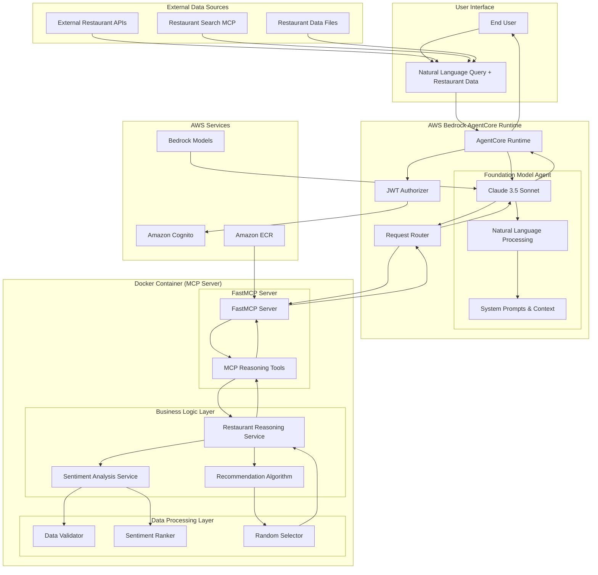

# Design Document

## Overview

The Restaurant Search Result Reasoning MCP application is a specialized AI system that provides intelligent restaurant recommendations based on sentiment analysis. Unlike traditional search systems, this application focuses on analyzing existing restaurant data to identify top candidates and provide data-driven recommendations using customer sentiment metrics.

The system consists of two main components: an MCP server that provides sentiment-based restaurant reasoning tools, and an AgentCore-hosted foundation model that processes natural language queries and converts them to MCP tool calls. The application takes restaurant data as input (typically from external search services) and applies algorithmic analysis to rank restaurants by sentiment scores and provide personalized recommendations.

The system follows a layered architecture with clear separation between natural language processing (foundation model), MCP protocol handling, sentiment analysis logic, and AWS services integration. It focuses on processing and reasoning about restaurant data rather than retrieving it from external sources.

## Architecture

### High-Level Architecture



### Component Architecture

The application follows the Bedrock AgentCore conversational AI pattern with these key components:

#### Foundation Model Layer
1. **AgentCore Foundation Model**: Claude 3.5 Sonnet configured for restaurant reasoning tasks
2. **Natural Language Processor**: Interprets user queries and extracts reasoning parameters
3. **System Prompts**: Context about restaurant sentiment analysis and recommendation logic
4. **Tool Orchestrator**: Manages MCP tool selection and parameter mapping
5. **Response Formatter**: Converts structured reasoning results into conversational responses

#### MCP Server Layer
6. **FastMCP Server**: Uses FastMCP with `stateless_http=True` for AgentCore Runtime compatibility
7. **MCP Reasoning Tools**: Decorated Python functions that become MCP tools via `@mcp.tool()`
8. **Restaurant Reasoning Service**: Core business logic for sentiment analysis and recommendation
9. **Sentiment Analysis Service**: Analyzes restaurant sentiment data and calculates scores
10. **Recommendation Algorithm**: Implements ranking and selection logic

#### Data Processing Layer
11. **Data Validator**: Validates incoming restaurant data structure and completeness
12. **Sentiment Ranker**: Ranks restaurants based on sentiment metrics
13. **Random Selector**: Provides random selection from top candidates

#### Infrastructure Layer
14. **AgentCore Runtime**: Manages foundation model hosting and MCP tool routing
15. **Authentication**: JWT-based authentication via Amazon Cognito integration
16. **Request Router**: Routes natural language queries to appropriate processing components

## Components and Interfaces

### Foundation Model Configuration

The AgentCore foundation model is configured to handle natural language restaurant reasoning queries:

```python
# Foundation model configuration for AgentCore
foundation_model_config = {
    "model_id": "amazon.nova-pro-v1:0",
    "model_parameters": {
        "temperature": 0.1,  # Low temperature for consistent reasoning and tool calling
        "max_tokens": 2048,
        "top_p": 0.9
    },
    "system_prompt": """You are a helpful restaurant recommendation assistant that analyzes 
    restaurant sentiment data to provide intelligent recommendations. You can process lists 
    of restaurants and analyze their customer satisfaction metrics (likes, dislikes, neutral) 
    to identify top candidates and provide personalized recommendations.
    
    You have access to sentiment analysis tools that can:
    - Rank restaurants by highest sentiment likes
    - Rank restaurants by combined likes + neutral percentage
    - Select top 20 candidates from any restaurant list
    - Randomly recommend 1 restaurant from top candidates
    
    When users provide restaurant data or ask for recommendations, use the appropriate 
    MCP tools to analyze sentiment and provide helpful, data-driven recommendations.""",
    "tool_calling": {
        "enabled": True,
        "auto_invoke": True
    }
}
```

#### Natural Language Processing Pipeline

The foundation model processes queries through these stages:

1. **Intent Recognition**: Identifies restaurant recommendation intent from natural language
2. **Data Extraction**: Extracts restaurant data from user input or external sources
3. **Parameter Extraction**: Extracts ranking preferences and recommendation criteria
4. **Tool Selection**: Chooses appropriate MCP reasoning tool
5. **Parameter Validation**: Validates restaurant data structure and completeness
6. **Tool Invocation**: Calls MCP tools with properly formatted restaurant data
7. **Response Generation**: Formats reasoning results into conversational responses

#### Query Processing Examples

```python
# Example query processing flows
query_examples = {
    "recommend from this list": {
        "intent": "restaurant_recommendation",
        "extracted_data": "restaurant_json_list",
        "tool_call": "recommend_restaurants",
        "parameters": {
            "restaurants": "parsed_restaurant_list",
            "ranking_method": "sentiment_likes"
        }
    },
    "find best restaurants by customer satisfaction": {
        "intent": "sentiment_analysis",
        "ranking_preference": "combined_sentiment",
        "tool_call": "recommend_restaurants", 
        "parameters": {
            "restaurants": "restaurant_data",
            "ranking_method": "combined_sentiment"
        }
    },
    "analyze these restaurants and pick one": {
        "intent": "recommendation_with_analysis",
        "tool_call": "recommend_restaurants",
        "parameters": {
            "restaurants": "restaurant_list",
            "ranking_method": "sentiment_likes"
        }
    }
}
```

### FastMCP Server Implementation

The application uses FastMCP with the following configuration:

```python
from mcp.server.fastmcp import FastMCP

# Create MCP server with AgentCore Runtime compatibility
mcp = FastMCP(host="0.0.0.0", stateless_http=True)

# MCP reasoning tools are defined using decorators
@mcp.tool()
def recommend_restaurants(restaurants: list[dict], ranking_method: str = "sentiment_likes") -> str:
    """Analyze restaurant sentiment data and provide intelligent recommendations"""
    # Implementation here
    
@mcp.tool()
def analyze_restaurant_sentiment(restaurants: list[dict]) -> str:
    """Analyze sentiment data for a list of restaurants without recommendation"""
    # Implementation here

if __name__ == "__main__":
    mcp.run(transport="streamable-http")
```

### MCP Tools Interface

The application exposes the following MCP tools with automatic schema generation:

#### recommend_restaurants
- **Parameters**: 
  - `restaurants: list[dict]` - List of restaurant objects with sentiment data
  - `ranking_method: str = "sentiment_likes"` - Ranking method ("sentiment_likes" or "combined_sentiment")
- **Returns**: JSON string containing candidate list (top 20) and single recommendation
- **Description**: Analyze restaurant sentiment data and provide intelligent recommendations

#### analyze_restaurant_sentiment
- **Parameters**: `restaurants: list[dict]` - List of restaurant objects with sentiment data
- **Returns**: JSON string containing sentiment analysis results without recommendation
- **Description**: Analyze sentiment data for restaurants without providing recommendations

### Restaurant Reasoning Service Interface

```python
class RestaurantReasoningService:
    def analyze_and_recommend(self, restaurants: List[dict], ranking_method: str) -> RecommendationResult
    def rank_by_sentiment_likes(self, restaurants: List[Restaurant]) -> List[Restaurant]
    def rank_by_combined_sentiment(self, restaurants: List[Restaurant]) -> List[Restaurant]
    def select_top_candidates(self, ranked_restaurants: List[Restaurant], count: int = 20) -> List[Restaurant]
    def random_recommendation(self, candidates: List[Restaurant]) -> Restaurant
    def validate_restaurant_data(self, restaurant_data: dict) -> bool
```

### Sentiment Analysis Service Interface

```python
class SentimentAnalysisService:
    def calculate_sentiment_score(self, sentiment: Sentiment) -> float
    def calculate_combined_score(self, sentiment: Sentiment) -> float
    def get_sentiment_percentage(self, sentiment: Sentiment) -> Dict[str, float]
    def rank_restaurants_by_score(self, restaurants: List[Restaurant], score_method: str) -> List[Restaurant]
    def validate_sentiment_data(self, sentiment: dict) -> bool
```

### Data Validator Interface

```python
class RestaurantDataValidator:
    def validate_restaurant_structure(self, restaurant: dict) -> ValidationResult
    def validate_sentiment_structure(self, sentiment: dict) -> ValidationResult
    def validate_required_fields(self, restaurant: dict) -> List[str]
    def sanitize_restaurant_data(self, restaurant: dict) -> dict
    def get_validation_errors(self, restaurants: List[dict]) -> List[ValidationError]
```

### Recommendation Algorithm Interface

```python
class RecommendationAlgorithm:
    def __init__(self, random_seed: Optional[int] = None)
    def rank_by_likes(self, restaurants: List[Restaurant]) -> List[Restaurant]
    def rank_by_combined_sentiment(self, restaurants: List[Restaurant]) -> List[Restaurant]
    def select_candidates(self, ranked_restaurants: List[Restaurant], count: int) -> List[Restaurant]
    def random_select(self, candidates: List[Restaurant]) -> Restaurant
    def calculate_ranking_scores(self, restaurants: List[Restaurant], method: str) -> Dict[str, float]
```

## Data Models

### Restaurant Data Models

```python
@dataclass
class Sentiment:
    likes: int
    dislikes: int
    neutral: int
    
    def total_responses(self) -> int:
        return self.likes + self.dislikes + self.neutral
    
    def likes_percentage(self) -> float:
        total = self.total_responses()
        return (self.likes / total * 100) if total > 0 else 0.0
    
    def combined_positive_percentage(self) -> float:
        total = self.total_responses()
        return ((self.likes + self.neutral) / total * 100) if total > 0 else 0.0

@dataclass
class Restaurant:
    id: str
    name: str
    address: str
    meal_type: List[str]
    sentiment: Sentiment
    location_category: str
    district: str
    price_range: str
    operating_hours: Optional[dict] = None
    metadata: Optional[dict] = None
    
    def sentiment_score(self) -> float:
        """Calculate sentiment score for ranking"""
        return self.sentiment.likes_percentage()
    
    def combined_sentiment_score(self) -> float:
        """Calculate combined sentiment score for ranking"""
        return self.sentiment.combined_positive_percentage()

@dataclass
class RecommendationResult:
    candidates: List[Restaurant]
    recommendation: Restaurant
    ranking_method: str
    analysis_summary: Dict[str, Any]
    
    def to_dict(self) -> dict:
        return {
            "candidates": [asdict(r) for r in self.candidates],
            "recommendation": asdict(self.recommendation),
            "ranking_method": self.ranking_method,
            "analysis_summary": self.analysis_summary
        }

@dataclass
class SentimentAnalysis:
    restaurant_count: int
    average_likes: float
    average_dislikes: float
    average_neutral: float
    top_sentiment_score: float
    bottom_sentiment_score: float
    ranking_method: str
    
@dataclass
class ValidationResult:
    is_valid: bool
    errors: List[str]
    warnings: List[str]
    
@dataclass
class ValidationError:
    restaurant_id: str
    field: str
    error_type: str
    message: str
```

### Configuration Data Models

```python
@dataclass
class ReasoningConfig:
    default_ranking_method: str = "sentiment_likes"
    candidate_count: int = 20
    minimum_sentiment_responses: int = 1
    enable_random_seed: bool = False
    random_seed: Optional[int] = None

@dataclass
class MCPServerConfig:
    host: str = "0.0.0.0"
    port: int = 8080
    stateless_http: bool = True
    enable_cors: bool = True
    max_request_size: int = 10485760  # 10MB
```

### Authentication Data Models

```python
@dataclass
class CognitoConfig:
    user_pool_id: str
    client_id: str
    region: str
    discovery_url: str
    jwks_url: str
    issuer_url: str

@dataclass
class JWTClaims:
    user_id: str
    username: str
    email: str
    client_id: str
    token_use: str
    exp: int
    iat: int
    iss: str
    aud: str

@dataclass
class AuthenticationTokens:
    id_token: str
    access_token: str
    refresh_token: str
    expires_in: int
    token_type: str = "Bearer"

@dataclass
class UserContext:
    user_id: str
    username: str
    email: str
    authenticated: bool
    token_claims: JWTClaims
    session_id: Optional[str] = None
```

## Sentiment Analysis and Recommendation Logic

### Ranking Algorithms

#### Sentiment Likes Ranking
```python
def rank_by_sentiment_likes(restaurants: List[Restaurant]) -> List[Restaurant]:
    """
    Rank restaurants by highest sentiment likes count
    
    Algorithm:
    1. Sort restaurants by sentiment.likes in descending order
    2. Handle ties by secondary sort on total responses
    3. Return ranked list
    """
    return sorted(
        restaurants,
        key=lambda r: (r.sentiment.likes, r.sentiment.total_responses()),
        reverse=True
    )
```

#### Combined Sentiment Ranking
```python
def rank_by_combined_sentiment(restaurants: List[Restaurant]) -> List[Restaurant]:
    """
    Rank restaurants by combined likes + neutral percentage
    
    Algorithm:
    1. Calculate (likes + neutral) / total_responses for each restaurant
    2. Sort by percentage in descending order
    3. Handle ties by secondary sort on absolute likes count
    4. Return ranked list
    """
    def combined_score(restaurant: Restaurant) -> float:
        sentiment = restaurant.sentiment
        total = sentiment.total_responses()
        if total == 0:
            return 0.0
        return (sentiment.likes + sentiment.neutral) / total
    
    return sorted(
        restaurants,
        key=lambda r: (combined_score(r), r.sentiment.likes),
        reverse=True
    )
```

#### Candidate Selection and Recommendation
```python
def select_top_candidates_and_recommend(
    ranked_restaurants: List[Restaurant], 
    candidate_count: int = 20
) -> RecommendationResult:
    """
    Select top candidates and randomly recommend one
    
    Algorithm:
    1. Take top N restaurants from ranked list (default 20)
    2. If fewer than N restaurants available, use all
    3. Randomly select 1 restaurant from candidates
    4. Return both candidate list and recommendation
    """
    candidates = ranked_restaurants[:candidate_count]
    
    if not candidates:
        raise ValueError("No valid candidates available")
    
    # Random selection from top candidates
    recommendation = random.choice(candidates)
    
    return RecommendationResult(
        candidates=candidates,
        recommendation=recommendation,
        ranking_method=ranking_method,
        analysis_summary=generate_analysis_summary(candidates)
    )
```

### Data Validation Logic

#### Restaurant Data Validation
```python
def validate_restaurant_data(restaurant: dict) -> ValidationResult:
    """
    Validate restaurant data structure and required fields
    
    Required fields:
    - id: string identifier
    - name: restaurant name
    - sentiment: object with likes, dislikes, neutral (integers)
    
    Optional fields:
    - address, meal_type, location_category, district, price_range, etc.
    """
    errors = []
    warnings = []
    
    # Check required fields
    required_fields = ['id', 'name', 'sentiment']
    for field in required_fields:
        if field not in restaurant:
            errors.append(f"Missing required field: {field}")
    
    # Validate sentiment structure
    if 'sentiment' in restaurant:
        sentiment = restaurant['sentiment']
        sentiment_fields = ['likes', 'dislikes', 'neutral']
        for field in sentiment_fields:
            if field not in sentiment:
                errors.append(f"Missing sentiment field: {field}")
            elif not isinstance(sentiment[field], int) or sentiment[field] < 0:
                errors.append(f"Invalid sentiment {field}: must be non-negative integer")
    
    # Check for empty sentiment data
    if 'sentiment' in restaurant:
        sentiment = restaurant['sentiment']
        total_responses = sum(sentiment.get(f, 0) for f in ['likes', 'dislikes', 'neutral'])
        if total_responses == 0:
            warnings.append("Restaurant has no sentiment responses")
    
    return ValidationResult(
        is_valid=len(errors) == 0,
        errors=errors,
        warnings=warnings
    )
```

### Response Formatting

#### Conversational Response Generation
```python
def format_recommendation_response(result: RecommendationResult) -> str:
    """
    Format recommendation results into conversational response
    """
    candidates_count = len(result.candidates)
    recommendation = result.recommendation
    
    # Generate response based on ranking method
    if result.ranking_method == "sentiment_likes":
        ranking_desc = "highest customer likes"
    else:
        ranking_desc = "best combined customer satisfaction (likes + neutral)"
    
    response = f"""I analyzed the restaurant data and found {candidates_count} top candidates based on {ranking_desc}.

**My Recommendation:**
🍽️ **{recommendation.name}**
📍 {recommendation.address if hasattr(recommendation, 'address') else 'Address not available'}
👍 Customer Sentiment: {recommendation.sentiment.likes} likes, {recommendation.sentiment.dislikes} dislikes, {recommendation.sentiment.neutral} neutral
💰 Price Range: {getattr(recommendation, 'price_range', 'Not specified')}

**Top {candidates_count} Candidates:**"""
    
    for i, candidate in enumerate(result.candidates[:5], 1):  # Show top 5 in summary
        response += f"\n{i}. {candidate.name} - {candidate.sentiment.likes} likes"
    
    if candidates_count > 5:
        response += f"\n... and {candidates_count - 5} more restaurants"
    
    response += "\n\nWould you like me to analyze different criteria or provide more details about any of these restaurants?"
    
    return response
```

## Error Handling

### Error Types and Responses

1. **Data Validation Errors**
   - Missing required fields (id, name, sentiment)
   - Invalid sentiment data structure
   - Non-integer sentiment values
   - Empty restaurant list

2. **Sentiment Analysis Errors**
   - Zero total sentiment responses
   - Negative sentiment values
   - Invalid ranking method specified
   - Calculation overflow errors

3. **Recommendation Errors**
   - No valid candidates after filtering
   - Random selection failures
   - Invalid candidate count parameters

4. **MCP Protocol Errors**
   - Invalid tool parameters
   - JSON serialization errors
   - Tool execution timeouts
   - Response size limits exceeded

5. **Foundation Model Errors**
   - Model invocation failures
   - Tool calling parameter errors
   - Response generation timeouts
   - Context window exceeded

6. **Authentication Errors**
   - Invalid JWT tokens
   - Expired authentication
   - Missing authorization headers
   - Cognito service unavailable

### Error Response Format

#### MCP Tool Error Format (Internal)
```python
{
    "error": {
        "type": "ValidationError",
        "message": "Invalid restaurant data structure",
        "details": {
            "invalid_restaurants": [
                {
                    "index": 0,
                    "errors": ["Missing required field: sentiment"],
                    "warnings": ["Address field not provided"]
                }
            ],
            "valid_count": 15,
            "total_count": 16
        }
    }
}
```

#### Conversational Error Format (User-Facing)
```python
conversational_errors = {
    "invalid_data": "I found some issues with the restaurant data you provided. {error_count} restaurants are missing required information like sentiment data. Could you check the data format and try again?",
    
    "no_valid_restaurants": "I couldn't find any restaurants with valid sentiment data to analyze. Please make sure each restaurant has 'likes', 'dislikes', and 'neutral' sentiment counts.",
    
    "empty_list": "You didn't provide any restaurant data to analyze. Please share a list of restaurants with sentiment information and I'll help you find the best recommendations.",
    
    "system_error": "I'm having trouble processing the restaurant data right now. Please try again in a moment, or let me know if you'd like help with something else."
}
```

## Testing Strategy

### Unit Testing
- Test sentiment analysis algorithms with various data sets
- Test ranking methods (sentiment_likes vs combined_sentiment)
- Test data validation with valid and invalid restaurant data
- Test random selection reproducibility with seeds
- Test edge cases (empty lists, zero sentiment responses)
- Test error handling and validation logic

### Integration Testing
- Test MCP tool registration and execution
- Test end-to-end recommendation workflows
- Test AgentCore Runtime integration
- Test foundation model tool calling
- Test authentication flow integration
- Test response formatting and serialization

### Algorithm Testing
- Test ranking consistency with different data sets
- Test tie-breaking logic in ranking algorithms
- Test candidate selection with various list sizes
- Test random recommendation distribution
- Test sentiment score calculations
- Test percentage calculations for combined sentiment

### Conversational Testing
- Test natural language query understanding for recommendation requests
- Test response formatting and readability
- Test error message clarity and helpfulness
- Test multi-turn conversation flows
- Test handling of malformed restaurant data in conversations

### Performance Testing
- Test processing time with large restaurant lists (1000+ restaurants)
- Test memory usage with complex restaurant data structures
- Test concurrent recommendation requests
- Test MCP server response times
- Test foundation model response times

### Data Quality Testing
- Test with real restaurant data from various sources
- Test with edge cases (restaurants with zero sentiment)
- Test with malformed JSON data
- Test with missing optional fields
- Test with extreme sentiment values

### User Experience Testing
- Test recommendation quality and relevance
- Test explanation clarity for ranking methods
- Test error message helpfulness
- Test conversation flow naturalness
- Test response completeness and accuracy

## Deployment and Configuration

### Platform Architecture Requirements

**Critical Requirement**: Amazon Bedrock AgentCore Runtime requires `linux/arm64` architecture containers.

#### Architecture Compatibility
- **Development Environment**: Can be x86/AMD64 (Windows, macOS, Linux)
- **Runtime Environment**: Must be `linux/arm64` (managed by AgentCore Runtime)
- **Build Process**: AWS CodeBuild automatically handles cross-platform building

### Bedrock AgentCore Runtime Deployment

The application follows the Bedrock AgentCore Runtime deployment pattern:

#### Using Bedrock AgentCore Starter Toolkit

```python
from bedrock_agentcore_starter_toolkit import Runtime
from boto3.session import Session

# Initialize runtime
agentcore_runtime = Runtime()

# Configure with authentication
auth_config = {
    "customJWTAuthorizer": {
        "allowedClients": [cognito_client_id],
        "discoveryUrl": cognito_discovery_url,
    }
}

# Configure MCP server deployment
mcp_server_config = agentcore_runtime.configure(
    entrypoint="restaurant_reasoning_mcp_server.py",
    auto_create_execution_role=True,
    auto_create_ecr=True,
    requirements_file="requirements.txt",
    region=region,
    authorizer_configuration=auth_config,
    protocol="MCP",
    agent_name="restaurant_reasoning_mcp"
)

# Launch MCP server to AgentCore Runtime
mcp_launch_result = agentcore_runtime.launch()

# Configure foundation model agent
foundation_model_config = {
    "model_id": "amazon.nova-pro-v1:0",
    "model_parameters": {
        "temperature": 0.1,
        "max_tokens": 2048,
        "top_p": 0.9
    },
    "system_prompt": """You are a helpful restaurant recommendation assistant...""",
    "mcp_server_arn": mcp_launch_result.agent_arn,
    "tool_calling": {"enabled": True, "auto_invoke": True}
}

# Deploy complete conversational agent
agent_config = agentcore_runtime.configure_agent(
    agent_name="restaurant_reasoning_conversational_agent",
    foundation_model_config=foundation_model_config,
    authorizer_configuration=auth_config
)

# Launch conversational agent
agent_launch_result = agentcore_runtime.launch_agent()
```

### Docker Configuration

```dockerfile
# REQUIRED: ARM64 platform for Amazon Bedrock AgentCore Runtime
FROM --platform=linux/arm64 ghcr.io/astral-sh/uv:python3.12-bookworm-slim

WORKDIR /app

# Configure UV for container environment
ENV UV_SYSTEM_PYTHON=1 UV_COMPILE_BYTECODE=1

# Install dependencies
COPY requirements.txt requirements.txt
RUN uv pip install -r requirements.txt

# Set AWS region environment variables
ENV AWS_REGION=us-east-1
ENV AWS_DEFAULT_REGION=us-east-1
ENV DOCKER_CONTAINER=1

# Create non-root user for security
RUN useradd -m -u 1000 bedrock_agentcore
USER bedrock_agentcore

# Expose MCP server port
EXPOSE 8080

# Copy application code
COPY . .

# Start MCP reasoning server
CMD ["python", "-m", "restaurant_reasoning_mcp_server"]
```

### Requirements.txt

```txt
mcp>=1.10.0
bedrock-agentcore
bedrock-agentcore-starter-toolkit
pydantic>=2.0.0
```

### Environment Variables

AgentCore Runtime manages these automatically:
- AWS credentials via IAM roles
- Region configuration
- Authentication tokens
- Runtime-specific configurations

### Authentication Configuration

The system implements JWT-based authentication using Amazon Cognito:

```python
# Cognito User Pool configuration
cognito_config = {
    "user_pool_name": "restaurant-reasoning-mcp-users",
    "client_name": "restaurant-reasoning-client",
    "domain_name": "restaurant-reasoning-mcp",
    "supported_identity_providers": ["COGNITO"],
    "oauth_flows": ["authorization_code_grant"],
    "oauth_scopes": ["openid", "profile", "email"]
}

# AgentCore Runtime authentication configuration
auth_config = {
    "customJWTAuthorizer": {
        "allowedClients": [cognito_client_id],
        "discoveryUrl": f"https://cognito-idp.{region}.amazonaws.com/{user_pool_id}/.well-known/openid_configuration"
    }
}
```

### Integration with External Data Sources

The system is designed to integrate with various restaurant data sources:

#### Restaurant Search MCP Integration
```python
# Example integration with restaurant search MCP
async def get_restaurants_and_recommend(district: str, meal_type: str) -> str:
    """
    Integrate with restaurant search MCP to get data, then provide recommendations
    """
    # 1. Call restaurant search MCP to get restaurant list
    search_results = await call_restaurant_search_mcp(
        districts=[district], 
        meal_types=[meal_type]
    )
    
    # 2. Extract restaurant data from search results
    restaurants = parse_search_results(search_results)
    
    # 3. Use reasoning MCP to analyze and recommend
    recommendation_result = await call_reasoning_mcp(
        restaurants=restaurants,
        ranking_method="sentiment_likes"
    )
    
    return recommendation_result
```

#### API Integration Pattern
```python
# Example integration with external restaurant APIs
class ExternalDataIntegration:
    def __init__(self, reasoning_service: RestaurantReasoningService):
        self.reasoning_service = reasoning_service
    
    async def process_external_data(self, api_response: dict) -> RecommendationResult:
        """Process data from external APIs and provide recommendations"""
        # Parse external API response
        restaurants = self.parse_api_response(api_response)
        
        # Validate and clean data
        valid_restaurants = self.validate_and_clean(restaurants)
        
        # Apply reasoning and recommendation
        return self.reasoning_service.analyze_and_recommend(
            valid_restaurants, 
            ranking_method="combined_sentiment"
        )
```

This design provides a comprehensive foundation for building the restaurant search result reasoning MCP application with focus on sentiment analysis, intelligent recommendations, and seamless integration with AgentCore Runtime.