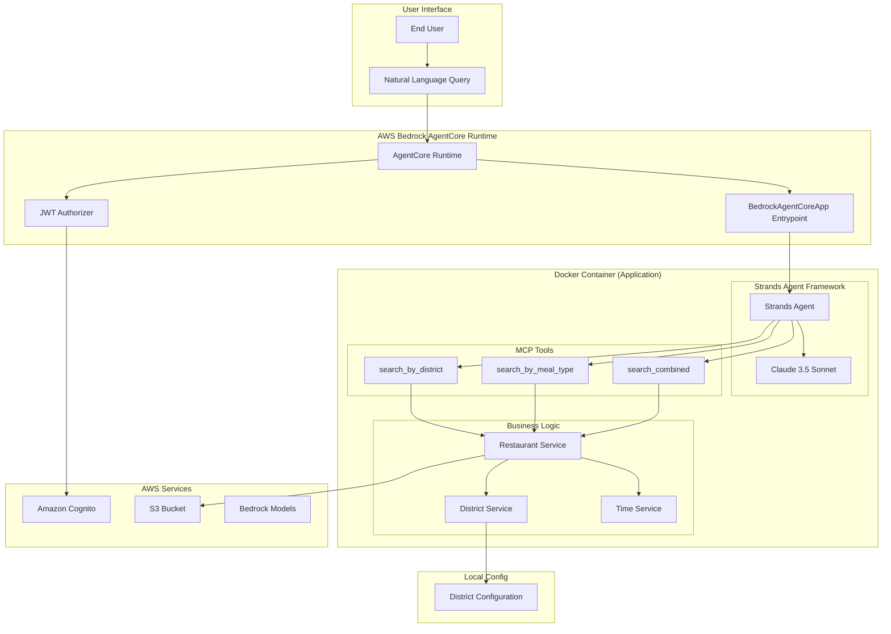
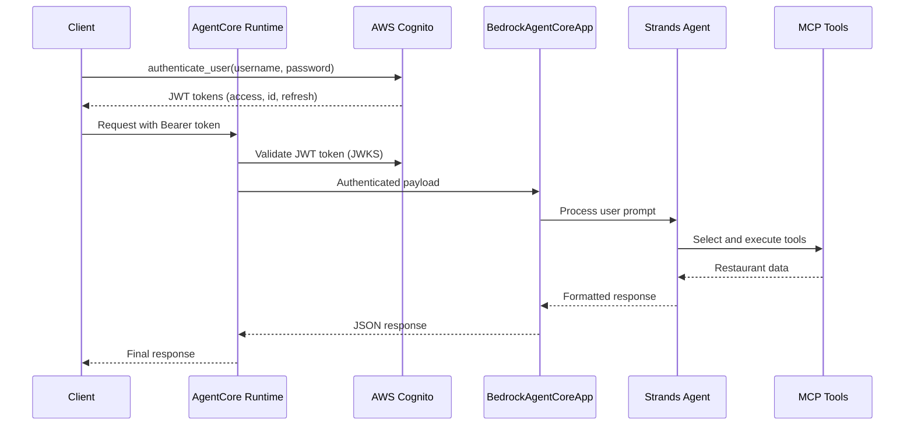

# Restaurant Search MCP Server

A comprehensive conversational AI system that enables natural language restaurant search through AWS Bedrock AgentCore. The system integrates MCP (Model Context Protocol) tools with a BedrockAgentCoreApp entrypoint, providing both structured API access and natural language conversational interfaces powered by foundation models with JWT authentication.

## 🏗️ Architecture Overview

The Restaurant Search MCP application consists of three main components:

1. **BedrockAgentCoreApp Entrypoint**: Main application entry point that processes user prompts and orchestrates responses
2. **Strands Agent Integration**: Uses Strands Agent framework to automatically select and execute MCP tools based on natural language queries
3. **MCP Tools**: Provides structured restaurant search capabilities via three specialized tools for district, meal type, and combined searches



## 🚀 Quick Start

### Prerequisites

- AWS account with configured credentials (`aws configure`)
- Python 3.10+ environment
- Docker installed for local development
- Model access: Anthropic Claude 3.5 Sonnet in Bedrock console
- Required IAM policies: `BedrockAgentCoreFullAccess`, `AmazonBedrockFullAccess`

### Installation

1. **Clone and setup the project:**
```bash
git clone <repository-url>
cd restaurant-search-mcp
pip install -r requirements.txt
```

2. **Set up AWS Cognito authentication:**
```bash
python setup_cognito.py --region us-east-1 --email your-test-email@example.com
```

3. **Deploy the BedrockAgentCoreApp entrypoint to AgentCore Runtime:**
```bash
python deploy_conversational_agent.py
```

4. **Test the deployment:**
```bash
python tests/test_entrypoint_integration.py
```

## 🔧 Configuration

### Environment Variables

```bash
# Authentication (default: enabled)
REQUIRE_AUTHENTICATION=true

# AWS Configuration
AWS_REGION=us-east-1
AWS_DEFAULT_REGION=us-east-1

# Docker Configuration (for AgentCore Runtime)
DOCKER_CONTAINER=1
```

### Cognito Configuration

The system automatically creates `cognito_config.json` during setup:

```json
{
  "region": "us-east-1",
  "user_pool": {
    "user_pool_id": "us-east-1_XXXXXXXXX",
    "user_pool_arn": "arn:aws:cognito-idp:us-east-1:ACCOUNT:userpool/us-east-1_XXXXXXXXX"
  },
  "app_client": {
    "client_id": "XXXXXXXXXXXXXXXXXXXXXXXXXX",
    "client_name": "restaurant-search-mcp-client"
  },
  "test_user": {
    "username": "test@example.com",
    "email": "test@example.com",
    "status": "CONFIRMED"
  },
  "discovery_url": "https://cognito-idp.us-east-1.amazonaws.com/us-east-1_XXXXXXXXX/.well-known/openid-configuration"
}
```

## 🛠️ MCP Tools

The server exposes three MCP tools for restaurant search:

### 1. search_restaurants_by_district

Search for restaurants in specific districts.

**Parameters:**
- `districts` (List[str]): List of district names (e.g., ["Central district", "Admiralty"])

**Example:**
```python
await session.call_tool(
    "search_restaurants_by_district",
    {"districts": ["Central district", "Tsim Sha Tsui"]}
)
```

### 2. search_restaurants_by_meal_type

Search for restaurants by meal type based on operating hours.

**Parameters:**
- `meal_types` (List[str]): List of meal types ("breakfast", "lunch", "dinner")

**Meal Time Periods:**
- **Breakfast**: 07:00 - 11:29
- **Lunch**: 11:30 - 17:29  
- **Dinner**: 17:30 - 22:30

**Example:**
```python
await session.call_tool(
    "search_restaurants_by_meal_type",
    {"meal_types": ["breakfast", "lunch"]}
)
```

### 3. search_restaurants_combined

Search for restaurants by both district and meal type criteria.

**Parameters:**
- `districts` (Optional[List[str]]): Optional list of district names
- `meal_types` (Optional[List[str]]): Optional list of meal types

**Example:**
```python
await session.call_tool(
    "search_restaurants_combined",
    {
        "districts": ["Central district"],
        "meal_types": ["dinner"]
    }
)
```

## 🚀 BedrockAgentCoreApp Entrypoint Integration

The system uses a BedrockAgentCoreApp entrypoint that integrates Strands Agent framework for natural language processing and automatic MCP tool selection.

### Entrypoint Architecture

```python
from bedrock_agentcore import BedrockAgentCoreApp
from strands_agents import Agent

# Initialize the BedrockAgentCoreApp
app = BedrockAgentCoreApp()

@app.entrypoint
def process_request(payload: Dict[str, Any]) -> str:
    """Main entrypoint for processing AgentCore Runtime requests."""
    # Extract user prompt from payload
    user_prompt = extract_user_prompt(payload)
    
    # Process with Strands Agent (automatically selects MCP tools)
    agent_response = strands_agent.run(user_prompt)
    
    # Format and return JSON-serializable response
    return format_response(agent_response)
```

### Strands Agent Configuration

The Strands Agent is configured with:
- **Model**: Claude 3.5 Sonnet (anthropic.claude-3-5-sonnet-20241022-v2:0)
- **Temperature**: 0.1 (for consistent tool calling)
- **Tools**: All three MCP restaurant search tools
- **System Prompt**: Comprehensive Hong Kong restaurant search context

### Automatic Tool Selection

The agent automatically selects appropriate tools based on user queries:

| User Query | Selected Tool | Parameters |
|------------|---------------|------------|
| "Find restaurants in Central district" | `search_restaurants_by_district` | `{"districts": ["Central district"]}` |
| "Show me breakfast places" | `search_restaurants_by_meal_type` | `{"meal_types": ["breakfast"]}` |
| "Dinner restaurants in Tsim Sha Tsui" | `search_restaurants_combined` | `{"districts": ["Tsim Sha Tsui"], "meal_types": ["dinner"]}` |

### Payload Processing

The entrypoint handles various payload formats from AgentCore Runtime:

```python
# Supported payload structures
{
  "input": {"prompt": "Find restaurants in Central district"}
}

{
  "input": {"message": "Show me breakfast places"}
}

{
  "prompt": "What dinner options are in Causeway Bay?"
}
```

## 💬 Natural Language Interface

Users can interact with the system using conversational language through the BedrockAgentCoreApp entrypoint:

### Example Queries

```
"Find restaurants in Central district"
"Show me breakfast places in Tsim Sha Tsui"
"What dinner restaurants are available in Causeway Bay?"
"Find lunch places in Admiralty and Wan Chai"
"Show me all restaurants in Mong Kok"
```

### Query Processing Pipeline

The Strands Agent automatically:
1. **Intent Recognition**: Analyzes user query to understand restaurant search intent
2. **Parameter Extraction**: Identifies districts and meal types from natural language
3. **Tool Selection**: Chooses the most appropriate MCP tool based on extracted parameters
4. **Tool Execution**: Calls the selected tool with properly formatted parameters
5. **Response Generation**: Formats tool results into conversational, user-friendly responses
6. **Error Handling**: Provides helpful suggestions when queries cannot be processed

## 🔐 Authentication

The system uses AWS Cognito for JWT-based authentication:

### Authentication Flow



### Authentication Examples

#### Basic Authentication
```python
from services.auth_service import CognitoAuthenticator

authenticator = CognitoAuthenticator(
    user_pool_id="us-east-1_wBAxW7yd4",
    client_id="26k0pnja579pdpb1pt6savs27e",
    region="us-east-1"
)

# Authenticate user
tokens = authenticator.authenticate_user("username", "password")
print(f"Access token: {tokens.access_token}")
```

#### Authenticated Entrypoint Client
```python
import json
import requests
from services.auth_service import CognitoAuthenticator

def authenticated_entrypoint_request():
    # Get authentication token
    authenticator = CognitoAuthenticator(
        user_pool_id="us-east-1_wBAxW7yd4",
        client_id="26k0pnja579pdpb1pt6savs27e",
        region="us-east-1"
    )
    
    tokens = authenticator.authenticate_user("user@example.com", "password")
    
    # Set up authenticated headers
    headers = {
        'Authorization': f'Bearer {tokens.access_token}',
        'Content-Type': 'application/json'
    }
    
    # AgentCore Runtime endpoint
    agentcore_url = "https://your-agentcore-endpoint.amazonaws.com/invocations"
    
    # Send natural language query
    payload = {
        "input": {
            "prompt": "Find me some good breakfast places in Central district"
        }
    }
    
    response = requests.post(agentcore_url, headers=headers, json=payload)
    result = response.json()
    
    print(f"Response: {result['response']}")
    return result

# Example usage
authenticated_entrypoint_request()
```

#### Direct MCP Tool Access (Legacy)
```python
import asyncio
from mcp import ClientSession
from mcp.client.streamable_http import streamablehttp_client

async def direct_mcp_access():
    # Get authentication token
    tokens = authenticator.authenticate_user("user@example.com", "password")
    
    # Set up authenticated headers
    headers = {
        'Authorization': f'Bearer {tokens.access_token}',
        'Content-Type': 'application/json'
    }
    
    # Connect directly to MCP server (if deployed separately)
    mcp_url = "https://your-mcp-server-endpoint.amazonaws.com"
    async with streamablehttp_client(mcp_url, headers=headers) as (read, write, _):
        async with ClientSession(read, write) as session:
            await session.initialize()
            
            # Search restaurants using MCP protocol
            result = await session.call_tool(
                "search_restaurants_by_district",
                {"districts": ["Central district"]}
            )
            
            print(result.content[0].text)

asyncio.run(direct_mcp_access())
```

## 📊 Data Structure

### Restaurant Data Model

```python
{
  "id": "rest_001",
  "name": "Restaurant Name",
  "address": "123 Main Street, Hong Kong",
  "meal_type": ["Chinese", "Cantonese"],
  "sentiment": {
    "likes": 150,
    "dislikes": 10,
    "neutral": 25
  },
  "location_category": "Shopping Mall",
  "district": "Central district",
  "price_range": "$$",
  "operating_hours": {
    "mon_fri": ["11:30 - 15:30", "18:00 - 22:30"],
    "sat_sun": ["10:00 - 22:30"],
    "public_holiday": ["10:00 - 22:00"]
  },
  "metadata": {
    "data_quality": "high",
    "version": "1.0",
    "quality_score": 95
  }
}
```

### Available Districts

The system supports restaurants across Hong Kong's major regions:

- **Hong Kong Island**: Central district, Admiralty, Causeway Bay, Wan Chai, etc.
- **Kowloon**: Tsim Sha Tsui, Mong Kok, Yau Ma Tei, etc.
- **New Territories**: Sha Tin, Tsuen Wan, Tai Po, etc.
- **Lantau**: Tung Chung, Discovery Bay, etc.

## 🧪 Testing

### Run Authentication Tests
```bash
# Test Cognito authentication setup
python tests/test_auth_service.py

# Test end-to-end authentication flow
python tests/test_e2e_authentication.py

# Test MCP server with authentication
python tests/test_authenticated_mcp.py
```

### Run Entrypoint Tests
```bash
# Test BedrockAgentCoreApp entrypoint basic functionality
python tests/test_entrypoint_basic.py

# Test entrypoint integration with Strands Agent
python tests/test_entrypoint_integration.py

# Run comprehensive entrypoint test suite
python tests/run_entrypoint_tests.py
```

### Run MCP Tool Tests
```bash
# Test MCP tools locally
python tests/test_mcp_client.py

# Test deployed MCP server
python tests/test_mcp_deployment.py

# Test with AgentCore toolkit
python tests/test_mcp_with_toolkit.py
```

### Run Integration Tests
```bash
# Test complete system integration
python tests/test_system_integration.py

# Test conversational flow
python tests/test_conversational_flow.py
```

## 🚀 Deployment

### Local Development

```bash
# Start MCP server locally (without authentication)
REQUIRE_AUTHENTICATION=false python restaurant_mcp_server.py

# Test local server
python tests/test_mcp_client.py
```

### Production Deployment

```bash
# 1. Set up Cognito authentication
python setup_cognito.py --region us-east-1 --email admin@yourcompany.com

# 2. Deploy BedrockAgentCoreApp with entrypoint integration
python deploy_conversational_agent.py

# 3. Test deployed entrypoint system
python tests/test_entrypoint_integration.py

# 4. Optional: Deploy standalone MCP server (legacy)
python deploy_agentcore.py
```

### Deployment Options

The system supports two deployment patterns:

#### 1. Entrypoint Deployment (Recommended)
- **File**: `main.py` with BedrockAgentCoreApp entrypoint
- **Features**: Natural language processing, automatic tool selection, conversational responses
- **Use Case**: End-user applications, chatbots, conversational interfaces

#### 2. MCP Server Deployment (Legacy)
- **File**: `restaurant_mcp_server.py` with FastMCP server
- **Features**: Direct MCP protocol access, structured API calls
- **Use Case**: Integration with other MCP clients, programmatic access

### Docker Deployment

**Important**: Amazon Bedrock AgentCore Runtime requires `linux/arm64` architecture containers.

```dockerfile
# REQUIRED: ARM64 platform for AgentCore Runtime
FROM --platform=linux/arm64 python:3.12-slim

WORKDIR /app

# Install dependencies
COPY requirements.txt .
RUN pip install -r requirements.txt

# Copy application code
COPY . .

# Expose MCP server port
EXPOSE 8080

# Start MCP server
CMD ["python", "restaurant_mcp_server.py"]
```

## 📈 Monitoring and Observability

### Health Monitoring

The system provides comprehensive health monitoring:

```python
# Check server health
health_status = get_server_health()
print(f"Status: {health_status['status']}")

# Get server metrics
metrics = get_server_metrics()
print(f"Available districts: {metrics['available_districts_count']}")
```

### Security Monitoring

```python
# Get security metrics
security_metrics = security_monitor.get_security_metrics()
print(f"Authentication attempts: {security_metrics.total_auth_attempts}")
print(f"Successful authentications: {security_metrics.successful_auths}")
```

### Logging

The system provides structured logging for:
- Authentication events
- MCP tool invocations
- Error conditions
- Security events

```python
# Configure logging
import logging

logging.basicConfig(
    level=logging.INFO,
    format='%(asctime)s - %(name)s - %(levelname)s - %(message)s'
)
```

## 🔧 Troubleshooting

### Common Issues

#### Authentication Failures

**Issue**: `NotAuthorizedException: Incorrect username or password`

**Solutions**:
- Verify user exists in Cognito User Pool
- Check password meets policy requirements
- Ensure user status is `CONFIRMED`

**Debug Steps**:
```python
# Check user status
python debug_auth.py --username user@example.com
```

#### Entrypoint Processing Issues

**Issue**: `Invalid payload structure` or `No valid prompt found`

**Solutions**:
- Ensure payload contains `input.prompt`, `prompt`, or `message` field
- Verify JSON structure is valid
- Check AgentCore Runtime configuration

**Debug Steps**:
```python
# Test entrypoint with sample payload
python tests/test_entrypoint_basic.py --debug

# Check payload structure
payload = {"input": {"prompt": "Find restaurants in Central district"}}
```

#### Strands Agent Tool Selection Issues

**Issue**: Agent doesn't select appropriate tools or returns generic responses

**Solutions**:
- Verify tool schemas are properly defined
- Check system prompt includes tool usage guidance
- Ensure model has access to all three MCP tools

**Debug Steps**:
```python
# Test tool availability
python -c "from main import create_mcp_tools; print([t.name for t in create_mcp_tools()])"

# Test agent configuration
python tests/test_entrypoint_integration.py --verbose
```

#### MCP Connection Issues (Legacy)

**Issue**: Connection timeout or authentication errors

**Solutions**:
- Verify AgentCore deployment is successful
- Check JWT token is valid and not expired
- Ensure correct endpoint URL

**Debug Steps**:
```python
# Test MCP connectivity
python tests/test_mcp_deployment.py --debug
```

#### District Validation Errors

**Issue**: `Invalid districts: ['InvalidDistrict']`

**Solutions**:
- Check available districts: `python -c "from services.district_service import DistrictService; print(DistrictService().get_all_districts())"`
- Use exact district names from configuration
- Check district configuration files in `config/districts/`

### Error Codes Reference

| Error Code | Description | Solution |
|------------|-------------|----------|
| `ValidationError` | Invalid parameters | Check parameter format and values |
| `RestaurantSearchError` | Search operation failed | Verify data access and configuration |
| `AuthenticationError` | Authentication failed | Check credentials and token validity |
| `InternalError` | Unexpected system error | Check logs and contact support |

### Support Resources

- [Cognito Setup Guide](docs/COGNITO_SETUP_GUIDE.md) - Detailed Cognito authentication setup
- [Authentication Usage Examples](docs/AUTHENTICATION_USAGE_EXAMPLES.md) - Comprehensive authentication examples
- [MCP Tool Usage Examples](docs/MCP_TOOL_USAGE_EXAMPLES.md) - Framework integration patterns and examples
- [AWS Bedrock AgentCore Documentation](https://docs.aws.amazon.com/bedrock/latest/userguide/agents-core.html)
- [MCP Protocol Specification](https://modelcontextprotocol.io/)
- [Strands Agents Framework](https://github.com/strands-ai/strands-agents)

## 📁 Project Structure

```
restaurant-search-mcp/
├── README.md                           # This file
├── requirements.txt                    # Python dependencies
├── main.py                            # BedrockAgentCoreApp entrypoint (MAIN)
├── restaurant_mcp_server.py           # FastMCP server implementation (legacy)
├── deploy_conversational_agent.py     # Entrypoint deployment script
├── deploy_agentcore.py               # MCP server deployment script (legacy)
├── setup_cognito.py                  # Cognito setup automation
├── cognito_config.json               # Cognito configuration (generated)
├── .bedrock_agentcore.yaml           # AgentCore configuration
├── Dockerfile                        # Container configuration (ARM64)
│
├── services/                         # Business logic services
│   ├── restaurant_service.py         # Restaurant search logic
│   ├── district_service.py           # District configuration management
│   ├── time_service.py               # Meal time calculations
│   ├── data_access.py                # S3 data access client
│   ├── auth_service.py               # Cognito authentication
│   ├── auth_middleware.py            # Authentication middleware
│   ├── auth_error_handler.py         # Error handling utilities
│   └── security_monitor.py           # Security monitoring
│
├── models/                           # Data models
│   ├── restaurant_models.py          # Restaurant data structures
│   └── district_models.py            # District configuration models
│
├── config/                           # Local configuration data
│   ├── districts/                    # District configuration files
│   └── restaurants/                  # Sample restaurant data
│
├── tests/                            # Test suite
│   ├── test_entrypoint_basic.py      # Basic entrypoint functionality tests
│   ├── test_entrypoint_integration.py # Entrypoint integration tests
│   ├── run_entrypoint_tests.py       # Entrypoint test runner
│   ├── test_authenticated_mcp.py     # End-to-end authentication tests
│   ├── test_mcp_deployment.py        # Deployment validation tests
│   ├── test_auth_service.py          # Authentication unit tests
│   ├── test_restaurant_service.py    # Restaurant service tests
│   └── test_system_integration.py    # Integration tests
│
└── docs/                             # Documentation
    ├── COGNITO_SETUP_GUIDE.md        # Detailed Cognito setup guide
    └── AUTHENTICATION_USAGE_EXAMPLES.md # Authentication examples
```

## 🤝 Contributing

1. Fork the repository
2. Create a feature branch: `git checkout -b feature/new-feature`
3. Make your changes and add tests
4. Run the test suite: `python -m pytest tests/`
5. Commit your changes: `git commit -am 'Add new feature'`
6. Push to the branch: `git push origin feature/new-feature`
7. Submit a pull request

## 📄 License

This project is licensed under the MIT License - see the LICENSE file for details.

## 🏷️ Version

**Current Version**: 2.0.0  
**Last Updated**: September 27, 2025  
**Compatibility**: AWS Bedrock AgentCore Runtime, BedrockAgentCoreApp, Strands Agents, MCP Protocol 1.10.0+

### Version History
- **v2.0.0**: Added BedrockAgentCoreApp entrypoint integration with Strands Agent framework
- **v1.0.0**: Initial FastMCP server implementation with JWT authentication

## 🔗 Related Resources

- [AWS Bedrock AgentCore Samples](https://github.com/aws-samples/amazon-bedrock-agentcore-samples)
- [Model Context Protocol](https://modelcontextprotocol.io/)
- [FastMCP Documentation](https://github.com/modelcontextprotocol/python-sdk)
- [AWS Cognito Developer Guide](https://docs.aws.amazon.com/cognito/latest/developerguide/)