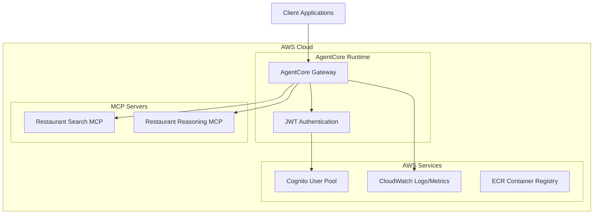

# AgentCore Gateway MCP Tools - Deployment Guide

## Overview

This guide provides comprehensive instructions for deploying the AgentCore Gateway for MCP Tools to Amazon Bedrock AgentCore Runtime. The Gateway exposes restaurant search and reasoning MCP tools through RESTful HTTP endpoints with JWT authentication.

## Prerequisites

### Required AWS Services

1. **AWS Account** with appropriate permissions
2. **Amazon Bedrock AgentCore** access enabled
3. **AWS Cognito User Pool** (existing: `us-east-1_KePRX24Bn`)
4. **Docker** installed for container building
5. **AWS CLI** configured with appropriate credentials

### Required Permissions

Your AWS user/role must have the following managed policies:
- `AmazonBedrockFullAccess`
- `AmazonECRFullAccess` 
- `AWSCodeBuildDeveloperAccess`
- `IAMFullAccess` (for service role creation)

### System Requirements

- **Platform**: Linux/ARM64 (required for AgentCore Runtime)
- **Python**: 3.10 or higher
- **Memory**: Minimum 2GB RAM
- **Storage**: Minimum 10GB available space

## Architecture Overview



## Deployment Methods

### Method 1: Automated Deployment (Recommended)

Use the provided deployment script for automated setup:

```bash
# 1. Navigate to project directory
cd agentcore-gateway-mcp-tools

# 2. Install dependencies
pip install -r requirements.txt

# 3. Run automated deployment
python scripts/deploy_agentcore.py
```

### Method 2: Manual Deployment

Follow these steps for manual deployment with full control:

#### Step 1: Prepare Container Image

1. **Build ARM64 Container**:
```bash
# Build for ARM64 platform (required for AgentCore)
docker build --platform linux/arm64 -t agentcore-gateway-mcp-tools .

# Verify platform
docker inspect agentcore-gateway-mcp-tools | grep Architecture
```

2. **Test Container Locally**:
```bash
# Run container locally for testing
docker run --platform linux/arm64 -p 8080:8080 \
  -e AWS_REGION=us-east-1 \
  -e COGNITO_USER_POOL_ID=us-east-1_KePRX24Bn \
  -e COGNITO_CLIENT_ID=1ofgeckef3po4i3us4j1m4chvd \
  agentcore-gateway-mcp-tools

# Test health endpoint
curl http://localhost:8080/health
```

#### Step 2: Push to ECR

1. **Create ECR Repository**:
```bash
# Create repository
aws ecr create-repository \
  --repository-name agentcore-gateway-mcp-tools \
  --region us-east-1

# Get login token
aws ecr get-login-password --region us-east-1 | \
  docker login --username AWS --password-stdin \
  <account-id>.dkr.ecr.us-east-1.amazonaws.com
```

2. **Tag and Push Image**:
```bash
# Tag image
docker tag agentcore-gateway-mcp-tools:latest \
  <account-id>.dkr.ecr.us-east-1.amazonaws.com/agentcore-gateway-mcp-tools:latest

# Push image
docker push <account-id>.dkr.ecr.us-east-1.amazonaws.com/agentcore-gateway-mcp-tools:latest
```

#### Step 3: Deploy to AgentCore

1. **Validate Configuration**:
```bash
# Validate AgentCore configuration
python scripts/validate_deployment_config.py
```

2. **Deploy Using AgentCore CLI**:
```bash
# Configure AgentCore
agentcore configure -e main.py

# Deploy to AgentCore Runtime
agentcore launch --config .bedrock_agentcore.yaml
```

## Configuration Files

### 1. AgentCore Configuration (.bedrock_agentcore.yaml)

```yaml
name: "agentcore-gateway-mcp-tools"
description: "Gateway service exposing MCP tools through REST API"
version: "1.0.0"

# Container configuration
container:
  image: "<account-id>.dkr.ecr.us-east-1.amazonaws.com/agentcore-gateway-mcp-tools:latest"
  platform: "linux/arm64"  # Required for AgentCore Runtime
  port: 8080
  
# Network configuration
network:
  mode: "PUBLIC"  # or "PRIVATE" for VPC deployment
  
# Authentication configuration
authentication:
  type: "customJWTAuthorizer"
  config:
    allowedClients:
      - "1ofgeckef3po4i3us4j1m4chvd"
    discoveryUrl: "https://cognito-idp.us-east-1.amazonaws.com/us-east-1_KePRX24Bn/.well-known/openid-configuration"

# Environment variables
environment:
  AWS_REGION: "us-east-1"
  COGNITO_USER_POOL_ID: "us-east-1_KePRX24Bn"
  COGNITO_CLIENT_ID: "1ofgeckef3po4i3us4j1m4chvd"
  MCP_SEARCH_SERVER_URL: "http://restaurant-search-mcp:8080"
  MCP_REASONING_SERVER_URL: "http://restaurant-reasoning-mcp:8080"
  LOG_LEVEL: "INFO"

# Resource allocation
resources:
  cpu: "1 vCPU"
  memory: "2 GB"
  
# Scaling configuration
scaling:
  min_instances: 1
  max_instances: 10
  target_cpu_utilization: 70

# Observability
observability:
  enabled: true
  cloudwatch:
    logs: true
    metrics: true
  xray:
    tracing: true
```

### 2. Cognito Configuration (cognito_config.json)

```json
{
  "user_pool_id": "us-east-1_KePRX24Bn",
  "client_id": "1ofgeckef3po4i3us4j1m4chvd",
  "client_secret": "t69uogl8jl9qu9nvsrpifu0gpruj02l9q8rnoci36bipc8me4r9",
  "region": "us-east-1",
  "discovery_url": "https://cognito-idp.us-east-1.amazonaws.com/us-east-1_KePRX24Bn/.well-known/openid-configuration",
  "jwks_uri": "https://cognito-idp.us-east-1.amazonaws.com/us-east-1_KePRX24Bn/.well-known/jwks.json",
  "issuer": "https://cognito-idp.us-east-1.amazonaws.com/us-east-1_KePRX24Bn",
  "algorithms": ["RS256"],
  "audience": "1ofgeckef3po4i3us4j1m4chvd"
}
```

### 3. Environment-Specific Configurations

#### Development Environment (config/development.json)
```json
{
  "environment": "development",
  "debug": true,
  "log_level": "DEBUG",
  "mcp_servers": {
    "search_server": {
      "url": "http://localhost:8081",
      "timeout": 30,
      "max_retries": 3
    },
    "reasoning_server": {
      "url": "http://localhost:8082",
      "timeout": 30,
      "max_retries": 3
    }
  },
  "rate_limiting": {
    "enabled": false
  }
}
```

#### Production Environment (config/production.json)
```json
{
  "environment": "production",
  "debug": false,
  "log_level": "INFO",
  "mcp_servers": {
    "search_server": {
      "url": "http://restaurant-search-mcp:8080",
      "timeout": 10,
      "max_retries": 3
    },
    "reasoning_server": {
      "url": "http://restaurant-reasoning-mcp:8080",
      "timeout": 15,
      "max_retries": 3
    }
  },
  "rate_limiting": {
    "enabled": true,
    "requests_per_minute": 100,
    "burst_limit": 20
  },
  "observability": {
    "cloudwatch_metrics": true,
    "structured_logging": true,
    "performance_monitoring": true
  }
}
```

## Deployment Validation

### 1. Pre-Deployment Checks

Run the validation script before deployment:

```bash
python scripts/validate_deployment_config.py
```

This script validates:
- AgentCore configuration syntax
- Cognito User Pool accessibility
- Container image availability
- Required environment variables
- Network connectivity to MCP servers

### 2. Post-Deployment Verification

After successful deployment, verify the service:

```bash
# Get deployment status
agentcore status

# Test health endpoint
curl -X GET "https://your-gateway-url/health"

# Test authenticated endpoint
curl -X POST "https://your-gateway-url/api/v1/restaurants/search/district" \
  -H "Authorization: Bearer YOUR_JWT_TOKEN" \
  -H "Content-Type: application/json" \
  -d '{"districts": ["Central district"]}'
```

### 3. Integration Testing

Run the comprehensive test suite:

```bash
# Run all tests
python -m pytest tests/ -v

# Run specific test categories
python -m pytest tests/test_api_endpoints_e2e.py -v
python -m pytest tests/test_auth_middleware.py -v
python -m pytest tests/test_mcp_client_integration.py -v
```

## Environment-Specific Deployment

### Development Environment

1. **Local Development Setup**:
```bash
# Install development dependencies
pip install -r requirements-dev.txt

# Start local MCP servers
docker-compose up -d mcp-servers

# Run Gateway locally
python main.py --config config/development.json
```

2. **Development AgentCore Deployment**:
```bash
# Deploy to development environment
agentcore launch --environment development
```

### Staging Environment

1. **Staging Configuration**:
```yaml
# .bedrock_agentcore.staging.yaml
name: "agentcore-gateway-mcp-tools-staging"
environment: "staging"
network:
  mode: "PRIVATE"
  vpc_config:
    vpc_id: "vpc-staging"
    subnet_ids: ["subnet-staging-1", "subnet-staging-2"]
```

2. **Deploy to Staging**:
```bash
agentcore launch --config .bedrock_agentcore.staging.yaml
```

### Production Environment

1. **Production Security Configuration**:
```yaml
# Enhanced security for production
authentication:
  type: "customJWTAuthorizer"
  config:
    allowedClients:
      - "1ofgeckef3po4i3us4j1m4chvd"
    discoveryUrl: "https://cognito-idp.us-east-1.amazonaws.com/us-east-1_KePRX24Bn/.well-known/openid-configuration"
    tokenValidation:
      strict: true
      clockSkew: 300  # 5 minutes
      
network:
  mode: "PRIVATE"
  vpc_config:
    vpc_id: "vpc-production"
    subnet_ids: ["subnet-prod-1", "subnet-prod-2"]
    security_group_ids: ["sg-gateway-prod"]
    
observability:
  enabled: true
  cloudwatch:
    logs: true
    metrics: true
    retention_days: 30
  xray:
    tracing: true
    sampling_rate: 0.1
```

2. **Production Deployment**:
```bash
# Deploy to production
agentcore launch --config .bedrock_agentcore.yaml --environment production

# Verify production deployment
python scripts/verify_production_deployment.py
```

## Monitoring and Observability

### CloudWatch Integration

1. **Metrics Dashboard**:
   - Request count and rate
   - Response times and latency
   - Error rates by endpoint
   - Authentication success/failure rates
   - MCP server health status

2. **Log Groups**:
   - `/aws/agentcore/agentcore-gateway-mcp-tools/application`
   - `/aws/agentcore/agentcore-gateway-mcp-tools/access`
   - `/aws/agentcore/agentcore-gateway-mcp-tools/error`

3. **Alarms**:
```bash
# Create CloudWatch alarms
aws cloudwatch put-metric-alarm \
  --alarm-name "Gateway-High-Error-Rate" \
  --alarm-description "High error rate in Gateway" \
  --metric-name "ErrorRate" \
  --namespace "AgentCore/Gateway" \
  --statistic "Average" \
  --period 300 \
  --threshold 5.0 \
  --comparison-operator "GreaterThanThreshold"
```

### X-Ray Tracing

Enable distributed tracing for performance monitoring:

```python
# X-Ray configuration in main.py
from aws_xray_sdk.core import xray_recorder
from aws_xray_sdk.core import patch_all

# Patch AWS SDK calls
patch_all()

# Configure X-Ray
xray_recorder.configure(
    context_missing='LOG_ERROR',
    plugins=('EC2Plugin', 'ECSPlugin'),
    daemon_address='127.0.0.1:2000'
)
```

## Security Configuration

### Network Security

1. **VPC Configuration** (Production):
```yaml
network:
  mode: "PRIVATE"
  vpc_config:
    vpc_id: "vpc-12345678"
    subnet_ids: ["subnet-12345678", "subnet-87654321"]
    security_group_ids: ["sg-gateway-12345678"]
```

2. **Security Group Rules**:
```bash
# Allow HTTPS traffic
aws ec2 authorize-security-group-ingress \
  --group-id sg-gateway-12345678 \
  --protocol tcp \
  --port 443 \
  --cidr 0.0.0.0/0

# Allow internal MCP communication
aws ec2 authorize-security-group-ingress \
  --group-id sg-gateway-12345678 \
  --protocol tcp \
  --port 8080 \
  --source-group sg-mcp-servers
```

### Authentication Security

1. **JWT Token Validation**:
   - Signature verification using Cognito JWKS
   - Token expiration checking
   - Audience validation
   - Issuer validation

2. **Rate Limiting**:
   - 100 requests per minute per user
   - Burst protection (20 requests per 10 seconds)
   - IP-based rate limiting for unauthenticated endpoints

### Data Protection

1. **Encryption in Transit**:
   - TLS 1.2+ for all communications
   - Certificate management through AWS Certificate Manager

2. **Encryption at Rest**:
   - CloudWatch Logs encryption
   - Container image encryption in ECR

## Scaling and Performance

### Auto Scaling Configuration

```yaml
scaling:
  min_instances: 2      # Minimum for high availability
  max_instances: 20     # Maximum for cost control
  target_cpu_utilization: 70
  target_memory_utilization: 80
  scale_up_cooldown: 300    # 5 minutes
  scale_down_cooldown: 600  # 10 minutes
```

### Performance Optimization

1. **Container Optimization**:
   - Multi-stage Docker builds
   - Minimal base images
   - Layer caching optimization

2. **Application Optimization**:
   - Connection pooling for MCP clients
   - Response caching for metadata endpoints
   - Async request processing

3. **Resource Allocation**:
   - CPU: 1-2 vCPUs per instance
   - Memory: 2-4 GB per instance
   - Storage: Minimal (stateless application)

## Backup and Disaster Recovery

### Configuration Backup

1. **Version Control**:
   - All configuration files in Git
   - Tagged releases for deployment versions
   - Environment-specific branches

2. **Configuration Export**:
```bash
# Export current AgentCore configuration
agentcore export-config --output backup/config-$(date +%Y%m%d).yaml
```

### Disaster Recovery

1. **Multi-Region Deployment**:
   - Primary: us-east-1
   - Secondary: us-west-2
   - Cross-region replication for critical data

2. **Recovery Procedures**:
```bash
# Restore from backup
agentcore launch --config backup/config-20250103.yaml

# Verify restoration
python scripts/verify_deployment.py
```

## Troubleshooting

### Common Deployment Issues

1. **Container Build Failures**:
```bash
# Check build logs
docker build --platform linux/arm64 --progress=plain -t test .

# Verify ARM64 support
docker buildx ls
```

2. **Authentication Issues**:
```bash
# Test Cognito connectivity
curl -X GET "https://cognito-idp.us-east-1.amazonaws.com/us-east-1_KePRX24Bn/.well-known/openid-configuration"

# Validate JWT token
python scripts/validate_jwt_token.py --token YOUR_TOKEN
```

3. **MCP Server Connectivity**:
```bash
# Test MCP server health
curl -X GET "http://restaurant-search-mcp:8080/health"
curl -X GET "http://restaurant-reasoning-mcp:8080/health"
```

### Debugging Tools

1. **Enable Debug Mode**:
```yaml
environment:
  LOG_LEVEL: "DEBUG"
  DEBUG_MODE: "true"
```

2. **Access Logs**:
```bash
# View application logs
aws logs tail /aws/agentcore/agentcore-gateway-mcp-tools/application --follow

# View access logs
aws logs tail /aws/agentcore/agentcore-gateway-mcp-tools/access --follow
```

3. **Health Check Debugging**:
```bash
# Detailed health check
curl -X GET "https://your-gateway-url/health?detailed=true"
```

## Maintenance and Updates

### Rolling Updates

1. **Update Process**:
```bash
# Build new image version
docker build --platform linux/arm64 -t agentcore-gateway-mcp-tools:v1.1.0 .

# Push to ECR
docker push <account-id>.dkr.ecr.us-east-1.amazonaws.com/agentcore-gateway-mcp-tools:v1.1.0

# Update AgentCore configuration
# Edit .bedrock_agentcore.yaml to use new image version

# Deploy update
agentcore update --config .bedrock_agentcore.yaml
```

2. **Rollback Procedure**:
```bash
# Rollback to previous version
agentcore rollback --version v1.0.0
```

### Monitoring Updates

1. **Health Monitoring During Updates**:
```bash
# Monitor deployment progress
watch -n 5 'agentcore status'

# Monitor health endpoint
watch -n 10 'curl -s https://your-gateway-url/health | jq .status'
```

## Cost Optimization

### Resource Optimization

1. **Right-sizing Instances**:
   - Monitor CPU and memory utilization
   - Adjust resource allocation based on usage patterns
   - Use spot instances for development environments

2. **Auto-scaling Optimization**:
   - Fine-tune scaling thresholds
   - Implement predictive scaling for known traffic patterns
   - Use scheduled scaling for predictable workloads

### Cost Monitoring

1. **Cost Allocation Tags**:
```yaml
tags:
  Environment: "production"
  Project: "agentcore-gateway-mcp-tools"
  CostCenter: "engineering"
  Owner: "platform-team"
```

2. **Budget Alerts**:
```bash
# Create budget for AgentCore costs
aws budgets create-budget \
  --account-id <account-id> \
  --budget file://budget-config.json
```

## Support and Documentation

### Additional Resources

- **API Documentation**: `/docs/API_DOCUMENTATION.md`
- **Authentication Guide**: `/docs/AUTHENTICATION_GUIDE.md`
- **Troubleshooting Guide**: `/docs/TROUBLESHOOTING_GUIDE.md`
- **Integration Examples**: `/docs/INTEGRATION_EXAMPLES.md`

### Getting Help

1. **Documentation**: Comprehensive guides in `/docs/` directory
2. **Logs**: CloudWatch logs for debugging
3. **Metrics**: CloudWatch dashboards for monitoring
4. **Testing**: Automated test suite for validation

---

**Last Updated**: January 3, 2025  
**Version**: 1.0.0  
**Deployment Target**: Amazon Bedrock AgentCore Runtime  
**Platform**: linux/arm64