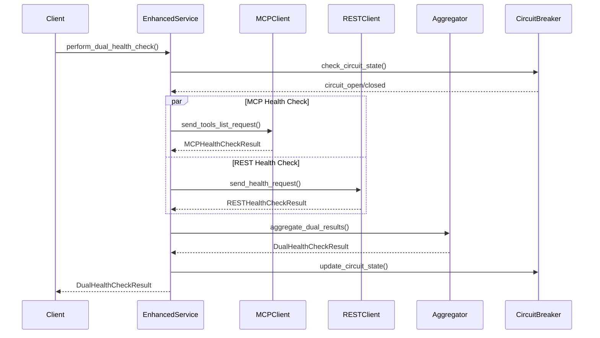

# Enhanced MCP Status Check - Developer Guide

## Overview

This developer guide provides comprehensive information for extending, customizing, and contributing to the Enhanced MCP Status Check system. The system is designed with modularity and extensibility in mind, allowing developers to add new monitoring methods, custom validation logic, and integration patterns.

## Table of Contents

1. [Architecture Overview](#architecture-overview)
2. [Development Environment Setup](#development-environment-setup)
3. [Core Components](#core-components)
4. [Extending the System](#extending-the-system)
5. [Custom Health Check Implementations](#custom-health-check-implementations)
6. [Plugin Development](#plugin-development)
7. [Testing Guidelines](#testing-guidelines)
8. [Contributing](#contributing)

## Architecture Overview

### System Architecture

The Enhanced MCP Status Check system follows a modular architecture with clear separation of concerns:

```
┌─────────────────────────────────────────────────────────────┐
│                    Enhanced Status Check System             │
├─────────────────────────────────────────────────────────────┤
│  ┌─────────────────┐  ┌─────────────────┐  ┌─────────────┐  │
│  │   MCP Health    │  │   REST Health   │  │   Result    │  │
│  │   Check Client  │  │   Check Client  │  │ Aggregator  │  │
│  └─────────────────┘  └─────────────────┘  └─────────────┘  │
├─────────────────────────────────────────────────────────────┤
│  ┌─────────────────┐  ┌─────────────────┐  ┌─────────────┐  │
│  │   Enhanced      │  │   Circuit       │  │   Metrics   │  │
│  │   Service       │  │   Breaker       │  │ Collector   │  │
│  └─────────────────┘  └─────────────────┘  └─────────────┘  │
├─────────────────────────────────────────────────────────────┤
│  ┌─────────────────┐  ┌─────────────────┐  ┌─────────────┐  │
│  │ Configuration   │  │ Authentication  │  │   Error     │  │
│  │   Management    │  │    Service      │  │  Handler    │  │
│  └─────────────────┘  └─────────────────┘  └─────────────┘  │
└─────────────────────────────────────────────────────────────┘
```

### Key Design Principles

1. **Modularity**: Each component has a single responsibility
2. **Extensibility**: Easy to add new monitoring methods and validators
3. **Configurability**: All behavior is configurable through JSON/YAML
4. **Observability**: Comprehensive logging, metrics, and tracing
5. **Reliability**: Fault tolerance and graceful degradation

### Component Interaction Flow



## Development Environment Setup

### Prerequisites

- Python 3.10 or higher
- Git
- Docker (optional, for containerized development)
- IDE with Python support (VS Code, PyCharm, etc.)

### Local Development Setup

1. **Clone the Repository**
```bash
git clone <repository-url>
cd enhanced-mcp-status-check
```

2. **Create Virtual Environment**
```bash
python -m venv venv
source venv/bin/activate  # On Windows: venv\Scripts\activate
```

3. **Install Dependencies**
```bash
# Install development dependencies
pip install -r requirements-dev.txt

# Install package in editable mode
pip install -e .
```

4. **Set Up Pre-commit Hooks**
```bash
pre-commit install
```

5. **Run Tests**
```bash
# Run all tests
python -m pytest tests/ -v

# Run with coverage
python -m pytest tests/ --cov=enhanced_mcp_status_check --cov-report=html
```

### Development Configuration

Create a development configuration file `config/development.json`:

```json
{
  "enhanced_status_check_system": {
    "dual_monitoring_enabled": true,
    "global_settings": {
      "check_interval_seconds": 5,
      "max_concurrent_checks": 5,
      "retry_attempts": 2
    },
    "servers": [
      {
        "server_name": "test-server",
        "mcp_endpoint_url": "http://localhost:8080/mcp",
        "rest_health_endpoint_url": "http://localhost:8080/status/health",
        "mcp_enabled": true,
        "rest_enabled": true
      }
    ],
    "observability": {
      "logging_level": "DEBUG",
      "debug_mode": true,
      "request_response_logging": true
    }
  }
}
```

## Core Components

### 1. Health Check Clients

#### MCP Health Check Client

The `MCPHealthCheckClient` handles MCP protocol-specific health checks:

```python
from enhanced_mcp_status_check.services.mcp_health_check_client import MCPHealthCheckClient
from enhanced_mcp_status_check.models.dual_health_models import MCPHealthCheckResult

class CustomMCPClient(MCPHealthCheckClient):
    async def send_tools_list_request(
        self, 
        endpoint_url: str, 
        auth_headers: Dict[str, str],
        timeout: int
    ) -> MCPHealthCheckResult:
        """Custom MCP tools/list request implementation."""
        # Add custom logic before/after the request
        result = await super().send_tools_list_request(
            endpoint_url, auth_headers, timeout
        )
        
        # Custom post-processing
        if result.success:
            await self._custom_validation(result)
        
        return result
    
    async def _custom_validation(self, result: MCPHealthCheckResult):
        """Custom validation logic for MCP responses."""
        # Implement custom validation
        pass
```

#### REST Health Check Client

The `RESTHealthCheckClient` handles HTTP REST API health checks:

```python
from enhanced_mcp_status_check.services.rest_health_check_client import RESTHealthCheckClient
from enhanced_mcp_status_check.models.dual_health_models import RESTHealthCheckResult

class CustomRESTClient(RESTHealthCheckClient):
    async def send_health_request(
        self, 
        health_endpoint_url: str,
        auth_headers: Dict[str, str],
        timeout: int
    ) -> RESTHealthCheckResult:
        """Custom REST health check implementation."""
        # Add custom headers or preprocessing
        custom_headers = {**auth_headers, "X-Custom-Header": "value"}
        
        result = await super().send_health_request(
            health_endpoint_url, custom_headers, timeout
        )
        
        # Custom response validation
        if result.success:
            await self._validate_custom_metrics(result)
        
        return result
    
    async def _validate_custom_metrics(self, result: RESTHealthCheckResult):
        """Validate custom metrics in REST response."""
        response_body = result.response_body
        if response_body and "custom_metric" in response_body:
            # Validate custom metrics
            pass
```

### 2. Result Aggregation

#### Health Result Aggregator

The `HealthResultAggregator` combines MCP and REST results:

```python
from enhanced_mcp_status_check.services.health_result_aggregator import HealthResultAggregator
from enhanced_mcp_status_check.models.dual_health_models import DualHealthCheckResult

class CustomAggregator(HealthResultAggregator):
    def aggregate_dual_results(
        self, 
        mcp_result: MCPHealthCheckResult,
        rest_result: RESTHealthCheckResult,
        aggregation_config: AggregationConfig
    ) -> DualHealthCheckResult:
        """Custom aggregation logic."""
        # Apply custom business rules
        if self._is_critical_server(mcp_result.server_name):
            # Require both checks to succeed for critical servers
            overall_success = mcp_result.success and rest_result.success
        else:
            # Use default aggregation for non-critical servers
            overall_success = self._default_aggregation(mcp_result, rest_result)
        
        # Create custom result
        return DualHealthCheckResult(
            server_name=mcp_result.server_name,
            timestamp=datetime.utcnow(),
            overall_status=self._determine_status(overall_success),
            overall_success=overall_success,
            mcp_result=mcp_result,
            rest_result=rest_result,
            # ... other fields
        )
    
    def _is_critical_server(self, server_name: str) -> bool:
        """Determine if server is critical."""
        critical_servers = ["payment-service", "auth-service"]
        return server_name in critical_servers
```

### 3. Configuration Management

#### Custom Configuration Loaders

Extend configuration loading for custom formats:

```python
from enhanced_mcp_status_check.config.config_loader import ConfigLoader
from enhanced_mcp_status_check.config.enhanced_status_config import EnhancedStatusConfig

class YAMLConfigLoader(ConfigLoader):
    @classmethod
    def load_config(cls, config_path: str) -> EnhancedStatusConfig:
        """Load configuration from YAML file."""
        import yaml
        
        with open(config_path, 'r') as file:
            config_data = yaml.safe_load(file)
        
        return cls._parse_config(config_data)
    
    @classmethod
    def _parse_config(cls, config_data: dict) -> EnhancedStatusConfig:
        """Parse configuration data into EnhancedStatusConfig."""
        # Custom parsing logic
        return EnhancedStatusConfig(**config_data)
```

#### Configuration Validation

Add custom validation rules:

```python
from enhanced_mcp_status_check.config.config_validator import ConfigValidator

class CustomConfigValidator(ConfigValidator):
    def validate_server_config(self, server_config: dict) -> List[str]:
        """Custom server configuration validation."""
        errors = super().validate_server_config(server_config)
        
        # Add custom validation rules
        if server_config.get("server_name") in ["prod-server"]:
            if not server_config.get("require_both_success"):
                errors.append("Production servers must require both MCP and REST success")
        
        return errors
```

## Extending the System

### Adding New Health Check Methods

To add a new health check method (e.g., GraphQL health checks):

1. **Create Health Check Client**

```python
from enhanced_mcp_status_check.models.dual_health_models import BaseHealthCheckResult
from datetime import datetime
from typing import Dict, Optional

@dataclass
class GraphQLHealthCheckResult(BaseHealthCheckResult):
    """GraphQL-specific health check result."""
    query_response: Optional[Dict[str, Any]] = None
    schema_validation: bool = False
    introspection_success: bool = False

class GraphQLHealthCheckClient:
    """GraphQL health check client."""
    
    async def send_introspection_query(
        self, 
        endpoint_url: str,
        auth_headers: Dict[str, str],
        timeout: int
    ) -> GraphQLHealthCheckResult:
        """Send GraphQL introspection query."""
        start_time = time.time()
        
        try:
            introspection_query = """
            query IntrospectionQuery {
                __schema {
                    queryType { name }
                    mutationType { name }
                    subscriptionType { name }
                }
            }
            """
            
            async with aiohttp.ClientSession() as session:
                async with session.post(
                    endpoint_url,
                    json={"query": introspection_query},
                    headers=auth_headers,
                    timeout=aiohttp.ClientTimeout(total=timeout)
                ) as response:
                    response_time = (time.time() - start_time) * 1000
                    response_data = await response.json()
                    
                    return GraphQLHealthCheckResult(
                        server_name="",  # Will be set by caller
                        timestamp=datetime.utcnow(),
                        success=response.status == 200 and "data" in response_data,
                        response_time_ms=response_time,
                        query_response=response_data,
                        schema_validation=self._validate_schema(response_data),
                        introspection_success="__schema" in response_data.get("data", {})
                    )
        
        except Exception as e:
            response_time = (time.time() - start_time) * 1000
            return GraphQLHealthCheckResult(
                server_name="",
                timestamp=datetime.utcnow(),
                success=False,
                response_time_ms=response_time,
                error_message=str(e)
            )
    
    def _validate_schema(self, response_data: Dict[str, Any]) -> bool:
        """Validate GraphQL schema response."""
        try:
            schema = response_data.get("data", {}).get("__schema", {})
            return bool(schema.get("queryType"))
        except:
            return False
```

2. **Extend Enhanced Health Check Service**

```python
from enhanced_mcp_status_check.services.enhanced_health_check_service import EnhancedHealthCheckService

class TripleHealthCheckService(EnhancedHealthCheckService):
    """Enhanced service with MCP, REST, and GraphQL health checks."""
    
    def __init__(self, config: EnhancedStatusConfig):
        super().__init__(config)
        self.graphql_client = GraphQLHealthCheckClient()
    
    async def perform_triple_health_check(
        self, 
        server_config: EnhancedServerConfig
    ) -> TripleHealthCheckResult:
        """Perform MCP, REST, and GraphQL health checks."""
        
        # Perform all three checks concurrently
        mcp_task = self.perform_mcp_health_check(server_config)
        rest_task = self.perform_rest_health_check(server_config)
        graphql_task = self._perform_graphql_health_check(server_config)
        
        mcp_result, rest_result, graphql_result = await asyncio.gather(
            mcp_task, rest_task, graphql_task, return_exceptions=True
        )
        
        # Aggregate all three results
        return self._aggregate_triple_results(
            mcp_result, rest_result, graphql_result, server_config
        )
    
    async def _perform_graphql_health_check(
        self, 
        server_config: EnhancedServerConfig
    ) -> GraphQLHealthCheckResult:
        """Perform GraphQL health check."""
        if not hasattr(server_config, 'graphql_endpoint_url'):
            return GraphQLHealthCheckResult(
                server_name=server_config.server_name,
                timestamp=datetime.utcnow(),
                success=False,
                response_time_ms=0,
                error_message="GraphQL endpoint not configured"
            )
        
        result = await self.graphql_client.send_introspection_query(
            server_config.graphql_endpoint_url,
            server_config.auth_headers or {},
            server_config.graphql_timeout_seconds or 10
        )
        
        result.server_name = server_config.server_name
        return result
```

### Custom Metrics Collection

Add custom metrics for new health check methods:

```python
from enhanced_mcp_status_check.services.dual_metrics_collector import DualMetricsCollector

class TripleMetricsCollector(DualMetricsCollector):
    """Metrics collector for MCP, REST, and GraphQL health checks."""
    
    def __init__(self):
        super().__init__()
        self.graphql_metrics = {}
    
    def record_graphql_health_check(
        self, 
        server_name: str, 
        result: GraphQLHealthCheckResult
    ):
        """Record GraphQL health check metrics."""
        if server_name not in self.graphql_metrics:
            self.graphql_metrics[server_name] = {
                "total_checks": 0,
                "successful_checks": 0,
                "failed_checks": 0,
                "total_response_time": 0,
                "schema_validation_successes": 0,
                "introspection_successes": 0
            }
        
        metrics = self.graphql_metrics[server_name]
        metrics["total_checks"] += 1
        metrics["total_response_time"] += result.response_time_ms
        
        if result.success:
            metrics["successful_checks"] += 1
        else:
            metrics["failed_checks"] += 1
        
        if result.schema_validation:
            metrics["schema_validation_successes"] += 1
        
        if result.introspection_success:
            metrics["introspection_successes"] += 1
    
    def get_graphql_metrics(self, server_name: str) -> Dict[str, Any]:
        """Get GraphQL metrics for a server."""
        if server_name not in self.graphql_metrics:
            return {}
        
        metrics = self.graphql_metrics[server_name]
        total_checks = metrics["total_checks"]
        
        if total_checks == 0:
            return metrics
        
        return {
            **metrics,
            "success_rate": metrics["successful_checks"] / total_checks,
            "failure_rate": metrics["failed_checks"] / total_checks,
            "average_response_time": metrics["total_response_time"] / total_checks,
            "schema_validation_rate": metrics["schema_validation_successes"] / total_checks,
            "introspection_success_rate": metrics["introspection_successes"] / total_checks
        }
```

## Custom Health Check Implementations

### Business Logic Validators

Implement custom business logic for health validation:

```python
from enhanced_mcp_status_check.services.health_result_aggregator import HealthResultAggregator

class BusinessLogicAggregator(HealthResultAggregator):
    """Aggregator with custom business logic."""
    
    def __init__(self, business_rules: Dict[str, Any]):
        super().__init__()
        self.business_rules = business_rules
    
    def aggregate_dual_results(
        self, 
        mcp_result: MCPHealthCheckResult,
        rest_result: RESTHealthCheckResult,
        aggregation_config: AggregationConfig
    ) -> DualHealthCheckResult:
        """Apply business rules to health check aggregation."""
        
        # Get server-specific rules
        server_rules = self.business_rules.get(
            mcp_result.server_name, 
            self.business_rules.get("default", {})
        )
        
        # Apply time-based rules
        if self._is_maintenance_window():
            return self._create_maintenance_result(mcp_result, rest_result)
        
        # Apply criticality-based rules
        if server_rules.get("criticality") == "high":
            return self._apply_high_criticality_rules(mcp_result, rest_result)
        
        # Apply dependency-based rules
        if server_rules.get("dependencies"):
            return self._apply_dependency_rules(
                mcp_result, rest_result, server_rules["dependencies"]
            )
        
        # Default aggregation
        return super().aggregate_dual_results(
            mcp_result, rest_result, aggregation_config
        )
    
    def _is_maintenance_window(self) -> bool:
        """Check if current time is in maintenance window."""
        now = datetime.utcnow()
        maintenance_start = now.replace(hour=2, minute=0, second=0, microsecond=0)
        maintenance_end = now.replace(hour=4, minute=0, second=0, microsecond=0)
        return maintenance_start <= now <= maintenance_end
    
    def _apply_high_criticality_rules(
        self, 
        mcp_result: MCPHealthCheckResult,
        rest_result: RESTHealthCheckResult
    ) -> DualHealthCheckResult:
        """Apply rules for high-criticality servers."""
        # Require both checks to succeed
        overall_success = mcp_result.success and rest_result.success
        
        # Lower tolerance for response times
        if mcp_result.response_time_ms > 1000 or rest_result.response_time_ms > 1000:
            overall_success = False
        
        return self._create_dual_result(
            mcp_result, rest_result, overall_success, "high_criticality"
        )
```

### Custom Circuit Breaker Logic

Implement custom circuit breaker behavior:

```python
from enhanced_mcp_status_check.services.enhanced_circuit_breaker import EnhancedCircuitBreaker

class AdaptiveCircuitBreaker(EnhancedCircuitBreaker):
    """Circuit breaker with adaptive thresholds."""
    
    def __init__(self, config: Dict[str, Any]):
        super().__init__(config)
        self.adaptive_thresholds = {}
    
    async def evaluate_circuit_state(
        self, 
        server_name: str,
        dual_result: DualHealthCheckResult
    ) -> EnhancedCircuitBreakerState:
        """Evaluate circuit state with adaptive thresholds."""
        
        # Update adaptive thresholds based on historical data
        self._update_adaptive_thresholds(server_name, dual_result)
        
        # Get current thresholds
        thresholds = self.adaptive_thresholds.get(server_name, {
            "failure_threshold": 5,
            "success_threshold": 3,
            "timeout_threshold": 10000  # ms
        })
        
        # Apply adaptive logic
        current_state = await super().evaluate_circuit_state(server_name, dual_result)
        
        # Modify state based on adaptive thresholds
        if dual_result.combined_response_time_ms > thresholds["timeout_threshold"]:
            current_state.mcp_circuit_open = True
            current_state.rest_circuit_open = True
            current_state.reason = "Adaptive timeout threshold exceeded"
        
        return current_state
    
    def _update_adaptive_thresholds(
        self, 
        server_name: str, 
        dual_result: DualHealthCheckResult
    ):
        """Update adaptive thresholds based on performance history."""
        if server_name not in self.adaptive_thresholds:
            self.adaptive_thresholds[server_name] = {
                "failure_threshold": 5,
                "success_threshold": 3,
                "timeout_threshold": 10000,
                "response_times": []
            }
        
        thresholds = self.adaptive_thresholds[server_name]
        
        # Track response times for adaptive timeout calculation
        thresholds["response_times"].append(dual_result.combined_response_time_ms)
        
        # Keep only last 100 measurements
        if len(thresholds["response_times"]) > 100:
            thresholds["response_times"] = thresholds["response_times"][-100:]
        
        # Calculate adaptive timeout (95th percentile + buffer)
        if len(thresholds["response_times"]) >= 10:
            sorted_times = sorted(thresholds["response_times"])
            p95_index = int(len(sorted_times) * 0.95)
            p95_time = sorted_times[p95_index]
            thresholds["timeout_threshold"] = p95_time * 1.5  # 50% buffer
```

## Plugin Development

### Plugin Interface

Create a plugin interface for extensibility:

```python
from abc import ABC, abstractmethod
from typing import Any, Dict, List, Optional

class HealthCheckPlugin(ABC):
    """Base class for health check plugins."""
    
    @abstractmethod
    def get_plugin_name(self) -> str:
        """Return the plugin name."""
        pass
    
    @abstractmethod
    def get_plugin_version(self) -> str:
        """Return the plugin version."""
        pass
    
    @abstractmethod
    async def perform_health_check(
        self, 
        server_config: Dict[str, Any],
        context: Dict[str, Any]
    ) -> Dict[str, Any]:
        """Perform the health check."""
        pass
    
    @abstractmethod
    def validate_config(self, config: Dict[str, Any]) -> List[str]:
        """Validate plugin configuration."""
        pass
    
    def get_required_config_keys(self) -> List[str]:
        """Return required configuration keys."""
        return []
    
    def get_optional_config_keys(self) -> List[str]:
        """Return optional configuration keys."""
        return []

class DatabaseHealthCheckPlugin(HealthCheckPlugin):
    """Plugin for database health checks."""
    
    def get_plugin_name(self) -> str:
        return "database_health_check"
    
    def get_plugin_version(self) -> str:
        return "1.0.0"
    
    async def perform_health_check(
        self, 
        server_config: Dict[str, Any],
        context: Dict[str, Any]
    ) -> Dict[str, Any]:
        """Perform database health check."""
        db_url = server_config.get("database_url")
        if not db_url:
            return {
                "success": False,
                "error": "Database URL not configured"
            }
        
        try:
            # Perform database connectivity check
            import asyncpg
            conn = await asyncpg.connect(db_url)
            
            # Simple query to test connectivity
            result = await conn.fetchval("SELECT 1")
            await conn.close()
            
            return {
                "success": True,
                "response_time_ms": context.get("response_time", 0),
                "database_responsive": result == 1
            }
        
        except Exception as e:
            return {
                "success": False,
                "error": str(e)
            }
    
    def validate_config(self, config: Dict[str, Any]) -> List[str]:
        """Validate database plugin configuration."""
        errors = []
        
        if not config.get("database_url"):
            errors.append("database_url is required")
        
        return errors
    
    def get_required_config_keys(self) -> List[str]:
        return ["database_url"]
```

### Plugin Manager

Implement a plugin manager to load and manage plugins:

```python
import importlib
import pkgutil
from typing import Dict, List, Type

class PluginManager:
    """Manager for health check plugins."""
    
    def __init__(self):
        self.plugins: Dict[str, HealthCheckPlugin] = {}
        self.plugin_configs: Dict[str, Dict[str, Any]] = {}
    
    def load_plugins(self, plugin_packages: List[str]):
        """Load plugins from specified packages."""
        for package_name in plugin_packages:
            try:
                package = importlib.import_module(package_name)
                self._discover_plugins_in_package(package)
            except ImportError as e:
                print(f"Failed to load plugin package {package_name}: {e}")
    
    def _discover_plugins_in_package(self, package):
        """Discover plugins in a package."""
        for importer, modname, ispkg in pkgutil.iter_modules(package.__path__):
            try:
                module = importlib.import_module(f"{package.__name__}.{modname}")
                self._register_plugins_in_module(module)
            except ImportError as e:
                print(f"Failed to load plugin module {modname}: {e}")
    
    def _register_plugins_in_module(self, module):
        """Register plugins found in a module."""
        for attr_name in dir(module):
            attr = getattr(module, attr_name)
            if (isinstance(attr, type) and 
                issubclass(attr, HealthCheckPlugin) and 
                attr != HealthCheckPlugin):
                
                plugin_instance = attr()
                plugin_name = plugin_instance.get_plugin_name()
                self.plugins[plugin_name] = plugin_instance
                print(f"Registered plugin: {plugin_name} v{plugin_instance.get_plugin_version()}")
    
    def register_plugin(self, plugin: HealthCheckPlugin):
        """Manually register a plugin."""
        plugin_name = plugin.get_plugin_name()
        self.plugins[plugin_name] = plugin
    
    def configure_plugin(self, plugin_name: str, config: Dict[str, Any]):
        """Configure a plugin."""
        if plugin_name not in self.plugins:
            raise ValueError(f"Plugin {plugin_name} not found")
        
        plugin = self.plugins[plugin_name]
        validation_errors = plugin.validate_config(config)
        
        if validation_errors:
            raise ValueError(f"Plugin configuration errors: {validation_errors}")
        
        self.plugin_configs[plugin_name] = config
    
    async def execute_plugin(
        self, 
        plugin_name: str, 
        server_config: Dict[str, Any],
        context: Dict[str, Any] = None
    ) -> Dict[str, Any]:
        """Execute a plugin health check."""
        if plugin_name not in self.plugins:
            raise ValueError(f"Plugin {plugin_name} not found")
        
        plugin = self.plugins[plugin_name]
        plugin_config = self.plugin_configs.get(plugin_name, {})
        
        # Merge plugin config with server config
        merged_config = {**plugin_config, **server_config}
        
        return await plugin.perform_health_check(merged_config, context or {})
    
    def get_available_plugins(self) -> List[str]:
        """Get list of available plugin names."""
        return list(self.plugins.keys())
    
    def get_plugin_info(self, plugin_name: str) -> Dict[str, Any]:
        """Get information about a plugin."""
        if plugin_name not in self.plugins:
            raise ValueError(f"Plugin {plugin_name} not found")
        
        plugin = self.plugins[plugin_name]
        return {
            "name": plugin.get_plugin_name(),
            "version": plugin.get_plugin_version(),
            "required_config_keys": plugin.get_required_config_keys(),
            "optional_config_keys": plugin.get_optional_config_keys()
        }
```

## Testing Guidelines

### Unit Testing

Write comprehensive unit tests for all components:

```python
import pytest
from unittest.mock import AsyncMock, MagicMock, patch
from enhanced_mcp_status_check.services.mcp_health_check_client import MCPHealthCheckClient

class TestMCPHealthCheckClient:
    """Test cases for MCP Health Check Client."""
    
    @pytest.fixture
    def mcp_client(self):
        return MCPHealthCheckClient()
    
    @pytest.mark.asyncio
    async def test_successful_tools_list_request(self, mcp_client):
        """Test successful MCP tools/list request."""
        mock_response = {
            "jsonrpc": "2.0",
            "id": 1,
            "result": {
                "tools": [
                    {
                        "name": "search_restaurants_by_district",
                        "description": "Search restaurants by district"
                    },
                    {
                        "name": "recommend_restaurants",
                        "description": "Recommend restaurants"
                    }
                ]
            }
        }
        
        with patch('aiohttp.ClientSession.post') as mock_post:
            mock_post.return_value.__aenter__.return_value.status = 200
            mock_post.return_value.__aenter__.return_value.json = AsyncMock(
                return_value=mock_response
            )
            
            result = await mcp_client.send_tools_list_request(
                "http://localhost:8080/mcp",
                {"Authorization": "Bearer token"},
                10
            )
            
            assert result.success is True
            assert result.tools_count == 2
            assert "search_restaurants_by_district" in result.expected_tools_found
    
    @pytest.mark.asyncio
    async def test_failed_tools_list_request(self, mcp_client):
        """Test failed MCP tools/list request."""
        with patch('aiohttp.ClientSession.post') as mock_post:
            mock_post.side_effect = aiohttp.ClientError("Connection failed")
            
            result = await mcp_client.send_tools_list_request(
                "http://localhost:8080/mcp",
                {"Authorization": "Bearer token"},
                10
            )
            
            assert result.success is False
            assert "Connection failed" in result.error_message
    
    def test_validate_tools_list_response(self, mcp_client):
        """Test tools list response validation."""
        response = MCPToolsListResponse(
            jsonrpc="2.0",
            id=1,
            result={
                "tools": [
                    {"name": "search_restaurants_by_district"},
                    {"name": "recommend_restaurants"}
                ]
            }
        )
        
        expected_tools = ["search_restaurants_by_district", "recommend_restaurants"]
        validation_result = mcp_client.validate_tools_list_response(
            response, expected_tools
        )
        
        assert validation_result.valid is True
        assert len(validation_result.missing_tools) == 0
```

### Integration Testing

Create integration tests for end-to-end scenarios:

```python
import pytest
import asyncio
from enhanced_mcp_status_check.services.enhanced_health_check_service import EnhancedHealthCheckService
from enhanced_mcp_status_check.config.enhanced_status_config import EnhancedStatusConfig

class TestEnhancedHealthCheckIntegration:
    """Integration tests for enhanced health check service."""
    
    @pytest.fixture
    def test_config(self):
        return EnhancedStatusConfig(
            dual_monitoring_enabled=True,
            servers=[
                {
                    "server_name": "test-server",
                    "mcp_endpoint_url": "http://localhost:8080/mcp",
                    "rest_health_endpoint_url": "http://localhost:8080/status/health",
                    "mcp_enabled": True,
                    "rest_enabled": True
                }
            ]
        )
    
    @pytest.fixture
    def health_service(self, test_config):
        return EnhancedHealthCheckService(test_config)
    
    @pytest.mark.asyncio
    async def test_dual_health_check_integration(self, health_service, test_config):
        """Test complete dual health check flow."""
        server_config = test_config.servers[0]
        
        # Mock both MCP and REST responses
        with patch.multiple(
            health_service,
            perform_mcp_health_check=AsyncMock(return_value=MagicMock(success=True)),
            perform_rest_health_check=AsyncMock(return_value=MagicMock(success=True))
        ):
            result = await health_service.perform_dual_health_check(server_config)
            
            assert result.overall_success is True
            assert result.mcp_success is True
            assert result.rest_success is True
    
    @pytest.mark.asyncio
    async def test_multiple_servers_health_check(self, health_service, test_config):
        """Test health checks for multiple servers."""
        # Add another server to config
        test_config.servers.append({
            "server_name": "test-server-2",
            "mcp_endpoint_url": "http://localhost:8081/mcp",
            "rest_health_endpoint_url": "http://localhost:8081/status/health",
            "mcp_enabled": True,
            "rest_enabled": True
        })
        
        with patch.multiple(
            health_service,
            perform_dual_health_check=AsyncMock(
                return_value=MagicMock(overall_success=True)
            )
        ):
            results = await health_service.check_multiple_servers_dual(
                test_config.servers
            )
            
            assert len(results) == 2
            assert all(result.overall_success for result in results)
```

### Performance Testing

Create performance tests for concurrent operations:

```python
import pytest
import asyncio
import time
from enhanced_mcp_status_check.services.enhanced_health_check_service import EnhancedHealthCheckService

class TestPerformance:
    """Performance tests for enhanced health check system."""
    
    @pytest.mark.asyncio
    async def test_concurrent_health_checks_performance(self):
        """Test performance of concurrent health checks."""
        # Create multiple server configurations
        servers = [
            {
                "server_name": f"server-{i}",
                "mcp_endpoint_url": f"http://localhost:808{i}/mcp",
                "rest_health_endpoint_url": f"http://localhost:808{i}/status/health"
            }
            for i in range(10)
        ]
        
        config = EnhancedStatusConfig(
            dual_monitoring_enabled=True,
            servers=servers
        )
        
        health_service = EnhancedHealthCheckService(config)
        
        # Mock health check methods to simulate network delays
        async def mock_health_check(server_config):
            await asyncio.sleep(0.1)  # Simulate 100ms network delay
            return MagicMock(overall_success=True)
        
        health_service.perform_dual_health_check = mock_health_check
        
        # Measure concurrent execution time
        start_time = time.time()
        results = await health_service.check_multiple_servers_dual(servers)
        end_time = time.time()
        
        execution_time = end_time - start_time
        
        # Should complete in roughly 100ms (concurrent) rather than 1000ms (sequential)
        assert execution_time < 0.5  # Allow some overhead
        assert len(results) == 10
    
    @pytest.mark.asyncio
    async def test_memory_usage_under_load(self):
        """Test memory usage under high load."""
        import psutil
        import os
        
        process = psutil.Process(os.getpid())
        initial_memory = process.memory_info().rss
        
        # Perform many health checks
        for _ in range(100):
            # Simulate health check operations
            await asyncio.sleep(0.001)
        
        final_memory = process.memory_info().rss
        memory_increase = final_memory - initial_memory
        
        # Memory increase should be reasonable (less than 50MB)
        assert memory_increase < 50 * 1024 * 1024
```

## Contributing

### Code Style

Follow PEP 8 and use the following tools:

```bash
# Format code
black enhanced_mcp_status_check/

# Sort imports
isort enhanced_mcp_status_check/

# Lint code
flake8 enhanced_mcp_status_check/

# Type checking
mypy enhanced_mcp_status_check/
```

### Pull Request Process

1. **Fork the Repository**
2. **Create Feature Branch**
   ```bash
   git checkout -b feature/your-feature-name
   ```

3. **Make Changes**
   - Write code following the style guidelines
   - Add comprehensive tests
   - Update documentation

4. **Run Tests**
   ```bash
   python -m pytest tests/ -v --cov=enhanced_mcp_status_check
   ```

5. **Submit Pull Request**
   - Provide clear description of changes
   - Reference any related issues
   - Ensure all CI checks pass

### Documentation Standards

- Use Google-style docstrings
- Include type hints for all functions
- Provide examples in docstrings
- Update relevant documentation files

### Testing Requirements

- Maintain 90%+ test coverage
- Include unit tests for all new functions
- Add integration tests for new features
- Include performance tests for critical paths

---

**Version**: 1.0.0  
**Last Updated**: October 2025  
**Maintainers**: Enhanced MCP Status Check Development Team