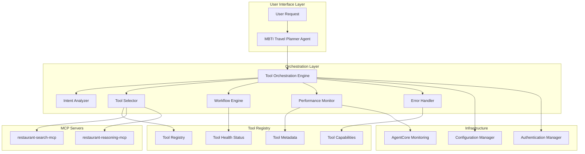
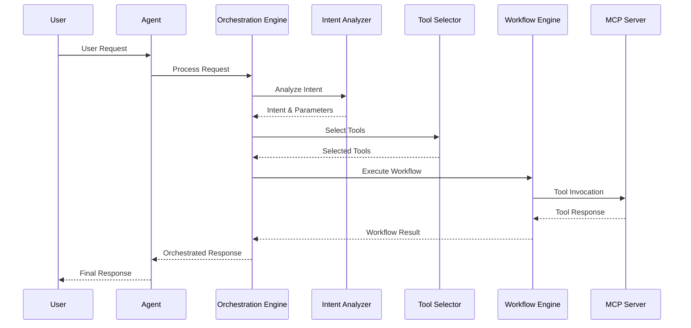

# Tool Orchestration System Documentation

## Table of Contents

1. [Overview](#overview)
2. [Architecture](#architecture)
3. [Core Components](#core-components)
4. [Configuration Management](#configuration-management)
5. [API Reference](#api-reference)
6. [Integration Patterns](#integration-patterns)
7. [Performance Considerations](#performance-considerations)
8. [Security Model](#security-model)

## Overview

The Tool Orchestration System provides intelligent guidance and automation for selecting and coordinating tools from multiple MCP servers in the MBTI Travel Planner Agent. It acts as an intelligent middleware layer between the Nova Pro model and available MCP tools, ensuring optimal tool selection, efficient workflows, and robust error handling.

### Key Features

- **Intelligent Tool Selection**: Analyzes user intent and recommends appropriate tools based on capability matching and performance metrics
- **Workflow Orchestration**: Coordinates multi-step workflows that combine tools from different MCP servers
- **Performance Monitoring**: Tracks tool usage patterns, response times, and success rates
- **Context-Aware Processing**: Considers user context, conversation history, and MBTI preferences
- **Error Handling & Fallbacks**: Provides robust error recovery with alternative tool suggestions
- **Configuration Management**: Supports environment-specific configurations and runtime updates

## Architecture

### High-Level System Architecture



### Component Interaction Flow



## Core Components

### Tool Orchestration Engine

The central coordinator that manages the entire orchestration process.

**Location**: `services/tool_orchestration_engine.py`

**Key Responsibilities**:
- Request processing and coordination
- Component lifecycle management
- Result aggregation and formatting
- Integration with AgentCore monitoring

**Configuration**:
```yaml
orchestration:
  engine:
    max_concurrent_requests: 50
    request_timeout: 30s
    enable_tracing: true
    performance_tracking: true
```

### Intent Analyzer

Analyzes user requests to understand intent and extract relevant parameters.

**Location**: `services/intent_analyzer.py`

**Supported Intent Types**:
- `RESTAURANT_SEARCH_BY_LOCATION`: Search restaurants in specific districts
- `RESTAURANT_SEARCH_BY_MEAL`: Search restaurants by meal type  
- `RESTAURANT_RECOMMENDATION`: Get recommendations from restaurant data
- `COMBINED_SEARCH_AND_RECOMMENDATION`: Multi-step workflow
- `SENTIMENT_ANALYSIS`: Analyze restaurant sentiment data

**Configuration**:
```yaml
intent_analysis:
  confidence_threshold: 0.8
  nlp_model: "intent-classifier-v1"
  parameter_extraction:
    enabled: true
    timeout: 5s
```

### Tool Selector

Selects optimal tools based on intent, context, and performance metrics.

**Location**: `services/tool_selector.py`

**Selection Criteria**:
- Tool capability match with intent
- Historical performance metrics
- Current tool health status
- User context and preferences
- Workflow efficiency considerations

**Configuration**:
```yaml
tool_selection:
  ranking_algorithm: "weighted_performance"
  performance_weight: 0.4
  health_weight: 0.3
  capability_weight: 0.3
  fallback_count: 2
```

### Workflow Engine

Executes multi-step workflows that coordinate multiple tools.

**Location**: `services/workflow_engine.py`

**Workflow Types**:
- `SIMPLE_SEARCH`: Single tool execution
- `SEARCH_AND_RECOMMEND`: Search followed by recommendation
- `MULTI_CRITERIA_SEARCH`: Multiple search tools with result aggregation
- `ITERATIVE_REFINEMENT`: Progressive refinement based on results

**Configuration**:
```yaml
workflow_engine:
  max_concurrent_workflows: 50
  step_timeout: 30s
  retry_policy:
    max_retries: 3
    backoff_multiplier: 2
    max_backoff: 60s
```

### Performance Monitor

Tracks tool usage, performance metrics, and health status.

**Location**: `services/performance_monitor.py`

**Metrics Tracked**:
- Tool invocation frequency and patterns
- Response times and success rates
- Error rates and failure modes
- Resource utilization and efficiency
- User satisfaction indicators

**Configuration**:
```yaml
performance_monitoring:
  metrics_collection: true
  health_check_interval: 30s
  performance_window: 300s
  alert_thresholds:
    error_rate: 0.1
    response_time: 10s
```

### Tool Registry

Manages tool metadata, capabilities, and health status.

**Location**: `services/tool_registry.py`

**Registry Features**:
- Tool metadata management
- Capability tracking
- Health status monitoring
- Performance characteristics storage
- Dynamic tool registration

## Configuration Management

### Configuration Structure

The orchestration system uses a hierarchical configuration structure with environment-specific overrides.

**Base Configuration**: `config/orchestration_config.yaml`

```yaml
orchestration:
  # Intent analysis configuration
  intent_analysis:
    confidence_threshold: 0.8
    nlp_model: "intent-classifier-v1"
    parameter_extraction:
      enabled: true
      timeout: 5s
  
  # Tool selection configuration
  tool_selection:
    ranking_algorithm: "weighted_performance"
    performance_weight: 0.4
    health_weight: 0.3
    capability_weight: 0.3
    fallback_count: 2
  
  # Workflow engine configuration
  workflow_engine:
    max_concurrent_workflows: 50
    step_timeout: 30s
    retry_policy:
      max_retries: 3
      backoff_multiplier: 2
      max_backoff: 60s
  
  # Performance monitoring configuration
  performance_monitoring:
    metrics_collection: true
    health_check_interval: 30s
    performance_window: 300s
    alert_thresholds:
      error_rate: 0.1
      response_time: 10s

# Tool-specific configuration
tools:
  restaurant_search:
    priority: 1
    capabilities:
      - "search_by_district"
      - "search_by_meal_type"
      - "combined_search"
    health_check: "/health"
    timeout: 15s
  
  restaurant_reasoning:
    priority: 1
    capabilities:
      - "recommend_restaurants"
      - "analyze_sentiment"
    health_check: "/health"
    timeout: 20s
```

### Environment-Specific Configuration

**Development**: `config/environments/orchestration_development.yaml`
```yaml
orchestration:
  intent_analysis:
    confidence_threshold: 0.6  # Lower threshold for testing
  performance_monitoring:
    health_check_interval: 10s  # More frequent checks
```

**Production**: `config/environments/orchestration_production.yaml`
```yaml
orchestration:
  intent_analysis:
    confidence_threshold: 0.9  # Higher threshold for production
  performance_monitoring:
    health_check_interval: 60s  # Less frequent checks
    alert_thresholds:
      error_rate: 0.05  # Stricter error rate
```

### Runtime Configuration Updates

The system supports hot-reloading of configuration changes without restart:

```python
from config.runtime_config_manager import RuntimeConfigManager

config_manager = RuntimeConfigManager()

# Update configuration at runtime
config_manager.update_config({
    "orchestration.tool_selection.performance_weight": 0.5,
    "orchestration.performance_monitoring.health_check_interval": "45s"
})

# Validate configuration changes
validation_result = config_manager.validate_config()
if not validation_result.is_valid:
    config_manager.rollback()
```

## API Reference

### Tool Orchestration Engine API

#### Process Request

```python
async def orchestrate_request(
    self, 
    request: UserRequest
) -> OrchestrationResult:
    """
    Process a user request through the orchestration system.
    
    Args:
        request: User request containing text, context, and metadata
        
    Returns:
        OrchestrationResult containing response and execution metadata
        
    Raises:
        OrchestrationError: If orchestration fails
        ValidationError: If request validation fails
    """
```

#### Register Tool

```python
def register_tool(
    self, 
    tool: ToolMetadata
) -> None:
    """
    Register a new tool with the orchestration system.
    
    Args:
        tool: Tool metadata including capabilities and configuration
        
    Raises:
        RegistrationError: If tool registration fails
    """
```

#### Get Performance Metrics

```python
def get_performance_metrics(
    self, 
    time_window: Optional[timedelta] = None
) -> PerformanceMetrics:
    """
    Retrieve performance metrics for the orchestration system.
    
    Args:
        time_window: Optional time window for metrics (default: last hour)
        
    Returns:
        PerformanceMetrics containing system performance data
    """
```

### Intent Analyzer API

#### Analyze Intent

```python
async def analyze_intent(
    self, 
    request: str, 
    context: UserContext
) -> Intent:
    """
    Analyze user request to determine intent and extract parameters.
    
    Args:
        request: User request text
        context: User context including history and preferences
        
    Returns:
        Intent object with type, confidence, and extracted parameters
    """
```

### Tool Selector API

#### Select Tools

```python
async def select_tools(
    self, 
    intent: Intent, 
    context: UserContext
) -> List[SelectedTool]:
    """
    Select optimal tools for the given intent and context.
    
    Args:
        intent: Analyzed user intent
        context: User context and preferences
        
    Returns:
        List of selected tools with confidence scores
    """
```

### Workflow Engine API

#### Execute Workflow

```python
async def execute_workflow(
    self, 
    workflow: Workflow, 
    context: ExecutionContext
) -> WorkflowResult:
    """
    Execute a multi-step workflow with the selected tools.
    
    Args:
        workflow: Workflow definition with steps and configuration
        context: Execution context with user data and settings
        
    Returns:
        WorkflowResult containing aggregated results and metadata
    """
```

## Integration Patterns

### AgentCore Integration

The orchestration system integrates seamlessly with existing AgentCore infrastructure:

```python
from services.agentcore_monitoring_service import AgentCoreMonitoringService
from services.authentication_manager import AuthenticationManager

class ToolOrchestrationEngine:
    def __init__(self, config: OrchestrationConfig):
        self.monitoring_service = AgentCoreMonitoringService()
        self.auth_manager = AuthenticationManager()
        # ... other initialization
    
    async def orchestrate_request(self, request: UserRequest) -> OrchestrationResult:
        # Track request with AgentCore monitoring
        with self.monitoring_service.track_operation("orchestration_request"):
            # Get authentication credentials
            credentials = await self.auth_manager.get_credentials()
            
            # Process request with orchestration logic
            result = await self._process_request(request, credentials)
            
            # Log metrics to AgentCore
            await self.monitoring_service.log_metrics({
                "orchestration_success": 1,
                "response_time": result.execution_time,
                "tools_used": len(result.tools_invoked)
            })
            
            return result
```

### MCP Server Integration

Tools are automatically discovered and registered from MCP servers:

```python
class MCPToolRegistry:
    async def discover_and_register_tools(self, mcp_endpoint: str):
        """Discover tools from MCP server and register them."""
        
        # Connect to MCP server
        async with streamablehttp_client(mcp_endpoint) as (read, write, _):
            async with ClientSession(read, write) as session:
                await session.initialize()
                
                # List available tools
                tools = await session.list_tools()
                
                # Register each tool
                for tool_info in tools:
                    tool_metadata = self._create_tool_metadata(tool_info)
                    await self.register_tool(tool_metadata)
```

### Error Handling Integration

The system integrates with existing error handling infrastructure:

```python
from services.error_handler import ErrorHandler

class OrchestrationErrorHandler:
    def __init__(self, base_error_handler: ErrorHandler):
        self.base_error_handler = base_error_handler
    
    async def handle_orchestration_error(
        self, 
        error: Exception, 
        context: OrchestrationContext
    ) -> ErrorResponse:
        """Handle orchestration-specific errors with fallback to base handler."""
        
        if isinstance(error, ToolSelectionError):
            return await self._handle_tool_selection_error(error, context)
        elif isinstance(error, WorkflowExecutionError):
            return await self._handle_workflow_error(error, context)
        else:
            # Delegate to base error handler
            return await self.base_error_handler.handle_error(error, context)
```

## Performance Considerations

### Optimization Strategies

1. **Caching**: Tool metadata and performance metrics are cached to reduce lookup times
2. **Connection Pooling**: MCP connections are pooled and reused across requests
3. **Parallel Execution**: Independent workflow steps are executed in parallel
4. **Lazy Loading**: Tool capabilities are loaded on-demand

### Performance Metrics

The system tracks key performance indicators:

- **Tool Selection Time**: Average time to select appropriate tools (target: <50ms)
- **Workflow Execution Time**: End-to-end workflow completion time
- **Tool Response Time**: Individual tool invocation response times
- **Cache Hit Rate**: Percentage of requests served from cache
- **Concurrent Request Handling**: Number of simultaneous orchestration requests

### Scaling Considerations

- **Horizontal Scaling**: Multiple orchestration engine instances can run concurrently
- **Load Balancing**: Requests are distributed across available instances
- **Resource Management**: Memory and CPU usage are monitored and managed
- **Circuit Breakers**: Prevent cascade failures when tools become unavailable

## Security Model

### Authentication and Authorization

The orchestration system leverages existing AgentCore authentication:

```python
class OrchestrationAuthManager:
    def __init__(self, auth_manager: AuthenticationManager):
        self.auth_manager = auth_manager
    
    async def authorize_tool_access(
        self, 
        user_context: UserContext, 
        tool_id: str
    ) -> bool:
        """Check if user is authorized to access the specified tool."""
        
        # Get user permissions from AgentCore
        permissions = await self.auth_manager.get_user_permissions(
            user_context.user_id
        )
        
        # Check tool-specific permissions
        return f"tool:{tool_id}" in permissions.allowed_resources
```

### Data Protection

- **Encryption**: All data in transit is encrypted using TLS
- **Token Management**: Authentication tokens are securely stored and rotated
- **Audit Logging**: All orchestration decisions are logged for security analysis
- **Input Validation**: User inputs are validated and sanitized

### Access Control

- **Role-Based Access**: Users have different access levels to tools and workflows
- **Tool Restrictions**: Certain tools can be restricted based on user roles
- **Rate Limiting**: Prevents abuse through request rate limiting
- **Session Management**: User sessions are securely managed and expired

---

**Document Version**: 1.0.0  
**Last Updated**: October 8, 2025  
**Maintained By**: MBTI Travel Planner Agent Team