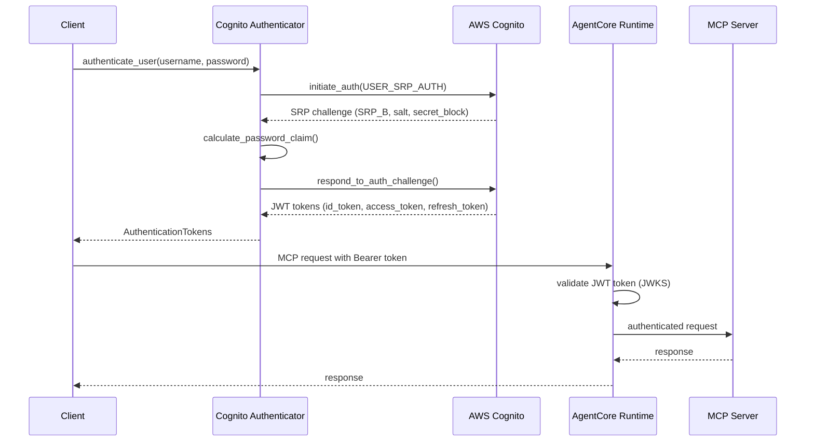

# Cognito Setup and Configuration Guide

This guide provides detailed instructions for setting up Amazon Cognito User Pool authentication for the Restaurant Search MCP server deployed on Bedrock AgentCore Runtime.

## Table of Contents

1. [Prerequisites](#prerequisites)
2. [Cognito User Pool Setup](#cognito-user-pool-setup)
3. [JWT Authorizer Configuration](#jwt-authorizer-configuration)
4. [Authentication Flow](#authentication-flow)
5. [Testing Authentication](#testing-authentication)
6. [Troubleshooting](#troubleshooting)

## Prerequisites

Before setting up Cognito authentication, ensure you have:

- AWS CLI configured with appropriate permissions
- Python 3.10+ environment
- Required Python packages installed:
  ```bash
  pip install boto3 bedrock-agentcore bedrock-agentcore-starter-toolkit
  ```
- IAM permissions for:
  - `cognito-idp:*` (Cognito Identity Provider operations)
  - `bedrock-agentcore:*` (AgentCore Runtime operations)
  - `iam:CreateRole`, `iam:AttachRolePolicy` (for execution roles)

## Cognito User Pool Setup

### Step 1: Automated Setup (Recommended)

Use the provided setup script for automated Cognito configuration:

```bash
python setup_cognito.py --region us-east-1 --email your-test-email@example.com
```

This script will:
- Create a Cognito User Pool with appropriate settings
- Create an App Client for JWT authentication
- Create a test user for authentication testing
- Generate configuration files

### Step 2: Manual Setup (Alternative)

If you prefer manual setup, follow these steps:

#### 2.1 Create User Pool

```python
import boto3

cognito_client = boto3.client('cognito-idp', region_name='us-east-1')

response = cognito_client.create_user_pool(
    PoolName='restaurant-search-mcp-pool',
    Policies={
        'PasswordPolicy': {
            'MinimumLength': 8,
            'RequireUppercase': True,
            'RequireLowercase': True,
            'RequireNumbers': True,
            'RequireSymbols': False
        }
    },
    AutoVerifiedAttributes=['email'],
    UsernameAttributes=['email'],
    UsernameConfiguration={'CaseSensitive': False},
    Schema=[
        {
            'Name': 'email',
            'AttributeDataType': 'String',
            'Required': True,
            'Mutable': True
        }
    ],
    AccountRecoverySetting={
        'RecoveryMechanisms': [
            {
                'Priority': 1,
                'Name': 'verified_email'
            }
        ]
    }
)

user_pool_id = response['UserPool']['Id']
print(f"User Pool ID: {user_pool_id}")
```

#### 2.2 Create App Client

```python
client_response = cognito_client.create_user_pool_client(
    UserPoolId=user_pool_id,
    ClientName='mbti-travel-oidc-client',
    GenerateSecret=False,  # Public client for JWT tokens
    RefreshTokenValidity=30,  # 30 days
    AccessTokenValidity=60,   # 60 minutes
    IdTokenValidity=60,       # 60 minutes
    TokenValidityUnits={
        'AccessToken': 'minutes',
        'IdToken': 'minutes',
        'RefreshToken': 'days'
    },
    ReadAttributes=['email'],
    WriteAttributes=['email'],
    ExplicitAuthFlows=[
        'ALLOW_USER_PASSWORD_AUTH',
        'ALLOW_REFRESH_TOKEN_AUTH',
        'ALLOW_USER_SRP_AUTH'
    ],
    SupportedIdentityProviders=['COGNITO'],
    PreventUserExistenceErrors='ENABLED'
)

client_id = client_response['UserPoolClient']['ClientId']
print(f"App Client ID: {client_id}")
```

#### 2.3 Create Test User

```python
# Create test user
cognito_client.admin_create_user(
    UserPoolId=user_pool_id,
    Username='test@example.com',
    UserAttributes=[
        {'Name': 'email', 'Value': 'test@example.com'},
        {'Name': 'email_verified', 'Value': 'true'}
    ],
    TemporaryPassword='TempPass123!',
    MessageAction='SUPPRESS'
)

# Set permanent password
cognito_client.admin_set_user_password(
    UserPoolId=user_pool_id,
    Username='test@example.com',
    Password='TempPass123!',
    Permanent=True
)
```

### Step 3: Configuration File

The setup process creates a `cognito_config.json` file with the following structure:

```json
{
  "region": "us-east-1",
  "user_pool": {
    "user_pool_id": "us-east-1_XXXXXXXXX",
    "user_pool_arn": "arn:aws:cognito-idp:us-east-1:ACCOUNT:userpool/us-east-1_XXXXXXXXX",
    "creation_date": "2025-09-27T07:48:31.750000+09:00"
  },
  "app_client": {
    "client_id": "XXXXXXXXXXXXXXXXXXXXXXXXXX",
    "client_name": "mbti-travel-oidc-client"
  },
  "test_user": {
    "username": "test@example.com",
    "email": "test@example.com",
    "status": "CONFIRMED"
  },
  "discovery_url": "https://cognito-idp.us-east-1.amazonaws.com/us-east-1_XXXXXXXXX/.well-known/openid-configuration"
}
```

## JWT Authorizer Configuration

### AgentCore Runtime Integration

The JWT authorizer configuration is automatically applied during AgentCore deployment:

```python
from bedrock_agentcore_starter_toolkit import Runtime

# Load Cognito configuration
with open('cognito_config.json', 'r') as f:
    cognito_config = json.load(f)

# Create JWT authorizer configuration
auth_config = {
    "customJWTAuthorizer": {
        "allowedClients": [cognito_config['app_client']['client_id']],
        "discoveryUrl": cognito_config['discovery_url']
    }
}

# Configure AgentCore Runtime with authentication
agentcore_runtime = Runtime()
response = agentcore_runtime.configure(
    entrypoint="restaurant_mcp_server.py",
    auto_create_execution_role=True,
    auto_create_ecr=True,
    requirements_file="requirements.txt",
    region="us-east-1",
    authorizer_configuration=auth_config,
    protocol="MCP",
    agent_name="restaurant_search_mcp"
)
```

### JWKS Endpoint Configuration

The JWT authorizer uses the following endpoints for token validation:

- **Discovery URL**: `https://cognito-idp.{region}.amazonaws.com/{user_pool_id}/.well-known/openid-configuration`
- **JWKS URL**: `https://cognito-idp.{region}.amazonaws.com/{user_pool_id}/.well-known/jwks.json`
- **Issuer URL**: `https://cognito-idp.{region}.amazonaws.com/{user_pool_id}`

## Authentication Flow

### SRP Authentication Flow

The system uses AWS Cognito's Secure Remote Password (SRP) protocol for authentication:



### Token Validation Process

1. **Token Extraction**: Extract JWT token from `Authorization: Bearer <token>` header
2. **Header Validation**: Decode token header to get Key ID (kid)
3. **JWKS Retrieval**: Fetch public keys from Cognito JWKS endpoint
4. **Signature Verification**: Verify token signature using RSA public key
5. **Claims Validation**: Validate token claims (exp, iss, aud, client_id)
6. **User Context**: Extract user information for request processing

### Token Lifecycle

- **Access Token**: 60 minutes validity, used for API authentication
- **ID Token**: 60 minutes validity, contains user identity information
- **Refresh Token**: 30 days validity, used to obtain new access tokens

## Testing Authentication

### Test Script Example

```python
#!/usr/bin/env python3
"""Test Cognito authentication flow."""

import json
from services.auth_service import CognitoAuthenticator

def test_authentication():
    # Load configuration
    with open('cognito_config.json', 'r') as f:
        config = json.load(f)
    
    # Initialize authenticator
    authenticator = CognitoAuthenticator(
        user_pool_id=config['user_pool']['user_pool_id'],
        client_id=config['app_client']['client_id'],
        region=config['region']
    )
    
    # Test authentication
    try:
        tokens = authenticator.authenticate_user(
            username=config['test_user']['email'],
            password='TempPass123!'
        )
        
        print("✓ Authentication successful!")
        print(f"Access Token: {tokens.access_token[:50]}...")
        print(f"Token Type: {tokens.token_type}")
        print(f"Expires In: {tokens.expires_in} seconds")
        
        # Test token validation
        user_context = authenticator.validate_user_session(tokens.access_token)
        print(f"✓ User validated: {user_context.email}")
        
        return True
        
    except Exception as e:
        print(f"✗ Authentication failed: {e}")
        return False

if __name__ == "__main__":
    test_authentication()
```

### MCP Client Testing

```python
import asyncio
import json
from mcp import ClientSession
from mcp.client.streamable_http import streamablehttp_client

async def test_authenticated_mcp():
    # Authenticate and get token
    # ... (authentication code from above)
    
    # MCP client with authentication
    headers = {
        'Authorization': f'Bearer {tokens.access_token}',
        'Content-Type': 'application/json'
    }
    
    mcp_url = "https://your-agentcore-endpoint.amazonaws.com"
    
    async with streamablehttp_client(mcp_url, headers=headers) as (read, write, _):
        async with ClientSession(read, write) as session:
            await session.initialize()
            
            # List available tools
            tools = await session.list_tools()
            print(f"Available tools: {[tool.name for tool in tools.tools]}")
            
            # Call restaurant search tool
            result = await session.call_tool(
                "search_restaurants_by_district",
                {"districts": ["Central district"]}
            )
            
            print(f"Search result: {result.content}")

# Run test
asyncio.run(test_authenticated_mcp())
```

## Troubleshooting

### Common Issues and Solutions

#### 1. Authentication Failures

**Issue**: `NotAuthorizedException: Incorrect username or password`

**Solutions**:
- Verify user exists in Cognito User Pool
- Check password meets policy requirements
- Ensure user status is `CONFIRMED`
- Verify username format (email vs username)

**Debug Steps**:
```python
# Check user status
response = cognito_client.admin_get_user(
    UserPoolId=user_pool_id,
    Username=username
)
print(f"User Status: {response['UserStatus']}")
```

#### 2. JWT Token Validation Errors

**Issue**: `Invalid token signature` or `Token expired`

**Solutions**:
- Verify JWKS endpoint is accessible
- Check token expiration time
- Ensure correct client_id in token audience
- Validate issuer URL matches User Pool

**Debug Steps**:
```python
import jwt

# Decode token without verification to inspect claims
decoded = jwt.decode(token, options={"verify_signature": False})
print(f"Token claims: {json.dumps(decoded, indent=2)}")
print(f"Expires at: {decoded.get('exp')}")
print(f"Current time: {time.time()}")
```

#### 3. JWKS Endpoint Issues

**Issue**: `Failed to fetch JWKS` or `Key not found`

**Solutions**:
- Verify discovery URL is correct
- Check network connectivity to Cognito
- Ensure JWKS cache is not stale
- Validate User Pool region

**Debug Steps**:
```python
import requests

# Test JWKS endpoint
discovery_url = "https://cognito-idp.us-east-1.amazonaws.com/us-east-1_XXXXXXXXX/.well-known/openid-configuration"
response = requests.get(discovery_url)
print(f"Discovery response: {response.json()}")

jwks_url = response.json()['jwks_uri']
jwks_response = requests.get(jwks_url)
print(f"JWKS keys: {len(jwks_response.json()['keys'])}")
```

#### 4. AgentCore Authentication Configuration

**Issue**: `Unauthorized` responses from AgentCore Runtime

**Solutions**:
- Verify JWT authorizer configuration in deployment
- Check allowedClients includes correct client_id
- Ensure discovery URL is accessible from AgentCore
- Validate token format in Authorization header

**Debug Steps**:
```python
# Check AgentCore configuration
from bedrock_agentcore_starter_toolkit import Runtime

runtime = Runtime()
status = runtime.status()
print(f"Agent status: {json.dumps(status, indent=2, default=str)}")
```

#### 5. User Pool Configuration Issues

**Issue**: User creation or authentication flow problems

**Solutions**:
- Verify User Pool policies (password, MFA, etc.)
- Check app client configuration (auth flows, token validity)
- Ensure proper IAM permissions for Cognito operations
- Validate email verification settings

**Debug Steps**:
```python
# Check User Pool configuration
pool_response = cognito_client.describe_user_pool(UserPoolId=user_pool_id)
print(f"Pool policies: {pool_response['UserPool']['Policies']}")

client_response = cognito_client.describe_user_pool_client(
    UserPoolId=user_pool_id,
    ClientId=client_id
)
print(f"Client auth flows: {client_response['UserPoolClient']['ExplicitAuthFlows']}")
```

### Error Codes Reference

| Error Code | Description | Solution |
|------------|-------------|----------|
| `NotAuthorizedException` | Invalid credentials | Check username/password |
| `UserNotFoundException` | User doesn't exist | Create user or check username |
| `UserNotConfirmedException` | User not verified | Confirm user account |
| `ExpiredCodeException` | Verification code expired | Request new code |
| `InvalidParameterException` | Invalid request parameters | Check API parameters |
| `TooManyRequestsException` | Rate limit exceeded | Implement retry logic |
| `ResourceNotFoundException` | User Pool/Client not found | Verify IDs are correct |

### Logging and Monitoring

Enable detailed logging for troubleshooting:

```python
import logging

# Configure logging
logging.basicConfig(
    level=logging.DEBUG,
    format='%(asctime)s - %(name)s - %(levelname)s - %(message)s'
)

# Enable boto3 debug logging
boto3.set_stream_logger('boto3', logging.DEBUG)
boto3.set_stream_logger('botocore', logging.DEBUG)
```

### Support Resources

- [AWS Cognito Developer Guide](https://docs.aws.amazon.com/cognito/latest/developerguide/)
- [Bedrock AgentCore Documentation](https://docs.aws.amazon.com/bedrock/latest/userguide/agents-core.html)
- [JWT.io Token Debugger](https://jwt.io/)
- [AWS CLI Cognito Commands](https://docs.aws.amazon.com/cli/latest/reference/cognito-idp/)

## Security Best Practices

1. **Token Storage**: Never store JWT tokens in client-side storage
2. **HTTPS Only**: Always use HTTPS for token transmission
3. **Token Expiration**: Implement proper token refresh logic
4. **Rate Limiting**: Implement authentication rate limiting
5. **Monitoring**: Monitor authentication failures and suspicious activity
6. **Secrets Management**: Use AWS Secrets Manager for sensitive configuration
7. **IAM Permissions**: Follow principle of least privilege for IAM roles
8. **Network Security**: Use VPC endpoints for private network access

## Next Steps

After completing Cognito setup:

1. Deploy MCP server with authentication: `python deploy_agentcore.py`
2. Test authentication flow: `python test_auth_integration.py`
3. Implement client applications with JWT authentication
4. Set up monitoring and alerting for authentication events
5. Configure production security settings (MFA, advanced security features)