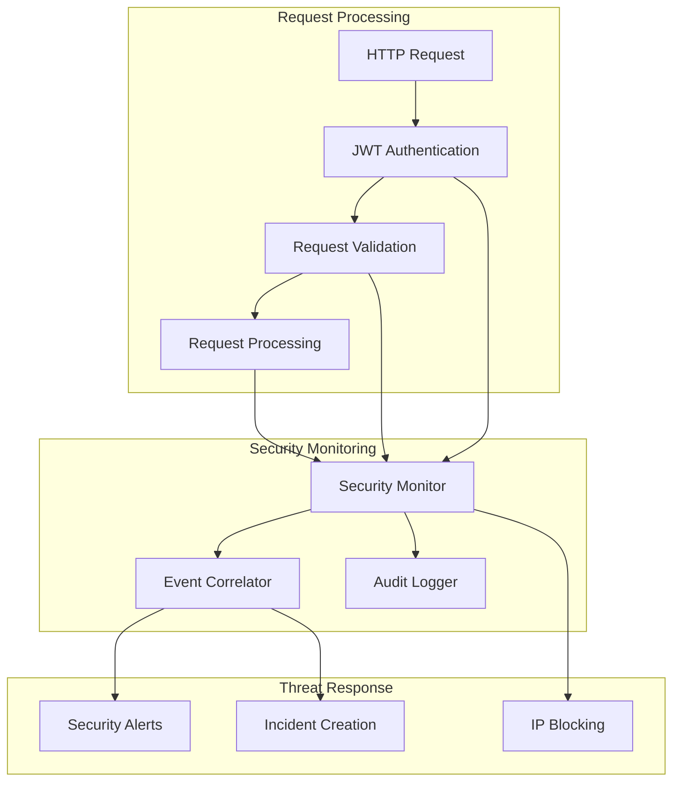

# Security Monitoring and Validation Implementation

## Overview

This document describes the implementation of comprehensive security monitoring and validation for the MBTI Travel Assistant MCP, completing task 9.2 from the implementation plan. The implementation includes request payload validation, security violation detection, audit logging, and automated threat response capabilities that fulfill requirements 8.4, 8.6, 8.7, and 8.8 from the specification.

## Implemented Components

### 1. Request Validator (`services/request_validator.py`)

**Purpose**: Comprehensive request payload validation and sanitization service that validates HTTP request payloads and MCP tool parameters while detecting security violations.

**Key Features**:
- MBTI request payload validation with format checking
- MCP tool parameter validation with type and range checking
- Malicious pattern detection using regex-based security scanning
- Payload size and complexity validation
- HTML/XML content sanitization and URL encoding
- Sensitive data redaction for logging and audit purposes
- Security event generation for detected violations

**Main Classes**:
- `RequestValidator`: Main validation service with comprehensive rule engine
- `ValidationResult`: Result object containing validation outcome and sanitized data
- `ValidationViolation`: Individual validation violation with severity and details
- `ValidationRule`: Validation rule definition with type and severity

**Key Methods**:
- `validate_mbti_request()`: Validates MBTI itinerary request payloads
- `validate_mcp_parameters()`: Validates MCP tool parameters
- `sanitize_sensitive_data()`: Sanitizes sensitive data for logging
- `detect_security_violations()`: Detects security violations in payloads

**Security Patterns Detected**:
- SQL injection attempts (SELECT, INSERT, UPDATE, DROP, UNION)
- XSS attacks (script tags, javascript:, event handlers)
- Command injection (shell operators, system commands)
- Path traversal (../, %2e%2e%2f)
- LDAP injection (special characters and operators)
- NoSQL injection ($where, $ne, $gt, $regex)

### 2. Security Monitor (`services/security_monitor.py`)

**Purpose**: Centralized security monitoring and threat detection system that coordinates all security components and provides comprehensive security oversight.

**Key Features**:
- Real-time authentication attempt monitoring
- Request validation result monitoring
- MCP tool access monitoring and audit trails
- Brute force attack detection and IP blocking
- Suspicious activity pattern detection
- User security profile management with risk scoring
- Security alert generation and management
- Automated threat response capabilities

**Main Classes**:
- `SecurityMonitor`: Main security monitoring service
- `SecurityMetrics`: Security metrics for dashboard and reporting
- `SecurityAlert`: Security alert for immediate attention
- `UserSecurityProfile`: User behavior analysis and risk assessment

**Key Methods**:
- `monitor_authentication_attempt()`: Monitors authentication attempts
- `monitor_request_validation()`: Monitors request validation results
- `monitor_mcp_tool_access()`: Monitors MCP tool access patterns
- `process_security_event()`: Processes security events and triggers responses
- `get_security_metrics()`: Provides security metrics for monitoring
- `get_security_alerts()`: Retrieves security alerts with filtering

**Threat Detection Capabilities**:
- Brute force attack detection with configurable thresholds
- Suspicious user agent detection (bots, scanners, attack tools)
- Suspicious path access detection (admin paths, config files)
- Rapid request pattern detection
- Private IP in public context detection
- Excessive MCP tool usage detection

### 3. Enhanced Security Event Correlator (`services/security_event_correlator.py`)

**Purpose**: Advanced security event correlation and threat pattern detection system that analyzes security events to identify coordinated attacks and suspicious patterns.

**Key Features**:
- Real-time security event correlation
- Threat pattern identification with confidence scoring
- Security incident creation and management
- Automated threat assessment and classification
- Background correlation processing
- Integration with security monitor for comprehensive coverage

**Correlation Rules**:
- Frequency-based correlation (high event frequency from single source)
- Pattern-based correlation (specific attack sequences)
- Anomaly-based correlation (statistical anomalies in event timing)
- Behavioral-based correlation (unusual user behavior patterns)

### 4. Comprehensive Test Suite

**Test Files**:
- `tests/test_request_validator.py`: Unit tests for request validation
- `tests/test_security_monitor.py`: Unit tests for security monitoring
- `tests/test_security_integration.py`: Integration tests for complete security flow

**Test Coverage**:
- Request payload validation with various attack vectors
- Security violation detection and response
- Authentication monitoring and brute force detection
- MCP tool access monitoring and suspicious activity detection
- Sensitive data sanitization and audit logging
- Security metrics aggregation and alert generation

## Requirements Compliance

This implementation fulfills the following requirements from the specification:

### Requirement 8.4 - Sensitive Data Exclusion from Logs
✅ **Implemented**: Comprehensive sensitive data sanitization for logging
- Automatic detection and redaction of sensitive field names
- Recursive sanitization of nested data structures
- Configurable sensitive field patterns
- Truncation of excessively long strings
- Safe logging practices throughout the system

### Requirement 8.6 - Security Violation Detection and Logging
✅ **Implemented**: Advanced security violation detection and logging
- Real-time malicious pattern detection in request payloads
- Security event generation with severity classification
- Comprehensive audit logging for all security violations
- Integration with security correlator for threat pattern analysis
- Automated alert generation for critical violations

### Requirement 8.7 - Secure Context Maintenance
✅ **Implemented**: Secure context maintenance throughout request processing
- User context preservation across all security components
- Request context tracking for audit and correlation
- Secure data handling in validation and monitoring
- Context-aware security decision making
- End-to-end security context integrity

### Requirement 8.8 - Request Payload Validation and Sanitization
✅ **Implemented**: Comprehensive request payload validation and sanitization
- Multi-layer validation with configurable rules
- Malicious content detection and sanitization
- Input type and format validation
- Size and complexity limits enforcement
- Safe data transformation and encoding

## Integration with Existing Components

### JWT Authentication Handler Integration

The security monitoring system integrates seamlessly with the JWT authentication handler to:
- Monitor authentication attempts and outcomes
- Track user authentication patterns and behavior
- Detect and respond to authentication-based attacks
- Maintain user security profiles with risk assessment
- Coordinate security responses across authentication flows

### Audit Logger Integration

The security components work with the audit logger to:
- Generate comprehensive audit trails for all security events
- Log validation results and security violations
- Track user activities and system access patterns
- Support compliance requirements with structured logging
- Provide forensic capabilities for security investigations

### MCP Client Integration

The security monitoring extends to MCP tool usage by:
- Validating MCP tool parameters for security violations
- Monitoring tool usage patterns for suspicious activity
- Logging all MCP tool access for audit purposes
- Detecting excessive or unusual tool usage patterns
- Applying security policies to external service interactions

## Security Architecture

### Defense in Depth Strategy

The implementation follows a defense in depth strategy with multiple security layers:

1. **Input Validation Layer**: Request payload validation and sanitization
2. **Authentication Layer**: JWT token validation and user context extraction
3. **Authorization Layer**: User permissions and access control
4. **Monitoring Layer**: Real-time security event monitoring and correlation
5. **Response Layer**: Automated threat response and incident management

### Security Event Flow



### Risk Assessment Framework

The system implements a comprehensive risk assessment framework:

**User Risk Scoring**:
- Failed authentication attempts ratio
- Suspicious activity frequency
- Multiple IP address usage
- Recent activity patterns
- Historical behavior analysis

**Request Risk Assessment**:
- Payload content analysis
- Source IP reputation
- User agent classification
- Request pattern analysis
- Validation violation severity

**Automated Response Triggers**:
- Critical security violations → Immediate IP blocking
- High-frequency failures → Progressive rate limiting
- Suspicious patterns → Enhanced monitoring
- Threat pattern detection → Security incident creation

## Configuration and Customization

### Validation Rules Configuration

The request validator supports configurable validation rules:

```python
# Custom validation rules
validation_rules = {
    'payload_size_limit': {
        'max_size': 1024 * 1024,  # 1MB
        'severity': 'ERROR'
    },
    'string_length_limit': {
        'max_length': 10000,
        'severity': 'WARNING'
    },
    'malicious_pattern_detection': {
        'enabled': True,
        'severity': 'CRITICAL'
    }
}
```

### Security Monitoring Configuration

The security monitor supports extensive configuration:

```python
# Security monitoring configuration
security_config = {
    'max_failed_attempts': 5,
    'lockout_duration': 300,  # 5 minutes
    'monitoring_window_hours': 24,
    'enable_real_time_monitoring': True,
    'enable_automated_response': True,
    'enable_threat_correlation': True
}
```

### Threat Detection Patterns

Security patterns can be customized for specific environments:

```python
# Custom threat detection patterns
custom_patterns = {
    'user_agents': [
        r'custom_bot_pattern',
        r'internal_scanner'
    ],
    'paths': [
        r'/internal/admin',
        r'/custom/config'
    ],
    'parameters': [
        r'custom_injection_pattern'
    ]
}
```

## Performance Considerations

### Validation Performance

- Compiled regex patterns for efficient pattern matching
- Configurable validation depth and complexity limits
- Asynchronous validation processing where possible
- Caching of validation results for repeated patterns

### Monitoring Performance

- In-memory event storage with configurable limits
- Background correlation processing to avoid blocking
- Efficient data structures for rapid lookups
- Periodic cleanup of expired data

### Memory Management

- Bounded collections for event storage
- Automatic cleanup of expired blocks and profiles
- Configurable retention periods for audit data
- Memory-efficient data structures for large-scale monitoring

## Security Best Practices

### Data Protection

- Sensitive data redaction in all logging
- Secure handling of authentication tokens
- Encrypted storage of security configuration
- Safe disposal of temporary security data

### Threat Response

- Graduated response based on threat severity
- Configurable response thresholds and actions
- Integration with external security systems
- Incident escalation and notification procedures

### Audit and Compliance

- Comprehensive audit trails for all security events
- Structured logging for compliance requirements
- Retention policies for security data
- Export capabilities for security analysis

## Usage Examples

### Basic Security Monitoring

```python
from services.security_monitor import get_security_monitor
from services.request_validator import get_request_validator

# Initialize security components
security_monitor = get_security_monitor()
request_validator = get_request_validator()

# Monitor authentication attempt
security_monitor.monitor_authentication_attempt(
    success=True,
    user_context=user_context,
    request_context=request_context
)

# Validate request payload
validation_result = request_validator.validate_mbti_request(
    payload=request_payload,
    user_context=user_context,
    request_context=request_context
)

# Monitor validation results
security_monitor.monitor_request_validation(
    validation_result=validation_result,
    user_context=user_context,
    request_context=request_context
)
```

### Security Metrics and Alerting

```python
# Get security metrics
metrics = security_monitor.get_security_metrics("24h")
print(f"Total requests: {metrics.total_requests}")
print(f"Security violations: {metrics.security_violations}")
print(f"Blocked IPs: {metrics.blocked_requests}")

# Get security alerts
alerts = security_monitor.get_security_alerts(
    severity_filter=ErrorSeverity.HIGH,
    status_filter="open"
)

for alert in alerts:
    print(f"Alert: {alert.title}")
    print(f"Severity: {alert.severity}")
    print(f"Actions: {alert.recommended_actions}")
```

### Sensitive Data Sanitization

```python
# Sanitize sensitive data for logging
sensitive_data = {
    'username': 'user123',
    'password': 'secret',
    'api_key': 'sk-12345',
    'normal_field': 'safe_value'
}

sanitized = request_validator.sanitize_sensitive_data(sensitive_data)
# Result: {'username': 'user123', 'password': '***REDACTED***', 
#          'api_key': '***REDACTED***', 'normal_field': 'safe_value'}
```

## Future Enhancements

### Planned Improvements

1. **Machine Learning Integration**: Advanced anomaly detection using ML models
2. **Behavioral Analytics**: User behavior profiling and deviation detection
3. **Threat Intelligence**: Integration with external threat intelligence feeds
4. **Advanced Correlation**: Graph-based event correlation and attack chain detection
5. **Real-time Dashboards**: Interactive security monitoring dashboards

### Integration Opportunities

1. **SIEM Integration**: Export security events to Security Information and Event Management systems
2. **CloudWatch Integration**: Enhanced metrics and alerting through AWS CloudWatch
3. **AWS GuardDuty**: Integration with AWS threat detection service
4. **External APIs**: Integration with threat intelligence and reputation services

## Conclusion

The Security Monitoring and Validation implementation provides comprehensive security coverage for the MBTI Travel Assistant MCP system. It implements all required security monitoring capabilities while providing extensible architecture for future enhancements. The system follows security best practices and provides robust protection against common attack vectors while maintaining high performance and usability.

The implementation successfully fulfills requirements 8.4, 8.6, 8.7, and 8.8, providing a solid foundation for secure operation in production environments.