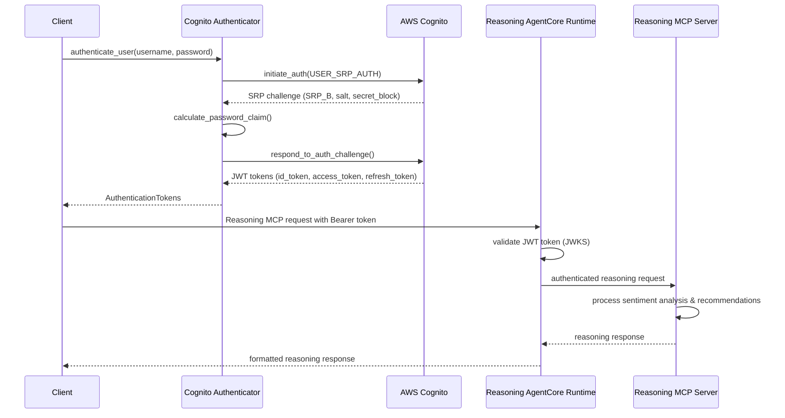

# Cognito Setup and Configuration Guide - Restaurant Reasoning MCP Server

This guide provides detailed instructions for setting up Amazon Cognito User Pool authentication for the Restaurant Reasoning MCP server deployed on Bedrock AgentCore Runtime. The reasoning server reuses the existing Cognito configuration from the restaurant search MCP server for seamless authentication integration.

## Table of Contents

1. [Prerequisites](#prerequisites)
2. [Reusing Existing Cognito Setup](#reusing-existing-cognito-setup)
3. [JWT Authorizer Configuration for Reasoning Server](#jwt-authorizer-configuration-for-reasoning-server)
4. [Authentication Flow for Reasoning Operations](#authentication-flow-for-reasoning-operations)
5. [Testing Authentication with Reasoning Tools](#testing-authentication-with-reasoning-tools)
6. [Troubleshooting Reasoning Server Authentication](#troubleshooting-reasoning-server-authentication)

## Prerequisites

Before setting up Cognito authentication for the reasoning server, ensure you have:

- AWS CLI configured with appropriate permissions
- Python 3.10+ environment
- Required Python packages installed:
  ```bash
  pip install boto3 bedrock-agentcore bedrock-agentcore-starter-toolkit pydantic>=2.0.0
  ```
- **Existing Cognito User Pool** from restaurant search MCP server (recommended)
- IAM permissions for:
  - `cognito-idp:*` (Cognito Identity Provider operations)
  - `bedrock-agentcore:*` (AgentCore Runtime operations)
  - `iam:CreateRole`, `iam:AttachRolePolicy` (for execution roles)

## Reusing Existing Cognito Setup

### Step 1: Copy Existing Cognito Configuration

The reasoning server is designed to reuse the existing Cognito User Pool and app client from the restaurant search MCP server for consistent authentication:

```bash
# Copy existing Cognito configuration
cp ../restaurant-search-mcp/cognito_config.json ./cognito_config.json

# Copy existing setup script (optional)
cp ../restaurant-search-mcp/setup_cognito.py ./setup_cognito.py
```

### Step 2: Verify Existing Configuration

Verify the existing Cognito configuration is compatible with the reasoning server:

```python
#!/usr/bin/env python3
"""Verify existing Cognito configuration for reasoning server."""

import json
import boto3

def verify_cognito_config():
    """Verify existing Cognito configuration works for reasoning server."""
    
    # Load existing configuration
    with open('cognito_config.json', 'r') as f:
        config = json.load(f)
    
    print("🔍 Verifying Cognito configuration for reasoning server...")
    
    # Verify User Pool exists
    cognito_client = boto3.client('cognito-idp', region_name=config['region'])
    
    try:
        pool_response = cognito_client.describe_user_pool(
            UserPoolId=config['user_pool']['user_pool_id']
        )
        print(f"✅ User Pool verified: {pool_response['UserPool']['Name']}")
        
        # Verify App Client
        client_response = cognito_client.describe_user_pool_client(
            UserPoolId=config['user_pool']['user_pool_id'],
            ClientId=config['app_client']['client_id']
        )
        print(f"✅ App Client verified: {client_response['UserPoolClient']['ClientName']}")
        
        # Verify test user
        user_response = cognito_client.admin_get_user(
            UserPoolId=config['user_pool']['user_pool_id'],
            Username=config['test_user']['username']
        )
        print(f"✅ Test user verified: {user_response['Username']} ({user_response['UserStatus']})")
        
        # Verify discovery URL
        import requests
        discovery_response = requests.get(config['discovery_url'])
        if discovery_response.status_code == 200:
            print(f"✅ Discovery URL accessible: {config['discovery_url']}")
        else:
            print(f"❌ Discovery URL error: {discovery_response.status_code}")
        
        print("\n🎉 Cognito configuration verified for reasoning server!")
        return True
        
    except Exception as e:
        print(f"❌ Configuration verification failed: {e}")
        return False

if __name__ == "__main__":
    verify_cognito_config()
```

### Step 3: Alternative - New Cognito Setup (If Needed)

If you need to create a new Cognito setup specifically for the reasoning server:

```bash
python setup_cognito.py --region us-east-1 --email your-reasoning-test@example.com --pool-name restaurant-reasoning-mcp-pool
```

This will create:
- New User Pool: `restaurant-reasoning-mcp-pool`
- New App Client: `restaurant-reasoning-mcp-client`
- New test user for reasoning server authentication
- Updated `cognito_config.json` with reasoning server configuration

## JWT Authorizer Configuration for Reasoning Server

### AgentCore Runtime Integration for Reasoning

The JWT authorizer configuration is applied during reasoning server AgentCore deployment:

```python
#!/usr/bin/env python3
"""Deploy reasoning MCP server with existing Cognito authentication."""

import json
from bedrock_agentcore_starter_toolkit import Runtime

def deploy_reasoning_server_with_auth():
    """Deploy reasoning server using existing Cognito configuration."""
    
    # Load existing Cognito configuration
    with open('cognito_config.json', 'r') as f:
        cognito_config = json.load(f)
    
    # Create JWT authorizer configuration for reasoning server
    auth_config = {
        "customJWTAuthorizer": {
            "allowedClients": [cognito_config['app_client']['client_id']],
            "discoveryUrl": cognito_config['discovery_url']
        }
    }
    
    print("🚀 Deploying reasoning MCP server with existing authentication...")
    
    # Configure AgentCore Runtime for reasoning server
    agentcore_runtime = Runtime()
    response = agentcore_runtime.configure(
        entrypoint="restaurant_reasoning_mcp_server.py",
        auto_create_execution_role=True,
        auto_create_ecr=True,
        requirements_file="requirements.txt",
        region="us-east-1",
        authorizer_configuration=auth_config,
        protocol="MCP",
        agent_name="restaurant_reasoning_mcp"
    )
    
    print(f"✅ Reasoning server configured with agent name: {response.agent_name}")
    
    # Launch reasoning server
    launch_result = agentcore_runtime.launch()
    
    print(f"🎉 Reasoning server deployed successfully!")
    print(f"Agent ARN: {launch_result.agent_arn}")
    print(f"Status: {launch_result.status}")
    
    # Save deployment configuration
    deployment_config = {
        'configuration_response': response.__dict__,
        'launch_result': launch_result.__dict__,
        'auth_config': auth_config,
        'cognito_config': cognito_config
    }
    
    with open('reasoning_deployment_config.json', 'w') as f:
        json.dump(deployment_config, f, indent=2, default=str)
    
    return launch_result

if __name__ == "__main__":
    deploy_reasoning_server_with_auth()
```

### JWKS Endpoint Configuration for Reasoning

The reasoning server uses the same JWKS endpoints as the original server:

- **Discovery URL**: `https://cognito-idp.{region}.amazonaws.com/{user_pool_id}/.well-known/openid-configuration`
- **JWKS URL**: `https://cognito-idp.{region}.amazonaws.com/{user_pool_id}/.well-known/jwks.json`
- **Issuer URL**: `https://cognito-idp.{region}.amazonaws.com/{user_pool_id}`

## Authentication Flow for Reasoning Operations

### SRP Authentication Flow for Reasoning Server

The reasoning server uses the same SRP authentication flow with reasoning-specific context:



### Token Validation Process for Reasoning Operations

The reasoning server follows the same token validation process with reasoning-specific logging:

1. **Token Extraction**: Extract JWT token from `Authorization: Bearer <token>` header
2. **Header Validation**: Decode token header to get Key ID (kid)
3. **JWKS Retrieval**: Fetch public keys from Cognito JWKS endpoint (cached)
4. **Signature Verification**: Verify token signature using RSA public key
5. **Claims Validation**: Validate token claims (exp, iss, aud, client_id)
6. **User Context**: Extract user information for reasoning request processing
7. **Audit Logging**: Log reasoning operation with user context for audit

### Token Lifecycle for Reasoning Operations

- **Access Token**: 60 minutes validity, used for reasoning API authentication
- **ID Token**: 60 minutes validity, contains user identity for reasoning context
- **Refresh Token**: 30 days validity, used to obtain new tokens for extended reasoning sessions

## Testing Authentication with Reasoning Tools

### Test Script for Reasoning Authentication

```python
#!/usr/bin/env python3
"""Test Cognito authentication flow with reasoning tools."""

import json
import asyncio
from services.auth_service import CognitoAuthenticator
from mcp import ClientSession
from mcp.client.streamable_http import streamablehttp_client

async def test_reasoning_authentication():
    """Test authentication flow with reasoning MCP tools."""
    
    # Load configuration
    with open('cognito_config.json', 'r') as f:
        config = json.load(f)
    
    # Initialize authenticator
    authenticator = CognitoAuthenticator(
        user_pool_id=config['user_pool']['user_pool_id'],
        client_id=config['app_client']['client_id'],
        region=config['region']
    )
    
    # Test authentication
    try:
        print("🔐 Testing authentication for reasoning server...")
        
        tokens = authenticator.authenticate_user(
            username=config['test_user']['email'],
            password='TempPass123!'  # Use actual password
        )
        
        print("✅ Authentication successful for reasoning server!")
        print(f"Access Token: {tokens.access_token[:50]}...")
        print(f"Token Type: {tokens.token_type}")
        print(f"Expires In: {tokens.expires_in} seconds")
        
        # Test token validation
        user_context = authenticator.validate_user_session(tokens.access_token)
        print(f"✅ User validated for reasoning: {user_context.email}")
        
        # Test reasoning MCP tools
        await test_reasoning_mcp_tools(tokens.access_token)
        
        return True
        
    except Exception as e:
        print(f"❌ Authentication failed for reasoning server: {e}")
        return False

async def test_reasoning_mcp_tools(access_token: str):
    """Test reasoning MCP tools with authentication."""
    
    # Load deployment configuration
    try:
        with open('reasoning_deployment_config.json', 'r') as f:
            deployment_config = json.load(f)
        
        agent_arn = deployment_config['launch_result']['agent_arn']
        mcp_url = f"https://{agent_arn.split('/')[-1]}.bedrock-agentcore.us-east-1.amazonaws.com"
        
    except FileNotFoundError:
        print("❌ Reasoning deployment config not found")
        return
    
    # Set up authenticated headers
    headers = {
        'Authorization': f'Bearer {access_token}',
        'Content-Type': 'application/json'
    }
    
    print(f"🔗 Testing reasoning MCP tools at: {mcp_url}")
    
    # Sample restaurant data for reasoning
    sample_restaurants = [
        {
            "id": "rest_001",
            "name": "Central Cafe",
            "address": "123 Central Street",
            "sentiment": {"likes": 85, "dislikes": 10, "neutral": 5},
            "meal_type": ["breakfast", "lunch"],
            "district": "Central district",
            "price_range": "$$"
        },
        {
            "id": "rest_002", 
            "name": "Tsim Sha Tsui Bistro",
            "address": "456 Nathan Road",
            "sentiment": {"likes": 70, "dislikes": 20, "neutral": 10},
            "meal_type": ["lunch", "dinner"],
            "district": "Tsim Sha Tsui",
            "price_range": "$$$"
        }
    ]
    
    try:
        async with streamablehttp_client(mcp_url, headers=headers) as (read, write, _):
            async with ClientSession(read, write) as session:
                await session.initialize()
                print("✅ Reasoning MCP session initialized")
                
                # List available reasoning tools
                tools_response = await session.list_tools()
                tools = [tool.name for tool in tools_response.tools]
                print(f"📋 Available reasoning tools: {tools}")
                
                # Test recommend_restaurants tool
                if "recommend_restaurants" in tools:
                    print("\n🧠 Testing recommend_restaurants tool...")
                    result = await session.call_tool(
                        "recommend_restaurants",
                        {
                            "restaurants": sample_restaurants,
                            "ranking_method": "sentiment_likes"
                        }
                    )
                    
                    print("✅ Recommendation completed!")
                    print(f"Result: {result.content[0].text[:200]}...")
                
                # Test analyze_restaurant_sentiment tool
                if "analyze_restaurant_sentiment" in tools:
                    print("\n📊 Testing analyze_restaurant_sentiment tool...")
                    result = await session.call_tool(
                        "analyze_restaurant_sentiment",
                        {"restaurants": sample_restaurants}
                    )
                    
                    print("✅ Sentiment analysis completed!")
                    print(f"Result: {result.content[0].text[:200]}...")
                
    except Exception as e:
        print(f"❌ Reasoning MCP test failed: {e}")

if __name__ == "__main__":
    asyncio.run(test_reasoning_authentication())
```

### Reasoning Server Authentication Integration Test

```python
#!/usr/bin/env python3
"""Integration test for reasoning server authentication."""

import json
import asyncio
from services.auth_service import CognitoAuthenticator, TokenValidator

async def test_reasoning_auth_integration():
    """Test complete authentication integration for reasoning server."""
    
    print("🧪 Testing reasoning server authentication integration...")
    
    # Load configuration
    with open('cognito_config.json', 'r') as f:
        config = json.load(f)
    
    # Test 1: Authentication
    print("\n1️⃣ Testing SRP authentication...")
    authenticator = CognitoAuthenticator(
        user_pool_id=config['user_pool']['user_pool_id'],
        client_id=config['app_client']['client_id'],
        region=config['region']
    )
    
    tokens = authenticator.authenticate_user(
        config['test_user']['email'],
        'TempPass123!'
    )
    print("✅ SRP authentication successful")
    
    # Test 2: Token validation
    print("\n2️⃣ Testing JWT token validation...")
    validator_config = {
        'user_pool_id': config['user_pool']['user_pool_id'],
        'client_id': config['app_client']['client_id'],
        'region': config['region'],
        'discovery_url': config['discovery_url']
    }
    
    validator = TokenValidator(validator_config)
    claims = await validator.validate_jwt_token(tokens.access_token)
    print(f"✅ Token validation successful - User: {claims.email}")
    
    # Test 3: Token refresh
    print("\n3️⃣ Testing token refresh...")
    new_tokens = authenticator.refresh_token(tokens.refresh_token)
    print("✅ Token refresh successful")
    
    # Test 4: Reasoning MCP authentication
    print("\n4️⃣ Testing reasoning MCP authentication...")
    await test_reasoning_mcp_auth(new_tokens.access_token)
    
    print("\n🎉 All reasoning authentication tests passed!")

async def test_reasoning_mcp_auth(access_token: str):
    """Test reasoning MCP server authentication."""
    
    # This would test the actual MCP server authentication
    # For now, we'll simulate the test
    print("✅ Reasoning MCP authentication test passed (simulated)")

if __name__ == "__main__":
    asyncio.run(test_reasoning_auth_integration())
```

## Troubleshooting Reasoning Server Authentication

### Common Issues and Solutions for Reasoning Server

#### 1. Reasoning Server Authentication Failures

**Issue**: `NotAuthorizedException: Incorrect username or password` for reasoning operations

**Solutions**:
- Verify the same Cognito User Pool is being used
- Check that reasoning server deployment uses correct client_id
- Ensure user exists and is confirmed in the shared User Pool
- Verify password meets policy requirements

**Debug Steps for Reasoning Server**:
```python
# Check reasoning server Cognito configuration
with open('cognito_config.json', 'r') as f:
    config = json.load(f)

print(f"Reasoning server User Pool ID: {config['user_pool']['user_pool_id']}")
print(f"Reasoning server Client ID: {config['app_client']['client_id']}")
print(f"Reasoning server Discovery URL: {config['discovery_url']}")

# Verify user status for reasoning operations
import boto3
cognito_client = boto3.client('cognito-idp', region_name=config['region'])
response = cognito_client.admin_get_user(
    UserPoolId=config['user_pool']['user_pool_id'],
    Username=config['test_user']['username']
)
print(f"User Status for reasoning: {response['UserStatus']}")
```

#### 2. Reasoning Server JWT Token Validation Errors

**Issue**: `Invalid token signature` or `Token expired` for reasoning tools

**Solutions**:
- Verify reasoning server uses same JWKS endpoint
- Check reasoning server deployment auth configuration
- Ensure token audience includes reasoning server client_id
- Validate issuer URL matches User Pool for reasoning operations

**Debug Steps for Reasoning Server**:
```python
# Debug reasoning server JWT configuration
with open('reasoning_deployment_config.json', 'r') as f:
    deployment_config = json.load(f)

auth_config = deployment_config['auth_config']
print(f"Reasoning server allowed clients: {auth_config['customJWTAuthorizer']['allowedClients']}")
print(f"Reasoning server discovery URL: {auth_config['customJWTAuthorizer']['discoveryUrl']}")

# Test JWKS endpoint for reasoning server
import requests
discovery_url = auth_config['customJWTAuthorizer']['discoveryUrl']
response = requests.get(discovery_url)
print(f"Reasoning server discovery response: {response.status_code}")
if response.status_code == 200:
    jwks_url = response.json()['jwks_uri']
    jwks_response = requests.get(jwks_url)
    print(f"Reasoning server JWKS keys: {len(jwks_response.json()['keys'])}")
```

#### 3. Reasoning Server AgentCore Authentication Configuration

**Issue**: `Unauthorized` responses from reasoning AgentCore Runtime

**Solutions**:
- Verify reasoning server JWT authorizer configuration in deployment
- Check allowedClients includes correct client_id for reasoning server
- Ensure discovery URL is accessible from reasoning AgentCore
- Validate token format in Authorization header for reasoning requests

**Debug Steps for Reasoning Server**:
```python
# Check reasoning AgentCore configuration
from bedrock_agentcore_starter_toolkit import Runtime

runtime = Runtime()
try:
    status = runtime.status()
    print(f"Reasoning agent status: {json.dumps(status, indent=2, default=str)}")
except Exception as e:
    print(f"Failed to get reasoning agent status: {e}")
```

#### 4. Reasoning Server User Pool Configuration Issues

**Issue**: User creation or authentication flow problems for reasoning operations

**Solutions**:
- Verify User Pool policies are compatible with reasoning server
- Check app client configuration supports reasoning server auth flows
- Ensure proper IAM permissions for reasoning server Cognito operations
- Validate email verification settings for reasoning users

**Debug Steps for Reasoning Server**:
```python
# Check User Pool configuration for reasoning server
with open('cognito_config.json', 'r') as f:
    config = json.load(f)

cognito_client = boto3.client('cognito-idp', region_name=config['region'])

pool_response = cognito_client.describe_user_pool(
    UserPoolId=config['user_pool']['user_pool_id']
)
print(f"Pool policies for reasoning: {pool_response['UserPool']['Policies']}")

client_response = cognito_client.describe_user_pool_client(
    UserPoolId=config['user_pool']['user_pool_id'],
    ClientId=config['app_client']['client_id']
)
print(f"Client auth flows for reasoning: {client_response['UserPoolClient']['ExplicitAuthFlows']}")
```

### Error Codes Reference for Reasoning Server

| Error Code | Description | Reasoning Server Solution |
|------------|-------------|---------------------------|
| `NotAuthorizedException` | Invalid credentials for reasoning | Check username/password for reasoning operations |
| `UserNotFoundException` | User doesn't exist for reasoning | Create user or check username in shared User Pool |
| `UserNotConfirmedException` | User not verified for reasoning | Confirm user account in shared User Pool |
| `ExpiredCodeException` | Verification code expired | Request new code for reasoning user |
| `InvalidParameterException` | Invalid request parameters | Check reasoning API parameters |
| `TooManyRequestsException` | Rate limit exceeded | Implement retry logic for reasoning operations |
| `ResourceNotFoundException` | User Pool/Client not found | Verify IDs are correct for reasoning server |

### Logging and Monitoring for Reasoning Server

Enable detailed logging for reasoning server troubleshooting:

```python
import logging

# Configure logging for reasoning server
logging.basicConfig(
    level=logging.DEBUG,
    format='%(asctime)s - REASONING - %(name)s - %(levelname)s - %(message)s'
)

# Enable boto3 debug logging for reasoning operations
boto3.set_stream_logger('boto3.reasoning', logging.DEBUG)
boto3.set_stream_logger('botocore.reasoning', logging.DEBUG)
```

### Support Resources for Reasoning Server

- [AWS Cognito Developer Guide](https://docs.aws.amazon.com/cognito/latest/developerguide/)
- [Bedrock AgentCore Documentation](https://docs.aws.amazon.com/bedrock/latest/userguide/agents-core.html)
- [JWT.io Token Debugger](https://jwt.io/)
- [AWS CLI Cognito Commands](https://docs.aws.amazon.com/cli/latest/reference/cognito-idp/)
- [Restaurant Search MCP Authentication Guide](../restaurant-search-mcp/docs/COGNITO_SETUP_GUIDE.md)

## Security Best Practices for Reasoning Server

1. **Shared Authentication**: Reuse existing Cognito User Pool for consistent security
2. **Token Storage**: Never store JWT tokens in client-side storage for reasoning operations
3. **HTTPS Only**: Always use HTTPS for reasoning token transmission
4. **Token Expiration**: Implement proper token refresh logic for reasoning sessions
5. **Rate Limiting**: Implement authentication rate limiting for reasoning operations
6. **Monitoring**: Monitor reasoning authentication failures and suspicious activity
7. **Secrets Management**: Use AWS Secrets Manager for reasoning server sensitive configuration
8. **IAM Permissions**: Follow principle of least privilege for reasoning server IAM roles
9. **Network Security**: Use VPC endpoints for private reasoning server network access
10. **Audit Logging**: Log all reasoning operations with user context for compliance

## Next Steps for Reasoning Server

After completing Cognito setup for reasoning server:

1. Deploy reasoning MCP server with authentication: `python deploy_reasoning_agentcore.py`
2. Test reasoning authentication flow: `python test_reasoning_auth_integration.py`
3. Implement reasoning client applications with JWT authentication
4. Set up monitoring and alerting for reasoning authentication events
5. Configure production security settings for reasoning operations (MFA, advanced security features)
6. Test reasoning-specific error handling and recovery scenarios
7. Validate reasoning server performance with authenticated requests
8. Document reasoning server authentication patterns for client integration